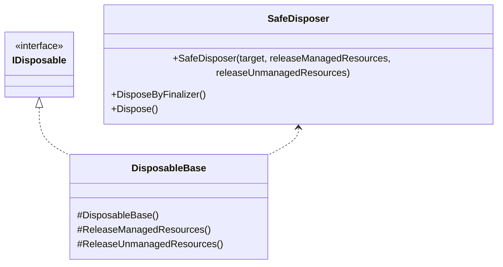
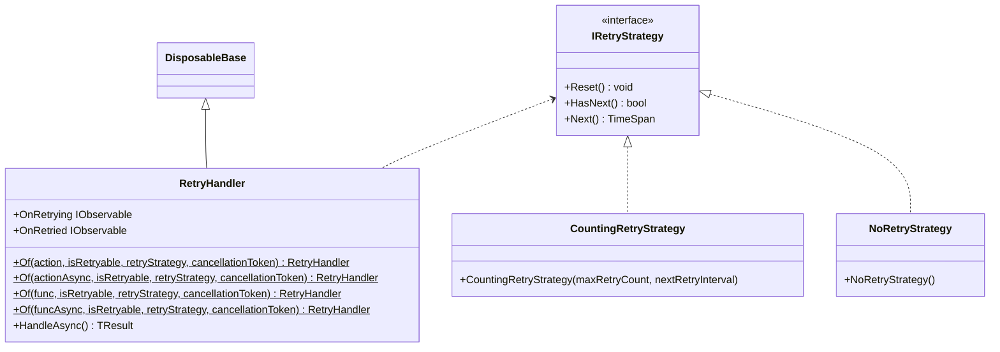

---
sidebar_position: 3
---

# Common

## What for?

フレームワークやアプリケーションの機能を実現するにはリトライ処理のように汎用的な機能が必要になります。
例えばリトライ処理であれば、フレームワークの[Chat](../integration/chat.vivox.md)や[Multiplay](../integration/multiplay.ngo.md)、アプリケーションの外部API呼び出しなど、外部接続を行う機能で必要になります。
このモジュールではそういった汎用的な処理を共通機能として提供します。

## Specification

- [Dispose Pattern](https://learn.microsoft.com/en-us/dotnet/standard/garbage-collection/implementing-dispose)を適用できます。
- リトライ処理を適用できます。

## Architecture

### System



### Retry



## Installation

### Package

```text
https://github.com/extreal-dev/Extreal.Core.Common.git
```

### Dependencies

Commonは次のパッケージを使います。

- [Extreal.Core.Logging](./logging.md)
- [UniTask](https://github.com/Cysharp/UniTask)
- [UniRx](https://github.com/neuecc/UniRx)

モジュールバージョンと各パッケージバージョンの対応は[Release](../category/release)を参照ください。

### Settings

設定はないため作業は不要です。

## Usage

### Dispose Patternを適用する {#core-common-dp}

[Dispose Pattern](https://learn.microsoft.com/en-us/dotnet/standard/garbage-collection/implementing-dispose)を適用する方法として継承と移譲の2つの方法を提供しています。
継承の方がDispose Patternのカバー範囲が広いので、継承が使える場合は継承を使ってください。
適用対象のクラスが既に別のクラスを継承していて継承が使えない場合は移譲を使ってください。

継承ではDisposableBaseクラスを使用します。

```csharp
public class SomethingClass : DisposableBase
{
    // Processing something with resources
    
    protected override void ReleaseManagedResources()
    {
        // release managed resources
    }

    protected override void ReleaseUnmanagedResources()
    {
        // release unmanaged resources
    }
}
```

扱うリソースに応じてReleaseManagedResourcesメソッドとReleaseUnmanagedResourcesメソッドをオーバーライドしてリソースを解放します。
デフォルトでこれらのメソッドは何も処理しないので、解放処理が不要なメソッドのオーバーライドは不要です。
これらのメソッドはDisposableBaseクラスによりDispose Patternで示されたタイミングで呼び出されます。

:::caution
リソースの解放漏れを防ぐため、例外やエラーを発生させないようにリソース解放処理を実装してください。
:::

:::caution
[Dispose Pattern](https://learn.microsoft.com/en-us/dotnet/standard/garbage-collection/implementing-dispose)はDisposeの正しい実装方法を示しています。
Dispose Patternに従ったとしてもアプリケーションでIDisposableのDisposeメソッドを適切なタイミングで呼び出す必要があります。
DisposableBaseを使った場合も同様です。
:::

移譲ではSafeDisposerクラスを使用します。
DisposableBaseクラスはSafeDisposerクラスを使ってDispose Patternを実現しています。
SafeDisposerクラスの実装例としてDisposableBaseクラスのソースコードを掲載しますので参考にしてください。

```csharp
public class DisposableBase : IDisposable
{
    private readonly SafeDisposer safeDisposer;

    protected DisposableBase()
        => safeDisposer = new SafeDisposer(this, ReleaseManagedResources, ReleaseUnmanagedResources);

    ~DisposableBase() => safeDisposer.DisposeByFinalizer();

    protected virtual void ReleaseManagedResources() { }

    protected virtual void ReleaseUnmanagedResources() { }

    public void Dispose() => safeDisposer.Dispose();
}
```

### リトライ処理を適用する {#core-common-retry}

#### リトライ処理

リトライ処理はRetryHandlerクラスが提供します。
RetryHandlerクラスを使うことでメソッドにリトライ処理を適用できます。

リトライ処理を適用できるメソッドの条件は次の通りです。

- 次のいずれかの処理を行うメソッドが対象です。
  - 戻り値なしの同期処理
    ```csharp
    public void RunAction()
    ```
  - 戻り値なしの非同期処理
    ```csharp
    public UniTask RunActionAsync()
    ```
  - 戻り値ありの同期処理
    ```csharp
    public TResult RunFunc()
    ```
  - 戻り値ありの非同期処理
    ```csharp
    public UniTask<TResult> RunFuncAsync()
    ```
- メソッド引数はありとなしのどちらでも構いません。
- 非同期処理には[UniTask](https://github.com/Cysharp/UniTask)を使ってください。
- リトライするかしないかを例外で判断できるようにしてください（リトライ対象の処理失敗は例外をスローしてください）。

リトライ処理の適用はRetryHandlerのOfメソッドを使います。
OfメソッドによりRetryHandlerを生成してリトライ処理を適用したメソッドを呼び出せるようにします。
Ofメソッドには次のパラメータを指定します。

- リトライ対象メソッド
- リトライするかしないかの判定処理
- リトライ処理を制御する方法（リトライ戦略）
- リトライをキャンセルするためのトークン

リトライ処理を適用したメソッドの実行にはRetryHandlerのHandleAsyncメソッドを使います。
HandleAsyncメソッドによりリトライ対象メソッドの処理が失敗した場合はリトライ処理が開始されます。
HandleAsyncではリトライするかしないかの判定処理とリトライ戦略を使ってリトライの継続判定を行います。

```csharp
using var retryHandler = RetryHandler<Unit>.Of(RunAction, e => e is AccessViolationException, new CountingRetryStrategy());
await sut.HandleAsync();
```

リトライ対象メソッドに引数がある場合は[ラムダ式](https://learn.microsoft.com/en-us/dotnet/csharp/language-reference/operators/lambda-expressions)を使います。

```csharp
// Synchronous processing without return value
using var retryHandler = RetryHandler<Unit>.Of(() => RunAction(value), e => e is AccessViolationException, new CountingRetryStrategy());
await sut.HandleAsync();

// Asynchronous processing without return value
using var retryHandler = RetryHandler<Unit>.Of(async () => await RunActionAsync(value), e => e is AccessViolationException, new CountingRetryStrategy());
await sut.HandleAsync();

// Synchronous processing with return value
using var retryHandler = RetryHandler<Unit>.Of(() => RunFunc(value), e => e is AccessViolationException, new CountingRetryStrategy());
var result = await sut.HandleAsync();

// Asynchronous processing with return value
using var retryHandler = RetryHandler<Unit>.Of(async () => await RunFuncAsync(value), e => e is AccessViolationException, new CountingRetryStrategy());
var result = await sut.HandleAsync();
```

#### リトライ戦略

デフォルトで次のリトライ戦略を提供しています。

- CountingRetryStrategy
  - 回数でリトライを制御します。
- NoRetryStrategy
  - 常にリトライしません。
  - リトライ処理を組み込んだライブラリを作る場合に使います。

CountingRetryStrategyは最大リトライ回数とリトライ間隔を指定して使います。

```csharp
// Max retry count is 5, retry interval is 5 seconds each times
var retryStrategy = new CountingRetryStrategy(5, _ => TimeSpan.FromSeconds(5));

// Max retry count is 5, retry interval is retry count x 5 seconds
var retryStrategy = new CountingRetryStrategy(5, retryCount => TimeSpan.FromSeconds(retryCount * 5));
```

CountingRetryStrategyはデフォルトでフィボナッチ数を使ったリトライ処理を提供します。
デフォルトのフィボナッチ数は20個までなので最大リトライ回数を20より大きくしたい場合はリトライ間隔を指定してください。

```csharp
// Max retry count is 12(default), retry interval is Fibonacci numbers
var retryStrategy = new CountingRetryStrategy();

// Max retry count is 5, retry interval is Fibonacci numbers
var retryStrategy = new CountingRetryStrategy(5);
```

リトライ戦略はIRetryStrategyインタフェースが提供します。
デフォルトで提供しているクラスで対応できない場合はIRetryStrategyインタフェースを実装したクラスを作成してください。

#### リトライ処理の再利用

ボイスチャットやマルチプレイでは接続中に予期しない切断が発生する可能性があります。
そのような切断が発生した場合は初回接続時の状態（チャンネル名などのアクセス情報）を使って再接続を行いたい場合があります。
RetryHandlerはHandleAsyncメソッドが呼ばれる度にリトライ状態をリセットするため、再利用して使うことが可能です。

#### リトライ処理のイベント通知 {#core-common-retry-event}

RetryHandlerは次のイベント通知を設けています。

- OnRetrying
  - タイミング：リトライする直前
  - タイプ：IObservable
  - パラメータ：リトライ回数
    - 1回目は`1`、2回目は`2`となります。
    - `1`はリトライ戦略の実行開始を意味します。
- OnRetried
  - タイミング：リトライが終了した直後
    - リトライがキャンセルされた場合は通知されません。
  - タイプ：IObservable
  - パラメータ：リトライ結果
    - true：リトライ戦略を実行してリトライが成功した場合
    - false：リトライ戦略を実行して最終的にリトライが成功しなかった場合
