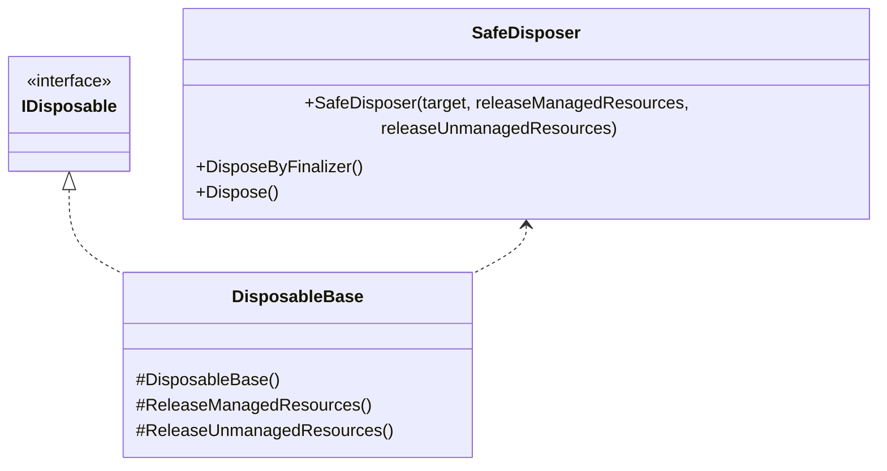

---
sidebar_position: 3
---

# Common

## What for?

フレームワークやアプリケーションの機能を実現するにはリトライ処理のように汎用的な機能が必要になります。
例えばリトライ処理であれば、フレームワークの[Chat](../integration/chat.vivox.md)や[Multiplay](../integration/multiplay.ngo.md)、アプリケーションの外部API呼び出しなど、外部接続を行う機能で必要になります。
このモジュールではそういった汎用的な処理を共通機能として提供します。

## Specification

- [Dispose Pattern](https://learn.microsoft.com/en-us/dotnet/standard/garbage-collection/implementing-dispose)を適用できる

## Architecture



## Installation

### Package

```text
https://github.com/extreal-dev/Extreal.Core.Common.git
```

### Dependencies

Commonは次のパッケージを使います。

- [Extreal.Core.Logging](./logging.md)

モジュールバージョンと各パッケージバージョンの対応は[Release](../category/release)を参照ください。

### Settings

設定はないため作業は不要です。

## Usage

### Dispose Patternを適用する {#core-common-dp}

[Dispose Pattern](https://learn.microsoft.com/en-us/dotnet/standard/garbage-collection/implementing-dispose)を適用する方法として継承と移譲の2つの方法を提供しています。
継承の方がDispose Patternのカバー範囲が広いので、継承が使える場合は継承を使ってください。
適用対象のクラスが既に別のクラスを継承していて継承が使えない場合は移譲を使ってください。

継承ではDisposableBaseクラスを使用します。

```csharp
public class SomethingClass : DisposableBase
{
    // Processing something with resources
    
    protected override void ReleaseManagedResources()
    {
        // release managed resources
    }

    protected override void ReleaseUnmanagedResources()
    {
        // release unmanaged resources
    }
}
```

扱うリソースに応じてReleaseManagedResourcesメソッドとReleaseUnmanagedResourcesメソッドをオーバーライドしてリソースを解放します。
デフォルトでこれらのメソッドは何も処理しないので、解放処理が不要なメソッドのオーバーライドは不要です。
これらのメソッドはDisposableBaseクラスによりDispose Patternで示されたタイミングで呼び出されます。

:::caution
リソースの解放漏れを防ぐため、例外やエラーを発生させないようにリソース解放処理を実装してください。
:::

:::caution
[Dispose Pattern](https://learn.microsoft.com/en-us/dotnet/standard/garbage-collection/implementing-dispose)はDisposeの正しい実装方法を示しています。
Dispose Patternに従ったとしてもアプリケーションでIDisposableのDisposeメソッドを適切なタイミングで呼び出す必要があります。
DisposableBaseを使った場合も同様です。
:::

移譲ではSafeDisposerクラスを使用します。
DisposableBaseクラスはSafeDisposerクラスを使ってDispose Patternを実現しています。
SafeDisposerクラスの実装例としてDisposableBaseクラスのソースコードを掲載しますので参考にしてください。

```csharp
public class DisposableBase : IDisposable
{
    private readonly SafeDisposer safeDisposer;

    protected DisposableBase()
        => safeDisposer = new SafeDisposer(this, ReleaseManagedResources, ReleaseUnmanagedResources);

    ~DisposableBase() => safeDisposer.DisposeByFinalizer();

    protected virtual void ReleaseManagedResources() { }

    protected virtual void ReleaseUnmanagedResources() { }

    public void Dispose() => safeDisposer.Dispose();
}
```
