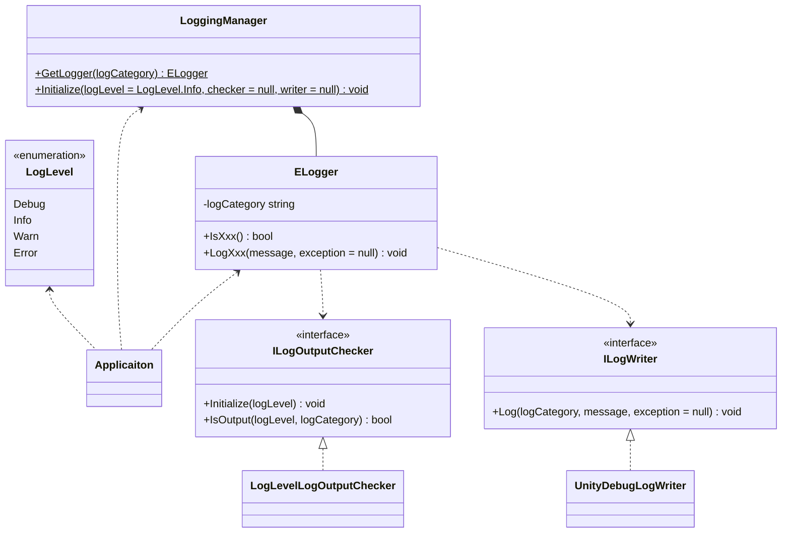
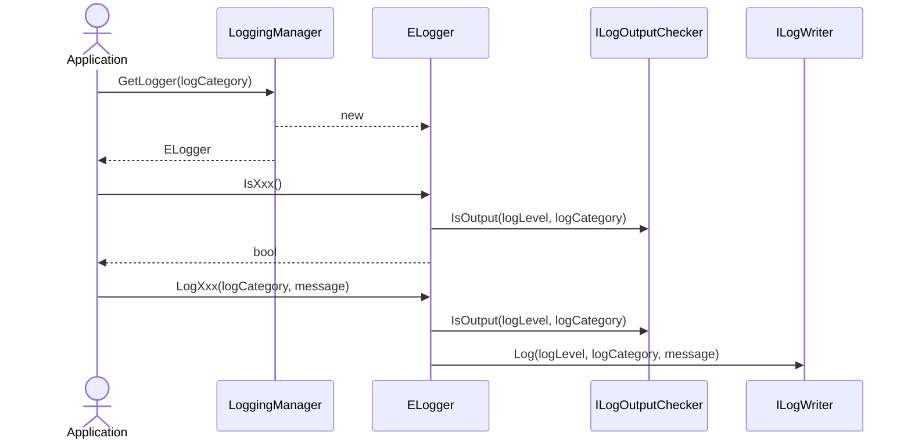

# Logging

## What for?

フレームワークとアプリケーションのログ出力を共通化し、アプリケーションで統一してログ出力を制御できるようにLoggingを提供します。

あなたのアプリケーションのログ出力をLoggingに集約することで、開発と本番運用で出力するログの種類や出力先の切り替えなど、アプリケーションのログ出力制御が容易になります。

:::info
現時点のLoggingはUnity標準のDebugクラスを使ったログ出力のみ提供します。
開発時のデバッグ用と考えてください。
アプリケーションをモニタリングできるようにパブリッククラウドへのログ送信など、今後ログ出力先を増やしていく予定です。
:::

## Specification

Loggingではログ出力を制御しやすいようにログレベルとログカテゴリを関連付けてログを出力します。

ログレベルは高い方から順にERROR、WARN、INFO、DEBUGの4つです。

- ERROR
  - アプリケーションを継続できないエラーが発生した場合
- WARN
  - すぐに影響はないが放置しておくと問題となる事象が発生した場合
- INFO
  - アプリケーションの利用状況や外部サービスとの接続状況を把握する目的で正常動作の事象を出力したい場合
- DEBUG
  - 開発時にデバッグ情報を出力したい場合

ログレベルは次のような使い方を想定しています。
- 開発時はDEBUG以上、本番運用時はINFO以上のログを出力する。
- ERROR以上のログを監視して通知する。

ログカテゴリはログを分類する名前です。
次のような使い方を想定しています。

- ログ出力を行うクラス名をログカテゴリにしてログを見てどのクラスから出力されたのか分かるようにする。
- 特定の名前をログカテゴリにして複数クラスで出力しているログを後から追跡できるようにする。
- 障害の再現テストなどで特定クラスのみログレベルに関係なく全てのログを出力したい場合があります。これはログカテゴリを使ってログ出力判定を変更することで実現できます。

Loggingの仕様は次の通りです。

- ログレベルとログカテゴリを関連付けてログを出力できます。
  - デフォルトのログ出力判定はログレベルのみで判定します。
  - デフォルトではINFO以上のログを出力します。
  - デフォルトのログ出力はUnity標準のDebugクラスで行います。
- ログ出力判定に使うログレベルを変更できます。
- ログ出力判定を変更できます。
- ログ書き込み（フォーマットや出力先）を変更できます。

## Architecture



:::info
`Xxx`にはログレベル（Error、Warn、Info、Debug）が入ります。
:::

:::info
UnityのLoggerとLoggingのLoggerが重複し参照が曖昧になるのを防ぐため、LoggingのLoggerにはExtrealの頭文字の`E`を付けています。
:::

アプリケーションでログ出力する場合のシーケンスは次の通りです。



## Installation

### Package

```
https://github.com/extreal-dev/Extreal.Core.Logging.git
```

### Dependencies

依存するものがないため作業は不要です。

### Settings

デフォルトのまま使う場合は以降の作業は不要です。

フレームワークやアプリケーションの初期化処理でログ出力が必要になるケースがあるため、フレームワークやアプリケーションのどの機能よりも先にログ出力を初期化して利用できる状態にする必要があります。ログ出力の初期化を行うスクリプトを作成し、アプリケーションの初期化処理の先頭に追加してください。

LoggingManagerクラスを使ってログ出力を初期化します。

```csharp
public static class AppInitializer
{
    [RuntimeInitializeOnLoadMethod(RuntimeInitializeLoadType.BeforeSceneLoad)]
    private static void Initialize()
    {
        const LogLevel logLevel = LogLevel.Debug;
        LoggingManager.Initialize(logLevel: logLevel);
    }
}
```

開発時や本番運用時の設定切り替えにはシンボルを使います。

```csharp
#if DEV
const LogLevel logLevel = LogLevel.Debug;
#elif PROD
const LogLevel logLevel = LogLevel.Info;
#endif
LoggingManager.Initialize(logLevel: logLevel);
```

## Usage

### ログを出力する

Loggerクラスを使ってログを出力します。
LoggerクラスはLoggingManagerクラスから取得します。

```csharp
public class SomethingService {

    private static readonly ELogger Logger = LoggingManager.GetLogger(nameof(SomethingService));

    public void Something() {

      Logger.LogInfo("Here we go!");

      // something

      Logger.LogInfo("It's over!!!");
    }
}
```

ログに出力する文字列作成は出力場所によってはアプリケーションの性能劣化に繋がるので事前にログ出力判定を行ってからログ出力します。

```csharp
if (Logger.IsDebug()) {
    Logger.LogDebug($"Hello {name}!");
}
```

:::tip
本番運用時に設定するログレベルから判断して常に出力されるログにはログ出力判定は不要です。
:::

### ログレベルを変更する

LoggingManagerクラスを使ってログレベルを変更します。

```csharp
// Initialization script for Logging
LoggingManager.Initialize(LogLevel.Debug);
```

### ログ出力判定を変更する

ILogOutputCheckerインタフェースがログ出力を判定します。
ILogOutputCheckerインタフェースを実装したクラスを作成しLoggingManagerクラスに設定します。

```csharp
// Class that implements the ILogOutputChecker interface.
// Adds special conditions to log output checks.
public class AppLogOutputChecker : ILogOutputChecker
{
    private LogLevel logLevel;

    public void Initialize(LogLevel logLevel)
    {
        this.logLevel = logLevel;
    }

    public bool IsOutput(LogLevel logLevel, string logCategory)
    {
        return this.logLevel <= logLevel
                || (logLevel == LogLevel.Debug && logCategory == "Debugger");
    }
}
```

```csharp
// Initialization script for Logging
LoggingManager.Initialize(checker: new AppLogOutputChecker());
```

### ログ書き込みを変更する

ILogWriterインタフェースがログを書き込みます。
ILogWriterインタフェースを実装したクラスを作成しLoggingManagerクラスに設定します。

```csharp
// Class that implements the ILogWriter interface.
// Changes the format of the log.
public class AppLogWriter : ILogWriter
{
    public void Log(LogLevel logLevel, string logCategory, string message, Exception exception = null)
    {
        switch (logLevel)
        {
            case LogLevel.Debug:
                Debug.Log(LogFormat("o-o", logCategory, message, exception));
                break;

            case LogLevel.Info:
                Debug.Log(LogFormat("(^_^)", logCategory, message, exception));
                break;

            case LogLevel.Warn:
                Debug.LogWarning(LogFormat("(--;", logCategory, message, exception));
                break;

            case LogLevel.Error:
                Debug.LogError(LogFormat("(*A*;", logCategory, message, exception));
                break;

            default:
                throw new ArgumentOutOfRangeException(nameof(logLevel), "Undefined LogLevel was input");
        }
    }

    private string LogFormat(string logLevel, string logCategory, string message, Exception exception = null)
    {
        var stringBuilder = new StringBuilder();
        stringBuilder
            .Append(logLevel)
            .Append(" ")
            .Append(logCategory)
            .Append(": ")
            .Append(message);
        if (exception != null)
        {
            stringBuilder.Append("\n---- Exception ----\n").Append(exception).Append("\n-------------------\n");
        }
        return stringBuilder.ToString();
    }
}
```

```csharp
// Initialization script for Logging
LoggingManager.Initialize(writer: new AppLogWriter());
```
