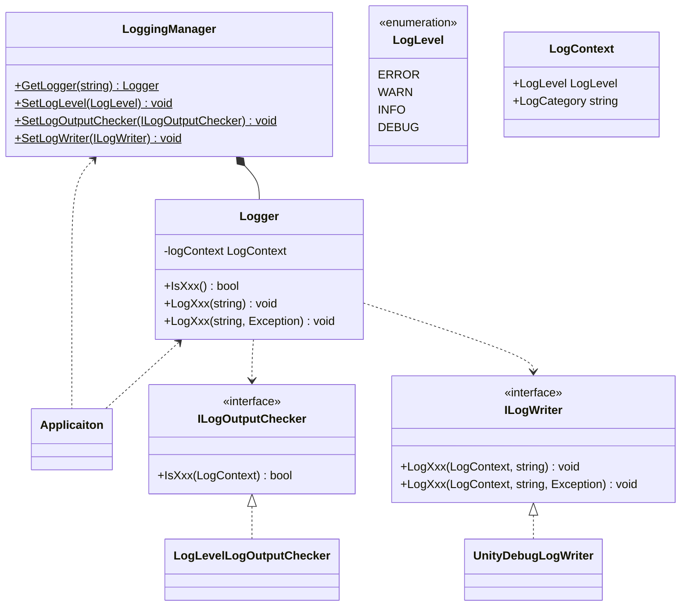
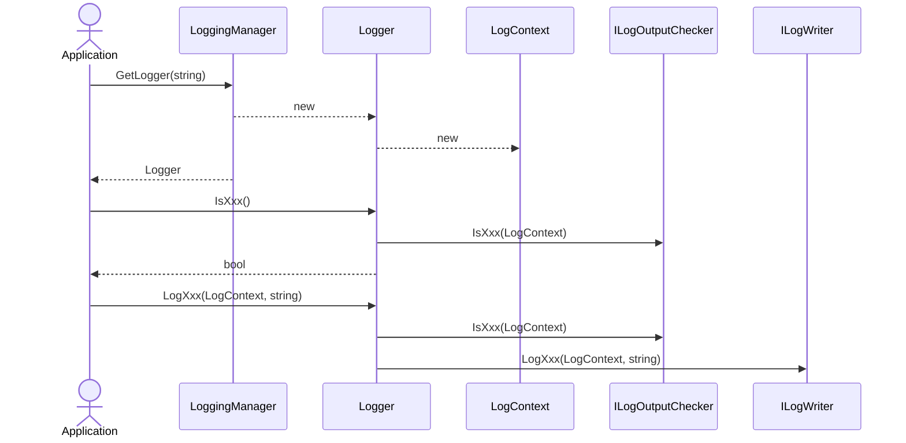

# Logging

## What for?

フレームワークとアプリケーションのログ出力を共通化し、アプリケーションで統一してログ出力を制御できるようにLoggingを提供します。

あなたのアプリケーションのログ出力をLoggingに集約することで、開発と本番運用で出力するログの種類や出力先の切り替えなど、アプリケーションのログ出力制御が容易になります。

:::info
現時点のLoggingはUnity標準のDebugクラスを使ったログ出力のみ提供します。
開発時のデバッグ用と考えてください。
アプリケーションをモニタリングできるようにパブリッククラウドへのログ送信など、今後ログ出力先を増やしていく予定です。
:::

## Specification

Loggingではログ出力を制御しやすいようにログレベルとログカテゴリを関連付けてログを出力します。

ログレベルは高い方から順にERROR、WARN、INFO、DEBUGの4つです。

- ERROR
  - アプリケーションを継続できないエラーが発生した場合
- WARN
  - すぐに影響はないが放置しておくと問題となる事象が発生した場合
- INFO
  - アプリケーションの利用状況や外部サービスとの接続状況を把握する目的で正常動作の事象を出力したい場合
- DEBUG
  - 開発時にデバッグ情報を出力したい場合

ログレベルは次のような使い方を想定しています。
- 開発時はDEBUG以上、本番運用時はINFO以上のログを出力する。
- ERROR以上のログを監視して通知する。

ログカテゴリはログを分類する名前です。
次のような使い方を想定しています。

- ログ出力を行うクラス名をログカテゴリにしてログを見てどのクラスから出力されたのか分かるようにする。
- 特定の名前をログカテゴリにして複数クラスで出力しているログを後から追跡できるようにする。
- 障害の再現待ちなどで特定の名前のログカテゴリのみログレベルの設定に関係なくDEBUGレベルのログを出力できるようにする。

Loggingの仕様は次の通りです。

- ログレベルとログカテゴリを関連付けてログを出力します。
- デフォルトのログ出力判定はログレベルのみで判定します。
- デフォルトではINFO以上のログを出力します。
- デフォルトのログ出力はUnity標準のDebugクラスで行います。
- ログレベルを変更できます。
- ログ出力判定を変更できます。
- ログ書き込み（フォーマットや出力先）を変更できます。

## Architecture



:::note
`Xxx`にはログレベル（Error、Warn、Info、Debug）が入ります。
:::

アプリケーションでログ出力する場合のシーケンスは次の通りです。



## Installation

### Package

`https://github.com/extreal-dev/Extreal.Core.Logging.git`

### Dependencies

依存するものがないため作業は不要です。

### Settings

デフォルトのまま使う場合は以降の作業は不要です。

フレームワークやアプリケーションの初期化処理でログ出力が必要になるケースがあるため、フレームワークやアプリケーションのどの機能よりも先にログ出力を初期化して利用できる状態にする必要があります。ログ出力の初期化を行うスクリプトを作成し、アプリケーションの初期化処理の先頭に追加してください。

LoggerManagerクラスを使ってログ出力を初期化します。

```csharp
// ログレベルを変更する場合
LoggerManager.SetLogLevel(LogLevel.DEBUG);

// ログ出力判定を変更する場合
LoggerManager.SetLogOutputChecker(new AppLogOutputChecker());

// ログ出力（フォーマットや出力先）を変更する場合
LoggerManager.SetLogWriter(new AppLogWriter());
```

開発時や本番運用時の設定切り替えにはシンボルを使います。

```csharp
#if DEV
LogLevel level = LogLevel.DEBUG;
#elif PROD
LogLevel level = LogLevel.INFO;
#endif
LoggerManager.SetLogLevel(level);
```

## Usage

### ログを出力する

Loggerクラスを使ってログを出力します。
LoggerクラスはLoggerManagerクラスから取得します。

```csharp
public class SomethingService {

    private static readonly LOGGER = LoggerManager.Get(typeof(SomethingService).Name);

    public void Something() {

      LOGGER.LogInfo("Here we go!");

      // something

      LOGGER.LogInfo("It's over!!!");
    }
}
```

ログに出力する文字列作成は出力場所によってはアプリケーションの性能劣化に繋がるので事前にログ出力判定を行ってからログ出力します。

```csharp
if (LOGGER.IsDebug()) {
    LOGGER.LogDebug($"Hello {name}!");
}
```

:::tip
本番運用時に設定するログレベルから判断して常に出力されるログにはログ出力判定は不要です。
:::

### ログレベルを変更する

LoggerManagerクラスを使ってログレベルを変更します。

```csharp
// ログ出力の初期化スクリプト
LoggerManager.SetLogLevel(LogLevel.DEBUG);
```

### ログ出力判定を変更する

ILogOutputCheckerインタフェースがログ出力を判定します。
ILogOutputCheckerインタフェースを実装したクラスを作成しLoggerManagerクラスに設定します。

```csharp
// ILogOutputCheckerインタフェースを実装したクラス
public class AppLogOutputChecker : ILogOutputChecker {
    // something
}
```

```csharp
// ログ出力の初期化スクリプト
LoggerManager.SetLogOutputChecker(new AppLogOutputChecker());
```

### ログ書き込みを変更する

ILogWriterインタフェースがログを書き込みます。
ILogWriterインタフェースを実装したクラスを作成しLoggerManagerクラスに設定します。

```csharp
// ILogWriterインタフェースを実装したクラス
public class AppLogWriter : ILogWriter {
    // something
}
```

```csharp
// ログ出力の初期化スクリプト
LoggerManager.SetLogWriter(new AppLogWriter());
```
