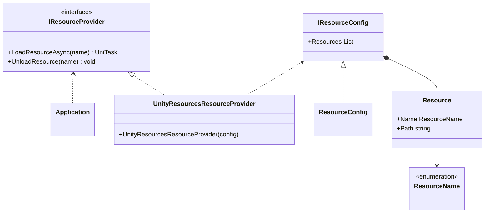
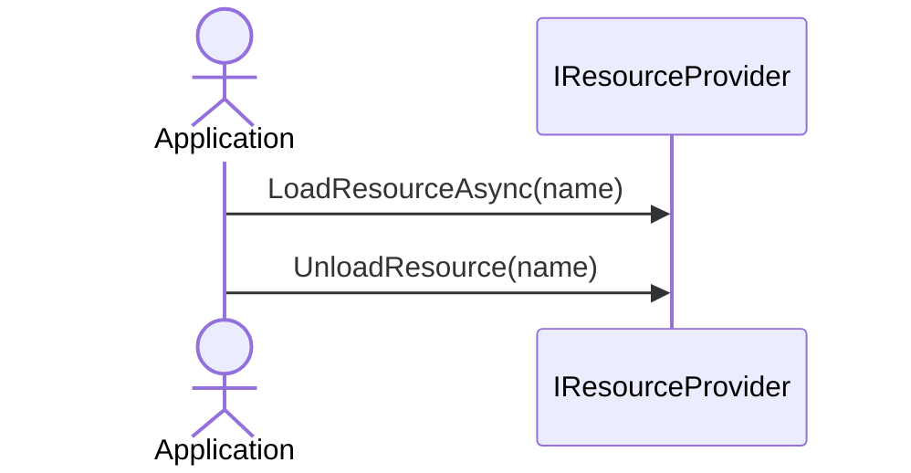

# Resource Provider

アプリケーションで使うリソース（テクスチャ、3Dモデルなど）の管理方法はアプリケーションのステージに合わせて変わっていきます。
プロトタイプなどの初期段階では頻繁に変更が入るのでアプリケーションにリソースを含めますが、本格的にアプリケーションを配布するようになるとアプリケーションとリソースを分離してリソースのみ変更できるようにします。
アプリケーションからリソースを分離するとアプリケーションの容量が減りダウンロード時間が短くなるメリットもあります。

アプリケーションで使うリソースの管理方法を切り替えられるようにResource Providerを提供します。

:::info
現時点のResource ProviderはUnityのResourcesディレクトリを使ったリソース管理のみ提供します。
このリソース管理ではアプリケーションにリソースが含まれます。
アプリケーションとアセットを分離するリソース管理を今後追加していく予定です。
:::

## Specification

Resource Providerの仕様は次の通りです。

- 論理的なリソース名を使ってリソースをロード/アンロードできます。
  - リソース名と使用するリソース管理方法に依存する物理パスは設定でマッピングします。
- リソース管理方法を変更できます。

## Architecture



:::info
次のタイプはアプリケーションで作成します。
- ResourceName：リソース名を表すEnum
- ResourceConfig：リソース設定を保持するクラス
:::

アプリケーションでリソースのロード/アンロードする場合のシーケンスは次の通りです。



## Installation

### Package

```
https://github.com/extreal-dev/Extreal.Core.ResourceProvider.git
```

### Dependencies

Scene Transitionは次のパッケージを使います。

- [Extreal.Core.Logging](/core/logging)
- [UniTask](https://github.com/Cysharp/UniTask)

モジュールバージョンと各パッケージバージョンの対応は[Release](/category/release)を参照ください。

### Settings

アプリケーションで使用するリソースを設定します。
次の2つのタイプを作成します。

- リソース名を表すEnum
- リソース設定を保持するクラス

```csharp
// Enum for the rsource name
public enum ResourceName
{
    PlayerAvatar,
    ShopKeeperAvatar,
}
```

IResourceConfigインタフェースがリソース設定を保持します。
リソース設定を保持するクラスはIResourceConfigインタフェースを実装してください。

```csharp
// Class that holds the resource config
[CreateAssetMenu(
    menuName = "Config/" + nameof(ResourceConfig),
    fileName = nameof(ResourceConfig))]
public class ResourceConfig : ScriptableObject, IResourceConfig<ResourceName>
{
    [SerializeField] private List<Resource<ResourceName>> _resources;
    public List<Resource<ResourceName>> Resources => _resources;
}
```

リソース設定をUnityエディタのインスペクタで編集できるようにResourceConfigはScriptableObjectにしています。
リソース名と使用するリソース管理方法に依存する物理パスを指定してリソース設定を行います。

IResourceProviderとResourceConfigの初期化はVContainerを使います。

```csharp
public class MainLifetimeScope : LifetimeScope
{
    [SerializeField]
    ResourceConfig _resourceConfig;

    protected override void Configure(IContainerBuilder builder)
    {
        builder.ResisterInstance(_resourceConfig).AsImplementedInterfaces();
        builder.Register<UnityResourcesResourceProvider>(Lifetime.Singleton).AsImplementedInterfaces();
    }
}
```

## Usage

### リソースをロード/アンロードする

IResourceProviderを使ってリソースをロード/アンロードします。

```csharp
// Load a resource
var playerAvatar = await _resourceProvider.LoadResourceAsync<GameObject>(ResourceName.PlayerAvatar);

// Unload a resource
_resourceProvider.UnloadResource(ResourceName.PlayerAvatar);
```

### リソース管理方法を変更する

IResourceProviderインタフェースがリソースを管理します。
IResourceProviderインタフェースを実装したクラスを作成し、使用するIResourceProviderの実装クラスをVContainerで変更します。

```csharp
// Class that implements IResourceProvider
// Omit implementation
public class AppResourceProvider : IResourceProvider
{
    public AppResouceProvider(IResourceConfig config)
    {
        // do something
    }
}
```

```csharp
// Change the implementation class of IResourceProvider to be used with VContainer
public class MainLifetimeScope : LifetimeScope
{
    [SerializeField]
    ResourceConfig _resourceConfig;

    protected override void Configure(IContainerBuilder builder)
    {
        builder.ResisterInstance(_resourceConfig).AsImplementedInterfaces();
        builder.Register<AppResourceProvider>(Lifetime.Singleton).AsImplementedInterfaces();
    }
}
```