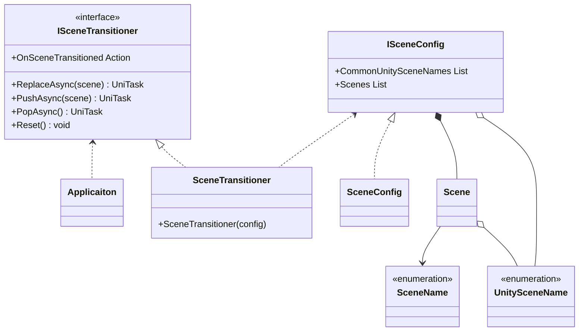
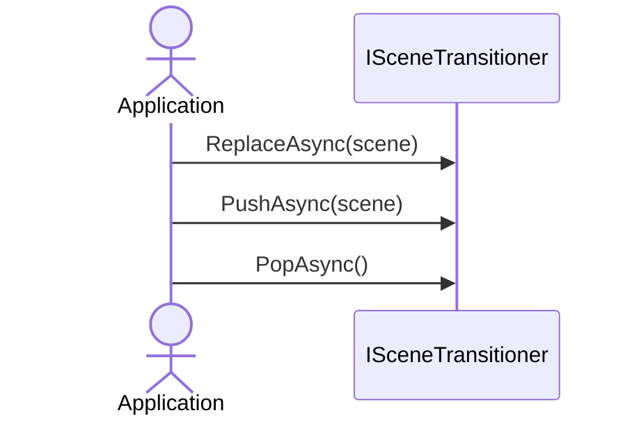

# Scene Transition

## What for?

[Frameworkが想定するアプリケーションアーキテクチャ](/intro#application)で説明した複数のUnityシーンを組み合わせたシーンの作成やシーンの切り替えを簡単にできるようにScene Transitionを提供します。

[Frameworkが想定するアプリケーションアーキテクチャ](/intro#application)で示した図を再掲します。


あなたのアプリケーションでScene Transitionを使い機能を自由に組み合わせてシーンを作れるようになると機能の再利用性が高まりメンテナンスしやすいアプリケーションが手に入ります。

## Specification

Scene Transitionの仕様は次の通りです。

- 複数のUnityシーンを組み合わせてシーンを設定できます。
- 全てのシーンに共通するUnityシーンをまとめて一箇所で設定できます。
- 指定したシーンに遷移できます。
- 遷移履歴に従って遷移元に戻れます。
- シーン遷移をトリガーに処理を追加できます。

## Architecture



:::info
次のタイプはアプリケーションで作成します。
- SceneName：シーン名を表すEnum
- UnitySceneName：Unityシーン名を表すEnum
- SceneConfig：シーン設定を保持するクラス
:::

アプリケーションでシーン遷移する場合のシーケンスは次の通りです。



## Installation

### Package

```
https://github.com/extreal-dev/Extreal.Core.SceneTransition.git
```

### Dependencies

依存するものがないため作業は不要です。

### Settings

アプリケーションで使用するシーンを設定します。
次の3つのタイプを作成します。

- シーン名を表すEnum
- Unityシーン名を表すEnum
- シーン設定を保持するクラス

```csharp
// Enum for the scene name
public enum SceneName
{
    TitlePage,
    AvatarSelectionPage,
    EventSelectionPage,
    EventRoom,
}
```

```csharp
// Enum for the UUnity scene name
public enum UnitySceneName
{
    Main,

    // Control
    CameraControl,
    InputControl,
    NetworkControl,
    PlayerControl,
    LobbyControl,
    TextChatControl,
    VoiceChatControl,
    ReactionControl,
    
    // Stage
    TitleStage,
    AvatarSelectionStage,
    EventSelectionStage,
    EventStage,
}
```

ISceneConfigインタフェースがシーン設定を保持します。
シーン設定を保持するクラスはISceneConfigインタフェースを実装してください。

```csharp
// Class that holds the scene config
[CreateAssetMenu(
    menuName = "Config/" + nameof(SceneConfig),
    fileName = nameof(SceneConfig))]
public class SceneConfig : ScriptableObject, ISceneConfig<SceneName, UnitySceneName>
{
    [SerializeField] private List<UnitySceneName> _commonUnitySceneNames;
    [SerializeField] private List<Scene<SceneName, UnitySceneName>> _scenes;

    public List<UnitySceneName> CommonUnityScenes => _commonUnityScenes;
    public List<Scene<SceneName, UnitySceneName>> Scenes => _scenes;
}
```

シーン設定をUnityエディタのインスペクタで編集できるようにSceneConfigはScriptableObjectにしています。
Unityエディタのインスペクタで全てのシーンに共通するUnityシーン、シーンとUnityシーンの組み合わせを指定してシーン設定を行います。

:::note
TODO: 設定した状態のUnityエディタのインスペクタの図
:::

SceneTransitionerとSceneConfigの初期化はVContainerを使います。

```csharp
    public class MainLifetimeScope : LifetimeScope
    {
        [SerializeField]
        SceneConfig _sceneConfig;

        protected override void Configure(IContainerBuilder builder)
        {
            builder.Register<SceneTransitioner>(Lifetime.Singleton).AsImplementedInterfaces();
        }
    }
```

## Usage

### 指定したシーンに遷移する

ISceneTransitionerのReplaceAsyncを使って指定したシーンに遷移します。

```csharp
// Transition to the title page
_sceneTransitioner.ReplaceAsync(SceneName.TitlePage);

// Transition to the avatar selection page
_sceneTransitioner.ReplaceAsync(SceneName.AvatarSelectionPage);

// Transition to the event selection page
_sceneTransitioner.ReplaceAsync(SceneName.EventSelectionPage);
```

ReplaceAsyncは遷移履歴を保持しないのでシーン遷移が固定されたアプリケーションでReplaceAsyncを使います。

### 遷移履歴に従って遷移元に戻る

ISceneTransitionerのPushAsync/PopAsyncを使うと遷移履歴に従って遷移元に戻れます。

```csharp
// Transition to the title page
_sceneTransitioner.PushAsync(SceneName.TitlePage);

// Transition to the avatar selection page
_sceneTransitioner.PushAsync(SceneName.AvatarSelectionPage);

// Transition to the event selection page
_sceneTransitioner.PushAsync(SceneName.EventSelectionPage);

// Transition to the avatar selection page
_sceneTransitioner.PopAsync();

// Transition to the title page
_sceneTransitioner.PopAsync();
```

### シーン遷移をトリガーに処理を追加する

ISceneTransitionerは次のイベント通知を設けています。

- OnSceneTransitioned
  - タイミング：シーン遷移した直後
  - タイプ：Action
  - パラメータ：現在のシーンの名前

```csharp
// Event handler
private void LogSceneTransition(SceneName sceneName)
{
    LOGGER.logInfo(sceneName);
}

// Initialize
_sceneTransitioner.OnSceneTransitioned += LogSceneTransition;

// Dispose
_sceneTransitioner.OnSceneTransitioned -= LogSceneTransition;
```
