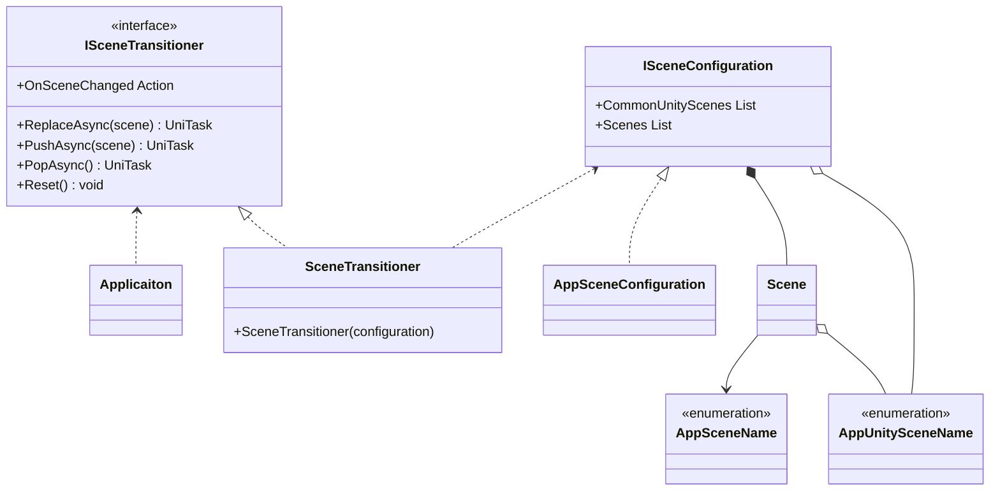
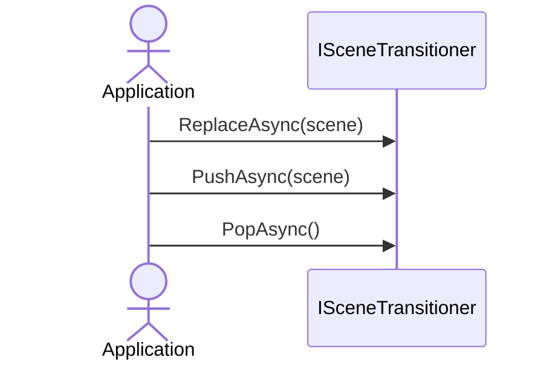

# Scene Transition

## What for?

[Frameworkが想定するアプリケーションアーキテクチャ](/intro#application)で説明した複数のUnityシーンを組み合わせたシーンの作成やシーンの切り替えを簡単にできるようにScene Transitionを提供します。

[Frameworkが想定するアプリケーションアーキテクチャ](/intro#application)で示した図を再掲します。


あなたのアプリケーションでScene Transitionを使い機能を自由に組み合わせてシーンを作れるようになると機能の再利用性が高まりメンテナンスしやすいアプリケーションが手に入ります。

## Specification

Scene Transitionの仕様は次の通りです。

- 複数のUnityシーンを組み合わせてシーンを設定できます。
- 全てのシーンに共通するUnityシーンをまとめて一箇所で設定できます。
- 指定したシーンに遷移できます。
- 遷移履歴に基づき遷移元のシーンに戻れます。
  - 複数の遷移元や遷移先があり元のシーンに戻りたい場合に使用します。
- シーン遷移をトリガーにアプリケーションで処理を追加できます。

## Architecture



:::info
後述しますが次のタイプはアプリケーションで作成します。
- AppSceneName
- AppUnitySceneName
- AppSceneConfiguration
:::

アプリケーションでシーン遷移する場合のシーケンスは次の通りです。



## Installation

### Package

```
https://github.com/extreal-dev/Extreal.Core.SceneTransition.git
```

### Dependencies

依存するものがないため作業は不要です。

### Settings

TODO: ここから