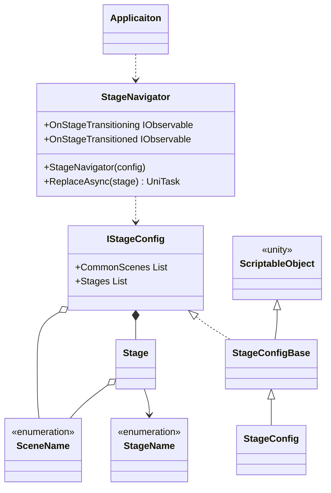
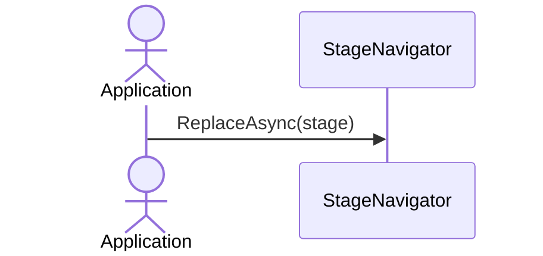

# Stage Navigation

## What for?

[Frameworkが想定するアプリケーションアーキテクチャ](/intro#application)で説明した複数のシーンを組み合わせたステージの作成やステージの切り替えを簡単にできるようにStage Navigationを提供します。

[Frameworkが想定するアプリケーションアーキテクチャ](/intro#application)で示した図を再掲します。


あなたのアプリケーションでStage Navigationを使い機能を自由に組み合わせてステージを作れるようになると機能の再利用性が高まりメンテナンスしやすいアプリケーションが手に入ります。

## Specification

Stage Navigationの仕様は次の通りです。

- 複数のシーンを組み合わせてステージを設定できます。
- 全てのステージに共通するシーンをまとめて一箇所で設定できます。
- 指定したステージに遷移できます。
- ステージ遷移をトリガーに処理を追加できます。

## Architecture



:::info
次のタイプはアプリケーションで作成します。
- StageName：ステージ名を表すEnum
- SceneName：シーン名を表すEnum
- StageConfig：ステージ設定を保持するクラス
:::

アプリケーションでステージ遷移する場合のシーケンスは次の通りです。



## Installation

### Package

```
https://github.com/extreal-dev/Extreal.Core.StageNavigation.git
```

### Dependencies

Stage Navigationは次のパッケージを使います。

- [Extreal.Core.Logging](/core/logging)
- [UniTask](https://github.com/Cysharp/UniTask)

モジュールバージョンと各パッケージバージョンの対応は[Release](/category/release)を参照ください。

### Settings

アプリケーションで使用するステージを設定します。
次の3つのタイプを作成します。

- ステージ名を表すEnum
- シーン名を表すEnum
- ステージ設定を保持するクラス

```csharp
// Enum for the stage name
public enum StageName
{
    TitleStage,
    AvatarSelectionStage,
    SpaceSelectionStage,
    VirtualStage,
}
```

```csharp
// Enum for the scene name
public enum SceneName
{
    App,

    // Control
    CameraControl,
    InputControl,
    NetworkControl,
    PlayerControl,
    LobbyControl,
    TextChatControl,
    VoiceChatControl,
    ReactionControl,
    
    // Screen
    TitleScreen,
    AvatarSelectionScreen,
    SpaceSelectionScreen,

    // Space
    VirtualSpace,
}
```

IStageConfigインタフェースがステージ設定を保持します。
ステージ設定をUnityエディタのインスペクタで編集できるようにScriptableObjectを継承したBaseクラスを提供しています。
ステージ設定を保持するクラスはStageConfigBaseクラスを継承してください。

```csharp
// Class that holds the stage config
[CreateAssetMenu(
    menuName = "Config/" + nameof(StageConfig),
    fileName = nameof(StageConfig))]
public class StageConfig : StageConfigBase<StageName, SceneName>
{
}
```

Unityエディタのインスペクタでステージ設定を行います。
設定例は次の通りです


- CommonScenesプロパティ
  - 全てのステージに共通するシーンを指定します。
- Stagesプロパティ
  - ステージ毎のシーン構成を指定します。

StageNavigatorとStageConfigの初期化はVContainerを使います。

```csharp
    public class AppScope : LifetimeScope
    {
        [SerializeField] private StageConfig stageConfig;

        protected override void Configure(IContainerBuilder builder)
        {
            builder.RegisterComponent(stageConfig).AsImplementedInterfaces();
            builder.Register<StageNavigator<StageName, SceneName>>(Lifetime.Singleton);
        }
    }
```

## Usage

### 指定したステージに遷移する

StageNavigatorのReplaceAsyncを使って指定したステージに遷移します。

```csharp
// Transition to the title stage
stageNavigator.ReplaceAsync(StageName.TitleStage);

// Transition to the avatar selection stage
stageNavigator.ReplaceAsync(StageName.AvatarSelectionStage);

// Transition to the space selection stage
stageNavigator.ReplaceAsync(StageName.SpaceSelectionStage);
```

### ステージ遷移をトリガーに処理を追加する

StageNavigatorは次のイベント通知を設けています。

- OnStageTransitioning
  - タイミング：ステージ遷移する直前
  - タイプ：IObservable
  - パラメータ：遷移するステージの名前
- OnStageTransitioned
  - タイミング：ステージ遷移した直後
  - タイプ：IObservable
  - パラメータ：遷移したステージの名前

OnStageTransitionedのタイミングでログを出力する例は次の通りです。

```csharp
stageNavigator.OnStageTransitioned.Subscribe(stageName =>
{
    Logger.LogInfo(stageName);
}).AddTo(compositeDisposable);
```
