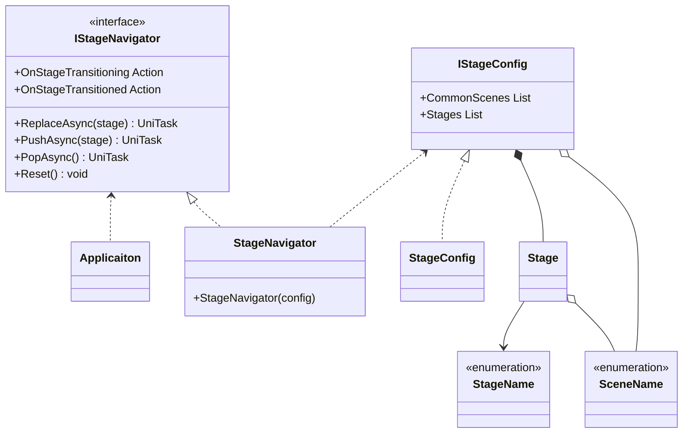
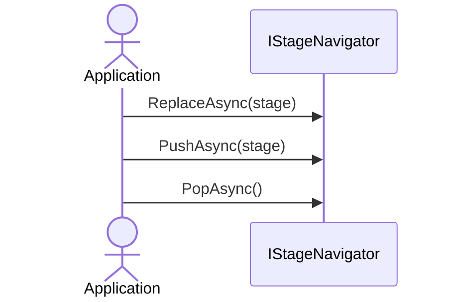

# Stage Navigation

## What for?

[Frameworkが想定するアプリケーションアーキテクチャ](/intro#application)で説明した複数のシーンを組み合わせたステージの作成やステージの切り替えを簡単にできるようにStage Navigationを提供します。

[Frameworkが想定するアプリケーションアーキテクチャ](/intro#application)で示した図を再掲します。


あなたのアプリケーションでStage Navigationを使い機能を自由に組み合わせてステージを作れるようになると機能の再利用性が高まりメンテナンスしやすいアプリケーションが手に入ります。

## Specification

Stage Navigationの仕様は次の通りです。

- 複数のシーンを組み合わせてステージを設定できます。
- 全てのステージに共通するシーンをまとめて一箇所で設定できます。
- 指定したステージに遷移できます。
- 遷移履歴に従って遷移元に戻れます。
- ステージ遷移をトリガーに処理を追加できます。

## Architecture



:::info
次のタイプはアプリケーションで作成します。
- StageName：ステージ名を表すEnum
- SceneName：シーン名を表すEnum
- StageConfig：ステージ設定を保持するクラス
:::

アプリケーションでステージ遷移する場合のシーケンスは次の通りです。



## Installation

### Package

```
https://github.com/extreal-dev/Extreal.Core.StageNavigation.git
```

### Dependencies

Stage Navigationは次のパッケージを使います。

- [Extreal.Core.Logging](/core/logging)
- [UniTask](https://github.com/Cysharp/UniTask)

モジュールバージョンと各パッケージバージョンの対応は[Release](/category/release)を参照ください。

### Settings

アプリケーションで使用するステージを設定します。
次の3つのタイプを作成します。

- ステージ名を表すEnum
- シーン名を表すEnum
- ステージ設定を保持するクラス

```csharp
// Enum for the stage name
public enum StageName
{
    TitleScreen,
    AvatarSelectionScreen,
    EventSelectionScreen,
    EventRoom,
}
```

```csharp
// Enum for the scene name
public enum SceneName
{
    App,

    // Control
    CameraControl,
    InputControl,
    NetworkControl,
    PlayerControl,
    LobbyControl,
    TextChatControl,
    VoiceChatControl,
    ReactionControl,
    
    // Screen
    TitleScreen,
    AvatarSelectionScreen,
    EventSelectionScreen,

    // Room
    EventRoom,
}
```

IStageConfigインタフェースがステージ設定を保持します。
ステージ設定を保持するクラスはIStageConfigインタフェースを実装してください。

```csharp
// Class that holds the stage config
[CreateAssetMenu(
    menuName = "Config/" + nameof(StageConfig),
    fileName = nameof(StageConfig))]
public class StageConfig : ScriptableObject, IStageConfig<StageName, SceneName>
{
    [SerializeField] private List<SceneName> commonScenes;
    [SerializeField] private List<Stage<StageName, SceneName>> stages;

    public List<SceneName> CommonScenes => commonScenes;
    public List<Stage<StageName, SceneName>> Stages => stages;
}
```

ステージ設定をUnityエディタのインスペクタで編集できるようにStageConfigはScriptableObjectにしています。
Unityエディタのインスペクタで全てのステージに共通するシーン、ステージとシーンの組み合わせを指定してステージ設定を行います。

StageNavigatorとStageConfigの初期化はVContainerを使います。

```csharp
    public class AppScope : LifetimeScope
    {
        [SerializeField] private StageConfig stageConfig;

        protected override void Configure(IContainerBuilder builder)
        {
            builder.RegisterInstance(stageConfig).AsImplementedInterfaces();
            builder.Register<StageNavigator<StageName, SceneName>>(Lifetime.Singleton).AsImplementedInterfaces();
        }
    }
```

## Usage

### 指定したステージに遷移する

IStageNavigatorのReplaceAsyncを使って指定したステージに遷移します。

```csharp
// Transition to the title screen
stageNavigator.ReplaceAsync(StageName.TitleScreen);

// Transition to the avatar selection screen
stageNavigator.ReplaceAsync(StageName.AvatarSelectionScreen);

// Transition to the event selection screen
stageNavigator.ReplaceAsync(StageName.EventSelectionScreen);
```

ReplaceAsyncは遷移履歴を保持しないのでステージ遷移が固定されたアプリケーションでReplaceAsyncを使います。

### 遷移履歴に従って遷移元に戻る

IStageNavigatorのPushAsync/PopAsyncを使うと遷移履歴に従って遷移元に戻れます。

```csharp
// Transition to the title screen
stageNavigator.PushAsync(SceneName.TitleScreen);

// Transition to the avatar selection screen
stageNavigator.PushAsync(SceneName.AvatarSelectionScreen);

// Transition to the event selection screen
stageNavigator.PushAsync(SceneName.EventSelectionScreen);

// Transition to the avatar selection screen
stageNavigator.PopAsync();

// Transition to the title screen
stageNavigator.PopAsync();
```

この戻れるステージ遷移をアプリケーションの一部のステージ遷移に使用したい場合は、戻れるステージ遷移が中途半端な状態にならないように遷移履歴をリセットしたい場合が出てきます。
IStageNavigatorのResetを使うと遷移履歴をリセットします。

```csharp
// Reset the transtion history
stageNavigator.Reset();
```

### ステージ遷移をトリガーに処理を追加する

IStageNavigatorは次のイベント通知を設けています。

- OnStageTransitioning
  - タイミング：ステージ遷移する直前
  - タイプ：Action
  - パラメータ：遷移するステージの名前
- OnStageTransitioned
  - タイミング：ステージ遷移した直後
  - タイプ：Action
  - パラメータ：遷移したステージの名前

OnStageTransitionedのタイミングでログを出力する例は次の通りです。

```csharp
// Event handler
private void LogStageTransition(StageName stage)
{
    LOGGER.LogInfo(stage);
}

// Initialize
stageNavigator.OnStageTransitioned += LogStageTransition;

// Dispose
stageNavigator.OnStageTransitioned -= LogStageTransition;
```
