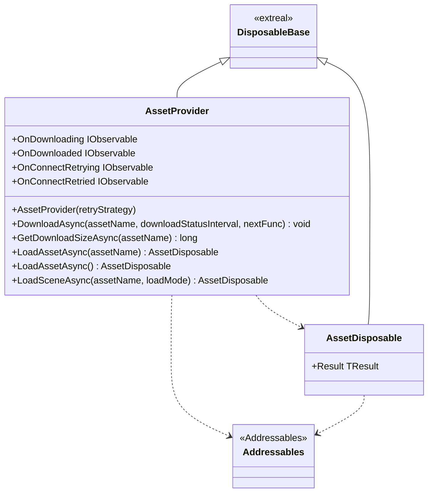
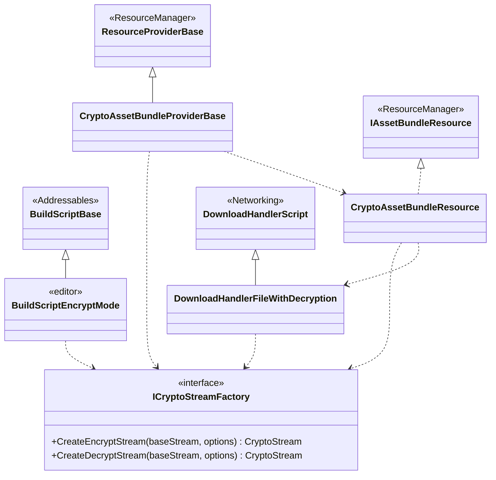

---
sidebar_position: 3
---

# Asset Workflow using Addressables

## What for?

[Addressables](https://docs.unity3d.com/Packages/com.unity.addressables@1.19/manual/index.html)をアプリケーションで使いやすくするラッパーを提供します。

Addressablesをラップしているこの機能をAddressablesラッパーと呼ぶことにします。

AddressablesラッパーではAddressablesを使ったアプリケーションに必要となるダウンロード状況表示やアセットの暗号化/復号を作りやすくする機能を提供します。

あなたのアプリケーションでAddressablesラッパーを使うことでAddressablesの導入がスムーズになることを目指しています。

:::caution
AddressablesラッパーはAddressablesを使いやすくしますが、Addressablesを知らなくてもAddressablesラッパーだけ知っていればアセットワークフローを実現できるわけではありません。
AddressablesラッパーはAddressablesをそのまま使う場合に使いにくい点や足りない機能を補いますが、アセットワークフローの処理はAddressablesに移譲します。
そのため、Addressablesラッパーを使うにはAddressablesを知っていることが前提です。
Addressablesを知らない場合は[Learning](../learning/intro.md#asset-workflow)を参照してAddressablesについて学習してください。
このガイドはAddressablesを知っている前提で説明しています。
:::

## Specification

Addressablesラッパーの仕様は次の通りです。

- Addressablesの機能を使用できます。
- アセットのダウンロードで接続できない時に再接続できます。
- アセットのダウンロード状況をトリガーに処理を追加できます。
- アセットの暗号化と復号ができます。

## Architecture

### Addressables wrapper



### Addressables customization



## Installation

### Package

```text
https://github.com/extreal-dev/Extreal.Integration.AssetWorkflow.Addressables.git
```

### Dependencies

Addressablesラッパーは次のパッケージを使います。

- [Extreal.Core.Logging](../core/logging.md)
- [Extreal.Core.Common](../core/common.md)
- [Addressables](https://docs.unity3d.com/Packages/com.unity.addressables@1.19/manual/index.html)
- [UniTask](https://github.com/Cysharp/UniTask)
- [UniRx](https://github.com/neuecc/UniRx)

モジュールバージョンと各パッケージバージョンの対応は[Release](../category/release)を参照ください。

### Settings

デフォルトで使う場合は特別な設定はありません。
アセットの暗号化と復号を行う場合は[暗号化と復号](#assets-addressables-crypto)を参照してください。

## Usage

### Addressablesの機能を使用する

Addressablesの機能はAssetProviderクラスが提供します。
AssetProviderが提供していない機能はAddressablesを直接使って実装してください。

```csharp
var assetProvider = new AssetProvider();
```

ここではAssetProviderの基本的な使い方をいくつか紹介します。

ダウンロードサイズの取得にはGetDownloadSizeAsyncメソッドを使います。

```csharp
var size = await assetProvider.GetDownloadSizeAsync("AssetName");
```

:::caution
AssetProvider.GetDownloadSizeAsyncメソッドは、アセットがキャッシュされている場合0を返しますが、
2022.1以降かつWebGLプラットフォームで使用した場合、キャッシュされていてもファイルサイズを返します。
[Unity Forum](https://forum.unity.com/threads/in-2022-2-xx-webgl-builds-getdownloadsizeasync-does-not-reflect-the-cache.1440877/)に投稿されている通り、
Unity2022.1へのアップデートにより、内部で使っているAddressables.GetDownloadSizeAsyncメソッドの動作が変わったことによるものです。
:::

アセットのダウンロードにはDownloadAsyncメソッドを使います。

```csharp
assetProvider.DownloadAsync("AssetName").Forget();
```

ダウンロード後にアセットをロードしてからステージ遷移させるなど、ダウロード後の処理を指定することもできます。

```csharp
Func<UniTask> navigate = async () =>
{
    MessageConfig = await LoadAsync<MessageConfig>();
    stageNavigator.ReplaceAsync(nextStage).Forget();
};
assetProvider.DownloadAsync("AssetName", nextFunc: navigate).Forget();
```

ダウンロード状況に応じて処理を実行したい場合は[イベント通知](#assets-addressables-event)を使用してください。

アセットのロードにはLoadAssetAsyncメソッドを使います。

```csharp
using var assetDisposable = await assetProvider.LoadAssetAsync<GameObject>("AssetName");
var prefab = assetDisposable.Result;
```

アセットやシーンをロードするメソッドはAssetDisposableを返します。
AssetDisposableはロードしたアセットのリリースをIDisposableのDisposeで実現するクラスです。
AssetDisposableにより他のIDisposableを実装したクラスと同じようにアセットを扱えます。
ロードしたアセットはAssetDisposableのResultプロパティから取得します。

ScriptableObjectなど、タイプ名をアセット名にすると、アセット名を指定せずにアセットをロードできます。

```csharp
// Asset name: "ChatConfig"
using var assetDisposable = await assetProvider.LoadAssetAsync<ChatConfig>();
var chatConfig = assetDisposable.Result;
```

シーンのロードにはLoadSceneAsyncメソッドを使います。

```csharp
using var assetDisposable = await assetProvider.LoadSceneAsync("VirtualSpace");
var sceneInstance = assetDisposable.Result;
```

### アセットのダウンロードで接続できない時に再接続する {#assets-addressables-retry}

AssetProviderは[Common](../core/common.md)が提供するリトライ処理を使って接続できない時の再接続を実現しています。
リトライ処理を知っている前提で以降の説明をするため、リトライ処理を確認していない方は先に[リトライ処理](../core/common.md#core-common-retry)を確認してください。

AssetProviderはデフォルトで再接続を行いません。
AssetProviderのコンストラクタにリトライ戦略を指定すると再接続を行います。

```csharp
var assetProvider = new AssetProvider(new CountingRetryStrategy());
```

AssetProviderが行う再接続の処理内容は次の通りです。

- 再接続を実行するタイミング
    - アセットのダウンロードが失敗した場合
      - アセットのダウンロードをしていない状態でアセットのロードをした場合もダウンロードが発生するため、アセットのロードが失敗した場合も含まれます。
- 再接続の処理内容
    - アセットのダウンロードが失敗した場合
        - リトライ戦略に応じて接続を繰り返します。

リトライ処理の状況に応じて処理を実行したい場合は[イベント通知](#assets-addressables-event)を使用してください。

### アセットのダウンロード状況をトリガーに処理を追加する {#assets-addressables-event}

AssetProviderは次のイベント通知を設けています。

- OnDownloading
    - タイミング：ダウンロードを開始する直前
    - タイプ：IObservable
    - パラメータ：アセット名
- OnDownloaded
    - タイミング：ダウンロードした直後（途中経過も含む）
    - タイプ：IObservable
    - パラメータ：ダウンロード状況
      - アセット名、トータルバイト数、ダウンロード済みバイト数、パーセントなど
- OnConnectRetrying
    - タイミング：接続をリトライする直前
    - タイプ：IObservable
    - パラメータ：リトライ回数
        - 1回目は`1`、2回目は`2`となります。
        - `1`はリトライ戦略の実行開始を意味します。
- OnConnectRetried
    - タイミング：接続のリトライが終了した直後
        - リトライがキャンセルされた場合は通知されません。
    - タイプ：IObservable
    - パラメータ：リトライ結果
        - true：リトライ戦略を実行してリトライが成功した場合
        - false：リトライ戦略を実行して最終的にリトライが成功しなかった場合

### アセットの暗号化と復号を行う {#assets-addressables-crypto}

:::caution
WebGLではこの機能を使用できません。
:::

:::caution
この機能を使うだけでは知的財産保護としては弱いので注意してください。

この機能を使うことで暗号化されたアセットのみを手に入れた場合は復号できません。
例えば、アセットのダウンロード先のURLが分かっても復号できないためアセットの流用を防げます。

しかし、暗号アルゴリズムや復号に使うキー（ICryptoStreamFactoryの実装）をアプリケーションに組み込んでいる場合は、リバースエンジニアアリングにより復号に必要な情報にアクセスして復号できてしまいます。
そのため、知的財産保護を目的とする場合は本機能に加えてリバースエンジニアアリング対応など、アプリケーションからの復号を防ぐ対応が必要です。
:::

AddressablesのビルドスクリプトとResourceProviderをカスタマイズしてアセットの暗号化と復号を実現します。
次のクラスを提供しています。

- アセットの暗号化を行うビルドスクリプト
  - BuildScriptEncryptMode
- アセットの復号を行うResourceProvider
  - CryptoAssetBundleProviderBase
  - CryptoAssetBundleResource
  - DownloadHandlerFileWithDecryption
- アセットの暗号化と復号に使うCryptoStreamを生成するファクトリ
  - ICryptoStreamFactory

これらのクラスは次のような関連があります。
- 使用する暗号アルゴリズムやキーの管理はアプリケーションに求められるセキュリティレベルに応じて変わるため、それらの処理を提供するICryptoStreamFactoryを設けています。
- ICryptoStreamFactoryを組み込むためにBaseクラスとしてCryptoAssetBundleProviderBaseを提供しています。
- CryptoAssetBundleProviderBaseはICryptoStreamFactoryを使ってアセットを復号します。(実際にはCryptoAssetBundleResource、DownloadHandlerFileWithDecryptionが行います)
- BuildScriptEncryptModeはビルド実行時にAsset Groupに指定されているResourceProviderがCryptoAssetBundleProviderBaseを継承したクラスの場合はICryptoStreamFactoryを使って暗号化を行い、そうでない場合は暗号化を行いません。

この機能の適用方法について説明します。

まず、アセットの暗号化を行うビルドスクリプトを次の手順で設定します。

- アセット作成メニューの`Extreal > Integration.AssetWorkflow.Addressables.Editor > Encrypt Build Script`からScriptableObjectを作成します。
- `AddressablesAssetSettings`のインスペクタから`Build and Play Mode Scripts`に作成したScriptableObjectを追加します。

この設定により、`Addressables Group`ウィンドウの`Build > New Build > Encrypt Build Script`が選べるようになります。

次に、アセットの復号を行うResourceProviderを設定します。
ResourceProviderの設定で関連するクラスを利用するため、`Extreal.Integration.AssetWorkflow.Addressables.Custom.ResourceProviders`の命名空間をアアプリケーションの`Assembly Definition References`に追加する必要があります。
先にICryptoStreamFactoryの実装が必要です。
アプリケーションの要件に合わせてICryptoStreamFactoryを実装してください。
実装イメージを伝えるためにAESを使った実装例を示します。

```csharp
public class CryptoStreamFactory : ICryptoStreamFactory
{
    public CryptoStream CreateEncryptStream(Stream baseStream, AssetBundleRequestOptions options)
        => CreateCryptoStream(baseStream, options, CryptoStreamMode.Write);

    public CryptoStream CreateDecryptStream(Stream baseStream, AssetBundleRequestOptions options)
        => CreateCryptoStream(baseStream, options, CryptoStreamMode.Read);

    private static CryptoStream CreateCryptoStream
    (
        Stream baseStream,
        AssetBundleRequestOptions options,
        CryptoStreamMode mode
    )
    {
        using var aes = CreateAesManaged(options);
        var cryptor = mode == CryptoStreamMode.Write ? aes.CreateEncryptor() : aes.CreateDecryptor();
        return new CryptoStream(baseStream, cryptor, mode);
    }

    [SuppressMessage("Usage", "CC0022")]
    private static AesManaged CreateAesManaged(AssetBundleRequestOptions options)
    {
        const int keyLength = 128;
        var salt = Encoding.UTF8.GetBytes(options.BundleName);

        using var keyGen = new Rfc2898DeriveBytes(SecretVariables.CryptAssetPassword, salt, 100, HashAlgorithmName.SHA256);
        using var ivGen = new Rfc2898DeriveBytes(SecretVariables.CryptAssetIv, salt, 1, HashAlgorithmName.SHA256);

        var key = keyGen.GetBytes(keyLength / 8);
        var iv = ivGen.GetBytes(keyLength / 8);

        return new AesManaged
        {
            BlockSize = keyLength,
            KeySize = keyLength,
            Mode = CipherMode.CBC,
            Padding = PaddingMode.PKCS7,
            Key = key,
            IV = iv
        };
    }
}
```

CryptoAssetBundleProviderBaseを継承したクラスを実装します。
ICryptoStreamFactoryを実装したクラスを返すようにします。

```csharp
[DisplayName("Crypto AssetBundle Provider")]
public class CryptoAssetBundleProvider : CryptoAssetBundleProviderBase
{
    public override ICryptoStreamFactory CryptoStreamFactory => new CryptoStreamFactory();
}
```

これで`Addressables Asset Group`のインスペクタから`Content Packing & Loading > Advanced Options > Asset Bundle Provider`にて実装したクラスを選べるようになります。
