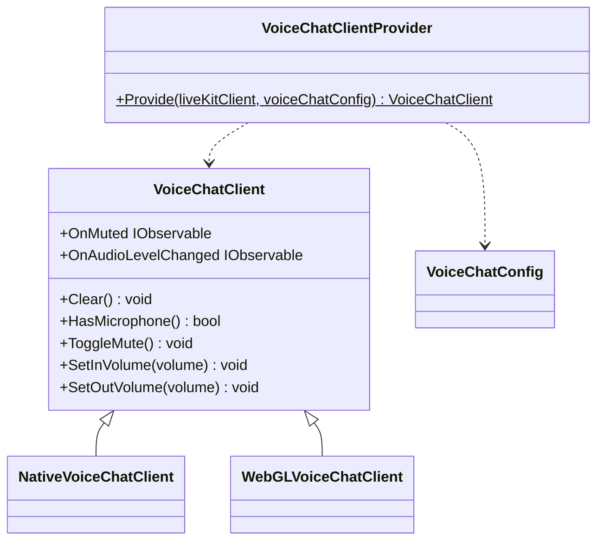
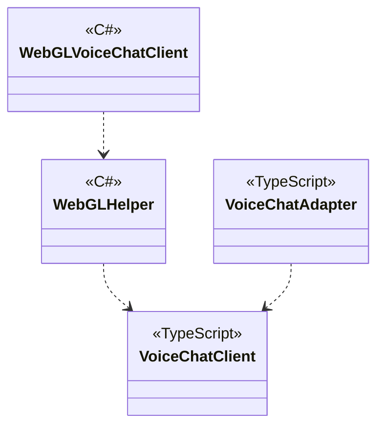

# Chat using LiveKit

## What for?

コストをできるだけ抑えてバーチャル空間等で大規模なコミュニケーションを取る手段としてSFU(Selective Forwarding Unit)があります。

このモジュールはNative(C#)とWebGL(JavaScript)向けのSFUによるボイスチャットを提供します。

## Specification

- SFUによるボイスチャットができます。
- ボイスチャットのクライアントの状態をトリガーに処理を追加できます。

## Architecture

### Unity



### JavaScript



## Installation

### Package

#### Unity
```text
https://github.com/extreal-dev/Extreal.Integration.Chat.LiveKit.git
```

#### npm
```text
@extreal-dev/extreal.integration.chat.livekit
```

### Dependencies

このモジュールは次のパッケージを使います。

#### Unity

- [Extreal.Core.Logging](../core/logging.md)
- [Extreal.Core.Common](../core/common.md)
- [Extreal.Integration.Web.Common](../integration/web.common.md)
- [Extreal.Integration.SFU.LiveKit](../integration/sfu.livekit.md)
- [UniTask](https://github.com/Cysharp/UniTask)
- [UniRx](https://github.com/neuecc/UniRx)
- [WebRTC](https://docs.unity3d.com/Packages/com.unity.webrtc@3.0/manual/index.html)

#### npm

- [@extreal-dev/extreal.integration.web.common](https://www.npmjs.com/package/@extreal-dev/extreal.integration.web.common)
- [@extreal-dev/extreal.integration.sfu.livekit](https://www.npmjs.com/package/@extreal-dev/extreal.integration.sfu.livekit)

### Settings

このモジュールは[SFU.LiveKit](./sfu.livekit.md)を使ってSFUを実現しています。
そのため[SFU.LiveKitのSettings](./sfu.livekit.md#settings)が必要になります。
SFU.LiveKitを設定した上で次の初期化を追加してください。

Providerを使ってClientを作成します。

```csharp
public class ClientControlScope : LifetimeScope
{
    protected override void Configure(IContainerBuilder builder)
    {
        var liveKitConfig = new LiveKitConfig("http://localhost:3050", "http://localhost:3051");
        var liveKitClient = LiveKitClientProvider.Provide(liveKitConfig);
        builder.RegisterComponent(liveKitClient);

        var voiceChatConfig = new VoiceChatConfig();
        var voiceChatClient = VoiceChatClientProvider.Provide(liveKitClient, voiceChatConfig);
        builder.RegisterComponent(voiceChatClient);

        builder.RegisterEntryPoint<ClientControlPresenter>();
    }
}
```

WebGLで使う場合はさらにJavaScriptの初期化が必要になります。
Adapterを作成してadapt関数を呼び出します。

```typescript
import { LiveKitAdapter } from "@extreal-dev/extreal.integration.sfu.livekit";
import { VoiceChatAdapter } from "@extreal-dev/extreal.integration.chat.livekit";


const liveKitAdapter = new LiveKitAdapter();
liveKitAdapter.adapt();

const voiceChatAdapter = new VoiceChatAdapter();
voiceChatAdapter.adapt(liveKitAdapter.getLiveKitClient);
```

## Usage

### SFUによるボイスチャットを行う

ボイスチャットは[SFU.LiveKit](./sfu.livekit.md)を使ってSFUを実現しています。
SFUの接続確立は[SFU.LiveKitのAPI](./sfu.livekit.md#sfu-livekit-establish-connection)を使ってください。

ボイスチャットの機能はVoiceChatClientが提供します。

ミュート切り替えはToggleMuteメソッドを使います。

```csharp
voiceChatClient.ToggleMute();
```

ミュート切り替え後の値（bool）はOnMutedイベントで受け取れます。

```csharp
voiceChatClient.OnMuted
    .Subscribe(muted =>
    {
        // do something
    })
    .AddTo(disposables);
```

ミュートの初期値を指定したい場合はVoiceChatConfigで指定します。

```csharp
var voiceChatConfig = new VoiceChatConfig(initialMute: false);
var voiceChatClient = VoiceChatClientProvider.Provide(liveKitClient, voiceChatConfig);
```

入力音量調整にはSetInVolumeメソッドを使います。
引数のvolumeには0～1のfloat値を入力してください。

```csharp
voiceChatClient.SetInVolume(volume);
```

入力音量の初期値を指定したい場合はVoiceChatConfigで指定します。

```csharp
var voiceChatConfig = new VoiceChatConfig(initialInVolume: 0.8f);
var voiceChatClient = VoiceChatClientProvider.Provide(liveKitClient, voiceChatConfig);
```

出力音量調整にはSetOutVolumeメソッドを使います。
引数のvolumeには0～1のfloat値を入力してください。

```csharp
voiceChatClient.SetOutVolume(volume);
```

出力音量の初期値を指定したい場合はVoiceChatConfigで指定します。

```csharp
var voiceChatConfig = new VoiceChatConfig(initialOutVolume: 0.8f);
var voiceChatClient = VoiceChatClientProvider.Provide(liveKitClient, voiceChatConfig);
```

### ボイスチャットのクライアントの状態をトリガーに処理を追加する

VoiceChatClientは次のイベント通知を設けています。

- OnAudioLevelChanged
  - タイミング：指定した頻度ごとに、発話音量の変化があったとき
  - タイプ：IObservable
  - パラメータ：IDと発話音量のペア

発話音量の取得頻度を指定したい場合はVoiceChatConfigで指定します。

```csharp
var voiceChatConfig = new VoiceChatConfig(InitialAudioLevelCheckIntervalSeconds: 0.5f);
var voiceChatClient = VoiceChatClientProvider.Provide(liveKitClient, voiceChatConfig);
```
