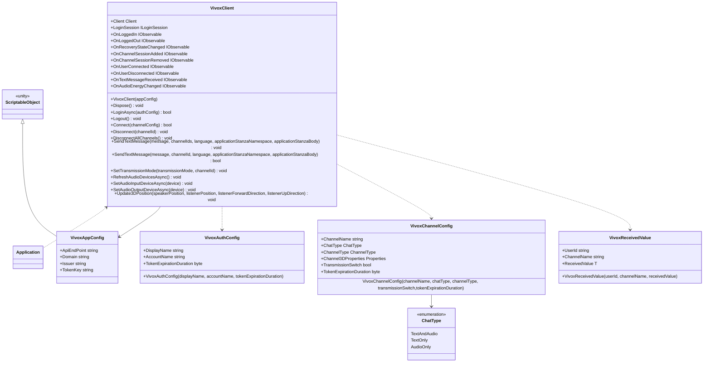

# Chat using Vivox

[Vivox](https://unity.com/ja/products/vivox)をアプリケーションで使いやすくするラッパーを提供します。

Vivoxをラップしているこの機能をVivoxラッパーと呼ぶことにします。

VivoxのAPIは概念毎に細かくインタフェースが分かれているので、ログイン/ログアウトやチャンネルへの接続/切断といった実装はどのようなアプリケーションでも同じような実装になります。
VivoxラッパーはそのようなVivoxを使う場合に共通する実装を機能として提供します。

あなたのアプリケーションでVivoxラッパーを使うことでVivoxの導入がスムーズになることを目指しています。

:::caution
VivoxラッパーはVivoxを使いやすくしますが、Vivoxを知らなくてもVivoxラッパーだけ知っていればボイス/テキストチャットを実現できるわけではありません。
VivoxラッパーはVivoxをそのまま使う場合に使いにくい点や足りない機能を補いますが、ボイス/テキストチャットの処理はVivoxに移譲します。
そのため、Vivoxラッパーを使うにはVivoxを知っていることが前提です。
Vivoxを知らない場合は[How to lean](/learning/intro#how-to-learn)を参照してVivoxについて学習してください。
このガイドはVivoxを知っている前提で説明しています。
:::

:::caution
Vivoxは元々存在していた[Vivox Developer Portal](https://developer.vivox.com/)と2021年10月に登場した[Unity Gaming Services](https://unity.com/ja/solutions/gaming-services)で使用できます。
現時点のVivoxラッパーは[Vivox Developer Portal](https://developer.vivox.com/)に対応しています。
[Unity Gaming Services](https://unity.com/ja/solutions/gaming-services)には対応していません。
今後[Unity Gaming Services](https://unity.com/ja/solutions/gaming-services)への対応を検討します。
:::

## Specification

Vivoxラッパーの仕様は次の通りです。

- Vivoxのクライアント向けの機能を使用できます。
- Vivoxのクライアント状態をトリガーに処理を追加できます。

## Architecture



## Installation

### Package

```
https://github.com/extreal-dev/Extreal.Integration.Chat.Vivox.git
```

### Dependencies

Vivoxラッパーは次のパッケージを使います。

- [Extreal.Core.Logging](/core/logging)
- [Vivox Unity SDK](https://docs.vivox.com/v5/general/unity/15_1_190000/en-us/Default.htm)
- [UniTask](https://github.com/Cysharp/UniTask)
- [UniRx](https://github.com/neuecc/UniRx)

モジュールバージョンと各パッケージバージョンの対応は[Release](/category/release)を参照ください。

### Settings

VivoxClientを初期化します。

[Vivox Developer Portal](https://developer.vivox.com/)でクライアントからの接続先となるアプリケーションが作成されているものとします。

VivoxClientの初期化にはVivoxAppConfigが必要です。
VivoxAppConfigはScriptableObjectを継承しているのでアセットを作成します。
VivoxAppConfigのアセット作成メニューは次の通りです。

```
Extreal/Integration.Chat.Vivox/VivoxAppConfig
```

インスペクタでVivoxのアプリケーションへの接続情報をVivoxAppConfigに設定します。

VContainerを使ってVivoxClientを初期化します。

```csharp
public class ChatControlScope : LifetimeScope
{
    [SerializeField] private VivoxAppConfig vivoxAppConfig;

    protected override void Configure(IContainerBuilder builder)
    {
        builder.RegisterComponent(vivoxAppConfig);
        builder.Register<VivoxClient>(Lifetime.Singleton);
    }
}
```

## Usage

## Vivoxのクライアント向けの機能を使用する

Vivoxのクライアント向けの機能はVivoxClientが提供します。
VivoxClientが提供していない機能はVivoxClientからVivoxが提供するClientやILoginSessionを取得して実装してください。

```csharp
var client = vivoxClient.Client;
var loginSession = vivoxClient.LoginSession;
```

ここではVivoxClientの基本的な使い方をいくつか紹介します。

ボイス/テキストチャットを行うにはまずVivoxのアプリケーションにログインが必要です。
ログインはVivoxClientのLoginを使います。

```csharp
var vivoxAuthConfig = new VivoxAuthConfig("Guest");
vivoxClient.Login(vivoxAuthConfig);
```

ログアウトはVivoxClientのLogoutを使います。

```csharp
vivoxClient.Logout();
```

チャンネルへの入室はVivoxClientのConnectを使います。

```csharp
var vivoxChannelConfig = new VivoxChannelConfig("GuestChannel");
vivoxClient.Connect(vivoxChannelConfig);
```

VivoxChannelConfigはデフォルトでボイスチャットとテキストチャットを有効にします。
ボイスチャットのみ、テキストチャットのみに制限したい場合はChatTypeを指定します。
ボイスチャットのみに制限する場合の例は次の通りです。

```csharp
var vivoxChannelConfig = new VivoxChannelConfig("GuestChannel", ChatType.AudioOnly);
```

チャンネルからの退室はVivoxClientのDisconnectAllChannelsを使います。

```csharp
vivoxClient.DisconnectAllChannels();
```

テキストチャットのメッセージ送信はVivoxClientのSendTextMessageを使います。

```csharp
vivoxClient.SendTextMessage(message, channelId);
```

テキストチャットのメッセージ受信はVivoxClientが発行するイベント通知のOnTextMessageReceivedを使用します。

```csharp
vivoxClient.OnTextMessageReceived
    .Subscribe(message => /* do something with message */)
    .AddTo(disposables);
```

## Vivoxのクライアント状態をトリガーに処理を追加できます。

VivoxClientは次のイベント通知を設けています。

- OnLoggedIn
  - タイミング：ログインした直後
  - タイプ：IObservable
  - パラメータ：なし
- OnLoggedOut
  - タイミング：ログアウトした直後
  - タイプ：IObservable
  - パラメータ：なし
- OnRecoveryStateChanged
  - タイミング：予期していないネットワーク切断が発生した直後
  - タイプ：IObservable
  - パラメータ：リカバリ状態
    - [ConnectionRecoveryState](https://docs.vivox.com/v5/general/unity/15_1_190000/en-us/Default.htm#ReferenceManual/Unity/namespace_vivox_unity.html#a21771ea5086c36c42452bc29059ec379%3FTocPath%3DCore%7CUnity%2520API%2520Reference%2520Manual%7CClass%2520List%7CUnity%20API%20Reference%20Manual%7CUnity%20API%20Reference%20Manual%7C_____4)
- OnChannelSessionAdded
  - タイミング：チャンネルが追加された直後
  - タイプ：IObservable
  - パラメータ：追加されたチャンネルのID
    - [ChannelId](https://docs.vivox.com/v5/general/unity/15_1_190000/en-us/Default.htm#ReferenceManual/Unity/class_vivox_unity_1_1_channel_id.html%3FTocPath%3DVivox%2520Unity%2520SDK%2520documentation%7CUnity%2520API%2520Reference%2520Manual%7CClass%2520List%7C_____5)
- OnChannelSessionRemoved
  - タイミング：チャンネルが削除された直後
  - タイプ：IObservable
  - パラメータ：削除されたチャンネルのID
    - [ChannelId](https://docs.vivox.com/v5/general/unity/15_1_190000/en-us/Default.htm#ReferenceManual/Unity/class_vivox_unity_1_1_channel_id.html%3FTocPath%3DVivox%2520Unity%2520SDK%2520documentation%7CUnity%2520API%2520Reference%2520Manual%7CClass%2520List%7C_____5)
- OnUserConnected
  - タイミング：チャンネルに参加者が入室した直後
  - タイプ：IObservable
  - パラメータ：入室した参加者
    - [IParticipant](https://docs.vivox.com/v5/general/unity/15_1_190000/en-us/Default.htm#ReferenceManual/Unity/interface_vivox_unity_1_1_i_participant.html%3FTocPath%3DVivox%2520Unity%2520SDK%2520documentation%7CUnity%2520API%2520Reference%2520Manual%7CClass%2520List%7C_____31)
- OnUserDisconnected
  - タイミング：チャンネルから参加者が退室した直後
  - タイプ：IObservable
  - パラメータ：退室した参加者
    - [IParticipant](https://docs.vivox.com/v5/general/unity/15_1_190000/en-us/Default.htm#ReferenceManual/Unity/interface_vivox_unity_1_1_i_participant.html%3FTocPath%3DVivox%2520Unity%2520SDK%2520documentation%7CUnity%2520API%2520Reference%2520Manual%7CClass%2520List%7C_____31)
- OnTextMessageReceived
  - タイミング：チャンネルにメッセージが着信した直後
  - タイプ：IObservable
  - パラメータ：着信したメッセージ
- OnAudioEnergyChanged
  - タイミング：参加者の音声の大きさに変化があった直後
  - タイプ：IObservable
  - パラメータ：音声の大きさ
    - [AudioEnergy](https://docs.vivox.com/v5/general/unity/15_1_190000/en-us/Default.htm#ReferenceManual/Unity/interface_vivox_unity_1_1_i_participant_properties.html#ac14ea71429adc8e41eaa22af478296ee%3FTocPath%3DCore%7CUnity%2520API%2520Reference%2520Manual%7CClass%2520List%7CUnity%20API%20Reference%20Manual%7CClass%20List%7C_____40)
