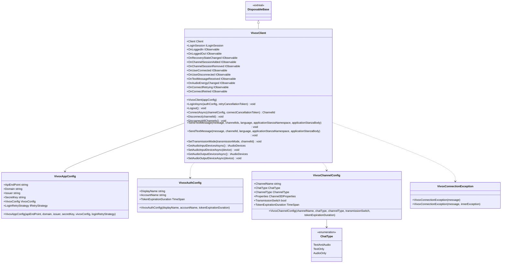

# Chat using Vivox

## What for?

[Vivox](https://unity.com/ja/products/vivox)をアプリケーションで使いやすくするラッパーを提供します。

Vivoxをラップしているこの機能をVivoxラッパーと呼ぶことにします。

VivoxのAPIを使ったログイン/ログアウトやチャンネルへの接続/切断といった実装はどのようなアプリケーションでも同じような実装になります。
VivoxラッパーはそのようなVivoxを使う場合に共通する実装を機能として提供します。

あなたのアプリケーションでVivoxラッパーを使うことでVivoxの導入がスムーズになることを目指しています。

:::caution
VivoxラッパーはVivoxを使いやすくしますが、Vivoxを知らなくてもVivoxラッパーだけ知っていればボイス/テキストチャットを実現できるわけではありません。
VivoxラッパーはVivoxをそのまま使う場合に使いにくい点や足りない機能を補いますが、ボイス/テキストチャットの処理はVivoxに移譲します。
そのため、Vivoxラッパーを使うにはVivoxを知っていることが前提です。
Vivoxを知らない場合は[Learning](../learning/intro.md#chat)を参照してVivoxについて学習してください。
このガイドはVivoxを知っている前提で説明しています。
:::

:::caution
Vivoxは元々存在していた[Vivox Developer Portal](https://developer.vivox.com/)と2021年10月に登場した[Unity Gaming Services](https://unity.com/ja/solutions/gaming-services)で使用できます。
現時点のVivoxラッパーは[Vivox Developer Portal](https://developer.vivox.com/)に対応しています。
[Unity Gaming Services](https://unity.com/ja/solutions/gaming-services)には対応していません。
今後[Unity Gaming Services](https://unity.com/ja/solutions/gaming-services)への対応を検討します。
:::

## Specification

Vivoxラッパーの仕様は次の通りです。

- Vivoxの機能を使用できます。
- 通信が切断されたときに再接続できます。
- Vivoxのクライアント状態をトリガーに処理を追加できます。

## Architecture



## Installation

### Package

```text
https://github.com/extreal-dev/Extreal.Integration.Chat.Vivox.git
```

### Dependencies

Vivoxラッパーは次のパッケージを使います。

- [Extreal.Core.Logging](../core/logging.md)
- [Extreal.Core.Common](../core/common.md)
- [Vivox Unity SDK](https://docs.vivox.com/v5/general/unity/15_1_190000/en-us/Default.htm)
- [UniTask](https://github.com/Cysharp/UniTask)
- [UniRx](https://github.com/neuecc/UniRx)

モジュールバージョンと各パッケージバージョンの対応は[Release](../category/release)を参照ください。

### Settings

VivoxClientを初期化します。

[Vivox Developer Portal](https://developer.vivox.com/)でクライアントからの接続先となるアプリケーションが作成されているものとします。

VivoxClientの初期化にはVivoxへの接続情報を保持するVivoxAppConfigが必要です。
今回は一例としてScriptableObjectでVivoxへの接続情報を設定する方法を紹介します。
VivoxAppConfigを生成するScriptableObjectを作成し、インスペクタでVivoxへの接続情報を設定します。

```csharp
[CreateAssetMenu(
    menuName = "Config/" + nameof(ChatConfig),
    fileName = nameof(ChatConfig))]
public class ChatConfig : ScriptableObject
{
    [SerializeField] private string apiEndPoint;
    [SerializeField] private string domain;
    [SerializeField] private string issuer;
    [SerializeField] private string secretKey;

    public VivoxAppConfig ToVivoxAppConfig()
        => new VivoxAppConfig(apiEndPoint, domain, issuer, secretKey);
}
```

:::info
VivoxAppConfigには接続情報の他に次の設定を行えます。
- [VivoxConfig](https://docs.vivox.com/v5/general/unity/15_1_190000/en-us/Default.htm#ReferenceManual/Unity/class_vivox_unity_1_1_vivox_config.html?TocPath=Vivox%2520Unity%2520SDK%2520documentation%257CUnity%2520API%2520Reference%2520Manual%257CClass%2520List%257C_____15)
- 通信切断時の再接続で使うリトライ戦略
  - 詳細は[通信切断時に再接続する](#chat-vivox-retry)を参照してください。
:::

VContainerを使ってVivoxClientを初期化します。

```csharp
public class ChatControlScope : LifetimeScope
{
    [SerializeField] private ChatConfig chatConfig;

    protected override void Configure(IContainerBuilder builder)
    {
        builder.RegisterComponent(chatConfig.ToVivoxAppConfig());
        builder.Register<VivoxClient>(Lifetime.Singleton);
    }
}
```

## Usage

### Vivoxの機能を使用する

Vivoxの機能はVivoxClientが提供します。
VivoxClientが提供していない機能はVivoxClientからVivoxが提供するClientやILoginSessionを取得して実装してください。

```csharp
var client = vivoxClient.Client;
var loginSession = vivoxClient.LoginSession;
```

ここではVivoxClientの基本的な使い方をいくつか紹介します。

ボイス/テキストチャットを行うにはまずVivoxのアプリケーションにログインが必要です。
ログインはVivoxClientのLoginAsyncを使います。

```csharp
var vivoxAuthConfig = new VivoxAuthConfig("Guest");
vivoxClient.LoginAsync(vivoxAuthConfig).Forget();
```

ログアウトはVivoxClientのLogoutを使います。

```csharp
vivoxClient.Logout();
```

チャンネルへの入室はVivoxClientのConnectAsyncを使います。

```csharp
var vivoxChannelConfig = new VivoxChannelConfig("GuestChannel");
vivoxClient.ConnectAsync(vivoxChannelConfig).Forget();
```

VivoxChannelConfigはデフォルトでボイスチャットとテキストチャットを有効にします。
ボイスチャットのみ、テキストチャットのみに制限したい場合はChatTypeを指定します。
ボイスチャットのみに制限する場合の例は次の通りです。

```csharp
var vivoxChannelConfig = new VivoxChannelConfig("GuestChannel", ChatType.AudioOnly);
```

空間内でのみボイスチャットやテキストチャットをできるようにする場合など、空間からの退室時点で全てのチャンネルから退室する場合はVivoxClientのDisconnectAllChannelsを使います。

```csharp
vivoxClient.DisconnectAllChannels();
```

グループチャット機能を提供している場合など、特定のチャンネルから退室する場合はVivoxClientのDisconnectを使います。

```csharp
vivoxClient.Disconnect(channelId);
```

テキストチャットのメッセージ送信はVivoxClientのSendTextMessageを使います。

```csharp
vivoxClient.SendTextMessage(message, channelId);
```

テキストチャットのメッセージ受信はVivoxClientが発行するイベント通知のOnTextMessageReceivedを使用します。

```csharp
vivoxClient.OnTextMessageReceived
    .Subscribe(message => /* do something with message */)
    .AddTo(disposables);
```

### 通信が切断されたときに再接続する {#chat-vivox-retry}

VivoxClientは[Common](../core/common.md)が提供するリトライ処理を使って通信切断時の再接続を実現しています。
リトライ処理を知っている前提で以降の説明をするため、リトライ処理を確認していない方は先に[リトライ処理](../core/common.md#core-common-retry)を確認してください。

VivoxClientはデフォルトで再接続を行いません。
VivoxAppConfigにリトライ戦略を指定すると再接続を行います。

```csharp
new VivoxAppConfig(apiEndPoint, domain, issuer, secretKey, loginRetryStrategy: new CountingRetryStrategy());
```

VivoxClientが行う再接続の処理内容は次の通りです。

- 再接続を実行するタイミング
  - ログインが失敗した場合
  - Vivox Unity SDKの[自動接続回復](https://docs.vivox.com/v5/general/unity/15_1_190000/en-us/Default.htm#Unity/developer-guide/channels/automatic-connection-recovery/connection-recovery.htm?TocPath=Vivox%2520Unity%2520SDK%2520documentation%257CVivox%2520Unity%2520Developer%2520Guide%257CChannels%257CAutomatic%2520connection%2520recovery%257C_____0)が失敗した場合
    - ログイン後に通信が切断するとVivox Unity SDKは自動接続回復を30秒間試みます。
    - 自動接続回復が失敗した場合はVivox Unity SDKによりクライアントはログアウトされます。
- 再接続の処理内容
  - ログインが失敗した場合
    - リトライ戦略に応じてログインを繰り返します。
  - Vivox Unity SDKの自動接続回復が失敗した場合
    - リトライ戦略に応じてログインを繰り返します。
    - ログインが成功した場合は切断前に接続していた全てのチャンネルに接続します。

自動接続回復が失敗した場合はログアウト状態となり、ログインからやり直す必要があるため、VivoxClientの再接続はログイン処理のみを対象としています。

リトライ処理の状況に応じて処理を実行したい場合は[イベント通知](#chat-vivox-event)を使用してください。

### Vivoxのクライアント状態をトリガーに処理を追加する {#chat-vivox-event}

VivoxClientは次のイベント通知を設けています。

- OnLoggedIn
  - タイミング：ログインした直後
  - タイプ：IObservable
  - パラメータ：なし
- OnLoggedOut
  - タイミング：ログアウトした直後
  - タイプ：IObservable
  - パラメータ：なし
- OnRecoveryStateChanged
  - タイミング：予期しないネットワーク切断時のリカバリ状態が変化した直後
  - タイプ：IObservable
  - パラメータ：リカバリ状態
    - [ConnectionRecoveryState](https://docs.vivox.com/v5/general/unity/15_1_190000/en-us/Default.htm#ReferenceManual/Unity/namespace_vivox_unity.html#a21771ea5086c36c42452bc29059ec379%3FTocPath%3DCore%7CUnity%2520API%2520Reference%2520Manual%7CClass%2520List%7CUnity%20API%20Reference%20Manual%7CUnity%20API%20Reference%20Manual%7C_____4)
- OnChannelSessionAdded
  - タイミング：チャンネルが追加された直後
  - タイプ：IObservable
  - パラメータ：追加されたチャンネルのID
    - [ChannelId](https://docs.vivox.com/v5/general/unity/15_1_190000/en-us/Default.htm#ReferenceManual/Unity/class_vivox_unity_1_1_channel_id.html%3FTocPath%3DVivox%2520Unity%2520SDK%2520documentation%7CUnity%2520API%2520Reference%2520Manual%7CClass%2520List%7C_____5)
- OnChannelSessionRemoved
  - タイミング：チャンネルが削除された直後
  - タイプ：IObservable
  - パラメータ：削除されたチャンネルのID
    - [ChannelId](https://docs.vivox.com/v5/general/unity/15_1_190000/en-us/Default.htm#ReferenceManual/Unity/class_vivox_unity_1_1_channel_id.html%3FTocPath%3DVivox%2520Unity%2520SDK%2520documentation%7CUnity%2520API%2520Reference%2520Manual%7CClass%2520List%7C_____5)
- OnUserConnected
  - タイミング：チャンネルに参加者が入室した直後
    - イベント発生元になったユーザーにもこのイベントが通知されます。
  - タイプ：IObservable
  - パラメータ：入室した参加者
    - [IParticipant](https://docs.vivox.com/v5/general/unity/15_1_190000/en-us/Default.htm#ReferenceManual/Unity/interface_vivox_unity_1_1_i_participant.html%3FTocPath%3DVivox%2520Unity%2520SDK%2520documentation%7CUnity%2520API%2520Reference%2520Manual%7CClass%2520List%7C_____31)
    - 参加者がチャンネルに入室したユーザー自身かどうかはIParticipantのIsSelfプロパティで判定します。
- OnUserDisconnected
  - タイミング：チャンネルから参加者が退室した直後
    - イベント発生元になったユーザーにもこのイベントが通知されます。
  - タイプ：IObservable
  - パラメータ：退室した参加者
    - [IParticipant](https://docs.vivox.com/v5/general/unity/15_1_190000/en-us/Default.htm#ReferenceManual/Unity/interface_vivox_unity_1_1_i_participant.html%3FTocPath%3DVivox%2520Unity%2520SDK%2520documentation%7CUnity%2520API%2520Reference%2520Manual%7CClass%2520List%7C_____31)
    - 参加者がチャンネルから退室したユーザー自身かどうかはIParticipantのIsSelfプロパティで判定します。
- OnTextMessageReceived
  - タイミング：チャンネルにメッセージが着信した直後
  - タイプ：IObservable
  - パラメータ：着信したメッセージ
    - [IChannelTextMessage](https://docs.vivox.com/v5/general/unity/15_1_190000/en-us/Default.htm#ReferenceManual/Unity/interface_vivox_unity_1_1_i_channel_text_message.html%3FTocPath%3DCore%7CUnity%2520API%2520Reference%2520Manual%7CClass%2520List%7CUnity%20API%20Reference%20Manual%7CClass%20List%7C_____33)
- OnAudioEnergyChanged
  - タイミング：参加者の音声の大きさに変化があった直後
  - タイプ：IObservable
  - パラメータ：参加者と音声の大きさ（タプル）
    - [IParticipant](https://docs.vivox.com/v5/general/unity/15_1_190000/en-us/Default.htm#ReferenceManual/Unity/interface_vivox_unity_1_1_i_participant.html%3FTocPath%3DVivox%2520Unity%2520SDK%2520documentation%7CUnity%2520API%2520Reference%2520Manual%7CClass%2520List%7C_____31)
    - [AudioEnergy](https://docs.vivox.com/v5/general/unity/15_1_190000/en-us/Default.htm#ReferenceManual/Unity/interface_vivox_unity_1_1_i_participant_properties.html#ac14ea71429adc8e41eaa22af478296ee%3FTocPath%3DCore%7CUnity%2520API%2520Reference%2520Manual%7CClass%2520List%7CUnity%20API%20Reference%20Manual%7CClass%20List%7C_____40)
- OnConnectRetrying
  - タイミング：接続をリトライする直前
  - タイプ：IObservable
  - パラメータ：リトライ回数
    - 1回目は`1`、2回目は`2`となります。
    - `1`はリトライ戦略の実行開始を意味します。
- OnConnectRetried
  - タイミング：接続のリトライが終了した直後
    - リトライがキャンセルされた場合は通知されません。
  - タイプ：IObservable
  - パラメータ：リトライ結果
    - true：リトライ戦略を実行してリトライが成功した場合
    - false：リトライ戦略を実行して最終的にリトライが成功しなかった場合
