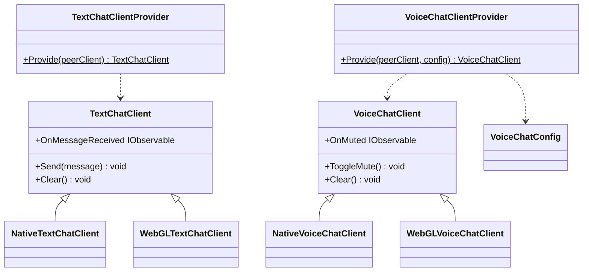
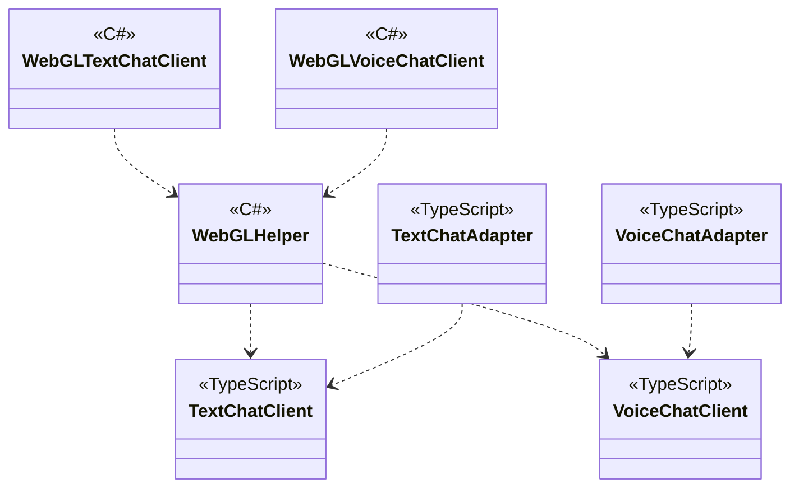

---
sidebar_position: 5
---

# Chat using WebRTC

## What for?

コストをできるだけ抑えてコミュニケーションを取る手段としてP2P(Peer to Peer)があります。

このモジュールはNative(C#)とWebGL(JavaScript)向けのP2Pによるテキスト/ボイスチャットを提供します。

## Specification

- P2Pによるテキストチャットができます。
- P2Pによるボイスチャットができます。

## Architecture

### Unity



### JavaScript



## Installation

### Package

#### Unity
```text
https://github.com/extreal-dev/Extreal.Integration.Chat.WebRTC.git
```

#### npm
```text
@extreal-dev/extreal.integration.chat.webrtc
```

### Dependencies

このモジュールは次のパッケージを使います。

#### Unity

- [Extreal.Core.Logging](../core/logging.md)
- [Extreal.Core.Common](../core/common.md)
- [Extreal.Integration.Web.Common](../integration/web.common.md)
- [Extreal.Integration.P2P.WebRTC](../integration/p2p.webrtc.md)
- [WebRTC](https://docs.unity3d.com/Packages/com.unity.webrtc@3.0/manual/index.html)
- [UniTask](https://github.com/Cysharp/UniTask)
- [UniRx](https://github.com/neuecc/UniRx)

#### npm

- [@extreal-dev/extreal.integration.web.common](https://www.npmjs.com/package/@extreal-dev/extreal.integration.web.common)
- [@extreal-dev/extreal.integration.p2p.webrtc](https://www.npmjs.com/package/@extreal-dev/extreal.integration.p2p.webrtc)

モジュールバージョンと各パッケージバージョンの対応は[Release](../category/release)を参照ください。

### Settings

このモジュールは[P2P.WebRTC](p2p.webrtc.md)を使ってP2Pを実現しています。
そのため[P2P.WebRTCのSettings](p2p.webrtc.md#settings)が必要になります。
P2P.WebRTCを設定した上で次の初期化を追加してください。

各Providerを使ってClientを作成します。

```csharp
public class ClientControlScope : LifetimeScope
{
    protected override void Configure(IContainerBuilder builder)
    {
        var peerConfig = new PeerConfig("http://127.0.0.1:3010");
        var peerClient = PeerClientProvider.Provide(peerConfig);
        builder.RegisterComponent(peerClient);

        var textChatClient = TextChatClientProvider.Provide(peerClient);
        builder.RegisterComponent(textChatClient);

        var voiceChatClient = VoiceChatClientProvider.Provide(peerClient);
        builder.RegisterComponent(voiceChatClient);

        builder.RegisterEntryPoint<ClientControlPresenter>();
    }
}
```

WebGLで使う場合はさらにJavaScriptの初期化が必要になります。
各Adapterを作成してadapt関数を呼び出します。

```typescript
import { PeerAdapter } from "@extreal-dev/extreal.integration.p2p.webrtc";
import { TextChatAdapter, VoiceChatAdapter } from "@extreal-dev/extreal.integration.chat.webrtc";

const peerAdapter = new PeerAdapter();
peerAdapter.adapt();

const textChatAdapter = new TextChatAdapter();
textChatAdapter.adapt(peerAdapter.getPeerClient);

const voiceChatAdapter = new VoiceChatAdapter();
voiceChatAdapter.adapt(peerAdapter.getPeerClient);
```

## Usage

### P2Pによるテキストチャットを行う

テキストチャットは[P2P.WebRTC](p2p.webrtc.md)を使ってP2Pを実現しています。
P2Pの接続確立は[P2P.WebRTCのAPI](p2p.webrtc.md#p2p-webrtc-host-client)を使ってください。

テキストチャットの機能はTextChatClientが提供します。

メッセージ送信はSendメソッドを使います。

```csharp
textChatClient.Send(message);
```

メッセージ受信はOnMessageReceivedイベントを使います。
パラメータとして文字列のメッセージが渡ってきます。

```csharp
textChatClient.OnMessageReceived
    .Subscribe(message =>
    {
        // do something
    })
    .AddTo(disposables);
```

テキストチャットを終了する場合はClearメソッドを使います。

```csharp
textChatClient.Clear();
```

### P2Pによるボイスチャットを行う

ボイスチャットは[P2P.WebRTC](p2p.webrtc.md)を使ってP2Pを実現しています。
P2Pの接続確立は[P2P.WebRTCのAPI](p2p.webrtc.md#p2p-webrtc-host-client)を使ってください。

ボイスチャットの機能はVoiceChatClientが提供します。

ミュート切り替えはToggleMuteメソッドを使います。

```csharp
voiceChatClient.ToggleMute();
```

ミュート切り替え後の値（bool）はOnMutedイベントで受け取れます。

```csharp
voiceChatClient.OnMuted
    .Subscribe(muted =>
    {
        // do something
    })
    .AddTo(disposables);
```

ミュートの初期値を指定したい場合はVoiceChatConfigで指定します。

```csharp
var voiceChatConfig = new VoiceChatConfig(initialMute: false);
var voiceChatClient = VoiceChatClientProvider.Provide(peerClient, voiceChatConfig);
```
