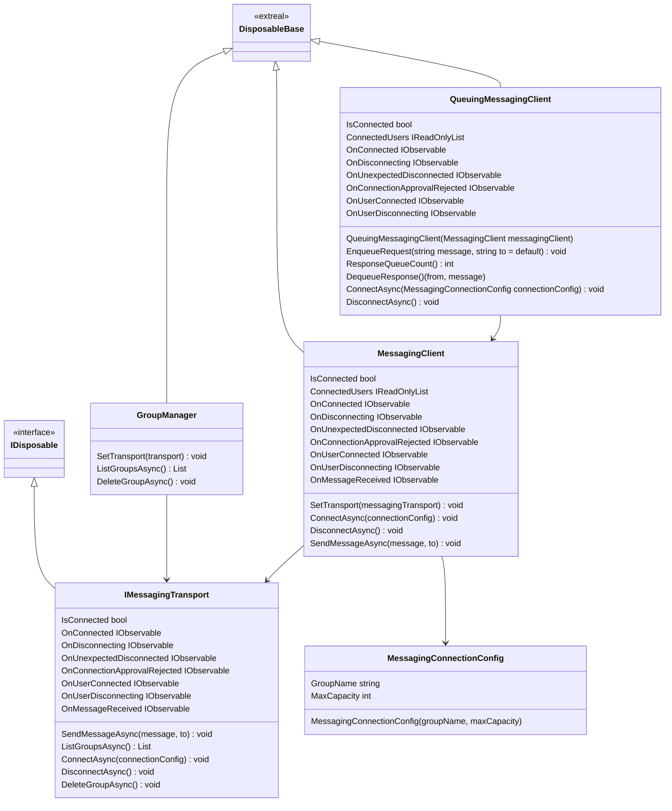

# Common for Messaging

## What for?

グループでメッセージのやり取りをする機能の共通部分を提供します。

この共通機能を使うことで自由にバックエンドとの通信方式を切り替えることができるようになります。
また使い方次第でマルチプレイにおける同期メッセージのやりとりやテキストチャットなど様々な用途に活用できます。

## Specification

- グループの管理ができます。
- グループでメッセージを送受信できます。
- キューイングを行うことができます。
- クライアントの状態をトリガーに処理を追加できます。
- バックエンドとの通信方式を切り替えることができます。

## Architecture



## Installation

### Package

```text
https://github.com/extreal-dev/Extreal.Integration.Messaging.Common.git
```

### Dependencies

- [Extreal.Core.Logging](../core/logging.md)
- [Extreal.Core.Common](../core/common.md)
- [UniTask](https://github.com/Cysharp/UniTask)
- [UniRx](https://github.com/neuecc/UniRx)

### Settings

MessagingClientを初期化します。
MessagingClientを初期化にはIMessagingTransportを実装したクラスのインスタンスが必要です。
IMessagingTransportを実装したクラスのインスタンスは初期化しているものとします。

```csharp
var messagingClient = new MessagingClient();
messagingClient.SetTransport(messagingTransport); // Let messagingTransport be an instance of a class that implements IMessagingTransport 
```

GroupManagerやQueuingMessagingClientを使用したい場合はこれらも初期化します。

```csharp
var groupManager = new GroupManager();
groupManager.SetTransport(messagingTransport);

var queuingMessagingClient = new QueuingMessagingClient(messagingClient);
```

## Usage
