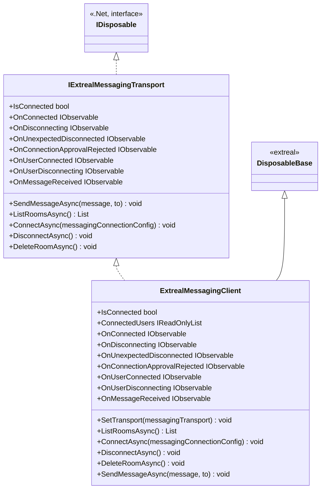

# Common for Messaging

## What for?

グループでメッセージのやり取りをする機能の共通部分を提供します。
この共通機能を使うことで自由にバックエンドとの通信方式を切り替えることができるようになります。
また使い方次第でマルチプレイにおける同期メッセージのやりとりやテキストチャットなど様々な用途に活用できます。

## Specification

- 存在するルーム一覧を取得できます。
- ルームに参加することができます。
  - ルームを新たに作成することができます。
- ルームを削除することができます。
- ルーム内にメッセージを送信することができます。
- クライアントの状態をトリガーに処理を追加できます。
- バックエンドとの通信方式を切り替えることができます。
- ExtrealMessagingClient: メッセージングに関するクライアント側の主要な機能を提供します。
- IExtrealMessagingTransport: メッセージングの通信層のインターフェースです。

## Architecture



## Installation

### Package

```text
https://github.com/extreal-dev/Extreal.Integration.Messaging.Common.git
```

### Dependencies

- [Extreal.Core.Logging](../core/logging.md)
- [Extreal.Core.Common](../core/common.md)
- [UniTask](https://github.com/Cysharp/UniTask)
- [UniRx](https://github.com/neuecc/UniRx)

### Settings

ExtrealMessagingClientにトランスポートをセットします。
例としてMessaging using Redisを使用する場合を記載します。

```csharp
var redisMessagingConfig = new RedisMessagingConfig("http://localhost:3030", new SocketIOOptions { EIO = EngineIO.V4 });
var RedisMessagingTransport = RedisMessagingTransportProvider.Provide(redisMessagingConfig);
var messagingClient = new ExtrealMessagingClient();
messagingClient.SetTransport(messagingTransport); // コンストラクタで渡した方が良さそう
```

## Usage
