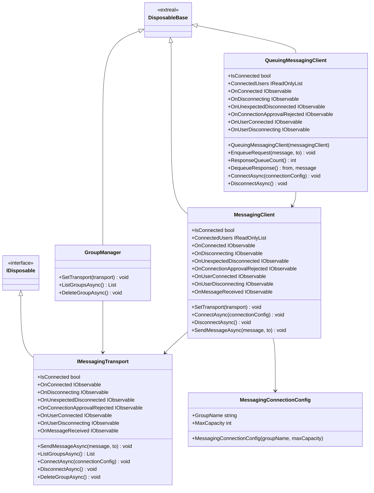

# Common for Messaging

## What for?

グループでメッセージのやり取りをする機能の共通部分を提供します。

この共通機能を使うことで自由にバックエンドとの通信方式を切り替えることができるようになります。
また使い方次第でマルチプレイにおける同期メッセージのやりとりやテキストチャットなど様々な用途に活用できます。

## Specification

- グループを管理できます。
- グループにメッセージを送信できます。
- キューイングを行うことができます。
- クライアントの状態をトリガーに処理を追加できます。

:::info
このモジュールは通信に使用するトランスポートを変更できます。
トランスポートの設定の仕方は[Settings](#settings)を参照してください。

Extrealではデフォルトで以下のトランスポートを提供しています。

- [Messaging for Redis](./messaging.redis.md)

上記以外の通信方式を使用したい場合はIMessagingTransportを実装する必要があります。
実装方法は上記モジュールを参考にしてください。
:::

## Architecture



## Installation

### Package

```text
https://github.com/extreal-dev/Extreal.Integration.Messaging.Common.git
```

### Dependencies

- [Extreal.Core.Logging](../core/logging.md)
- [Extreal.Core.Common](../core/common.md)
- [UniTask](https://github.com/Cysharp/UniTask)
- [UniRx](https://github.com/neuecc/UniRx)

モジュールバージョンと各パッケージバージョンの対応は[Release](../category/release)を参照ください。

### Settings

MessagingClientを初期化します。
MessagingClientの初期化にはIMessagingTransportを実装したクラスのインスタンスが必要です。
IMessagingTransportを実装したクラスのインスタンスは初期化しているものとします。

```csharp
var messagingClient = new MessagingClient();
messagingClient.SetTransport(messagingTransport); // Let messagingTransport be an instance of a class that implements IMessagingTransport 
```

GroupManagerやQueuingMessagingClientを使用したい場合はこれらも初期化します。

```csharp
var groupManager = new GroupManager();
groupManager.SetTransport(messagingTransport);

var queuingMessagingClient = new QueuingMessagingClient(messagingClient);
```

## Usage

### グループを管理する

GroupManagerクラスを使用することでグループを管理できます。

存在するグループ一覧を取得するためにはListGroupsAsyncを使います。

```csharp
var groups = await groupManager.ListGroupsAsync();
```

いま接続しているグループを削除するためにはDeleteGroupAsyncを使います。

```csharp
await groupManager.DeleteGroupAsync()
```

### グループにメッセージを送信する

MessagingClientクラスを使用することでグループにメッセージを送信できます。

まずグループ名を指定してグループに接続します。
存在しないグループ名を指定した場合は新しくグループが作成されます。

```csharp
var connectionConfig = new MessagingConnectionConfig("groupName");
await messagingClient.ConnectAsync(connectionConfig);
```

送信したい相手を指定してメッセージを送信します。
相手を省略した場合はグループ全体に送信します。

```csharp
await messagingClient.SendMessageAsync("message", "toUserId");
```

最後にグループから切断します。

```csharp
await messagingClient.DisconnectAsync();
```

### キューイングを行う

QueuingMessagingClientを使用することでメッセージをキューイングできます。

送信したい相手を指定してメッセージをキューに追加します。
相手を省略した場合はグループ全体に送信します。

```csharp
queuingMessagingClient.EnqueuRequest("message", "toUserId");
```

受信したメッセージをハンドリングします。

```csharp
while (queuingMessagingClient.ResponseQueueCount() > 0)
{
    (var from, var message) = queuingMessagingClient.DequeueResponse();
    // Handle message
}
```

### クライアントの状態をトリガーに処理を追加する

QueuingMessagingClientは次のイベント通知を設けています。

- OnConnected
  - タイミング：グループに接続した直後
  - タイプ：IObservable
  - パラメータ：自分のユーザID
- OnDisconnecting
  - タイミング：グループから切断する直前
  - タイプ：IObservable
  - パラメータ：切断する理由
- OnUnexpectedDisconnected
  - タイミング：予期していないサーバー切断が発生した直後
  - タイプ：IObservable
  - パラメータ：切断された理由
- OnConnectionApprovalRejected
  - タイミング：接続承認が拒否された直後
  - タイプ：IObservable
  - パラメータ：なし
- OnUserConnected
  - タイミング：ユーザが接続した直後
  - タイプ：IObservable
  - パラメータ：接続したユーザID
- OnUserDisconnecting
  - タイミング：ユーザが切断する直前
  - タイプ：IObservable
  - パラメータ：切断するユーザID

MessagingClientは上記に加えて次のイベント通知を設けています。

- OnMessageReceived
  - タイミング：メッセージを受信した直後
  - タイプ：IObservable
  - パラメータ：メッセージを送信したユーザのIDおよびメッセージ

:::info
OnDisconnectingとOnUnexpectedDisconnectedで受け取れるパラメータはトランスポートで実装しています。
詳細は各モジュールを参照してください。

Extrealで提供しているデフォルトのトランスポートを再掲します。

- [Messaging for Redis](./messaging.redis.md)
:::
