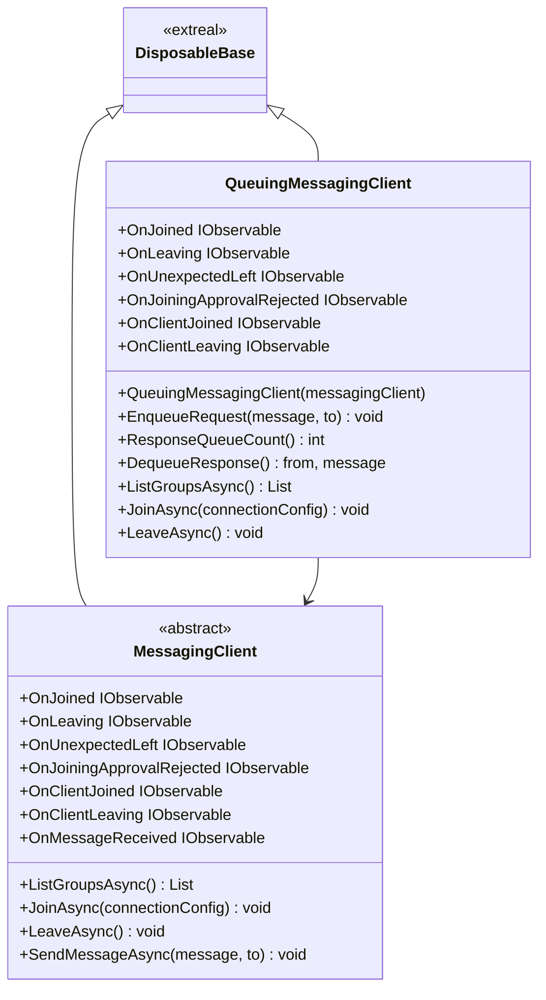
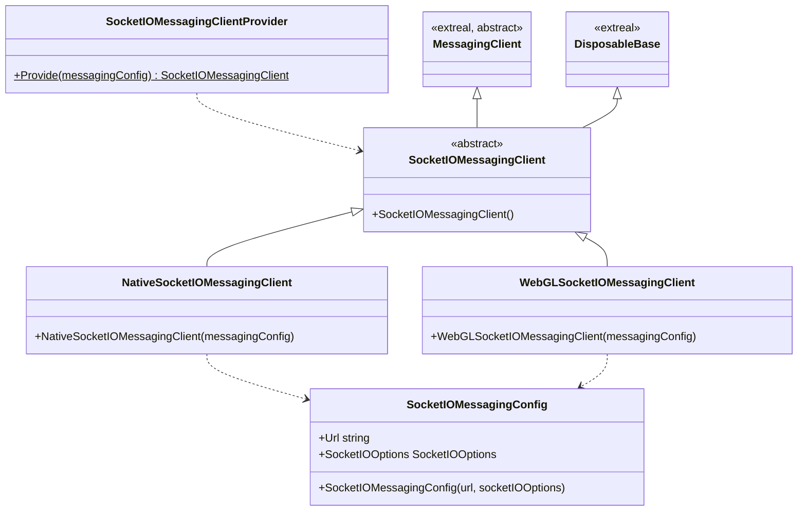
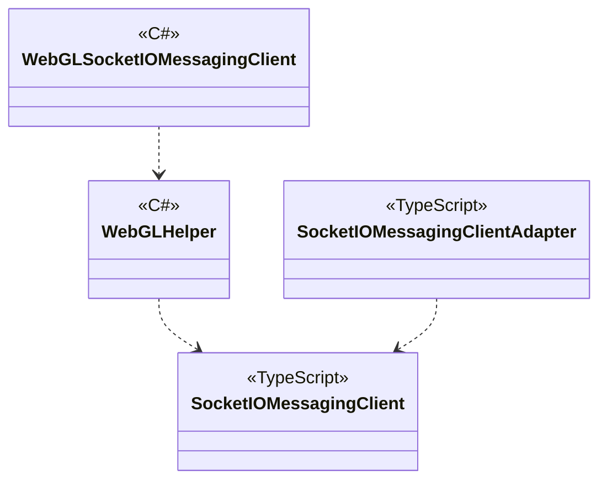

# Messaging

## What for?

人々が集まってコミュニケーションできるバーチャル空間ではマルチプレイやテキストチャットなど、グループを作ってメッセージをやりとりしたい場合が多くあります。

そこでExtrealではグループでメッセージをやりとりできるメッセージング機能を提供します。
このモジュールはデフォルト実装として[Socket.IO](https://socket.io/)を使ったメッセージング機能を提供します。
Socket.IOのようにメッセージングに使用するサーバをこのモジュールではメッセージングサーバと呼ぶことにします。

## Specification

- グループでメッセージをやりとりできます。
- メッセージを送受信するタイミングを制御（キューイング）できます。
- クライアントの状態をトリガーに処理を追加できます。
- Socket.IOによるメッセージングができます。
  - Native(C#)とWebGL(JavaScript)に対応しています。

:::tip
マルチプレイを実現する際など、短時間で多くのメッセージをやり取りする場合は通信負荷の高い状態が続きます。
そのような場合にキューイングを使用することで通信負荷を低減できます。
:::

## Architecture

### メッセージング

### Socket.IO

#### Unity



#### JavaScript


## Installation

### Package

#### メッセージング

```text
https://github.com/extreal-dev/Extreal.Integration.Messaging.git
```
#### Socket.IO

##### Unity

```text
https://github.com/extreal-dev/Extreal.Integration.Messaging.Socket.IO.git
```

##### npm

```text
@extreal-dev/extreal.integration.messaging.socket.io
```

### Dependencies

メッセージングは次のパッケージを使います。

#### メッセージング

- [Extreal.Core.Logging](../core/logging.md)
- [Extreal.Core.Common](../core/common.md)
- [UniTask](https://github.com/Cysharp/UniTask)
- [UniRx](https://github.com/neuecc/UniRx)

#### Socket.IO

##### Unity

- [Extreal.Core.Logging](../core/logging.md)
- [Extreal.Core.Common](../core/common.md)
- [Extreal.Integration.Web.Common](../integration/web.common.md)
- [UniTask](https://github.com/Cysharp/UniTask)
- [UniRx](https://github.com/neuecc/UniRx)
- [SocketIOClient](https://github.com/doghappy/socket.io-client-csharp)
- [Newtonsoft.Json](https://www.newtonsoft.com/json)

##### npm

- [@extreal-dev/extreal.integration.web.common](https://www.npmjs.com/package/@extreal-dev/extreal.integration.web.common)
- [socket.io-client](https://www.npmjs.com/package/socket.io-client)


モジュールバージョンと各パッケージバージョンの対応は[Release](../category/release)を参照ください。

### Settings

#### メッセージングサーバ

メッセージングサーバは[Docker Compose](https://docs.docker.com/compose/)で提供しています。

グループでのメッセージングにはSocket.IOの[Rooms](https://socket.io/docs/v4/rooms/)を使用しています。

メッセージングサーバを立ち上げる際に1グループあたりの最大人数を設定します。
最大人数を超えてクライアントがグループに参加しようとした場合はそのクライアントの参加を拒否します。
1グループあたりの最大人数は[compose.yaml](https://github.com/extreal-dev/Extreal.Integration.Messaging.Socket.IO/tree/main/MessagingServer~/compose.yaml)ファイル内のMESSAGING_MAX_CAPACITYで指定します。

```yaml
environment:
    # If "on" is logging, otherwise is not. In production, set it to "off".
    MESSAGING_LOGGING: ${MESSAGING_LOGGING:-on}
    # Capacity of one room
    MESSAGING_MAX_CAPACITY: ${MESSAGING_MAX_CAPACITY:-80} # Change here
    # In production, change it to suit the environment.
    MESSAGING_CORS_ORIGIN: ${MESSAGING_CORS_ORIGIN:-*}
```

メッセージングサーバの立ち上げ方は[README](https://github.com/extreal-dev/Extreal.Integration.Messaging.Socket.IO/tree/main/MessagingServer~)を参照してください。

:::tip
メッセージングサーバーを増やしてスケールアウトしたい場合はSocket.IOが提供するRedis Adapterを使うことで実現できます。詳細は[Redis Adapter](https://socket.io/docs/v4/redis-adapter/)を参照してください。
:::

#### アプリケーション

SocketIOMessagingClientProviderを使ってSocketIOMessagingClientを作成します。

```csharp
public class ClientControlScope : LifetimeScope
{
    protected override void Configure(IContainerBuilder builder)
    {
        var messagingConfig = new SocketIOMessagingConfig("url", socketIOOptions);
        var messagingClient = SocketIOMessagingClientProvider.Provide(messagingConfig);
        builder.RegisterComponent<MessagingClient>(messagingClient);

        builder.RegisterEntryPoint<ClientControlPresenter>();
    }
}
```

WebGLで使う場合、JavaScriptの初期化が必要になります。
SocketIOMessagingAdapterを作成してadapt関数を呼び出します。

```typescript
import { SocketIOMessagingAdapter } from "@extreal-dev/extreal.integration.messaging.socket.io";

const messagingAdapter = new SocketIOMessagingAdapter();
messagingAdapter.adapt();
```

## Usage

### グループでメッセージをやりとりする {#messaging-among-group}

グループでメッセージをやりとりする機能はMessagingClientが提供します。

既存のグループに参加したい場合は、グループ一覧をListGroupsAsyncで取得します。

```csharp
var groups = await messagingClient.ListGroupsAsync();
```

Groupのリストが返るので、ここで取得したGroupを使ってグループに参加します。

```csharp
var group = /* Select group from groups */;
var joiningConfig = new MessagingJoiningConfig(group.Name);
await messagingClient.JoinAsync(joiningConfig);
```

新しくグループを作成したい場合は、既存のグループに含まれないグループ名を指定して参加します。

```csharp
var joiningConfig = new MessagingJoiningConfig("NewGroupName");
await messagingClient.JoinAsync(joiningConfig);
```

メッセージを送信するためにはSendMessageAsyncを使います。
グループのメンバーにメッセージを送信したい場合はメッセージのみ指定します。

```csharp
await messagingClient.SendMessageAsync("message");
```

グループの特定メンバーにメッセージを送信したい場合はメッセージに加えてクライアントIDを指定します。

```csharp
await messagingClient.SendMessageAsync("message", toClientId);
```

グループに参加しているクライアントのIDはOnClientJoinedのイベントパラメータから作成できます。

```csharp
private readonly List<string> joinedClients = new List<string>();
messagingClient.OnClientJoined
    .Subscribe(joinedClients.Add)
```

メッセージ受信にはOnMessageReceivedイベントを使います。

```csharp
messagingClient.OnMessageReceived
    .Subscribe(HandleReceivedMessage)
    .AddTo(disposables);

private void HandleReceivedMessage((string clientId, string message) tuple)
{
  // Handle message
}
```

グループから出る場合はLeaveAsyncを使います。

```csharp
await messagingClient.LeaveAsync();
```

### メッセージを送受信するタイミングを制御（キューイング）する

キューイング機能はQueuingMessagingClientが提供します。
QueuingMessagingClientはMessagingClientのラッパークラスです。
キューイング機能を使用する場合はQueuingMessagingClientを初期化します。

```csharp
public class ClientControlScope : LifetimeScope
{
    protected override void Configure(IContainerBuilder builder)
    {
        var messagingConfig = new SocketIOMessagingConfig("url", socketIOOptions);
        var messagingClient = SocketIOMessagingClientProvider.Provide(messagingConfig);
        var queuingMessagingClient = new QueuingMessagingClient(messagingClient);
        builder.RegisterComponent(queuingMessagingClient);

        builder.RegisterEntryPoint<ClientControlPresenter>();
    }
}
```

QueuingMessagingClientでは送信するメッセージと受信したメッセージをそれぞれリクエストキューとレスポンスキューに保持することで送受信のタイミングを制御しています。

メッセージを送信したい場合はメッセージをリクエストキューに追加します。

グループのメンバーにメッセージを送信したい場合はメッセージのみ指定します。

```csharp
await queuingMessagingClient.EnqueueRequest("message");
```

グループの特定メンバーにメッセージを送信したい場合はメッセージに加えてクライアントIDを指定します。

```csharp
await queuingMessagingClient.EnqueueRequest("message", toClientId);
```

受信したメッセージはレスポンスキューから受け取ります。
レスポンスキューに入っているメッセージの個数はResponseQueueCountで確認できます。

```csharp
while (queuingMessagingClient.ResponseQueueCount() > 0)
{
    (var from, var message) = queuingMessagingClient.DequeueResponse();
    // Handle message
}
```

### クライアントの状態をトリガーに処理を追加する {#client-event}

MessagingClient/QueuingMessagingClientは次のイベント通知を設けています。

- OnJoined
  - タイミング：グループに参加した直後
  - タイプ：IObservable
  - パラメータ：自分のクライアントID
- OnLeaving
  - タイミング：グループから抜ける直前
  - タイプ：IObservable
  - パラメータ：なし
- OnUnexpectedLeft
  - タイミング：予期していないサーバー切断が発生した直後
  - タイプ：IObservable
  - パラメータ：切断された理由
- OnJoiningApprovalRejected
  - タイミング：参加が拒否された直後
  - タイプ：IObservable
  - パラメータ：なし
- OnClientJoined
  - タイミング：クライアントが参加した直後
  - タイプ：IObservable
  - パラメータ：参加したクライアントID
- OnClientLeaving
  - タイミング：クライアントが抜ける直前
  - タイプ：IObservable
  - パラメータ：切断するクライアントID
- OnMessageReceived
  - タイミング：メッセージを受信した直後
  - タイプ：IObservable
  - パラメータ：メッセージを送信したクライアントのIDおよびメッセージ
