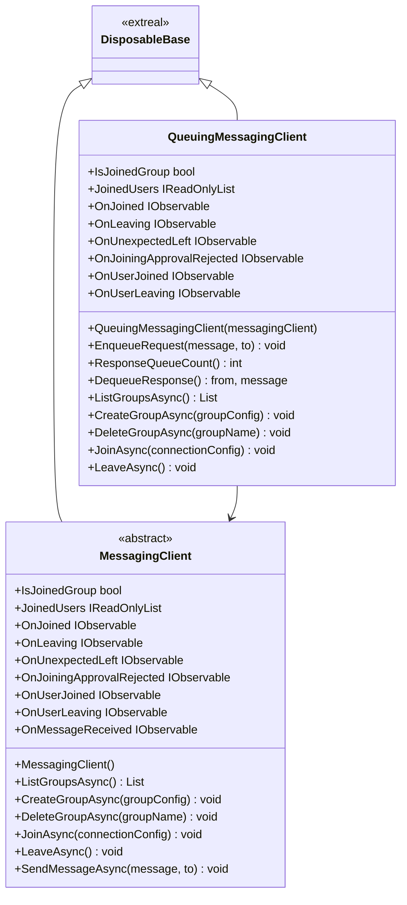
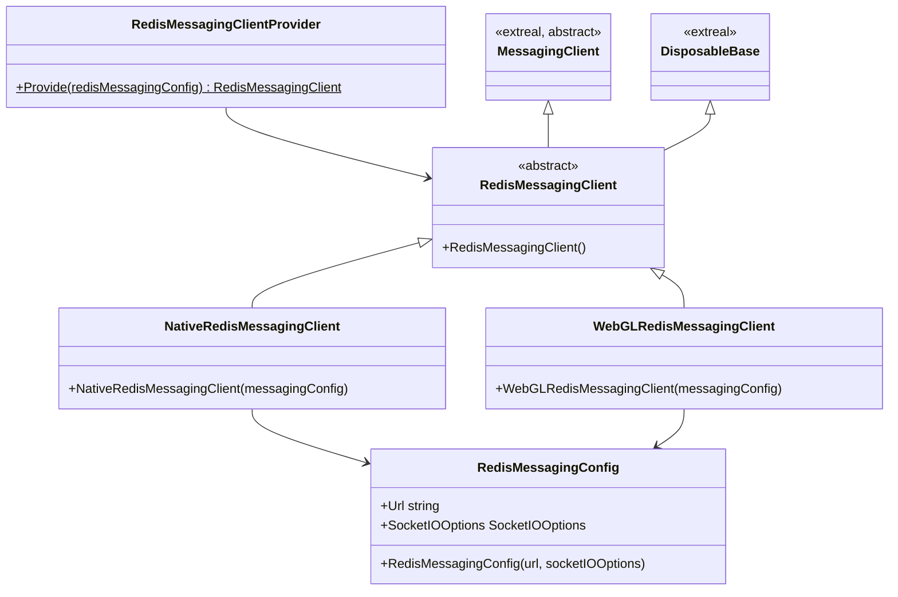

# Messaging

## What for?

グループでメッセージのやり取りをする機能を提供します。

Extrealではこの機能を提供するものを[メッセージング](https://github.com/extreal-dev/Extreal.Integration.Messaging.git)と呼ぶことにします。

'MessagingClient'を利用してメッセージングの実現方法を変更できます。
実現方法の設定は[Settings](#settings)を参照してください。

Extrealではデフォルトで以下のメッセージングの実現方法を提供しています。

- [Redisを使用したメッセージングの実現](https://github.com/extreal-dev/Extreal.Integration.Messaging.Redis.git)

この機能は、マルチプレイやテキストチャットなど、参加者同士でメッセージのやりとりを行う機能に活用できます。

## Specification

- グループを作成できます。
- グループに参加できます。
- グループにメッセージを送信できます。
- グループからメッセージを受信できます。
- グループから抜けることができます。
- メッセージを扱うタイミングを制御（キューイング）できます。
- クライアントの状態をトリガーに処理を追加できます。

## Architecture

### メッセージング

### Redisを使用したメッセージングの実現

#### Unity



#### JavaScript


## Installation

### Package

#### メッセージング

```text
https://github.com/extreal-dev/Extreal.Integration.Messaging.git
```
#### Redisを使用したメッセージングの実現を利用する場合

```text
https://github.com/extreal-dev/Extreal.Integration.Messaging.Redis.git
```

### Dependencies

メッセージングは次のパッケージを使います。

##### Unity

- [Extreal.Core.Logging](../core/logging.md)
- [Extreal.Core.Common](../core/common.md)
- [UniTask](https://github.com/Cysharp/UniTask)
- [UniRx](https://github.com/neuecc/UniRx)

#### Redisを使用したメッセージングの実現を利用する場合

##### Unity

- [Extreal.Core.Logging](../core/logging.md)
- [Extreal.Core.Common](../core/common.md)
- [Extreal.Integration.Web.Common](../integration/web.common.md)
- [Extreal.Integration.Messaging](../integration/messaging.md)
- [UniTask](https://github.com/Cysharp/UniTask)
- [UniRx](https://github.com/neuecc/UniRx)
- [System.Text.Json](https://learn.microsoft.com/ja-jp/dotnet/api/system.text.json)
- [SocketIOClient](https://github.com/doghappy/socket.io-client-csharp)

##### npm

- [@extreal-dev/extreal.integration.web.common](https://www.npmjs.com/package/@extreal-dev/extreal.integration.web.common)
- [socket.io-client](https://www.npmjs.com/package/socket.io-client)


モジュールバージョンと各パッケージバージョンの対応は[Release](../category/release)を参照ください。

### Settings

MessagingClientを実装したメッセージングの実現が必要です。

以下にRedisを使用したメッセージングの実現の例を示します。

#### メッセージングサーバ

メッセージングサーバは[Docker Compose](https://docs.docker.com/compose/)で提供しています。

サーバ・クライアント間はSocket.IOで接続し、Pub/SubはRedisのアダプターで実現しています。
詳細は[Redis adapter](https://socket.io/docs/v4/redis-adapter/)および[Rooms](https://socket.io/docs/v4/rooms/)を参照してください。

[README](https://github.com/extreal-dev/Extreal.Integration.Messaging.Redis/tree/main/RedisServer~)を参照してメッセージングサーバを準備してください。

#### アプリケーション

Providerを使って'RedisMessagingClient'を作成します。

```csharp
var redisMessagingConfig = new RedisMessagingConfig("url", socketIOOptions);
var redisMessagingClient = RedisMessagingClientProvider.Provide(redisMessagingConfig);
```

WebGLで使う場合、JavaScriptの初期化が必要になります。
Adapterを作成してadapt関数を呼び出します。

```typescript
import { RedisMessagingAdapter } from "@extreal-dev/extreal.integration.messaging.redis";

const redisMessagingAdapter = new RedisMessagingClientAdapter();
redisMessagingClientAdapter.adapt();
```

QueuingMessagingClientを使用したい場合はこれも初期化します。

```csharp
var queuingMessagingClient = new QueuingMessagingClient(redisMessagingClient);
```

## Usage

### グループを作成する

グループを作成するためにはCreateGroupAsyncを使います。

```csharp
var groupConfig = new GroupConfig("groupName", maxCapacity);
await messagingClient.CreateGroupAsync(groupConfig);
```

存在するグループ一覧を取得するためにはListGroupsAsyncを使います。

```csharp
var groups = await messagingClient.ListGroupsAsync();
```
グループを削除するためにはDeleteGroupAsyncを使います。

```csharp
await messagingClient.DeleteGroupAsync("groupName");
```

### グループに参加する

グループに参加するためにはJoinAsyncを使います。

```csharp
var connectionConfig = new MessagingJoiningConfig("groupName");
await messagingClient.JoinAsync(connectionConfig);
```

### グループにメッセージを送信する

参加しているグループに送信するためにはSendMessageAsyncを使います。

送信したい相手があれば対象を指定してメッセージを送信できます。
相手を省略した場合はグループ全体に送信します。

```csharp
await messagingClient.SendMessageAsync("message", "toUserId");
```

### グループからメッセージを受信する

グループから受信するためにはOnMessageReceivedイベント通知を使います。

```csharp
messagingClient.OnMessageReceived.Subscribe(HandleReceivedMessage);

private void HandleReceivedMessage((string userId, string message) tuple)
{
  // Handle message
}
```

### グループから抜ける
グループから抜けるためにはLeaveAsyncを使います。

```csharp
await messagingClient.LeaveAsync();
```

### キューイングを行う

QueuingMessagingClientを使用することでメッセージをキューイングできます。

送信したい相手を指定してメッセージをキューに追加します。
相手を省略した場合はグループ全体に送信します。

```csharp
queuingMessagingClient.EnqueueRequest("message", "toUserId");
```
QueuingMessagingClientでは、MessagingClientのOnMessageReceivedのイベント通知に受信したメッセージをキューに追加しています。

キューから受信したメッセージをハンドリングします。

```csharp
while (queuingMessagingClient.ResponseQueueCount() > 0)
{
    (var from, var message) = queuingMessagingClient.DequeueResponse();
    // Handle message
}
```

### クライアントの状態をトリガーに処理を追加する

MessagingClient/QueuingMessagingClientは次のイベント通知を設けています。

- OnJoined
  - タイミング：グループに参加した直後
  - タイプ：IObservable
  - パラメータ：自分のユーザID
- OnLeaving
  - タイミング：グループから抜ける直前
  - タイプ：IObservable
  - パラメータ：切断する理由
- OnUnexpectedLeft
  - タイミング：予期していないサーバー切断が発生した直後
  - タイプ：IObservable
  - パラメータ：切断された理由
- OnJoiningApprovalRejected
  - タイミング：参加承認が拒否された直後
  - タイプ：IObservable
  - パラメータ：なし
- OnUserJoined
  - タイミング：ユーザが参加した直後
  - タイプ：IObservable
  - パラメータ：接続したユーザID
- OnUserLeaving
  - タイミング：ユーザが抜ける直前
  - タイプ：IObservable
  - パラメータ：切断するユーザID
- OnMessageReceived
  - タイミング：メッセージを受信した直後
  - タイプ：IObservable
  - パラメータ：メッセージを送信したユーザのIDおよびメッセージ
