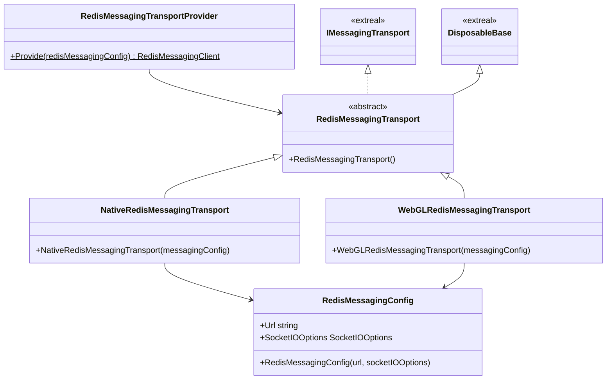
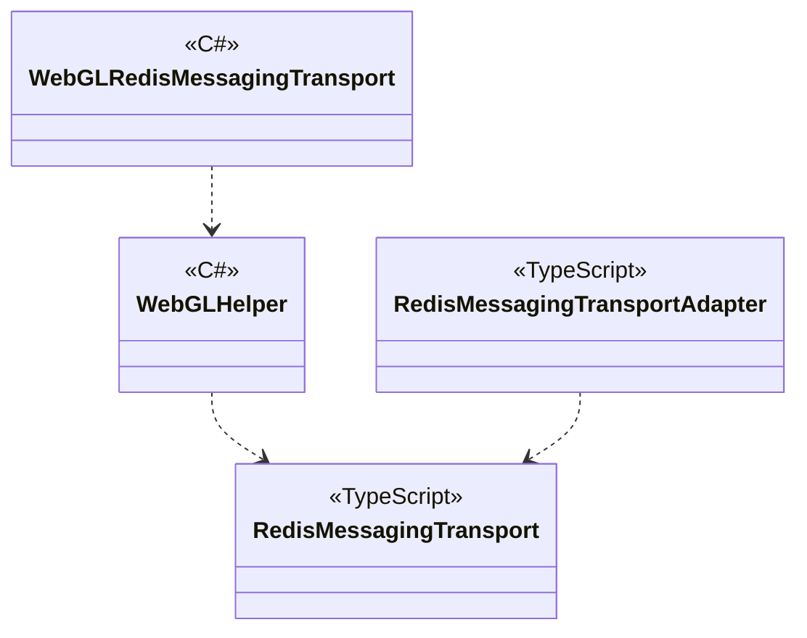

---
sidebar_position: 8
---

# Messaging using Redis

## What for?

コストをできるだけ抑えながら大規模なコミュニケーションを行う手段としてRedis Pub/Sub(Publish/Subscribe)があります。

このモジュールはNative(C#)とWebGL(JavaScript)向けのRedis Pub/Subによるメッセージングの通信方式の実装を提供します。

## Specification

- Redis Pub/Subによるメッセージングができます。
- クライアントの状態をトリガーに処理を追加できます。

## Architecture

### Unity



### JavaScript



## Installation

### Package

#### Unity

```text
https://github.com/extreal-dev/Extreal.Integration.Messaging.Redis.git
```

#### npm

```text
@extreal-dev/extreal.integration.messaging.redis
```

### Dependencies

このモジュールは次のパッケージを使います。

#### Unity

- [Extreal.Core.Logging](../core/logging.md)
- [Extreal.Core.Common](../core/common.md)
- [Extreal.Integration.Web.Common](../integration/web.common.md)
- [Extreal.Integration.Messaging.Common](../integration/messaging.common.md)
- [UniTask](https://github.com/Cysharp/UniTask)
- [UniRx](https://github.com/neuecc/UniRx)
- [System.Text.Json](https://learn.microsoft.com/ja-jp/dotnet/api/system.text.json)
- [SocketIOClient](https://github.com/doghappy/socket.io-client-csharp)

#### npm

- [@extreal-dev/extreal.integration.web.common](https://www.npmjs.com/package/@extreal-dev/extreal.integration.web.common)
- [socket.io-client](https://www.npmjs.com/package/socket.io-client)

モジュールバージョンと各パッケージバージョンの対応は[Release](../category/release)を参照ください。

### Settings

Providerを使ってトランスポートを作成します。

```csharp
var redisMessagingConfig = new RedisMessagingConfig("url", "socketIOOptions");
var redisMessagingTransport = RedisMessagingTransportProvider.Provide(redisMessagingConfig);
```

WebGLで使う場合はさらにJavaScriptの初期化が必要になります。
Adapterを作成してadapt関数を呼び出します。

```typescript
import { RedisMessagingTransportAdapter } from "@extreal-dev/extreal.integration.messaging.redis";

const redisMessagingTransportAdapter = new RedisMessagingTransportAdapter();
redisMessagingTransportAdapter.adapt();
```

## Usage

### Redis Pub/Subによるメッセージングを行う

[Common for Messaging](./messaging.common.md)の各クラスにRedisMessagingTransportを設定することでRedis Pub/Subによるメッセージングを行えるようになります。
設定の仕方は[Common for MessagingのSettings](./messaging.common.md#settings)を参照してください。

### クライアントの状態をトリガーに処理を追加する

OnDisconnectingとOnUnexpectedDisconnectedで受け取れる内容一覧を掲載します。

#### OnDisconnecting

| パラメータ | 説明 |
|-|-|
|disconnect request|自分から切断したとき|
|delete group|グループが削除されたとき|

#### OnUnexpectedDisconnected

Socket.IOの切断時の理由を渡しています。
詳細は[Socket.IOのドキュメント](https://socket.io/docs/v3/client-api/#event-disconnect)を参照してください。
