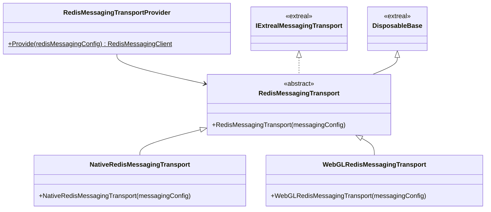

# Messaging using Redis

## What for?

コストをできるだけ抑えながら大規模なコミュニケーションを行う手段としてRedis Pub/Sub(Publish/Subscribe)があります。

このモジュールはNative(C#)とWebGL(JavaScript)向けのRedis Pub/Subによるメッセージングのバックエンドとの通信方式の実装を提供します。

## Specification

- Redis Pub/Subによるメッセージングができます。

## Architecture

### Unity



### JavaScript


## Installation

### Package

#### Unity

```text
https://github.com/extreal-dev/Extreal.Integration.Messaging.Redis.git
```

#### npm

```text
@extreal-dev/extreal.integration.messaging.redis
```

### Dependencies

このモジュールは次のパッケージを使います。

#### Unity

- [Extreal.Core.Logging](../core/logging.md)
- [Extreal.Core.Common](../core/common.md)
- [Extreal.Integration.Web.Common](../integration/web.common.md)
- [Extreal.Integration.Messaging.Common](../integration/messaging.common.md)
- [UniTask](https://github.com/Cysharp/UniTask)
- [UniRx](https://github.com/neuecc/UniRx)

#### npm

- [@extreal-dev/extreal.integration.web.common](https://www.npmjs.com/package/@extreal-dev/extreal.integration.web.common)

モジュールバージョンと各パッケージバージョンの対応は[Release](../category/release)を参照ください。

### Settings

## Usage
