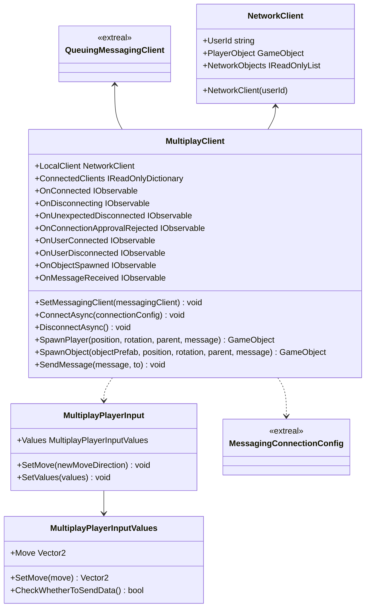

# Common for Multiplay

## What for?
マルチプレイ機能を実装する際には、プレイヤーの状態（位置情報や動きなど）を同期させる必要があります。

この同期処理は[NGOラッパー](multiplay.ngo.md)を利用し実現する場合、ホスト/サーバーが中心となって行われます。そのため、大規模なマルチプレイを実現する場合、ホスト/サーバーに膨大な負荷がかかり、コストが高くなります。

このライブラリでは低コストでマッシブマルチプレイができるように、以下の特徴を持った機能を提供します。
- ホスト/サーバーへの負荷を減らすように、同期情報をクライアント側で更新します。
- ホスト/サーバーが[NGOラッパー](multiplay.ngo.md)以外の外部ライブラリから構築します。
- ホスト/サーバーとの通信方式を変更（[Messaging.Common](messaging.common.md)を利用）できます。

## Specification

- 通信方式を変更できます。
- グループへの入退室ができます。
- 同期するオブジェクトをスポーンできます。
- プレイヤーへの入力情報を同期できます。
- メッセージの送受信ができます。

## Architecture



## Installation

### Package

#### Unity
```text
https://github.com/extreal-dev/Extreal.Integration.Multiplay.Common.git
```

### Dependencies

このモジュールは次のパッケージを使います。

#### Unity

- [Extreal.Core.Logging](../core/logging.md)
- [Extreal.Core.Common](../core/common.md)
- [Extreal.Integration.Messaging.Common](messaging.common.md)
- [UniTask](https://github.com/Cysharp/UniTask)
- [UniRx](https://github.com/neuecc/UniRx)

モジュールバージョンと各パッケージバージョンの対応は[Release](../category/release)を参照ください。

### Settings

このモジュールは[Messaging.Common](messaging.common.md)を使ってMultiplayを実現しています。
そのため[Messaging.CommonのSettings](messaging.common.md#settings)が必要になります。


```csharp
public class ClientControlScope : LifetimeScope
{
    [SerializeField] private MultiplayClient multiplayClient;

    protected override void Configure(IContainerBuilder builder)
    {
        // After initializing QueuingMessagingClient in Messaging.Common
        multiplayClient.SetMessagingClient(queuingMessagingClient);

        builder.RegisterComponent(multiplayClient);
    }
}
```

## Usage

### 通信方式を変更する

通信方式の変更は[Messaging.Common](messaging.common.md)を使って実現しています。
[Messaging.CommonのUsage](messaging.common.md#Usage)を参照してください。

### グループへの入退室を行う
参加するグループ名はMessagingConnectionConfigで指定します。

```csharp
// Join a group
var connectionConfig = new MessagingConnectionConfig(groupName);
await extrealMultiplayClient.ConnectAsync(connectionConfig);

// Leave the group
extrealMultiplayClient.Disconnect();
```

### 同期するオブジェクトをスポーンする
SpawnPlayerメソッドを使って、全プレイヤーをスポーンします。

```csharp
extrealMultiplayClient.SpawnPlayer()
```
SpawnObjectメソッドを使って、プレイヤー以外のオブジェクトをスポーンします。

```csharp
extrealMultiplayClient.SpawnObject()
```

### プレイヤーへの入力情報を同期する
同期されるオブジェクトにアタッチされたMultiplayerInputのValuesの値を同期しています。

同期されたValuesをSetValuesメソッドを使ってローカルオブジェクトに適用します。

他の入力情報を同期したい場合、MultiplayPlayerInputとMultiplayPlayerInputValuesを継承したクラスを作成し、Valuesにセットするようにします。

```csharp
public class HolidayPlayerInput : MultiplayPlayerInput
{
    public override MultiplayPlayerInputValues Values => HolidayValues;
    public HolidayPlayerInputValues HolidayValues { get; } = new HolidayPlayerInputValues();

    public override void SetMove(Vector2 newMoveDirection)
        => HolidayValues.SetMove(newMoveDirection);

    public void SetJump(bool newJump)
        => HolidayValues.SetJump(newJump);

    public override void SetValues(MultiplayPlayerInputValues values)
    {
        var holidayValues = values as HolidayPlayerInputValues;

        base.SetValues(holidayValues);
        SetJump(holidayValues.Jump);
    }
}
```

```csharp
    [Serializable]
    public class HolidayPlayerInputValues : MultiplayPlayerInputValues
    {
        private Vector2 preMove;
        private bool isMoveChanged;

        public bool Jump => jump;
        [SerializeField] private bool jump;
        private bool preJump;
        private bool isJumpChanged;

        public override void SetMove(Vector2 move)
        {
            preMove = Move;
            base.SetMove(move);
            isMoveChanged = preMove != Move;
        }

        public void SetJump(bool jump)
        {
            preJump = this.jump;
            this.jump = jump;
            isJumpChanged = preJump != this.jump;
        }

        public override bool CheckWhetherToSendData()
        {
            var ret = isMoveChanged || isJumpChanged;
            isMoveChanged =  isJumpChanged = false;
            return ret;
        }
    }

```

### メッセージの送受信を行う
メッセージ送信はSendMessageメソッドを使います。

```csharp
    multiplayClient.SendMessage(message, userId)
```

メッセージ受信はOnMessageReceivedイベントを使います。 パラメータとしてユーザ識別子とJSONのメッセージが渡ってきます。

```csharp
    multiplayClient.OnMessageReceived
    .Subscribe(HandleReceivedMessage)
    .AddTo(disposables);

    private void HandleReceivedMessage((string userId, string messageJson) tuple)
    {
       // do something
    }
```