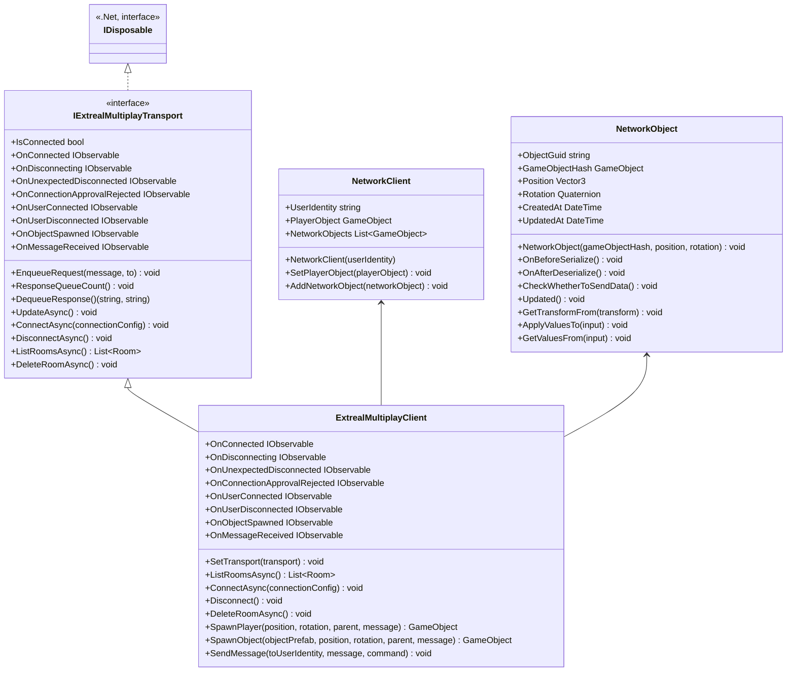

# Common for Multiplay

## What for?

マルチプレイの機能を実現するために、プレイヤーの入退室、スポーン、同期の部分を共通化したライブラリを提供します。

## Specification

- ネットワーク接続方法を変更できます。
- グループへの入退室ができます。
- ネットワーク上で共有するオブジェクトをスポーンできます。
- プレイヤーへの入力情報を同期できます。
- メッセージの送受信ができます。
- ExtrealMultiplayClient: マルチプレイ機能を実現するための中心となるクラス。
- NetworkObject: ネットワーク上で共有される各オブジェクト。
- NetworkClient: 個々のプレイヤー情報を表します。
- IExtrealMultiplayTransport: ネットワーク通信のためのインターフェース。

## Architecture

