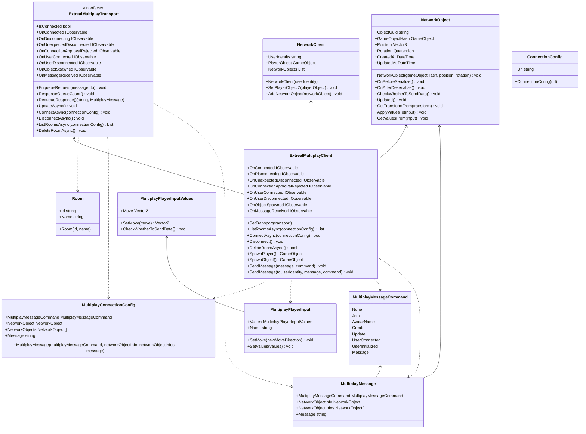

# Common for Multiplay

## What for?

マルチプレイの機能を実現するために、メッセージング以外の要素を共通化したライブラリを提供します。

ネットワーク接続管理、トランスポート層のカスタマイズ、オブジェクト同期、メッセージングシステムを提供し、開発者がマルチプレイ環境を効率的に構築できるよう支援します
## Specification

- ExtrealMultiplayClientによる、ネットワーク接続管理の設定、確立、切断ができます。またルーム情報と接続中のプレイヤーを管理できます。
- IExtrealMultiplayTransportを実現することで、ネットワーク通信のトランスポート層の実装詳細をカスタマイズできます。
- NetworkObjectにアプリケーション固有でネットワーク上で共有するオブジェクトを追加できます。
- MultiplayPlayerInputにアプリケーション固有でネットワーク上で共有するプレイヤーの入力情報を追加できます。
- メッセージの送受信を管理し、特定のコマンドやユーザーに対するメッセージングができます。

## Architecture

