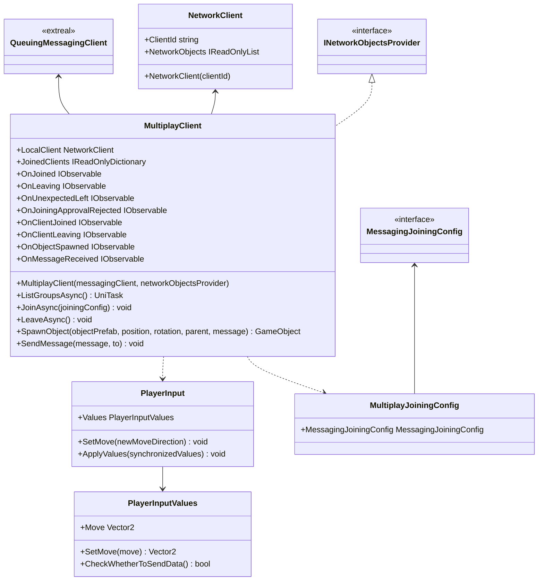

# Multiplay using Messaging

## What for?

マルチプレイ機能を実現する際には、プレイヤー状態（位置情報や動きなど）を同期させる必要があります。

[NGOラッパー](multiplay.ngo.md)のベースとなるNetcode for GameObjectsは単一のサーバプロセス内でプレイヤー状態を集中管理しています。
このような設計は、スケールアウト（サーバの能力を拡張して処理能力を増やすこと）を難しくしています。

RedisのPub/Subのようなメッセージングを採用することで、複数のチャンネルをプロセス内で管理できる構造を実現し、分散処理が容易になります。
これにより、スケールアウトがより簡単に行えるようになり、結果として運用コストの削減が可能になります。

このモジュールではプレイヤーが集まってマルチプレイを行うセッションをグループと呼ぶことにします。
このライブラリでは[Messaging](./messaging.md)を使ってグループでマルチプレイできるようにします。

## Specification

- グループでマルチプレイできます。
- グループ内でメッセージを送受信できます。
- 同期するオブジェクトの動きを追加できます。
- クライアントの状態をトリガーに処理を追加できます。

## Architecture



## Installation

### Package

#### Unity

```text
https://github.com/extreal-dev/Extreal.Integration.Multiplay.Messaging.git
```

### Dependencies

このモジュールは次のパッケージを使います。

#### Unity

- [Extreal.Core.Logging](../core/logging.md)
- [Extreal.Core.Common](../core/common.md)
- [Extreal.Integration.Messaging](messaging.md)
- [UniTask](https://github.com/Cysharp/UniTask)
- [UniRx](https://github.com/neuecc/UniRx)

モジュールバージョンと各パッケージバージョンの対応は[Release](../category/release)を参照ください。

### Settings

このモジュールは[Messaging](messaging.md)を使ってマルチプレイを実現しています。
そのため[MessagingのSettings](messaging.md#settings)が必要になります。

```csharp
public class ClientControlScope : LifetimeScope
{
    private MultiplayClient multiplayClient;

    protected override void Configure(IContainerBuilder builder)
    {
        // After initializing QueuingMessagingClient and NetworkObjectsProvider
        multiplayClient = new MultiplayClient(queuingMessagingClient, networkObjectsProvider)
    }
}
```

## Usage

### グループでマルチプレイを行う

グループでマルチプレイを行う機能はMultiplayClientが提供します。

グループでマルチプレイをするにはグループに参加したりグループから抜けたりする必要がありますが、このモジュールではこれらの機能は[Messaging](./messaging.md)に委譲しています。
これらの機能の詳細はMessagingの[グループでメッセージをやりとりする方法](./messaging.md#messaging-among-group)を参照してください。

このモジュールではこれらの機能は次のようにして使用します。

```csharp
// List groups
var groups = await multiplayClient.ListGroupsAsync();

// Join a group
var messagingJoiningConfig = new MessagingJoiningConfig("groupName");
var multiplayJoiningConfig = new MultiplayJoiningConfig(messagingJoiningConfig);
await multiplayClient.JoinAsync(multiplayJoiningConfig);

// Leave the group
multiplayClient.LeaveAsync();
```

グループに参加したらプレイヤーをスポーンしてマルチプレイを行います。
SpawnObjectメソッドを使ってプレイヤーをスポーンします。

```csharp
multiplayClient.SpawnObject(playerObjectToBeSpawned)
```
プレイヤー以外のオブジェクトのスポーンもできます。

```csharp
multiplayClient.SpawnObject(objectToBeSpawned)
```

### グループ内でメッセージを送受信する

リアクションの同期など、マルチプレイしているグループ内でメッセージを送受信したい場合がありますが、このモジュールではこの機能は[Messaging](./messaging.md)に委譲しています。
この機能の詳細はMessagingの[グループでメッセージをやりとりする方法](./messaging.md#messaging-among-group)を参照してください。

このモジュールではこの機能は次のようにして使用します。

```csharp
// Send message to a specified destination
var toClientId = messageClient.JoinedClients.First();
await messagingClient.SendMessageAsync("message", toClientId);

// Send message to entire group
await messagingClient.SendMessageAsync("message");

// Receive message
multiplayClient.OnMessageReceived.Subscribe(HandleReceivedMessage);

private void HandleReceivedMessage((string userId, string message) tuple)
{
  // Handle message
}
```

### 同期するオブジェクトの動きを追加する

:::info
オブジェクトをスポーンさせると位置(Position)と回転(Rotation)は自動で同期されます。
:::

マルチプレイする際にはアニメーションなど、オブジェクトの位置と回転以外の動きも同期したい場合が多くあります。
このモジュールではアプリ使用者からの入力を同期することでこれを実現しています。

アプリ使用者からの入力はPlayerInputのValuesで同期しています。
デフォルトでは水平方向の入力(Move)のみ同期します。

Move以外に他の入力も同期したい場合、PlayerInputとPlayerInputValuesを継承したクラスを作成してValuesにセットします。

例えばJumpという入力を同期する場合を示します。

```csharp
public class HolidayPlayerInput : PlayerInput
{
    public override PlayerInputValues Values => HolidayValues;
    public HolidayPlayerInputValues HolidayValues { get; } = new HolidayPlayerInputValues();

    public void SetJump(bool newJump)
        => HolidayValues.SetJump(newJump);

    public override void ApplyValues(PlayerInputValues synchronizedValues)
    {
        var synchronizedHolidayValues = synchronizedValues as HolidayPlayerInputValues;

        base.ApplyValues(synchronizedHolidayValues);
        SetJump(synchronizedHolidayValues.Jump);
    }
}
```

```csharp
public class HolidayPlayerInputValues : PlayerInputValues
{
    [SuppressMessage("Usage", "CC0047")] public bool Jump { get; set; }

    public void SetJump(bool jump)
        => Jump = jump;
}
```

アプリ使用者からの入力は一定時間ごとに同期されます。
入力が変わるごとに同期したい場合など、同期するタイミングを制御したい場合はCheckWhetherToSendDataメソッドを使用することで実現できます。

MoveかJumpのいずれかが変化した場合に同期する例を示します。

```csharp
[Serializable]
public class HolidayPlayerInputValues : PlayerInputValues
{
    private Vector2 preMove;
    private bool isMoveChanged;

    [SuppressMessage("Usage", "CC0047")] public bool Jump { get; set; }
    private bool preJump;
    private bool isJumpChanged;

    public override void SetMove(Vector2 move)
    {
        preMove = Move;
        base.SetMove(move);
        isMoveChanged = preMove != Move;
    }

    public void SetJump(bool jump)
    {
        preJump = Jump;
        Jump = jump;
        isJumpChanged = preJump != Jump;
    }

    public override bool CheckWhetherToSendData()
    {
        var ret = isMoveChanged || isJumpChanged;
        isMoveChanged = isJumpChanged = false;
        return ret;
    }
}
```

:::caution
最後にアプリ使用者からの入力を同期した時から一定時間が経過したら自動でまた入力を同期するようになっています。
CheckWhetherToSendDataメソッドの戻り値を常にfalseにしていても一定時間ごとには入力は同期されます。
:::

### クライアントの状態をトリガーに処理を追加できます

[Messaging](messaging.md)を利用してイベント通知しています。
詳細は[MessagingClientのイベント通知](messaging.md#クライアントの状態をトリガーに処理を追加する)を参照してください。

MultiplayClientは上記に加えて次のイベント通知を設けています。

- OnObjectSpawned
  - タイミング：同期するオブジェクトをスポーンした直後
  - タイプ：IObservable
  - パラメータ：接続したユーザID、スポーンしたオブジェクト、送信されたメッセージ
