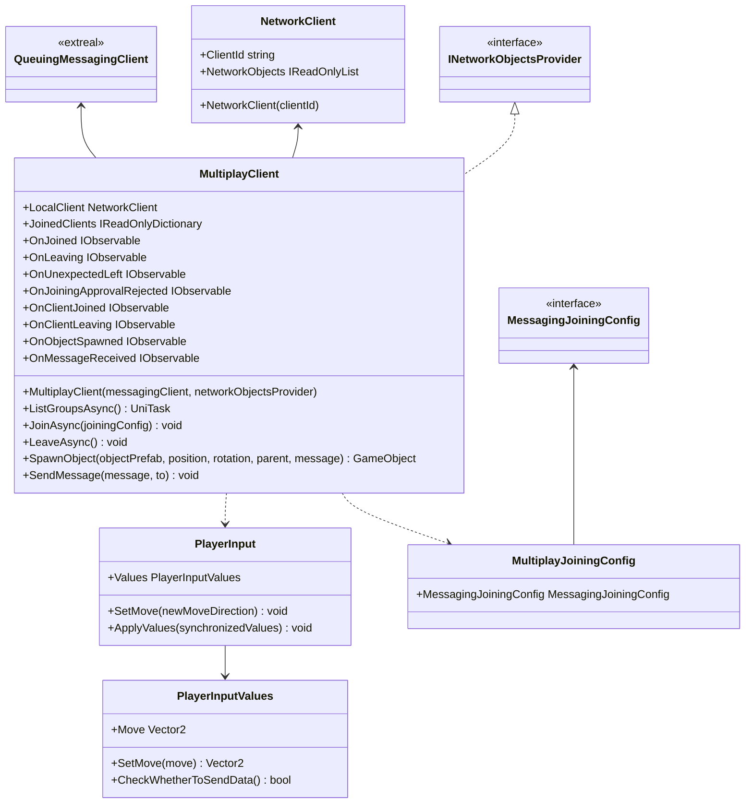

# Multiplay using Messaging

## What for?

マルチプレイ機能を実現する際には、プレイヤー状態（位置情報や動きなど）を同期させる必要があります。

[NGOラッパー](multiplay.ngo.md)のベースとなるNetcode for GameObjectsは単一のサーバプロセス内でプレイヤー状態を集中管理しています。
このような設計は、スケールアウト（サーバの能力を拡張して処理能力を増やすこと）を難しくしています。

RedisのPub/Subのようなメッセージングを採用することで、複数のチャンネルをプロセス内で管理できる構造を実現し、分散処理が容易になります。
これにより、スケールアウトがより簡単に行えるようになり、結果として運用コストの削減が可能になります。

このモジュールではプレイヤーが集まってマルチプレイを行うセッションをグループと呼ぶことにします。
このライブラリでは[Messaging](./messaging.md)を使ってグループでマルチプレイできるようにします。

## Specification

- グループでマルチプレイできます。
- グループ内でメッセージを送受信できます。
- 同期するオブジェクトの動きを追加できます。
- クライアントの状態をトリガーに処理を追加できます。

## Architecture



## Installation

### Package

#### Unity

```text
https://github.com/extreal-dev/Extreal.Integration.Multiplay.Messaging.git
```

### Dependencies

このモジュールは次のパッケージを使います。

#### Unity

- [Extreal.Core.Logging](../core/logging.md)
- [Extreal.Core.Common](../core/common.md)
- [Extreal.Integration.Messaging](messaging.md)
- [UniTask](https://github.com/Cysharp/UniTask)
- [UniRx](https://github.com/neuecc/UniRx)

モジュールバージョンと各パッケージバージョンの対応は[Release](../category/release)を参照ください。

### Settings

このモジュールは[Messaging](messaging.md)を使ってマルチプレイを実現しています。
そのため[MessagingのSettings](messaging.md#settings)が必要になります。

```csharp
public class ClientControlScope : LifetimeScope
{
    private MultiplayClient multiplayClient;

    protected override void Configure(IContainerBuilder builder)
    {
        // After initializing QueuingMessagingClient and NetworkObjectsProvider
        multiplayClient = new MultiplayClient(queuingMessagingClient, networkObjectsProvider)
    }
}
```

## Usage

### グループへの入退室を行う

参加するグループ名はMessagingJoiningConfigで指定します。

```csharp
// Join a group
var messagingJoiningConfig = new MessagingJoiningConfig("groupName");
var multiplayJoiningConfig = new MultiplayJoiningConfig(messagingJoiningConfig);
await multiplayClient.JoinAsync(multiplayJoiningConfig);

// Leave the group
multiplayClient.LeaveAsync();
```

### グループでマルチプレイを行う
グループに参加した後に、プレイヤーをスポーンしてマルチプレイを行います。
SpawnObjectメソッドを使ってプレイヤーをスポーンします。

```csharp
multiplayClient.SpawnObject(playerObjectToBeSpawned)
```
プレイヤー以外のオブジェクトのスポーンもできます。

```csharp
multiplayClient.SpawnObject(objectToBeSpawned)
```

### グループでメッセージの受送信を行う

参加しているグループに送信するためにはSendMessageを使います。

送信したい相手があれば対象を指定してメッセージを送信できます。
相手を省略した場合はグループ全体に送信します。

```csharp
await multiplayClient.SendMessage("message", "toUserId");
```

グループから受信するためにはOnMessageReceivedイベント通知を使います。

```csharp
multiplayClient.OnMessageReceived.Subscribe(HandleReceivedMessage);

private void HandleReceivedMessage((string userId, string message) tuple)
{
  // Handle message
}
```

### 同期するプレイヤーの動きを追加する

プレイヤーの動きはPlayerInputのValuesで同期しています。
デフォルトではMoveの動きのみ同期しています。

Moveの動き以外に他の動きを同期したい場合、PlayerInputとPlayerInputValuesを継承したクラスを作成してValuesにセットするようにします。

例えば、Jumpという動きを同期したい場合、以下を参考にしてください。

```csharp
public class HolidayPlayerInput : PlayerInput
{
    public override PlayerInputValues Values => HolidayValues;
    public HolidayPlayerInputValues HolidayValues { get; } = new HolidayPlayerInputValues();

    public void SetJump(bool newJump)
        => HolidayValues.SetJump(newJump);

    public override void ApplyValues(PlayerInputValues synchronizedValues)
    {
        var synchronizedHolidayValues = synchronizedValues as HolidayPlayerInputValues;

        base.ApplyValues(synchronizedHolidayValues);
        SetJump(synchronizedHolidayValues.Jump);
    }
}
```

```csharp
[Serializable]
public class HolidayPlayerInputValues : PlayerInputValues
{
    public bool Jump => jump;
    [SerializeField] private bool jump;
    private bool preJump;
    private bool isJumpChanged;

    public void SetJump(bool jump)
    {
        preJump = this.jump;
        this.jump = jump;
        isJumpChanged = preJump != this.jump;
    }
}
```

プレイヤー状態はPotionとRotationが変化したときは常に同期されます。
そうでない場合、CheckWhetherToSendDataメソッドで制御できます。

MoveとJumpの動きが変化した場合にのみ同期する例を示します。

```csharp
[Serializable]
public class HolidayPlayerInputValues : PlayerInputValues
{
    public override bool CheckWhetherToSendData()
    {
        var ret = isMoveChanged || isJumpChanged;
        isMoveChanged = isJumpChanged = false;
        return ret;
    }
}
```

### クライアントの状態をトリガーに処理を追加できます

[Messaging](messaging.md)を利用してイベント通知しています。
詳細は[MessagingClientのイベント通知](messaging.md#クライアントの状態をトリガーに処理を追加する)を参照してください。

MultiplayClientは上記に加えて次のイベント通知を設けています。

- OnObjectSpawned
  - タイミング：同期するオブジェクトをスポーンした直後
  - タイプ：IObservable
  - パラメータ：接続したユーザID、スポーンしたオブジェクト、送信されたメッセージ
