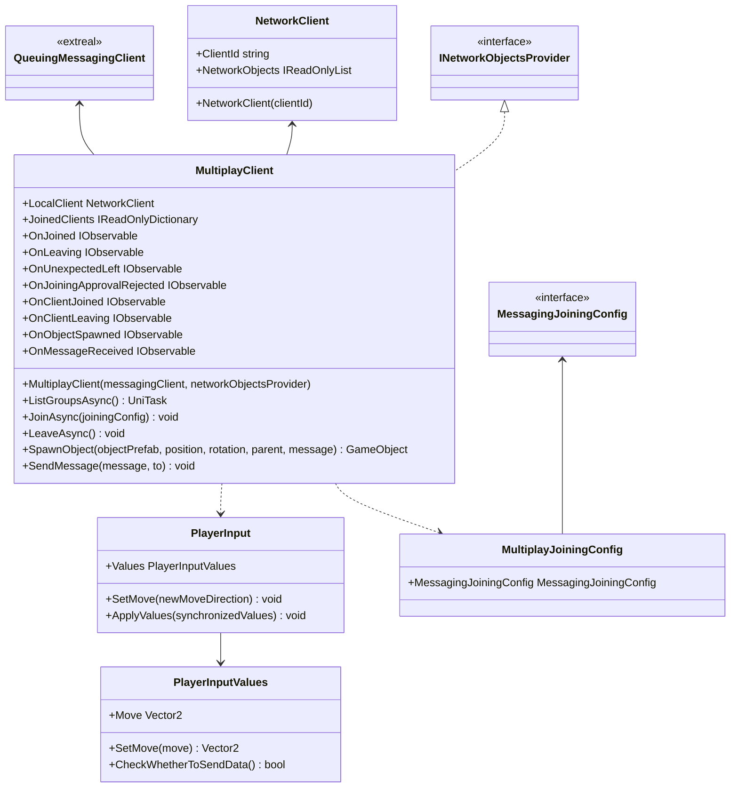

# Multiplay using Messaging

## What for?

マルチプレイ機能を実現する際には、プレイヤー状態（位置情報や動きなど）を同期させる必要があります。

[NGOラッパー](multiplay.ngo.md)のベースとなるNetcode for GameObjectsは単一のサーバープロセス内でプレイヤー状態を集中管理しています。
このような設計は、スケールアウトを難しくしています。

そこで、このモジュールでは[Messaging](./messaging.md)を利用することで、単一サーバーで複数グループのマルチプレイを実現、または複数サーバーにスケールアウトしマルチプレイの人数を増やすことを実現します。
これにより、スケールアウトがより簡単に行えるようになり、結果として運用コストの削減が可能になります。

## Specification

- グループでマルチプレイできます。
- グループ内でメッセージを送受信できます。
- 同期するオブジェクトの動きを追加できます。
- クライアントの状態をトリガーに処理を追加できます。

## Architecture



## Installation

### Package

#### Unity

```text
https://github.com/extreal-dev/Extreal.Integration.Multiplay.Messaging.git
```

### Dependencies

このモジュールは次のパッケージを使います。

#### Unity

- [Extreal.Core.Logging](../core/logging.md)
- [Extreal.Core.Common](../core/common.md)
- [Extreal.Integration.Messaging](messaging.md)
- [UniTask](https://github.com/Cysharp/UniTask)
- [UniRx](https://github.com/neuecc/UniRx)

モジュールバージョンと各パッケージバージョンの対応は[Release](../category/release)を参照ください。

### Settings

このモジュールは[Messaging](messaging.md)を使ってマルチプレイを実現しています。
そのため[MessagingのSettings](messaging.md#settings)が必要になります。

```csharp
public class ClientControlScope : LifetimeScope
{
    private MultiplayClient multiplayClient;

    protected override void Configure(IContainerBuilder builder)
    {
        // After initializing QueuingMessagingClient and NetworkObjectsProvider
        multiplayClient = new MultiplayClient(queuingMessagingClient, networkObjectsProvider)
    }
}
```

## Usage

### グループでマルチプレイを行う

グループでマルチプレイを行う機能はMultiplayClientが提供します。

グループへの参加/退室は[Messaging](./messaging.md)と同じ使い方になります。
[グループでメッセージをやりとりする](./messaging.md#messaging-among-group)を参照してください。

```csharp
// Join a group
var messagingJoiningConfig = new MessagingJoiningConfig("groupName");
var multiplayJoiningConfig = new MultiplayJoiningConfig(messagingJoiningConfig);
await multiplayClient.JoinAsync(multiplayJoiningConfig);

// Leave the group
multiplayClient.LeaveAsync();
```

グループに参加したらプレイヤーをスポーンしてマルチプレイに参加します。

```csharp
multiplayClient.SpawnObject(playerObjectToBeSpawned)
```
プレイヤー以外のオブジェクトのスポーンもできます。

```csharp
multiplayClient.SpawnObject(objectToBeSpawned)
```

### グループ内でメッセージを送受信する

リアクションの同期など、グループ内でメッセージを送受信したい場合があります。
メッセージの送受信は[Messaging](./messaging.md)と同じ使い方になります。
[グループでメッセージをやりとりする](./messaging.md#messaging-among-group)を参照してください。

```csharp
// Send message to entire group
await messagingClient.SendMessageAsync("message");
```

### 同期するオブジェクトの動きを追加する

SpawnObjectメソッドでスポーンしたオブジェクトの位置と回転はデフォルト実装で同期します。

要件によっては、アニメーションなど、オブジェクトの位置と回転以外の動きも同期したい場合があります。
このモジュールでは実装を追加することで、要件に合わせて同期するオブジェクトの動きを追加できます。

このモジュールではプレイヤーの入力を他のプレイヤーに送信することで、オブジェクトの動きを同期しています。
どのプレイヤーの入力を同期に使うかはPlayerInputとPlayerInputValuesで示します。

位置と回転以外の動きを同期したい場合は、PlayerInputとPlayerInputValuesを継承したクラスを作成します。

例えばJumpという入力を同期する場合を示します。

```csharp
public class HolidayPlayerInput : PlayerInput
{
    public override PlayerInputValues Values => HolidayValues;
    public HolidayPlayerInputValues HolidayValues { get; } = new HolidayPlayerInputValues();

    public void SetJump(bool newJump)
        => HolidayValues.SetJump(newJump);

    public override void ApplyValues(PlayerInputValues synchronizedValues)
    {
        var synchronizedHolidayValues = synchronizedValues as HolidayPlayerInputValues;

        base.ApplyValues(synchronizedHolidayValues);
        SetJump(synchronizedHolidayValues.Jump);
    }
}
```

```csharp
public class HolidayPlayerInputValues : PlayerInputValues
{
    [SuppressMessage("Usage", "CC0047")] public bool Jump { get; set; }

    public void SetJump(bool jump)
        => Jump = jump;
}
```

プレイヤーの入力は一定時間ごとに同期されます。
入力が変わるごとに同期したい場合など、同期するタイミングを制御したい場合はCheckWhetherToSendDataメソッドを使用します。

MoveかJumpのいずれかが変化した場合に同期する例を示します。

```csharp
[Serializable]
public class HolidayPlayerInputValues : PlayerInputValues
{
    private Vector2 preMove;
    private bool isMoveChanged;

    [SuppressMessage("Usage", "CC0047")] public bool Jump { get; set; }
    private bool preJump;
    private bool isJumpChanged;

    public override void SetMove(Vector2 move)
    {
        preMove = Move;
        base.SetMove(move);
        isMoveChanged = preMove != Move;
    }

    public void SetJump(bool jump)
    {
        preJump = Jump;
        Jump = jump;
        isJumpChanged = preJump != Jump;
    }

    public override bool CheckWhetherToSendData()
    {
        var ret = isMoveChanged || isJumpChanged;
        isMoveChanged = isJumpChanged = false;
        return ret;
    }
}
```

### クライアントの状態をトリガーに処理を追加する

[Messaging](messaging.md)と同じイベント通知を使えます。詳細はMessagingの[クライアントの状態をトリガーに処理を追加する](messaging.md#クライアントの状態をトリガーに処理を追加する)を参照してください。

MultiplayClientは上記に加えて次のイベント通知を設けています。

- OnObjectSpawned
  - タイミング：同期するオブジェクトをスポーンした直後
  - タイプ：IObservable
  - パラメータ：参加したクライアントID、スポーンしたオブジェクト、送信されたメッセージ
