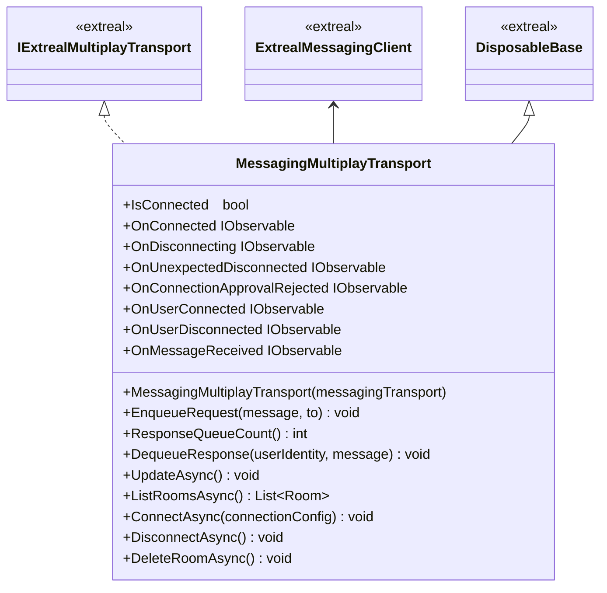

---
sidebar_position: 8
---

# Multiplay using Messaging

## What for?

マルチプレイ通信方式を実現したライブラリを提供します。

## Specification

- Messagingによるマルチプレイができます。
- MessagingMultiplayTransport: メッセージングを用いたマルチプレイの通信を実現するクラス。
## Architecture

