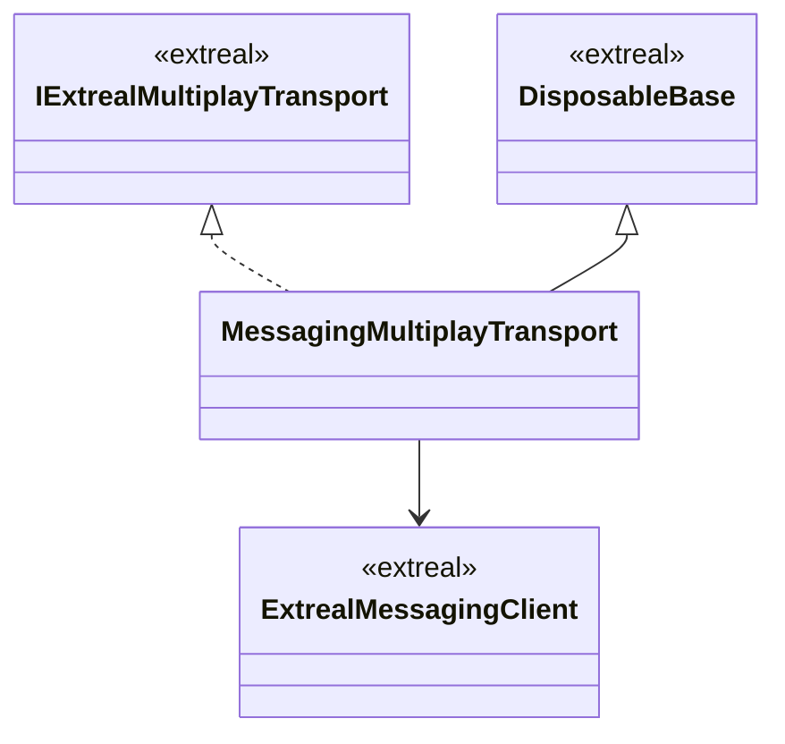

---
sidebar_position: 8
---

# Multiplay using Messaging

## What for?

マルチプレイ通信方式を実現したライブラリを提供します。

## Specification

- Messagingによるマルチプレイができます。

## Architecture

```mermaid
classDiagram

    IExtrealMultiplayTransport <|.. MessagingMultiplayTransport
    DisposableBase <|-- MessagingMultiplayTransport
    MessagingMultiplayTransport --> ExtrealMessagingClient

    class MessagingMultiplayTransport {
    }

    class IExtrealMultiplayTransport {
        <<extreal>>
    }

    class DisposableBase {
        <<extreal>>
    }

    class ExtrealMessagingClient {
        <<extreal>>
    }
```