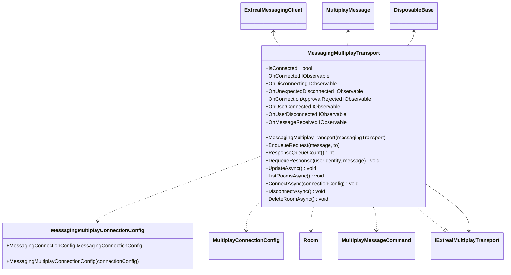

---
sidebar_position: 8
---

# Messaging for Multiplay

## What for?

マルチプレイ機能の中でメッセージングに関連する機能を共通化したライブラリを提供します。

## Specification

- MessagingMultiplayTransportでIExtrealMultiplayTransport を利用して、トランスポート層の共通設定を行い、メッセージングのための接続、切断、ルーム管理、メッセージ受信イベントの監視などを実現します。
- MessagingMultiplayTransportで実際のメッセージング通信の実装詳細を担うExtrealMessagingClientを利用します。
## Architecture

