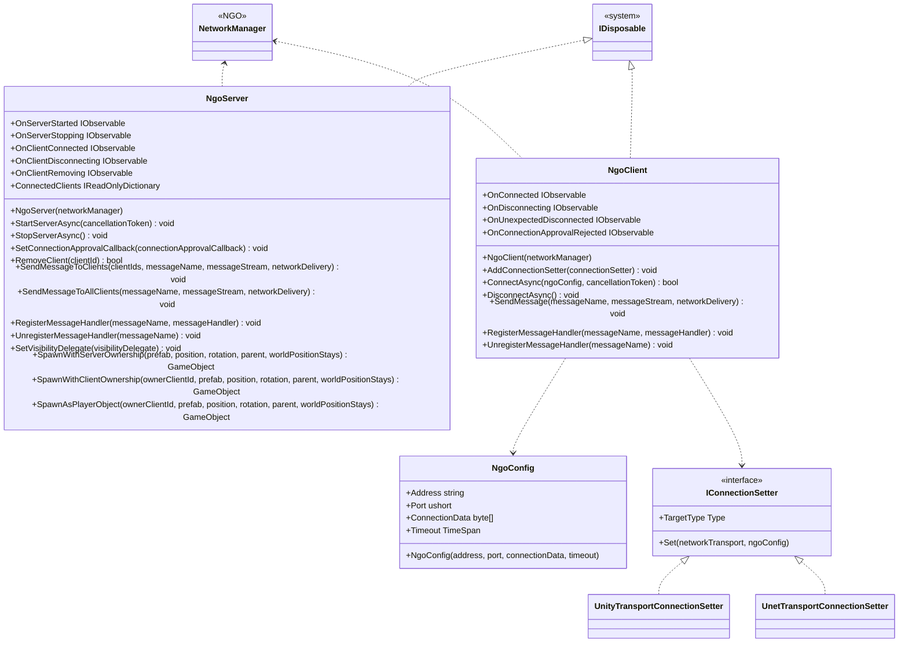

# Multiplay using Netcode for GameObjects

## What for?

[Netcode for GameObjects](https://docs-multiplayer.unity3d.com/netcode/current/about/index.html)をアプリケーションで使いやすくするラッパーを提供します。

ExtrealではNetcode for GameObjectsのことをNGO、NGOをラップしているこの機能をNGOラッパーと呼ぶことにします。

NGOではNetworkManagerという1つのクラスでサーバー、クライアント向けの機能を提供します。
NetworkManagerをそのまま使う場合は常にコンテキストを意識した実装が必要となり混乱しやすいので、NGOラッパーではサーバー向けとクライアント向けに別々のクラスとしてNgoServerとNgoClientを提供します。

あなたのアプリケーションでNGOラッパーを使うことでNGOの導入がスムーズになることを目指しています。

:::caution
NGOラッパーはNGOを使いやすくしますが、NGOを知らなくてもNGOラッパーだけ知っていればマルチプレイを実現できるわけではありません。
NGOラッパーはNGOをそのまま使う場合に使いにくい点や足りない機能を補いますが、マルチプレイの処理はNGOに移譲します。
そのため、NGOラッパーを使うにはNGOを知っていることが前提です。
NGOを知らない場合は[How to lean](/learning/intro#how-to-learn)を参照してNGOについて学習してください。
このガイドはNGOを知っている前提で説明しています。
:::

:::info
よくあるマルチプレイのアプリケーション要件に対するNGOラッパーの実装例は[サンプルアプリケーション](/category/sample-application)で提供します。

現時点では次の要件を提供済みです。

- ユーザーが選んだアバターでプレイできる
- 空間の最大人数を超えた場合は入室できないようにする

今後、次の要件を追加していく予定です。

- 予期しないネットワーク切断時に再接続する
- 空間の最大人数を超えた場合は待機人数まで待機できるようにする
  - 待機中のユーザーは非表示、他のユーザーのマルチプレイは見える
  - 他のユーザーが退室して順番が回ってくるとマルチプレイに参加できる
- オフラインでもオンライン時と同じようにアバターをプレイできる
- アバターに物を持たせることができる
:::

## Specification

NGOラッパーの仕様は次の通りです。

- NGOのサーバー向けの機能を使用できます。
- NGOのサーバー状態をトリガーに処理を追加できます。
- NGOのクライアント向けの機能を使用できます。
- NGOのクライアント状態をトリガーに処理を追加できます。
- NGOが提供するデフォルト以外のNetworkTransportにも対応できます。

:::info
NGOラッパーはNGOが提供している2つのトランスポート（Unity Transport、 UNet Transport）に対応しているので、これら2つのトランスポートを使用する場合は対応が不要です。
NGOが提供していない新たなトランスポートを使用する場合はNgoClientが使うIConnectionSetterを変更する必要があります。
対応方法は[NGOが提供するデフォルト以外のNetworkTransportに対応する](/integration/multiplay.ngo#int-ngo-nt)を参照してください。
:::

:::info
安定したパフォーマンスやセキュリティを担保しやすいため、NGOラッパーはNGOのアーキテクチャとして専用サーバーの使用を前提としています。
NGOのアーキテクチャについては[Network Topologies](https://docs-multiplayer.unity3d.com/netcode/current/reference/glossary/network-topologies) を参照ください。
専用サーバーの使用を前提としているため、NGOラッパーはホスト向けの機能は提供していません。
ホスト向けの機能を使いたい場合はNetworkManagerを直接使用してください。
:::

## Architecture



## Installation

### Package

```
https://github.com/extreal-dev/Extreal.Integration.Multiplay.NGO.git
```

### Dependencies

NGOラッパーは次のパッケージを使います。

- [Extreal.Core.Logging](/core/logging)
- [Netcode for GameObjects](https://docs-multiplayer.unity3d.com/netcode/current/about/index.html)
- [UniTask](https://github.com/Cysharp/UniTask)
- [UniRx](https://github.com/neuecc/UniRx)

モジュールバージョンと各パッケージバージョンの対応は[Release](/category/release)を参照ください。

### Settings

NgoServerとNgoClientを初期化します。
NgoServerとNgoClientの初期化にはNetworkManagerが必要です。
VContainerを使ってNetworkManagerをNgoServerとNgoClientに設定します。

NGOのNetworkManagerはGameObjectにアタッチして初期化しているものとします。

```csharp
public class MultiplayServerScope : LifetimeScope
{
    [SerializeField] private NetworkManager networkManager;

    protected override void Configure(IContainerBuilder builder)
    {
        builder.RegisterComponent(networkManager);
        builder.Register<NgoServer>(Lifetime.Singleton);
    }
}
```

```csharp
public class MultiplayControlScope : LifetimeScope
{
    [SerializeField] private NetworkManager networkManager;

    protected override void Configure(IContainerBuilder builder)
    {
        builder.RegisterComponent(networkManager);
        builder.Register<NgoClient>(Lifetime.Singleton);
    }
}
```

:::tip
NetworkManagerはサーバーとクライアントで同じ設定の必要があるため、Prefabにしてサーバーとクライアントで同じものを使うようにします。
:::

:::info
NGOが提供していない新たなトランスポートを使う場合は[NGOが提供するデフォルト以外のNetworkTransportを使用する](/integration/multiplay.ngo#int-ngo-nt)を参照して対応してください。
NGOが提供している2つのトランスポート（Unity Transport、 UNet Transport）を使用する場合は何も作業が必要ありません。
:::

## Usage

### NGOのサーバー向けの機能を使用する

NGOのサーバー向けの機能はNgoServerが提供します。
ここではNgoServerの基本的な使い方をいくつか紹介します。
NgoServerはマルチプレイの処理をNetworkManagerに移譲しているので各機能の詳細はNGOのドキュメントを参照してください。

サーバーの開始はStartServerAsyncを使います。

```csharp
ngoServer.StartServerAsync().Forget();
```

サーバーの停止はStopServerAsyncで行いますが、NgoServerのDisposeでStopServerAsyncを呼んでいるのでアプリケーション終了時は自動で呼ばれます。

クライアントからのメッセージに対応する処理はRegisterMessageHandlerで登録します。
登録の解除はUnregisterMessageHandlerで行います。
次のコードではサーバーの開始時と終了時に登録と登録解除をしています。

```csharp
ngoServer.OnServerStarted.Subscribe(_ =>
{
    ngoServer.RegisterMessageHandler(MessageName.PlayerSpawn.ToString(), PlayerSpawnMessageHandler);
}).AddTo(compositeDisposable);

ngoServer.OnServerStopping.Subscribe(_ =>
{
    ngoServer.UnregisterMessageHandler(MessageName.PlayerSpawn.ToString());
}).AddTo(compositeDisposable);
```

任意のタイミングでプレイヤーをスポーンしたい場合やプレイヤーのPrefabを動的に切り替えたい場合はSpawnAsPlayerObjectを使います。
次のコードは上記のRegisterMessageHandlerで登録しているクライアントからのメッセージに対応する処理です。
クライアントからのメッセージに対応してプレイヤーをスポーンしています。

```csharp
private async void PlayerSpawnMessageHandler(ulong clientId, FastBufferReader messageStream)
{
    var result = Addressables.LoadAssetAsync<GameObject>("PlayerPrefab");
    var playerPrefab = await result.Task;
    ngoServer.SpawnAsPlayerObject(clientId, playerPrefab);
}
```

### NGOのサーバー状態をトリガーに処理を追加する

NgoServerは次のイベント通知を設けています。

- OnServerStarted
  - タイミング：サーバーが開始した直後
  - タイプ：IObservable
  - パラメータ：なし
- OnServerStopping
  - タイミング：サーバーを停止する直前
  - タイプ：IObservable
  - パラメータ：なし
- OnClientConnected
  - タイミング：クライアントが接続した直後
  - タイプ：IObservable
  - パラメータ：接続したクライアントID
- OnClientDisconnecting
  - タイミング：クライアントが切断する直前
  - タイプ：IObservable
  - パラメータ：切断するクライアントID
- OnClientRemoving
  - タイミング：クライアントを削除する直前
  - タイプ：IObservable
  - パラメータ：削除するクライアントID

サーバーの開始時と終了時に処理を追加する例は次の通りです。

```csharp
ngoServer.OnServerStarted.Subscribe(_ =>
{
    ngoServer.RegisterMessageHandler(MessageName.PlayerSpawn.ToString(), PlayerSpawnMessageHandler);
}).AddTo(compositeDisposable);

ngoServer.OnServerStopping.Subscribe(_ =>
{
    ngoServer.UnregisterMessageHandler(MessageName.PlayerSpawn.ToString());
}).AddTo(compositeDisposable);
```

### NGOのクライアント向けの機能を使用する

NGOのクライアント向けの機能はNgoClientが提供します。
ここではNgoClientの基本的な使い方をいくつか紹介します。
NgoClientはマルチプレイの処理をNetworkManagerに移譲しているので各機能の詳細はNGOのドキュメントを参照してください。

サーバーへの接続はConnectAsyncを使います。
接続情報はNgoConfigで指定します。
アプリケーションの実行中はNgoClientのインスタンスを再利用する想定のため、接続時に毎回接続情報を指定します。

```csharp
var ngoConfig = new NgoConfig();
ngoClient.ConnectAsync(ngoConfig).Forget();
```

NgoConfigのデフォルトは次の通りです。
接続処理でタイムアウト時間が経過するとTimeoutExceptionが発生します。

```csharp
public NgoConfig
(
    string address = "127.0.0.1",
    ushort port = 7777,
    byte[] connectionData = null,
    byte timeoutSeconds = 10
)
```

サーバーからの切断はDisconnectAsyncを使います。

```csharp
ngoClient.DisconnectAsync().Forget();
```

サーバーへのメッセージ送信はSendMessageを使います。
次のコードはサーバーに接続後、プレイヤーをスポーンするメッセージをサーバーに送信しています。

```csharp
ngoClient.OnConnected.Subscribe(_ =>
{
    var messageStream = new FastBufferWriter(FixedString64Bytes.UTF8MaxLengthInBytes, Allocator.Temp);
    ngoClient.SendMessage(MessageName.PlayerSpawn.ToString(), messageStream);
}).AddTo(compositeDisposable);
```

### NGOのクライアント状態をトリガーに処理を追加する

NgoClientは次のイベント通知を設けています。

- OnConnected
  - タイミング：サーバーに接続した直後
  - タイプ：IObservable
  - パラメータ：なし
- OnDisconnecting
  - タイミング：サーバーから切断する直前
  - タイプ：IObservable
  - パラメータ：なし
- OnUnexpectedDisconnected
  - タイミング：予期していないサーバー切断が発生した直後
  - タイプ：IObservable
  - パラメータ：なし
- OnConnectionApprovalRejected
  - タイミング：接続承認が拒否された直後
  - タイプ：IObservable
  - パラメータ：なし

サーバーに接続した直後に処理を追加する例は次の通りです。

```csharp
ngoClient.OnConnected.Subscribe(_ =>
{
    var messageStream = new FastBufferWriter(FixedString64Bytes.UTF8MaxLengthInBytes, Allocator.Temp);
    ngoClient.SendMessage(MessageName.PlayerSpawn.ToString(), messageStream);
}).AddTo(compositeDisposable);
```

### NGOが提供するデフォルト以外のNetworkTransportに対応する {#int-ngo-nt}

NGOは通信に使用するトランスポートを変更できます。
NGOラッパーはNGOが提供している2つのトランスポート（Unity Transport、 UNet Transport）に対応しているので、これら2つのトランスポートを使用する場合は対応が不要です。
NGOが提供していない新たなトランスポートを使用する場合はNgoClientが使うIConnectionSetterを変更する必要があります。

各トランスポートの実装において接続情報を保持する部分は共通化されていないため、差異を吸収する必要があります。
各トランスポートの実装差異を埋めるためにIConnectionSetterを設けています。

新たなトランスポートを使用する場合はIConnectionSetterを実装したクラスを作り、NgoClientに設定します。
UnityTransportに対するIConnectionSetterの実装を示すのでIConnectionSetter実装時の参考にしてください。

```csharp
public class UnityTransportConnectionSetter : IConnectionSetter
{
    public Type TargetType => typeof(UnityTransport);

    public void Set(NetworkTransport networkTransport, NgoConfig ngoConfig)
    {
        var unityTransport = networkTransport as UnityTransport;
        unityTransport.ConnectionData.Address = ngoConfig.Address.Trim();
        unityTransport.ConnectionData.Port = ngoConfig.Port;
        unityTransport.ConnectionData.ServerListenAddress = ngoConfig.Address.Trim();
    }
}
```

NgoClientのAddConnectionSetterで実装したクラスを設定します。

```csharp
ngoClient.AddConnectionSetter(new UnityTransportConnectionSetter());
```
