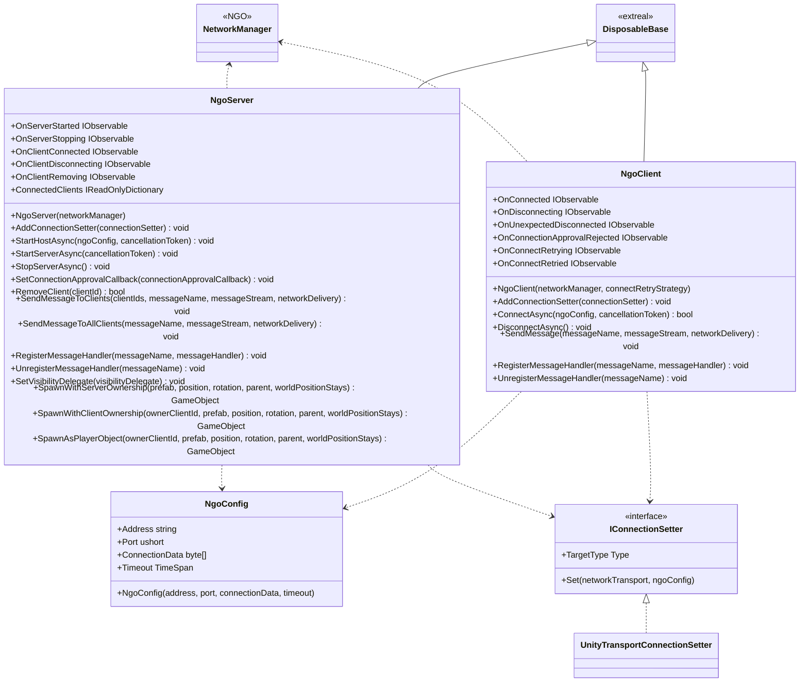
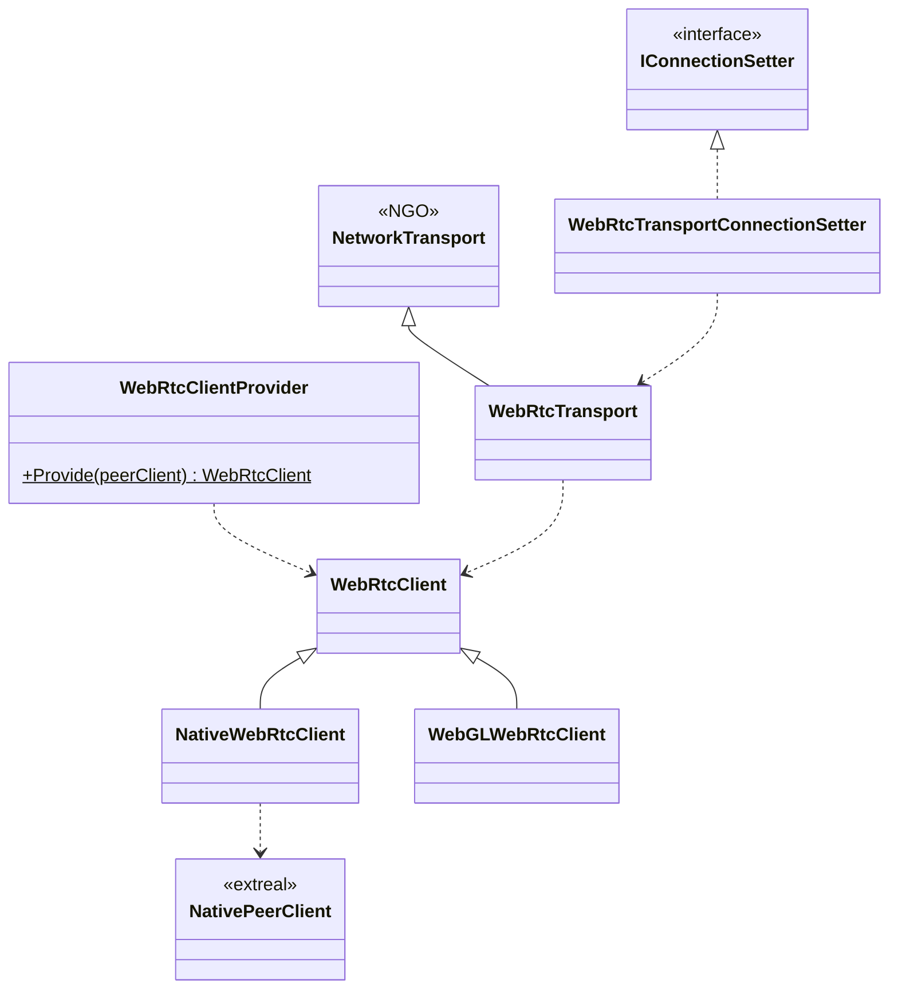
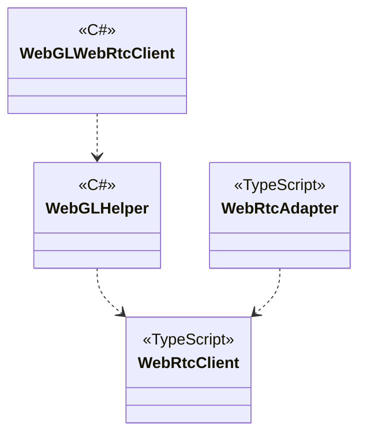

# Multiplay using Netcode for GameObjects

## What for?

[Netcode for GameObjects](https://docs-multiplayer.unity3d.com/netcode/current/about/index.html)をアプリケーションで使いやすくするラッパーを提供します。

ExtrealではNetcode for GameObjectsのことをNGO、NGOをラップしているこの機能をNGOラッパーと呼ぶことにします。

NGOではNetworkManagerという1つのクラスでサーバー、クライアント向けの機能を提供します。
NetworkManagerをそのまま使う場合は常にコンテキストを意識した実装が必要となり混乱しやすいので、NGOラッパーではサーバー向けとクライアント向けに別々のクラスとしてNgoServerとNgoClientを提供します。

あなたのアプリケーションでNGOラッパーを使うことでNGOの導入がスムーズになることを目指しています。

:::caution
NGOラッパーはNGOを使いやすくしますが、NGOを知らなくてもNGOラッパーだけ知っていればマルチプレイを実現できるわけではありません。
NGOラッパーはNGOをそのまま使う場合に使いにくい点や足りない機能を補いますが、マルチプレイの処理はNGOに移譲します。
そのため、NGOラッパーを使うにはNGOを知っていることが前提です。
NGOを知らない場合は[Learning](../learning/intro.md#multiplayer)を参照してNGOについて学習してください。
このガイドはNGOを知っている前提で説明しています。
:::

## Specification

NGOラッパーの仕様は次の通りです。

- NGOのサーバー/ホスト向けの機能を使用できます。
- NGOのサーバー/ホスト状態をトリガーに処理を追加できます。
- NGOのクライアント向けの機能を使用できます。
- NGOのクライアントの通信が切断されたときに再接続できます。
- NGOのクライアント状態をトリガーに処理を追加できます。
- NGOが提供するデフォルト以外のNetworkTransportにも対応できます。
- P2P(Host/Client)によるマルチプレイができます。(WebRtcTransport)
  - Native(C#)とWebGL(JavaScript)に対応しています。

:::caution
NGOのサーバー/ホスト向けの機能は共通するものが多いため、異なる部分のみホストと明示します。
サーバーと記載している部分はホストにも該当するものとして理解ください。
:::

:::info
NGOラッパーはNGOが提供しているデフォルトのトランスポート（Unity Transport）に対応しているので、デフォルトのトランスポートを使用する場合は対応が不要です。
NGOが提供していない新たなトランスポートを使用する場合はNgoClientが使うIConnectionSetterを変更する必要があります。
対応方法は[NGOが提供するデフォルト以外のNetworkTransportに対応する](#int-ngo-nt)を参照してください。
:::

## Architecture

### NGOラッパー



### WebRtcTransport

#### Unity



#### JavaScript



## Installation

### Package

#### Unity

NGOラッパーを使う場合

```text
https://github.com/extreal-dev/Extreal.Integration.Multiplay.NGO.git
```

WebRtcTransportを使う場合

```text
https://github.com/extreal-dev/Extreal.Integration.Multiplay.NGO.WebRTC.git
```

#### npm

WebRtcTransportを使う場合

```text
@extreal-dev/extreal.integration.multiplay.ngo.webrtc
```

### Dependencies

NGOラッパーを使う場合

- [Extreal.Core.Logging](../core/logging.md)
- [Extreal.Core.Common](../core/common.md)
- [Netcode for GameObjects](https://docs-multiplayer.unity3d.com/netcode/current/about/index.html)
- [UniTask](https://github.com/Cysharp/UniTask)
- [UniRx](https://github.com/neuecc/UniRx)

WebRtcTransportを使う場合

#### Unity

- [Extreal.Integration.Web.Common](../integration/web.common.md)
- [Extreal.Integration.P2P.WebRTC](../integration/p2p.webrtc.md)
- [WebRTC](https://docs.unity3d.com/Packages/com.unity.webrtc@3.0/manual/index.html)

#### npm

- [@extreal-dev/extreal.integration.web.common](https://www.npmjs.com/package/@extreal-dev/extreal.integration.web.common)
- [@extreal-dev/extreal.integration.p2p.webrtc](https://www.npmjs.com/package/@extreal-dev/extreal.integration.p2p.webrtc)

モジュールバージョンと各パッケージバージョンの対応は[Release](../category/release)を参照ください。

### Settings

#### NGOラッパー

NgoServerとNgoClientを初期化します。
NgoServerとNgoClientの初期化にはNetworkManagerが必要です。
VContainerを使ってNetworkManagerをNgoServerとNgoClientに設定します。

NGOのNetworkManagerはGameObjectにアタッチして初期化しているものとします。

```csharp
public class MultiplayServerScope : LifetimeScope
{
    [SerializeField] private NetworkManager networkManager;

    protected override void Configure(IContainerBuilder builder)
    {
        builder.RegisterComponent(networkManager);
        builder.Register<NgoServer>(Lifetime.Singleton);
    }
}
```

```csharp
public class MultiplayControlScope : LifetimeScope
{
    [SerializeField] private NetworkManager networkManager;

    protected override void Configure(IContainerBuilder builder)
    {
        builder.RegisterComponent(networkManager);
        builder.Register<NgoClient>(Lifetime.Singleton)
            .WithParameter(typeof(IRetryStrategy), NoRetryStrategy.Instance);
    }
}
```

:::tip
NetworkManagerはサーバーとクライアントで同じ設定の必要があるため、Prefabにしてサーバーとクライアントで同じものを使うようにします。
:::

:::info
NGOが提供していない新たなトランスポートを使う場合は[NGOが提供するデフォルト以外のNetworkTransportを使用する](#int-ngo-nt)を参照して対応してください。
NGOが提供しているデフォルトのトランスポート（Unity Transport）を使用する場合は何も作業が必要ありません。
:::

#### WebRtcTransport {#mulitplay-ngo-settings-webrtctransport}

WebRtcTransportは[P2P.WebRTC](p2p.webrtc.md)を使ってP2Pを実現しています。
そのため[P2P.WebRTCのSettings](p2p.webrtc.md#settings)が必要になります。
P2P.WebRTCを設定した上で次の初期化を追加します。

WebRtcTransportを使う場合はまずNetworkManagerのインスペクタでWebRtcTransportを設定します。
次にWebRtcTransportにWebRtcClientを設定できるようにNgoServerとNgoClientを初期化します。
WebRtcTransportConnectionSetter経由でWebRtcClientをWebRtcTransportに設定します。

```csharp
public class ClientControlScope : LifetimeScope
{
    [SerializeField] private NetworkManager networkManager;

    protected override void Configure(IContainerBuilder builder)
    {
        var peerConfig = new PeerConfig("http://127.0.0.1:3010");
        var peerClient = PeerClientProvider.Provide(peerConfig);
        builder.RegisterComponent(peerClient);

        var webRtcClient = WebRtcClientProvider.Provide(peerClient);
        var webRtcTransportConnectionSetter = new WebRtcTransportConnectionSetter(webRtcClient);

        var ngoHost = new NgoServer(networkManager);
        ngoHost.AddConnectionSetter(webRtcTransportConnectionSetter);
        builder.RegisterComponent(ngoHost);

        var ngoClient = new NgoClient(networkManager, assetHelper.NgoClientConfig.RetryStrategy);
        ngoClient.AddConnectionSetter(webRtcTransportConnectionSetter);
        builder.RegisterComponent(ngoClient);

        builder.RegisterEntryPoint<ClientControlPresenter>();
    }
}
```

WebGLで使う場合はさらにJavaScriptの初期化が必要になります。
WebRtcAdapterを作成してadapt関数を呼び出します。

```typescript
import { PeerAdapter } from "@extreal-dev/extreal.integration.p2p.webrtc";
import { WebRtcAdapter } from "@extreal-dev/extreal.integration.multiplay.ngo.webrtc";

const peerAdapter = new PeerAdapter();
peerAdapter.adapt();

const webRtcAdapter = new WebRtcAdapter();
webRtcAdapter.adapt(peerAdapter.getPeerClient);
```

## Usage

### NGOのサーバー/ホスト向けの機能を使用する {#mulitplay-ngo-server-host} 

NGOのサーバー/ホスト向けの機能はNgoServerが提供します。
ここではNgoServerの基本的な使い方をいくつか紹介します。
NgoServerはマルチプレイの処理をNetworkManagerに移譲しているので各機能の詳細はNGOのドキュメントを参照してください。

サーバーの開始はStartServerAsyncを使います。

```csharp
ngoServer.StartServerAsync().Forget();
```

ホストの開始はStartHostAsyncを使います。

```csharp
ngoServer.StartHostAsync(ngoConfig).Forget();
```

サーバーの停止はStopServerAsyncで行いますが、NgoServerのDisposeでStopServerAsyncを呼んでいます。
アプリケーション終了時はNgoServerのDisposeが呼ばれるようにしてください。

クライアントからのメッセージに対応する処理はRegisterMessageHandlerで登録します。
登録の解除はUnregisterMessageHandlerで行います。
次のコードではサーバーの開始時と終了時に登録と登録解除をしています。

```csharp
ngoServer.OnServerStarted.Subscribe(_ =>
{
    ngoServer.RegisterMessageHandler(MessageName.PlayerSpawn.ToString(), PlayerSpawnMessageHandler);
}).AddTo(compositeDisposable);

ngoServer.OnServerStopping.Subscribe(_ =>
{
    ngoServer.UnregisterMessageHandler(MessageName.PlayerSpawn.ToString());
}).AddTo(compositeDisposable);
```

任意のタイミングでプレイヤーをスポーンしたい場合やプレイヤーのPrefabを動的に切り替えたい場合はSpawnAsPlayerObjectを使います。
次のコードは上記のRegisterMessageHandlerで登録しているクライアントからのメッセージに対応する処理です。
クライアントからのメッセージに対応してプレイヤーをスポーンしています。

```csharp
private async void PlayerSpawnMessageHandler(ulong clientId, FastBufferReader messageStream)
{
    if (Logger.IsDebug())
    {
        Logger.LogDebug($"{MessageName.PlayerSpawn}: {clientId}");
    }
    messageStream.ReadValueSafe(out string avatarAssetName);
    var result = Addressables.LoadAssetAsync<GameObject>(avatarAssetName);
    var playerPrefab = await result.Task;
    ngoServer.SpawnAsPlayerObject(clientId, playerPrefab);
}
```

### NGOのサーバー/ホスト状態をトリガーに処理を追加する

NgoServerは次のイベント通知を設けています。

- OnServerStarted
  - タイミング：サーバーが開始した直後
  - タイプ：IObservable
  - パラメータ：なし
- OnServerStopping
  - タイミング：サーバーを停止する直前
  - タイプ：IObservable
  - パラメータ：なし
- OnClientConnected
  - タイミング：クライアントが接続した直後
  - タイプ：IObservable
  - パラメータ：接続したクライアントID
- OnClientDisconnecting
  - タイミング：クライアントが切断する直前
  - タイプ：IObservable
  - パラメータ：切断するクライアントID
- OnClientRemoving
  - タイミング：クライアントを削除する直前
  - タイプ：IObservable
  - パラメータ：削除するクライアントID

サーバーの開始時と終了時に処理を追加する例は次の通りです。

```csharp
ngoServer.OnServerStarted.Subscribe(_ =>
{
    ngoServer.RegisterMessageHandler(MessageName.PlayerSpawn.ToString(), PlayerSpawnMessageHandler);
}).AddTo(compositeDisposable);

ngoServer.OnServerStopping.Subscribe(_ =>
{
    ngoServer.UnregisterMessageHandler(MessageName.PlayerSpawn.ToString());
}).AddTo(compositeDisposable);
```

### NGOのクライアント向けの機能を使用する

NGOのクライアント向けの機能はNgoClientが提供します。
ここではNgoClientの基本的な使い方をいくつか紹介します。
NgoClientはマルチプレイの処理をNetworkManagerに移譲しているので各機能の詳細はNGOのドキュメントを参照してください。

サーバーへの接続はConnectAsyncを使います。
接続情報はNgoConfigで指定します。
アプリケーションの実行中はNgoClientのインスタンスを再利用する想定のため、接続時に毎回接続情報を指定します。

```csharp
var ngoConfig = new NgoConfig();
ngoClient.ConnectAsync(ngoConfig).Forget();
```

NgoConfigのデフォルトは次の通りです。
timeoutがnullの場合は10秒に設定されます。
接続処理でタイムアウト時間が経過するとTimeoutExceptionが発生します。

```csharp
public NgoConfig
(
    string address = "127.0.0.1",
    ushort port = 7777,
    byte[] connectionData = null,
    TimeSpan timeout = null
)
```

サーバーからの切断はDisconnectAsyncを使います。

```csharp
ngoClient.DisconnectAsync().Forget();
```

サーバーへのメッセージ送信はSendMessageを使います。
次のコードはサーバーに接続後、プレイヤーをスポーンするメッセージをサーバーに送信しています。

```csharp
ngoClient.OnConnected.Subscribe(_ =>
{
    var messageStream = new FastBufferWriter(FixedString64Bytes.UTF8MaxLengthInBytes, Allocator.Temp);
    ngoClient.SendMessage(MessageName.PlayerSpawn.ToString(), messageStream);
}).AddTo(compositeDisposable);
```

### NGOのクライアントの通信が切断されたときに再接続する {#multiplay-ngo-retry}

NgoClientは[Common](../core/common.md)が提供するリトライ処理を使って通信切断時の再接続を実現しています。
リトライ処理を知っている前提で以降の説明をするため、リトライ処理を確認していない方は先に[リトライ処理](../core/common.md#core-common-retry)を確認してください。

NgoClientはデフォルトで再接続を行いません。
NgoClientの初期化時にリトライ戦略を指定すると再接続を行います。

```csharp
builder.Register<NgoClient>(Lifetime.Singleton).WithParameter(typeof(IRetryStrategy), new CountingRetryStrategy());
```

NgoClientが行う再接続の処理内容は次の通りです。

- 再接続を実行するタイミング
  - 接続が失敗した場合
  - 予期していないサーバー切断が発生した場合
- 再接続の処理内容
  - 接続が失敗した場合
    - リトライ戦略に応じて接続を繰り返します。
  - 予期していないサーバー切断が発生した場合
    - リトライ戦略に応じて接続を繰り返します。

リトライ処理の状況に応じて処理を実行したい場合は[イベント通知](#multiplay-ngo-event)を使用してください。

### NGOのクライアント状態をトリガーに処理を追加する {#multiplay-ngo-event}

NgoClientは次のイベント通知を設けています。

- OnConnected
  - タイミング：サーバーに接続した直後
  - タイプ：IObservable
  - パラメータ：なし
- OnDisconnecting
  - タイミング：サーバーから切断する直前
  - タイプ：IObservable
  - パラメータ：なし
- OnUnexpectedDisconnected
  - タイミング：予期していないサーバー切断が発生した直後
  - タイプ：IObservable
  - パラメータ：なし
- OnConnectionApprovalRejected
  - タイミング：接続承認が拒否された直後
  - タイプ：IObservable
  - パラメータ：なし
- OnConnectRetrying
  - タイミング：接続をリトライする直前
  - タイプ：IObservable
  - パラメータ：リトライ回数
    - 1回目は`1`、2回目は`2`となります。
    - `1`はリトライ戦略の実行開始を意味します。
- OnConnectRetried
  - タイミング：接続のリトライが終了した直後
    - リトライがキャンセルされた場合は通知されません。
  - タイプ：IObservable
  - パラメータ：リトライ結果
    - true：リトライ戦略を実行してリトライが成功した場合
    - false：リトライ戦略を実行して最終的にリトライが成功しなかった場合

サーバーに接続した直後に処理を追加する例は次の通りです。

```csharp
ngoClient.OnConnected.Subscribe(_ =>
{
    var messageStream = new FastBufferWriter(FixedString64Bytes.UTF8MaxLengthInBytes, Allocator.Temp);
    ngoClient.SendMessage(MessageName.PlayerSpawn.ToString(), messageStream);
}).AddTo(compositeDisposable);
```

### NGOが提供するデフォルト以外のNetworkTransportに対応する {#int-ngo-nt}

NGOは通信に使用するトランスポートを変更できます。
NGOラッパーはNGOが提供しているデフォルトのトランスポート（Unity Transport）に対応しているので、デフォルトのトランスポートを使用する場合は対応が不要です。
NGOが提供していない新たなトランスポートを使用する場合はNgoClientが使うIConnectionSetterを変更する必要があります。

各トランスポートの実装において接続情報を保持する部分は共通化されていないため、差異を吸収する必要があります。
各トランスポートの実装差異を埋めるためにIConnectionSetterを設けています。

新たなトランスポートを使用する場合はIConnectionSetterを実装したクラスを作り、NgoClientに設定します。
UnityTransportに対するIConnectionSetterの実装を示すのでIConnectionSetter実装時の参考にしてください。

```csharp
public class UnityTransportConnectionSetter : IConnectionSetter
{
    public Type TargetType => typeof(UnityTransport);

    public void Set(NetworkTransport networkTransport, NgoConfig ngoConfig)
    {
        var unityTransport = networkTransport as UnityTransport;
        unityTransport.ConnectionData.Address = ngoConfig.Address.Trim();
        unityTransport.ConnectionData.Port = ngoConfig.Port;
        unityTransport.ConnectionData.ServerListenAddress = ngoConfig.Address.Trim();
    }
}
```

NgoClientのAddConnectionSetterで実装したクラスを設定します。

```csharp
ngoClient.AddConnectionSetter(new UnityTransportConnectionSetter());
```

### P2P(Host/Client)によるマルチプレイを行う {#mulitplay-ngo-p2p}

WebRtcTransportの設定によりマルチプレイをP2Pで行えます。
設定方法は[Settings](./multiplay.ngo.md#mulitplay-ngo-settings-webrtctransport)を参照ください。

WebRtcTransportは[P2P.WebRTC](p2p.webrtc.md)を使ってP2Pを実現しています。
ホスト/クライアントの接続確立は[P2P.WebRTCのAPI](p2p.webrtc.md#p2p-webrtc-host-client)を使ってください。

P2Pの接続確立後にNGOの接続を開始する必要があるため、NgoServerとNgoClientの開始タイミングはPeerClientのOnStartedイベントで判断します。

```csharp
peerClient.OnStarted
    .Subscribe(_ => ngoServer.StartHostAsync(ngoConfig).Forget())
    .AddTo(disposables);

peerClient.OnStarted
    .Subscribe(_ => ngoClient.ConnectAsync(ngoConfig).Forget())
    .AddTo(disposables);
```
