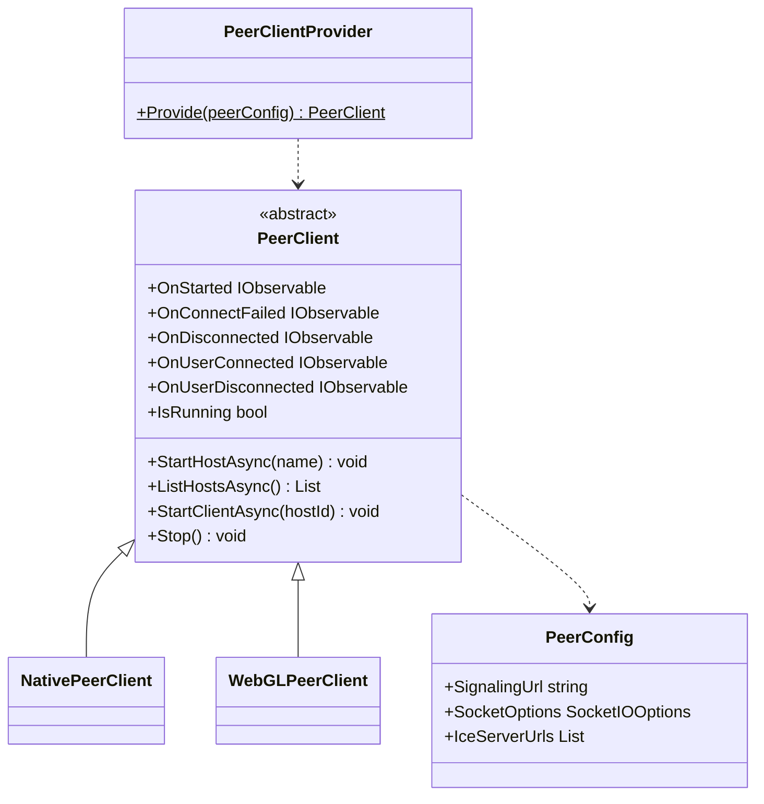
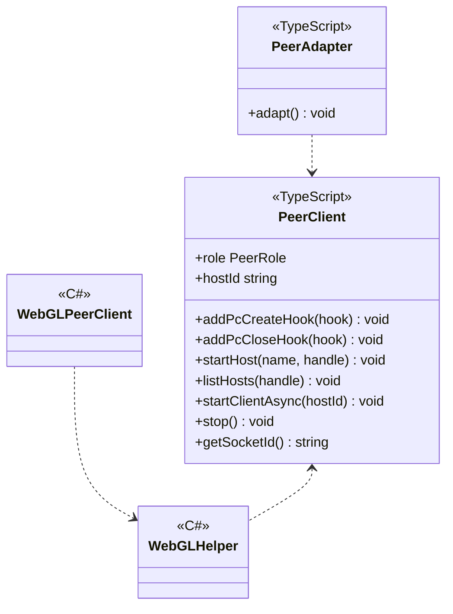
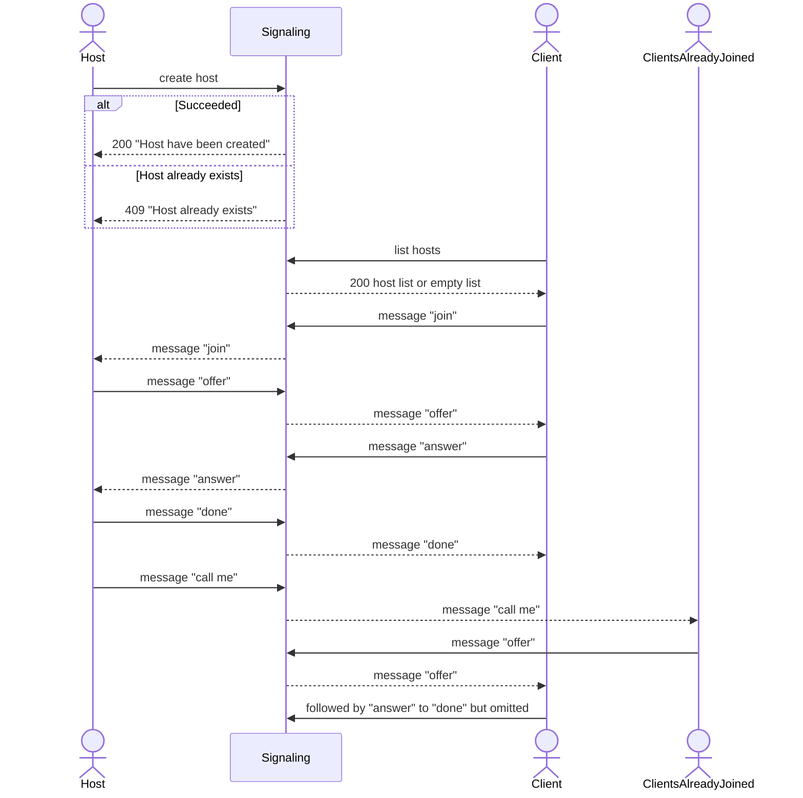

---
sidebar_position: 8
---

# P2P using WebRTC

## What for?

コストをできるだけ抑えてバーチャル空間等でコミュニケーションを取る手段としてP2P(Peer to Peer)があります。

WebRTCを活用すると比較的容易にP2Pを実現できますが、P2Pの接続確立は似通った処理になるので共通機能として提供します。
この共通機能を使うことでデータチャンネルやメディアストリームの処理を追加するのみでアプリケーション固有のP2Pを実現できます。

このモジュールはNative(C#)とWebGL(JavaScript)向けのP2Pのベース機能を提供します。

## Specification

- ホスト/クライアントのP2P接続を確立できます。
- P2Pの状態をトリガーに処理を追加できます。
- Native(C#)のP2Pにアプリケーション固有の処理を追加できます。
- WebGL(JavaScript)のP2Pにアプリケーション固有の処理を追加できます。

## Architecture

### Unity



### JavaScript



P2Pではアプリケーションとシグナリングサーバが協調してP2P接続を確立します。
このモジュールではP2P接続を確立するため、次の処理フローを想定した機能を提供しています。
あるユーザーがホストになり、他のユーザーがホストに参加すると、ホスト及びホストに既に参加しているユーザーとP2P接続を確立します。



:::info
このモジュールではWebRTCの経路情報収集にロジックが単純なVanilla ICEを採用しています。
Vanilla ICEでは全ての経路情報収集が完了するのを待つため、ネットワーク環境によっては経路情報収集に長い時間（例えば40秒）を要する場合があります。
全ての経路情報収集を待たなくても接続できる可能性が高いため、このモジュールではVanilla ICEにタイムアウトを設け、短い時間で経路情報収集を止めています。
デフォルトは5秒です。PeerConfigを使ってこのタイムアウトを変更できます。
:::

## Installation

### Package

#### Unity
```text
https://github.com/extreal-dev/Extreal.Integration.P2P.WebRTC.git
```

#### npm
```text
@extreal-dev/extreal.integration.p2p.webrtc
```

### Dependencies

このモジュールは次のパッケージを使います。

#### Unity

- [Extreal.Core.Logging](../core/logging.md)
- [Extreal.Core.Common](../core/common.md)
- [Extreal.Integration.Web.Common](../integration/web.common.md)
- [Collections](https://docs.unity3d.com/Packages/com.unity.collections@1.2/manual/index.html)
- [WebRTC](https://docs.unity3d.com/Packages/com.unity.webrtc@3.0/manual/index.html)
- [UniTask](https://github.com/Cysharp/UniTask)
- [UniRx](https://github.com/neuecc/UniRx)
- [System.Text.Json](https://learn.microsoft.com/ja-jp/dotnet/api/system.text.json)
- [SocketIOClient](https://github.com/doghappy/socket.io-client-csharp)

#### npm

- [@extreal-dev/extreal.integration.web.common](https://www.npmjs.com/package/@extreal-dev/extreal.integration.web.common)
- [socket.io-client](https://www.npmjs.com/package/socket.io-client)

### Settings

#### シグナリングサーバ

シグナリングサーバは[Docker Compose](https://docs.docker.com/compose/)で提供しています。
[README](https://github.com/extreal-dev/Extreal.Integration.P2P.WebRTC/tree/main/SignalingServer~)を参照してシグナリングサーバを準備してください。

#### アプリケーション

PeerClientProviderを使ってPeerClientを作成します。
PeerClientの作成時にシグナリングサーバのURLを指定します。

```csharp
public class ClientControlScope : LifetimeScope
{
    protected override void Configure(IContainerBuilder builder)
    {
        var peerConfig = new PeerConfig("http://127.0.0.1:3010");
        var peerClient = PeerClientProvider.Provide(peerConfig);
        builder.RegisterComponent(peerClient);
    }
}
```

WebGLで使う場合はさらにJavaScriptで初期化を行います。
PeerAdapterを作成してadapt関数を呼び出します。

```typescript
import { PeerAdapter } from "@extreal-dev/extreal.integration.p2p.webrtc";

const peerAdapter = new PeerAdapter();
peerAdapter.adapt();
```

:::info
TypeScriptを使った開発環境はこのモジュールの[サンプル](https://github.com/extreal-dev/Extreal.Integration.P2P.WebRTC/tree/main/Samples~/MVS/WebGLScripts~)を参考にしてください。
:::

## Usage

### ホスト/クライアントのP2P接続を確立する {#p2p-webrtc-host-client}

このモジュールはP2P接続を確立するためにホスト/クライアント向けの機能を提供します。
これらの機能はPeerClientが提供します。

まず名前を指定してホストを作成します。
作成したユーザーがホストになります。
名前が重複した場合はHostNameAlreadyExistsExceptionがスローされます。

```csharp
await peerClient.StartHostAsync("host name");
```

クライアント（ホストに参加したいユーザー）はホストの一覧を取得します。

```csharp
var hosts = await peerClient.ListHostsAsync();
```

IdとNameを持ったHostのリストが返るので、ここで取得したHostのIdを使ってクライアントはホストに参加します。
参加依頼したクライアントはホストと既にホストに参加している他のクライアントとP2P接続を確立します。

```csharp
await peerClient.StartClientAsync(hostId);
```

ホストを停止する場合やクライアントがホストから退室する場合はP2P接続を停止します。

```csharp
peerClient.Stop();
```

### P2Pの状態をトリガーに処理を追加する

PeerClientは次のイベント通知を設けています。

- OnStarted
  - タイミング：ホストまたはクライアントが開始した直後
    - ホスト
      - ホストが作成された直後
    - クライアント
      - 次の条件を全て満たした直後
        - ホストから"done"を受信
        - ホストとのIceConnectionStateがConnectedまたはCompletedになる
  - タイプ：IObservable
  - パラメータ：ユーザー自身のクライアントID
- OnStartFailed
  - タイミング：ホストまたはクライアントが開始失敗した直後
    - 開始処理がタイムアウトした場合に開始失敗と判断します。
    - タイムアウトのデフォルトは15秒です。PeerConfigを使ってタイムアウトを変更できます。
  - タイプ：IObservable
  - パラメータ：なし
- OnConnectFailed
  - タイミング：ホストまたはクライアントがシグナリングサーバに接続できなかった直後
  - タイプ：IObservable
  - パラメータ：接続できなかった理由
- OnDisconnected
  - タイミング：シグナリングサーバに接続中のホストまたはクライアントが切断された直後
  - タイプ：IObservable
  - パラメータ：切断された理由
- OnUserConnecting
  - タイミング：他のユーザーと接続する直前
    - 接続するユーザー同士がお互いにイベントを受け取ります。そのため新たに接続するユーザーは、既に接続している全てのユーザー数のイベントを受け取ります。
  - タイプ：IObservable
  - パラメータ：接続するユーザーのクライアントID
- OnUserDisconnecting
  - タイミング：他のユーザーと切断する直前
  - タイプ：IObservable
  - パラメータ：切断するユーザーのクライアントID

### Native(C#)のP2Pにアプリケーション固有の処理を追加する

:::caution
PeerConnectionのCreate/Close時にエラーが発生した場合でも、処理が継続されます。
:::

PeerClientはP2P接続の開始時と終了時に処理を追加できるフックを設けています。

```csharp
peerClient.AddPcCreateHook((id, isOffer, rtcPeerConnection) =>
{
    // do something
});

peerClient.AddPcCloseHook((id) =>
{
    // do something
});
```

これらのフックを使ってデータチャンネルやメディアストリームを操作しアプリケーション固有の機能をP2Pに追加します。
データチャンネルを作成する場合の実装例は次の通りです。

```csharp
#if !UNITY_WEBGL || UNITY_EDITOR
using System.Collections.Generic;
using System.Linq;
using System.Text;
using Extreal.Core.Logging;
using Unity.WebRTC;

namespace Extreal.Integration.P2P.WebRTC.MVS.ClientControl
{
    public class NativeDataChannelClient : DataChannelClient
    {
        private static readonly ELogger Logger = LoggingManager.GetLogger(nameof(NativeDataChannelClient));

        private static readonly string Label = "sample";

        private readonly Dictionary<string, RTCDataChannel> dcDict;

        public NativeDataChannelClient(NativePeerClient peerClient)
        {
            dcDict = new Dictionary<string, RTCDataChannel>();
            peerClient.AddPcCreateHook(CreatePc);
            peerClient.AddPcCloseHook(ClosePc);
        }

        private void CreatePc(string id, bool isOffer, RTCPeerConnection pc)
        {
            if (dcDict.ContainsKey(id))
            {
                return;
            }

            if (isOffer)
            {
                var dc = pc.CreateDataChannel(Label);
                HandleDc(id, dc);
            }
            else
            {
                pc.OnDataChannel += (dc) => HandleDc(id, dc);
            }
        }

        private void HandleDc(string id, RTCDataChannel dc)
        {
            if (dc.Label != Label)
            {
                return;
            }

            if (Logger.IsDebug())
            {
                Logger.LogDebug($"New DataChannel: id={id} label={dc.Label}");
            }

            dcDict.Add(id, dc);
            dc.OnMessage = message => Logger.LogDebug(Encoding.UTF8.GetString(message));
        }

        private void ClosePc(string id)
        {
            if (!dcDict.TryGetValue(id, out var dc))
            {
                return;
            }
            dc.Close();
            dcDict.Remove(id);
        }

        public override void Clear()
        {
            dcDict.Keys.ToList().ForEach(ClosePc);
            dcDict.Clear();
        }
    }
}
#endif
```

### WebGL(JavaScript)のP2Pにアプリケーション固有の処理を追加する

:::caution
PeerConnectionのCreate/Close時にエラーが発生した場合でも、処理が継続されます。
:::

WebGL(JavaScript)の場合はC#とJavaScriptの連携が必要になるため、Native(C#)に比べると少し大掛かりなものになります。
仕組みはNative(C#)と同じでフックを使ってアプリケーション固有の処理をP2Pに追加します。

データチャンネルを作成する場合の実装例は次の通りです。
PeerClientProviderという関数からPeerClientを取得する部分が大きく異なります。

```typescript
import { PeerClientProvider } from "@extreal-dev/extreal.integration.p2p.webrtc";

class DataChannelClient {
    private readonly label: string = "sample";
    private readonly isDebug: boolean;
    private readonly dcMap: Map<string, RTCDataChannel>;
    private readonly getPeerClient: PeerClientProvider;

    constructor(getPeerClient: PeerClientProvider) {
        this.isDebug = true;
        this.dcMap = new Map();
        this.getPeerClient = getPeerClient;
        this.getPeerClient().addPcCreateHook(this.createPc);
        this.getPeerClient().addPcCloseHook(this.closePc);
    }

    private createPc = (id: string, isOffer: boolean, pc: RTCPeerConnection) => {
        if (this.dcMap.has(id)) {
            return;
        }

        if (isOffer) {
            const dc = pc.createDataChannel(this.label);
            this.handleDc(id, dc);
        } else {
            pc.addEventListener("datachannel", (event) => this.handleDc(id, event.channel));
        }
    };

    private handleDc = (id: string, dc: RTCDataChannel) => {
        if (dc.label !== this.label) {
            return;
        }

        if (this.isDebug) {
            console.log(`New DataChannel: id=${id} label=${dc.label}`);
        }

        this.dcMap.set(id, dc);
    };

    private closePc = (id: string) => {
        const dc = this.dcMap.get(id);
        if (!dc) {
            return;
        }
        dc.close();
        this.dcMap.delete(id);
    };

    public clear = () => {
        [...this.dcMap.keys()].forEach(this.closePc);
        this.dcMap.clear();
    };
}

export { DataChannelClient };
```

PeerClientProviderは[Settings](#settings)で登場したPeerAdapterが提供します。
PeerAdapterは内部でPeerClientを保持し、C#とJavaScriptの相互作用を定義しています。

WebGLでP2Pを行う場合はまずPeerAdapterを作成してadapt関数を呼び出します。
そしてPeerAdapterのgetPeerClient関数を使って先ほどのDataChannelClientのようにアプリケーション固有の処理を追加します。

ここではアプリケーション固有の処理を呼び出すタイミングが重要になります。
C#のPeerClientより先にアプリケーションで追加した処理（今回であればDataChannelClient）が初期化されないように注意してください。
C#のPeerClientはPeerClientProviderのProvideメソッドを呼び出したタイミングで初期化されます。

[Web.Common](web.common.md)を使ってC#からの呼び出しタイミングを制御します。

```typescript
import { addAction } from "@extreal-dev/extreal.integration.web.common";
import { PeerAdapter } from "@extreal-dev/extreal.integration.p2p.webrtc";
import { DataChannelClient } from "./DataChannelClient";

const peerAdapter = new PeerAdapter();
peerAdapter.adapt();

let dataChannelClient: DataChannelClient;
addAction("start", () => dataChannelClient = new DataChannelClient(peerAdapter.getPeerClient));
addAction("clear", () => dataChannelClient.clear);
```

C#の呼び出し側を作成します。
[Web.Common](web.common.md)のWebGLHelperを使います。

```csharp
using Extreal.Integration.Web.Common;

namespace Extreal.Integration.P2P.WebRTC.MVS.ClientControl
{
    public class WebGLDataChannelClient : DataChannelClient
    {
        public WebGLDataChannelClient() => WebGLHelper.CallAction("start");

        public override void Clear() => WebGLHelper.CallAction("clear");
    }
}
```
