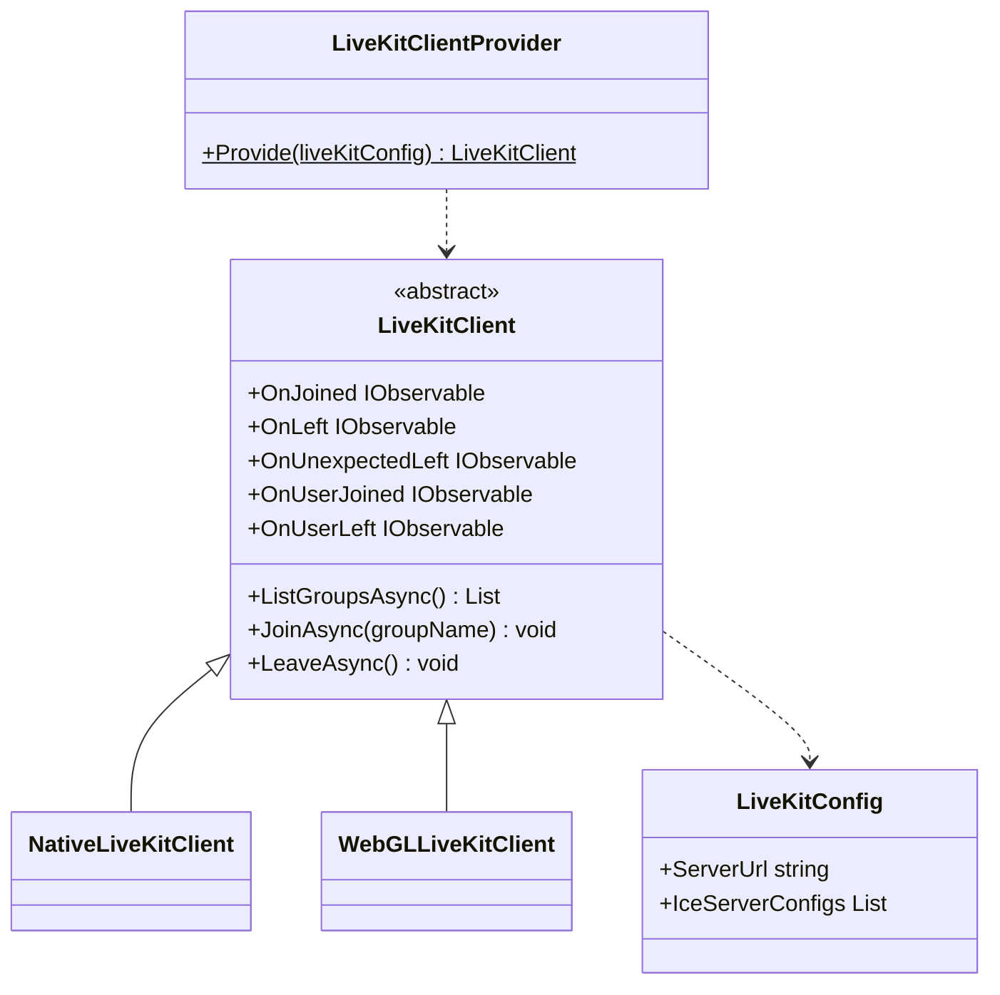
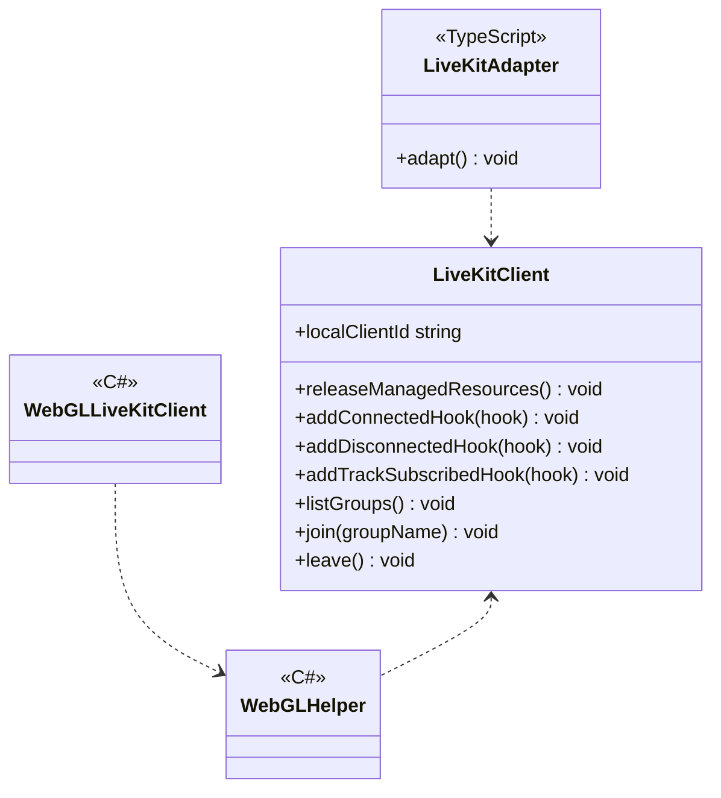
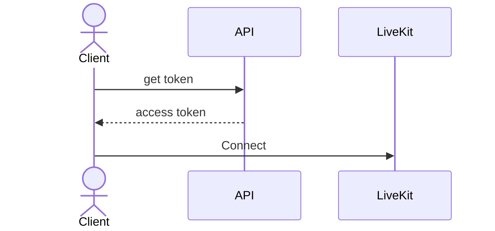

# SFU using LiveKit

## What for?

コストをできるだけ抑えてバーチャル空間等で大規模なコミュニケーションを取る手段としてSFU(Selective Forwarding Unit)があります。

[LiveKit](https://docs.livekit.io/realtime/)を活用すると比較的容易にSFUを実現できますが、SFUの接続確立は似通った処理になるので共通機能として提供します。
この共通機能を使うことで接続時とメディアストリームの処理を追加するのみでアプリケーション固有のSFUを実現できます。

このモジュールはNative(C#)とWebGL(JavaScript)向けのSFUのベース機能を提供します。

## Specification

- SFU接続を確立できます。
- SFUの状態をトリガーに処理を追加できます。
- Native(C#)のSFUにアプリケーション固有の処理を追加できます。
- WebGL(JavaScript)のSFUにアプリケーション固有の処理を追加できます。

## Architecture

### Unity



### JavaScript



LiveKitを使用したSFUでは、アプリケーションとAPIサーバー、LiveKitサーバーが協調してSFU接続を確立します。
このモジュールではSFU接続を確立するため、次の処理フローを想定した機能を提供しています。



## Installation

### Package

#### Unity
```text
https://github.com/extreal-dev/Extreal.Integration.SFU.LiveKit.git
```

#### npm
```text
@extreal-dev/extreal.integration.sfu.livekit
```

### Dependencies

このモジュールは次のパッケージを使います。

#### Unity

- [Extreal.Core.Logging](../core/logging.md)
- [Extreal.Core.Common](../core/common.md)
- [Extreal.Integration.Web.Common](../integration/web.common.md)
- [WebRTC](https://docs.unity3d.com/Packages/com.unity.webrtc@3.0/manual/index.html)
- [UniTask](https://github.com/Cysharp/UniTask)
- [UniRx](https://github.com/neuecc/UniRx)

#### npm

- [@extreal-dev/extreal.integration.web.common](https://www.npmjs.com/package/@extreal-dev/extreal.integration.web.common)

### Settings

#### LiveKitサーバ

LiveKitサーバは[Docker Compose](https://docs.docker.com/compose/)で提供しています。
[README](https://github.com/extreal-dev/Extreal.Integration.SFU.LiveKit/tree/main/LiveKitServer~)を参照してLiveKitサーバを準備してください。

#### APIサーバ

APIサーバは[Docker Compose](https://docs.docker.com/compose/)で提供しています。
[README](https://github.com/extreal-dev/Extreal.Integration.SFU.LiveKit/tree/main/APIServer~)を参照してAPIサーバを準備してください。

#### アプリケーション

LiveKitClientProviderを使ってLiveKitClientを作成します。
LiveKitClientの作成時にLiveKitサーバとAPIサーバのURLを指定します。

```csharp
public class ClientControlScope : LifetimeScope
{
    protected override void Configure(IContainerBuilder builder)
    {
        var liveKitConfig = new LiveKitConfig("http://localhost:3050", "http://localhost:3051");
        var liveKitClient = LiveKitClientProvider.Provide(liveKitConfig);
        builder.RegisterComponent(liveKitClient);
    }
}
```

WebGLで使う場合はさらにJavaScriptで初期化を行います。
LiveKitAdapterを作成してadapt関数を呼び出します。

```typescript
import { LiveKitAdapter } from "@extreal-dev/extreal.integration.sfu.livekit";

const liveKitAdapter = new LiveKitAdapter();
liveKitAdapter.adapt();
```

## Usage

### SFU接続を確立する {#sfu-liveKit-establish-connection}

このモジュールはSFU接続を確立する機能を提供します。
これらの機能はLiveKitClientが提供します。

まず名前を指定してグループに参加します。
まだ同じ名前のグループが存在しない場合は新たに作成され、存在する場合にはそのグループに参加します。

```csharp
await liveKitClient.JoinAsync("group name");
```

グループから退出する場合はLeaveAsyncメソッドを使用します。

```csharp
await liveKitClient.LeaveAsync();
```

現在存在しているグループの一覧を取得したい場合はListGroupsAsyncメソッドを使用します。

```csharp
var groups = await liveKitClient.ListGroupsAsync();
```

### SFUの状態をトリガーに処理を追加する

LiveKitClientは次のイベント通知を設けています。

- OnJoined
  - タイミング：グループに参加した直後
  - タイプ：IObservable
  - パラメータ：ユーザー自身のクライアントID
- OnLeft
  - タイミング：グループから退出した直後
  - タイプ：IObservable
  - パラメータ：なし
- OnUnexpectedLeft
  - タイミング：シグナリングサーバとの接続が切断された直後
  - タイプ：IObservable
  - パラメータ：切断された理由
- OnUserJoined
  - タイミング：他のユーザーと接続した直後
    - 接続するユーザー同士がお互いにイベントを受け取ります。そのため新たに接続するユーザーは、既に接続している全てのユーザー数のイベントを受け取ります。
  - タイプ：IObservable
  - パラメータ：接続したユーザーのクライアントID
- OnUserLeft
  - タイミング：他のユーザーと切断した直後
  - タイプ：IObservable
  - パラメータ：切断したユーザーのクライアントID

### Native(C#)のSFUにアプリケーション固有の処理を追加する

:::caution
Connected/Disconnected/TrackSubscribed/TrackUnsubscribedのHookでエラーが発生した場合でも、処理が継続されます。
:::

LiveKitClientは接続の開始時と終了時およびトラック購読の開始と終了時に処理を追加できるフックを設けています。

```csharp
liveKitClient.AddConnectedHook((participant) =>
{
    // do something
});

liveKitClient.AddDisconnectedHook((participant) =>
{
    // do something
});

liveKitClient.AddTrackSubscribedHook((track, participant) =>
{
    // do something
});

liveKitClient.AddTrackUnsubscribedHook((track, participant) =>
{
    // do something
});
```

これらのフックを使って参加者やトラックを操作しアプリケーション固有の機能をSFUに追加します。
＜サンプルが完成したら追記＞を追加する場合の実装例は次の通りです。

```csharp
// サンプルが完成したら追記
```

### WebGL(JavaScript)のSFUにアプリケーション固有の処理を追加する

:::caution
Connected/Disconnected/TrackSubscribed/TrackUnsubscribedのHookでエラーが発生した場合でも、処理が継続されます。
:::

WebGL(JavaScript)の場合はC#とJavaScriptの連携が必要になるため、Native(C#)に比べると少し大掛かりなものになります。
仕組みはNative(C#)と同じでフックを使ってアプリケーション固有の処理をSFUに追加します。

＜サンプルが完成したら追記＞を追加する場合の実装例は次の通りです。
LiveKitClientProviderという関数からLiveKitClientを取得する部分が大きく異なります。

```typescript
// サンプルが完成したら追記
```

LiveKitClientProviderは[Settings](#settings)で登場したLiveKitAdapterが提供します。
LiveKitAdapterは内部でLiveKitClientを保持し、C#とJavaScriptの相互作用を定義しています。

WebGLでSFUを行う場合はまずLiveKitAdapterを作成してadapt関数を呼び出します。
そしてLiveKitAdapterのgetLiveKitClient関数を使って先ほどのAudioStreamClientのようにアプリケーション固有の処理を追加します。

ここではアプリケーション固有の処理を呼び出すタイミングが重要になります。
C#のLiveKitClientより先にアプリケーションで追加した処理（今回であればAudioStreamClient）が初期化されないように注意してください。
C#のLiveKitClientはLiveKitClientProviderのProvideメソッドを呼び出したタイミングで初期化されます。

[Web.Common](./web.common.md)を使ってC#からの呼び出しタイミングを制御します。

```typescript
// サンプルが完成したら追記
```

C#の呼び出し側を作成します。
[Web.Common](./web.common.md)のWebGLHelperを使います。

```csharp
// サンプルが完成したら追記
```
