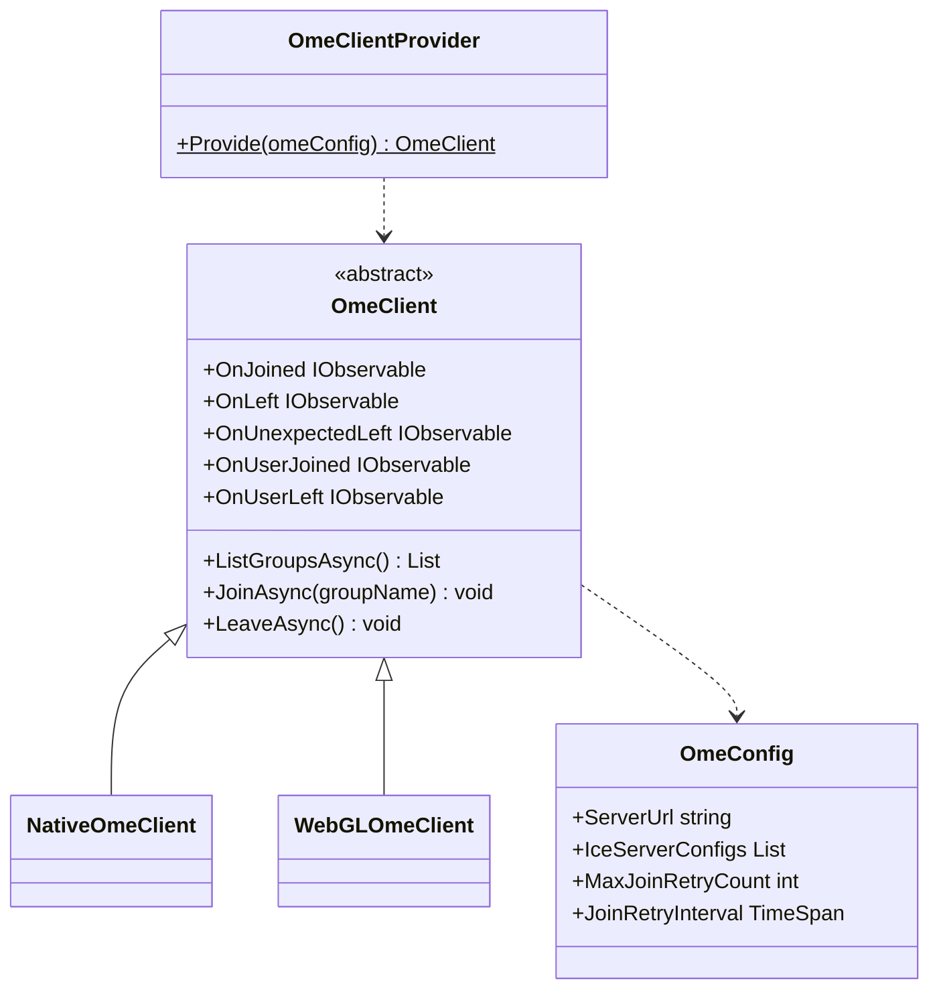
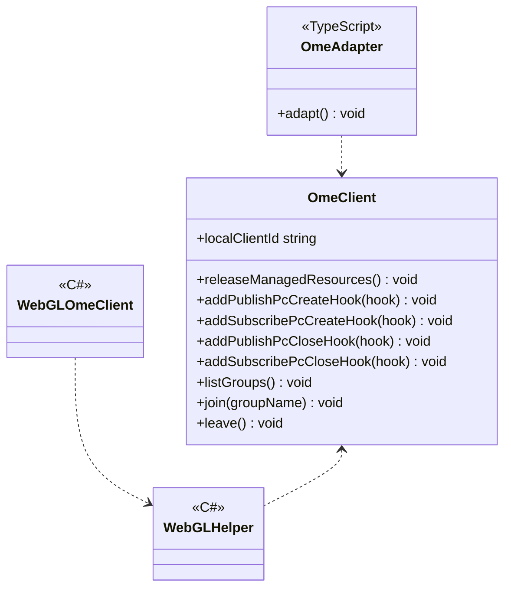
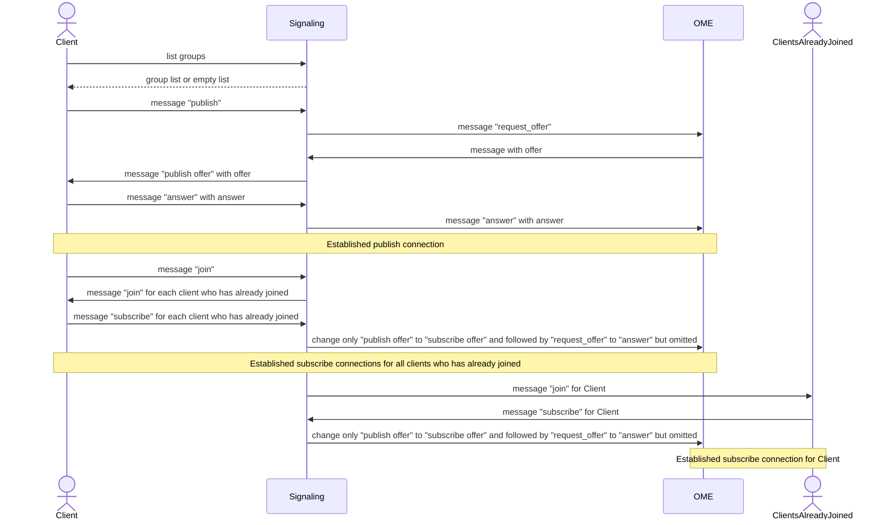

# SFU using OME

## What for?

コストをできるだけ抑えてバーチャル空間等で大規模なコミュニケーションを取る手段としてSFU(Selected Forwarding Unit)があります。

[OME(OvenMediaEngine)](https://airensoft.gitbook.io/ovenmediaengine/)を活用すると比較的容易にSFUを実現できますが、SFUの接続確立は似通った処理になるので共通機能として提供します。
この共通機能を使うことでメディアストリームの処理を追加するのみでアプリケーション固有のSFUを実現できます。

このモジュールはNative(C#)とWebGL(JavaScript)向けのSFUのベース機能を提供します。

## Specification

- SFU接続を確立できます。
- SFUの状態をトリガーに処理を追加できます。
- Native(C#)のSFUにアプリケーション固有の処理を追加できます。
- WebGL(JavaScript)のSFUにアプリケーション固有の処理を追加できます。

## Architecture

### Unity



### JavaScript



OMEを使用したSFUではアプリケーションとシグナリングサーバ、OMEサーバが協調してSFU接続を確立します。
このモジュールではSFU接続を確立するため、次の処理フローを想定した機能を提供しています。
publish connectionおよびsubscribe connectionはそれぞれWebRTCを用いた個別のP2P通信で接続しています。



## Installation

### Package

#### Unity
```text
https://github.com/extreal-dev/Extreal.Integration.SFU.OME.git
```

#### npm
```text
@extreal-dev/extreal.integration.sfu.ome
```

### Dependencies

このモジュールは次のパッケージを使います。

#### Unity

- [Extreal.Core.Logging](../core/logging.md)
- [Extreal.Core.Common](../core/common.md)
- [Extreal.Integration.Web.Common](../integration/web.common.md)
- [WebRTC](https://docs.unity3d.com/Packages/com.unity.webrtc@3.0/manual/index.html)
- [UniTask](https://github.com/Cysharp/UniTask)
- [UniRx](https://github.com/neuecc/UniRx)
- [NativeWebSocket](https://github.com/endel/NativeWebSocket)

#### npm

- [@extreal-dev/extreal.integration.web.common](https://www.npmjs.com/package/@extreal-dev/extreal.integration.web.common)

### Settings

#### OMEサーバ

OMEサーバは[Docker Compose](https://docs.docker.com/compose/)で提供しています。
[README](https://github.com/extreal-dev/Extreal.Integration.SFU.OME/tree/main/OMEServer~)を参照してOMEサーバを準備してください。

#### シグナリングサーバ

シグナリングサーバは[Docker Compose](https://docs.docker.com/compose/)で提供しています。
[README](https://github.com/extreal-dev/Extreal.Integration.SFU.OME/tree/main/SignalingServer~)を参照してシグナリングサーバを準備してください。

#### アプリケーション

OmeClientProviderを使ってOmeClientを作成します。
OmeClientの作成時にシグナリングサーバのURLを指定します。

```csharp
public class ClientControlScope : LifetimeScope
{
    protected override void Configure(IContainerBuilder builder)
    {
        var omeConfig = new OmeConfig("http://localhost:3040");
        var omeClient = OmeClientProvider.Provide(omeConfig);
        builder.RegisterComponent(omeClient);
    }
}
```

WebGLで使う場合はさらにJavaScriptで初期化を行います。
OmeAdapterを作成してadapt関数を呼び出します。

```typescript
import { OmeAdapter } from "@extreal-dev/extreal.integration.sfu.ome";

const omeAdapter = new OmeAdapter();
omeAdapter.adapt();
```

## Usage

### SFU接続を確立する {#sfu-ome-establish-connection}

このモジュールはSFU接続を確立する機能を提供します。
これらの機能はOmeClientが提供します。

まず名前を指定してグループに参加します。
まだ同じ名前のグループが存在しない場合は新たに作成され、存在する場合にはそのグループに参加します。

```csharp
await omeClient.JoinAsync("group name");
```

:::caution
グループに大人数が参加している場合、新しい人が参加するときに失敗する可能性があります。
参加に失敗したときには自動でリトライします。
このときのタイムアウト時間およびリトライ回数はVoiceChatConfigで指定します。

```csharp
var omeConfig = new OmeConfig("http://localhost:3040", maxJoinRetryCount: 5, joinRetryInterval: TimeSpan.FromSeconds(10));
var omeClient = OmeClientProvider.Provide(omeConfig);
```

リトライ処理の状況に応じて処理を実行したい場合は[イベント通知](#sfu-event)を使用してください。
:::

グループから退出する場合はLeaveAsyncメソッドを使用します。

```csharp
await omeClient.LeaveAsync();
```

現在存在しているグループの一覧を取得したい場合はListGroupsAsyncメソッドを使用します。

```csharp
var groups = await omeClient.ListGroupsAsync();
```

### SFUの状態をトリガーに処理を追加する {#sfu-event}

OmeClientは次のイベント通知を設けています。

- OnJoined
  - タイミング：グループに参加した直後
  - タイプ：IObservable
  - パラメータ：ユーザー自身のクライアントID
- OnLeft
  - タイミング：グループから退出した直後
  - タイプ：IObservable
  - パラメータ：なし
- OnUnexpectedLeft
  - タイミング：シグナリングサーバとの接続が切断された直後
  - タイプ：IObservable
  - パラメータ：切断された理由
- OnUserJoined
  - タイミング：他のユーザーと接続した直後
    - 接続するユーザー同士がお互いにイベントを受け取ります。そのため新たに接続するユーザーは、既に接続している全てのユーザー数のイベントを受け取ります。
  - タイプ：IObservable
  - パラメータ：接続したユーザーのクライアントID
- OnUserLeft
  - タイミング：他のユーザーと切断した直後
  - タイプ：IObservable
  - パラメータ：切断したユーザーのクライアントID
- OnJoinRetrying
  - タイミング：グループ参加をリトライする直前
  - タイプ：IObservable
  - パラメータ：リトライ回数
    - 1回目は`1`、2回目は`2`となります。
    - `1`はリトライ開始を意味します。
- OnJoinRetried
  - タイミング：グループ参加のリトライが終了した直後
  - タイプ：IObservable
  - パラメータ：リトライ結果
    - true：リトライが成功した場合
    - false：最終的にリトライが成功しなかった場合

### Native(C#)のSFUにアプリケーション固有の処理を追加する

:::caution
PeerConnectionのCreate/Close時にエラーが発生した場合でも、処理が継続されます。
:::

OmeClientはpublish connectionおよびsubscribe connectionの開始時と終了時に処理を追加できるフックを設けています。

```csharp
omeClient.AddPublishPcCreateHook((id, rtcPeerConnection) =>
{
    // do something
});

omeClient.AddSubscribePcCreateHook((id, rtcPeerConnection) =>
{
    // do something
});

omeClient.AddPublishPcCloseHook((id) =>
{
    // do something
});

omeClient.AddSubscribePcCloseHook((id) =>
{
    // do something
});
```

これらのフックを使ってメディアストリームを操作しアプリケーション固有の機能をSFUに追加します。
オーディオストリームを追加する場合の実装例は次の通りです。

```csharp
using System.Collections.Generic;
using System.Linq;
using Extreal.Core.Logging;
using Unity.WebRTC;
using UnityEngine;

namespace Extreal.Integration.SFU.OME.MVS.ClientControl
{
    public class NativeAudioStreamClient : AudioStreamClient
    {
        private static readonly ELogger Logger = LoggingManager.GetLogger(nameof(NativeAudioStreamClient));

        private (AudioSource inAudio, AudioStreamTrack inTrack, MediaStream inStream) inResource;
        private readonly Dictionary<string, (AudioSource outAudio, MediaStream outStream)> outResources = new Dictionary<string, (AudioSource, MediaStream)>();

        private readonly Transform audioSourceContainer;

        public NativeAudioStreamClient(NativeOmeClient omeClient)
        {
            audioSourceContainer = new GameObject(nameof(audioSourceContainer)).transform;
            Object.DontDestroyOnLoad(audioSourceContainer);

            omeClient.AddPublishPcCreateHook(CreatePublishPc);
            omeClient.AddSubscribePcCreateHook(CreateSubscribePc);
            omeClient.AddPublishPcCloseHook(ClosePublishPc);
            omeClient.AddSubscribePcCloseHook(CloseSubscribePc);
        }

        private void CreatePublishPc(string clientId, RTCPeerConnection pc)
        {
            inResource.inAudio = new GameObject("InAudio").AddComponent<AudioSource>();
            inResource.inAudio.transform.SetParent(audioSourceContainer);

            inResource.inTrack = new AudioStreamTrack(inResource.inAudio)
            {
                Loopback = false
            };
            inResource.inStream = new MediaStream();
            pc.AddTrack(inResource.inTrack, inResource.inStream);
        }

        private void CreateSubscribePc(string clientId, RTCPeerConnection pc) =>
            pc.OnTrack = (RTCTrackEvent e) =>
                {
                    if (Logger.IsDebug())
                    {
                        Logger.LogDebug($"OnTrack: Kind={e.Track.Kind}");
                    }
                };

        private void ClosePublishPc(string clientId)
        {
            if (inResource.inAudio != null)
            {
                inResource.inAudio.Stop();
                Object.Destroy(inResource.inAudio.gameObject);
            }
            if (inResource.inTrack != null)
            {
                inResource.inTrack.Dispose();
            }
            if (inResource.inStream != null)
            {
                inResource.inStream.GetTracks().ToList().ForEach(track => track.Stop());
                inResource.inStream.Dispose();
            }
            inResource = (default, default, default);
        }

        private void CloseSubscribePc(string clientId)
        {
        }

        protected override void DoReleaseManagedResources()
        {
            if (audioSourceContainer != null && audioSourceContainer.gameObject != null)
            {
                Object.Destroy(audioSourceContainer.gameObject);
            }
        }
    }
}
```

### WebGL(JavaScript)のSFUにアプリケーション固有の処理を追加する

:::caution
PeerConnectionのCreate/Close時にエラーが発生した場合でも、処理が継続されます。
:::

WebGL(JavaScript)の場合はC#とJavaScriptの連携が必要になるため、Native(C#)に比べると少し大掛かりなものになります。
仕組みはNative(C#)と同じでフックを使ってアプリケーション固有の処理をSFUに追加します。

オーディオストリームを追加する場合の実装例は次の通りです。
OmeClientProviderという関数からOmeClientを取得する部分が大きく異なります。

```typescript
import { OmeClientProvider } from "@extreal-dev/Extreal.Integration.SFU.OME";

class InResource {
    public inStream: MediaStream | undefined;
    public inTrack: MediaStreamTrack | undefined;
}

class AudioStreamClient {
    private readonly label: string = "sample";
    private readonly isDebug: boolean;
    private readonly getOmeClient: OmeClientProvider;

    private inResource: InResource | undefined;

    constructor(getOmeClient: OmeClientProvider) {
        this.isDebug = true;
        this.getOmeClient = getOmeClient;
        this.getOmeClient().addPublishPcCreateHook(this.createPublishPc);
        this.getOmeClient().addSubscribePcCreateHook(this.createSubscribePc);
        this.getOmeClient().addPublishPcCloseHook(this.closePublishPc);
        this.getOmeClient().addSubscribePcCloseHook(this.closeSubscribePc);
    }

    private createPublishPc = (clientId: string, pc: RTCPeerConnection) => {
        this.inResource = new InResource();

        const audioContext = new AudioContext();
        const gainNode = audioContext.createGain();
        gainNode.gain.setValueAtTime(0, audioContext.currentTime);

        const destination = audioContext.createMediaStreamDestination();
        gainNode.connect(destination);

        const inStream = destination.stream;
        const inTrack = inStream.getAudioTracks()[0];
        this.inResource.inStream = inStream;
        this.inResource.inTrack = inTrack;

        pc.addTrack(this.inResource.inTrack, this.inResource.inStream);
    };

    private createSubscribePc = (clientId: string, pc: RTCPeerConnection) => {
        pc.addEventListener("track", (event) => {
            if (this.isDebug) {
                console.log(`OnTrack: Kind=${event.track.kind}`);
            }
        });
    };

    private closePublishPc = (clientId: string) => {
        this.inResource = undefined;
    };

    private closeSubscribePc = (clientId: string) => {};
}

export { AudioStreamClient };
```

OmeClientProviderは[Settings](#settings)で登場したOmeAdapterが提供します。
OmeAdapterは内部でOmeClientを保持し、C#とJavaScriptの相互作用を定義しています。

WebGLでSFUを行う場合はまずOmeAdapterを作成してadapt関数を呼び出します。
そしてOmeAdapterのgetOmeClient関数を使って先ほどのAudioStreamClientのようにアプリケーション固有の処理を追加します。

ここではアプリケーション固有の処理を呼び出すタイミングが重要になります。
C#のOmeClientより先にアプリケーションで追加した処理（今回であればAudioStreamClient）が初期化されないように注意してください。
C#のOmeClientはOmeClientProviderのProvideメソッドを呼び出したタイミングで初期化されます。

[Web.Common](./web.common.md)を使ってC#からの呼び出しタイミングを制御します。

```typescript
import { addAction } from "@extreal-dev/extreal.integration.web.common";
import { OmeAdapter } from "@extreal-dev/Extreal.Integration.SFU.OME";
import { AudioStreamClient } from "./AudioStreamClient";
import { DummyClient } from "./DummyClient";


const omeAdapter = new OmeAdapter();
omeAdapter.adapt();

let audioStreamClient: AudioStreamClient;
addAction("start", () => audioStreamClient = new AudioStreamClient(omeAdapter.getOmeClient));
addAction("dummyhook", () => DummyClient.dummyHook(omeAdapter.getOmeClient));
```

C#の呼び出し側を作成します。
[Web.Common](./web.common.md)のWebGLHelperを使います。

```csharp
using Extreal.Integration.Web.Common;

namespace Extreal.Integration.SFU.OME.MVS.ClientControl
{
    public class WebGLAudioStreamClient : AudioStreamClient
    {
        public WebGLAudioStreamClient() => WebGLHelper.CallAction("start");
    }
}
```
