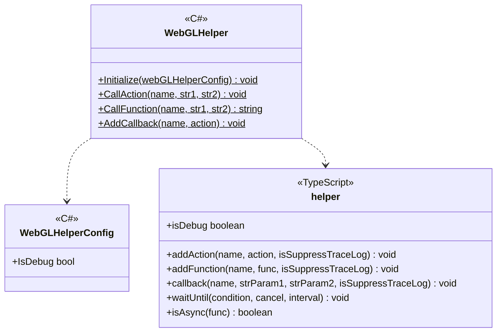
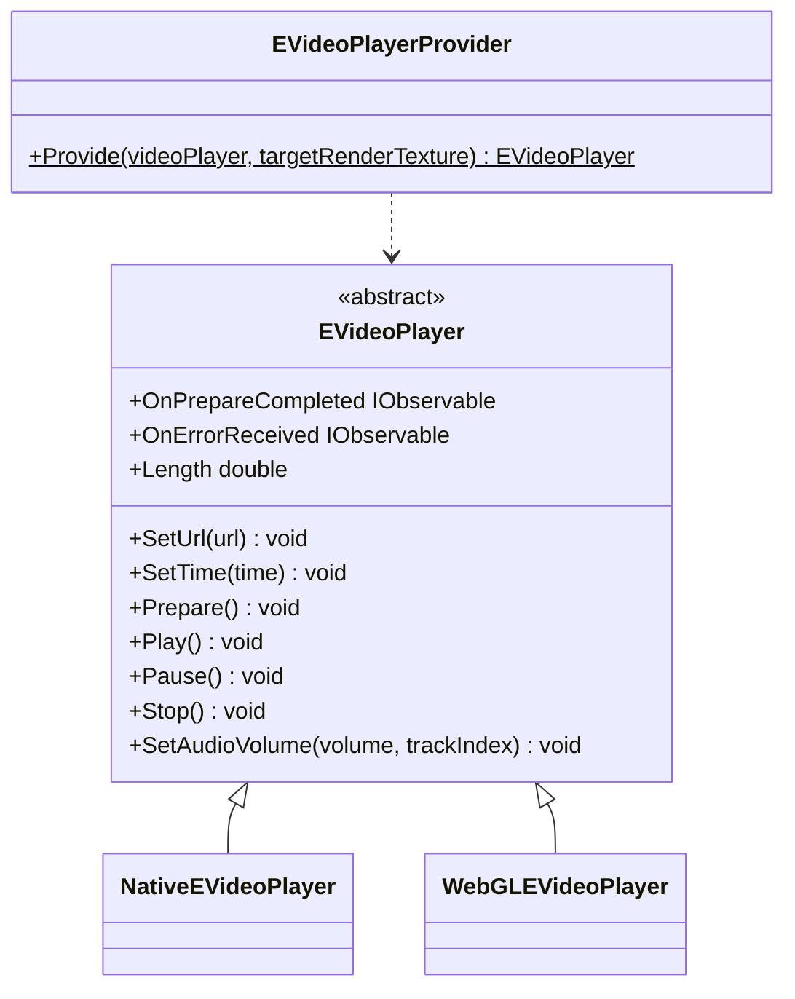
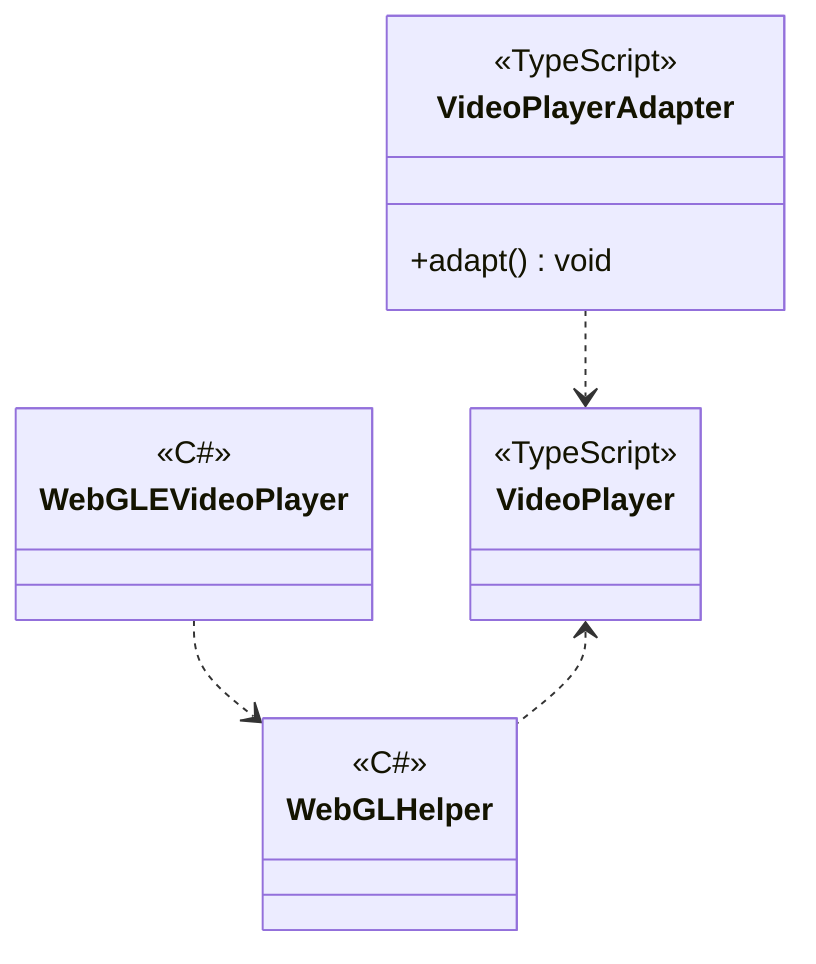

---
sidebar_position: 5
---

# Common for Web

## What for?

UnityではWebGLプラットフォームを使用してブラウザ向けのアプリケーションを作成できます。
ブラウザ向けのアプリケーションではUnity(C#)とブラウザ(JavaScript)間の処理の呼び出しやデータの受け渡しが必要になります。

このモジュールではUnityで提供されているC#とJavaScript連携の少し複雑な仕組みを隠蔽し、C#とJavaScriptの相互作用を簡単に行えるようにWebGLヘルパーを提供します。

## Specification

- C#からJavaScriptを呼び出せます。
- JavaScriptからC#にコールバックできます。
- JavaScriptの呼び出し状況のトレースログを抑制できます。
- プラットフォームに応じたビデオ再生ができます。

## Architecture



### VideoPlayer

#### Unity



#### JavaScript



## Installation

### Package

#### Unity
```text
https://github.com/extreal-dev/Extreal.Integration.Web.Common.git
```

#### npm
```text
@extreal-dev/extreal.integration.web.common
```

### Dependencies

このモジュールは次のパッケージを使います。

#### Unity
- [Extreal.Core.Logging](../core/logging.md)
- [Extreal.Core.Common](../core/common.md)
- [UniTask](https://github.com/Cysharp/UniTask)
- [UniRx](https://github.com/neuecc/UniRx)
- [System.Text.Json](https://learn.microsoft.com/ja-jp/dotnet/api/system.text.json)

#### npm
- 依存するものはありません。

### Settings {#settings}

WebGLヘルパーの初期化が必要です。
アプリケーションの起動時にWebGLヘルパーの初期化を行ってください。

```csharp
WebGLHelper.Initialize();
```

ブラウザ側でJavaScriptの呼び出し状況をログに出力できます。
デフォルトはログを出力しないので、ログを出力したい場合はWebGLHelperConfigで指定します。

```csharp
WebGLHelper.Initialize(new WebGLHelperConfig { IsDebug = true });
```

#### VideoPlayer

EVideoPlayerProviderを使ってEVideoPlayerを作成します。
WebGLで使う場合はtargetRenderTextureに使用したいRenderTextureを設定します。
WebGL以外で使う場合はvideoPlayerに使用したいVideoPlayerを設定します。

```csharp
var eVideoPlayer = EVideoPlayerProvider.Provide(videoPlayer, renderTexture);
```

:::info
TargetRenderTextureとVideoPlayerをどちらも設定するとプラットフォームを切り替えるだけでWebGL向けの機能もWebGL以外の機能も使用できます。
:::

WebGLで使う場合はさらにJavaScriptで初期化を行います。
VideoPlayerAdapterを作成してadapt関数を呼び出します。

```typescript
import { VideoPlayerAdapter } from "@extreal-dev/extreal.integration.web.common";

const videoPlayerAdapter = new VideoPlayerAdapter();
videoPlayerAdapter.adapt();
```

## Usage

### C#からJavaScriptを呼び出す {#call-javascript-from-csharp}

C#からJavaScriptの呼び出しは次のシグネチャのみ提供しています。

- 戻り値なし関数
  - 引数：文字列2つ
  - 戻り値：なし
  - 例：
    ```typescript
    const action = (param1: string, param2: string): void => {
        // do something
    }
    ```
- 戻り値あり関数
  - 引数：文字列2つ
  - 戻り値：文字列
  - 例：
    ```typescript
    const func = (param1: string, param2: string): string => {
        return "do something";
    }
    ```

:::info
引数と戻り値は文字列にしているので、複雑なデータ構造を扱いたい場合はJSONを使用してください。
:::

C#側はWebGLHelperのCallAction/CallFunctionを使ってJavaScriptを呼び出します。
Actionが戻り値なし、Functionが戻り値ありの関数に対応します。
C#とJavaScriptの対応付けは文字列のターゲット名で行います。

```csharp
public class Sample : DisposableBase
{
    public void DoAction(string param1, string param2)
        => WebGLHelper.CallAction("DoAction", param1, param2);

    public string DoFunction(string param1, string param2)
        => WebGLHelper.CallFunction("DoFunction", param1, param2);
}
```

JavaScript側はaddAction/addFunctionを使います。

```typescript
import { addAction, addFunction } from "@extreal-dev/extreal.integration.web.common";

addAction("DoAction", (str1, str2) => {
    // do something
});

addFunction("DoFunction", (str1, str2) => {
    return "do something";
});
```

### JavaScriptからC#にコールバックする {#callback-from-javascript-to-csharp}

JavaScriptからC#へのコールバックは次のシグネチャのみ提供しています。

- Action<string, string>

:::info
引数は文字列にしているので、複雑なデータ構造を扱いたい場合はJSONを使用してください。
:::

JavaScript側はcallbackを使います。
JavaScriptとC#の対応付けは文字列のターゲット名で行います。

```typescript
import { callback } from "@extreal-dev/extreal.integration.web.common";

callback("HandleOnCallback", "param1", "param2");
```

C#側はWebGLHelperのAddCallbackを使います。
この実装例ではコールバックを受けてイベント通知を送信しています。

```csharp
public class Sample : DisposableBase
{
    public IObservable<string> OnCallback => onCallback;
    private readonly Subject<string> onCallback = new Subject<string>();

    private static Sample instance;
    public Sample()
    {
        instance = this;
        WebGLHelper.AddCallback(nameof(HandleOnCallback), HandleOnCallback);
    }

    [MonoPInvokeCallback(typeof(Action<string, string>))]
    private static void HandleOnCallback(string str1, string str2)
        => instance.onCallback.OnNext($"received {str1} {str2} in callback");

    protected override void ReleaseManagedResources() => onCallback.Dispose();
}
```

### JavaScriptの呼び出し状況のトレースログを抑制する

[WebGLヘルパーの初期化](#settings)でログを出力するように指定した場合、すべての[C#からのJavaScriptの呼び出し時](#call-javascript-from-csharp)と[JavaScriptからのC#へのコールバック時](#callback-from-javascript-to-csharp)にログが出力されます。

高頻度で呼ばれる関数やコールバックが存在する場合など、このログ出力を抑制したいときがあります。
そのような場合は関数登録時またはコールバック時にこのログ出力を抑制することができます。
addAction/addFunction/callbackのisSuppressTraceLogをtrueにすることで、その関数呼び出しまたはコールバックのログ出力が抑制されます。

```typescript
import { addAction, addFunction, callback } from "@extreal-dev/extreal.integration.web.common";

addAction("DoTraceLogSuppressedAction",
    (str1, str2) => {
        // do something
    },
    true);  // isSuppressTraceLog

addFunction(
    "DoTraceLogSuppressedFunction",
    (str1, str2) => {
        return "do something";
    },
    true);  // isSuppressTraceLog

callback(
    "DoTraceLogSuppressedCallback",
    "param1",
    "param2",
    true);  // isSuppressTraceLog
```

### プラットフォームに応じたビデオ再生を行う

WebGLでのビデオ再生をJavaScriptに委譲する機能はEVideoPlayerが提供します。

:::info
WebGL以外でビデオ再生する場合も同様のAPIを使用できます。
:::

使用したい動画が存在するURLを設定して動画再生の準備をします。

```csharp
videoPlayer.SetUrl("URL");
videoPlayer.Prepare();
```

動画再生をする準備ができたらOnPrepareCompletedイベントが発火します。

```csharp
videoPlayer.OnPrepareCompleted
    .Subscribe(_ =>
    {
        // Handle processing when preparation is completed here.
    })
    .AddTo(disposables);
```

動画を再生/一時停止/停止したい場合はそれぞれPlay/Pause/Stopメソッドを使用します。

```csharp
videoPlayer.Play();
videoPlayer.Pause();
videoPlayer.Stop();
```

動画の準備時や再生時にエラーが生じた場合はOnErrorReceivedイベントが発火します。

```csharp
videoPlayer.OnErrorReceived
    .Subscribe(appState.Notify)
    .AddTo(disposables);
```

動画の音量を調節したい場合はSetAudioVolumeメソッドを使用します。
引数のvolumeには0～1のfloat値を入力してください。

```csharp
videoPlayer.SetAudioVolume(volume);
```

動画の長さを取得したい場合はLengthプロパティを使用します。
戻り値の単位は秒です。

```csharp
var videoLength = videoPlayer.Length;
```

動画の再生位置を指定したい場合はSetTimeメソッドを使用します。
引数の単位は秒です。

```csharp
videoPlayer.SetTime(time);
```
