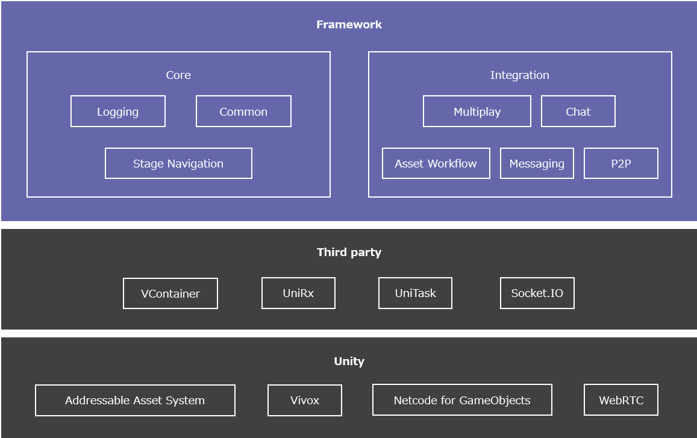
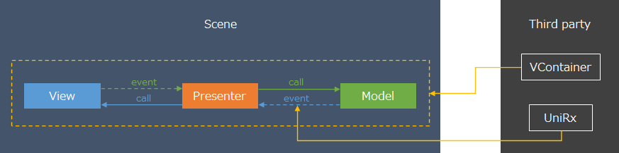

# Introduction

ここではExtrealのグランドデザインを説明します。
Extrealの全コンテンツはこのグランドデザインをベースに作成しています。

## Contents

Extrealは次のコンテンツを提供します。

- Framework
  - UnityベースのXRフレームワーク。
  - Unityパッケージで提供します。
- Sample Application
  - Frameworkを使ったサンプルアプリケーション。
  - Unityプロジェクトで提供します。
- Learning
  - Frameworkの使い方を学習する教材。
  - このガイドに含まれています。
- Guide
  - Extrealの活用方法を案内するガイド。
  - このドキュメントがガイドです。

## Architecture

FrameworkのアーキテクチャとFrameworkが想定するアプリケーションアーキテクチャを説明します。
FrameworkやSample Applicationはこのアーキテクチャを前提に作成しています。

### Framework



FrameworkはUnityやサードパーティのパッケージを活用して機能を実現します。
Frameworkは機能を次のカテゴリに分類しています。

- Core
  - アプリケーションのベースとなるコア機能を提供します。
  - ログ出力や画面遷移のようにどのようなアプリケーションでも使用する機能がCoreに含まれます。
- Integration
  - アプリケーションの要件に合わせてアプリケーションに統合する機能を提供します。
  - チャットやマルチプレイのようにアプリケーションの要件に応じて使用する機能がIntegrationに含まれます。

CoreとIntegrationはさらに機能単位でモジュールに分割しています。
Frameworkはモジュールの集まりです。
Frameworkは次の機能を提供しています。

- Core
  - [Logging](./core/logging.md)
  - [Stage Navigation](./core/stage-navigation.md)
  - [Common](./core/common.md)
- Integration
  - [Chat using Vivox](./integration/chat.vivox.md)
  - [Asset Workflow using Addressables](./integration/asset-workflow.addressables.md)
  - [Common for Web](./integration/web.common.md)
  - [P2P using WebRTC](./integration/p2p.webrtc.md)
  - [Chat using WebRTC](./integration/chat.webrtc.md)
  - [Messaging for Common](./integration/messaging.common.md)
  - Messaging using Redis
  - [Multiplay](./img/fw-arch.png)
    - [Multiplay using Netcode for GameObjects](./integration/multiplay.ngo.md)
    - [Multiplay for Common](./integration/messaging.redis.md)
    - Multiplay using Messaging


全てのモジュールはログ出力を統一するためLoggingに依存しています。

### Application

ゲームやXRのアプリケーションはGUIだけでなく走り回る空間なども含まれるため画面と空間で構成します。
Extrealではこれら画面と空間をステージと呼ぶことにします。
例えば、バーチャル空間に集まって何かするようなアプリケーションであれば、タイトル画面→アバター選択画面→空間選択画面→バーチャル空間といったステージ構成になります。
入力制御のように複数のステージに共通する機能やボイスチャットのように特定のステージでのみ使う機能が存在します。
こういった機能を自由に組み合わせてステージを作れると機能の再利用性が高まりメンテナンスしやすくなります。

Unityでは画面や空間を作成する単位としてシーンを提供しています。
1つのシーンで1つの画面や空間を作成することが多いのですが、Extrealでは機能を自由に組み合わせてステージを作れるようにするため、1つのシーンで1つの機能や画面を作成し複数のシーンを組み合わせてステージを作ります。


複数のシーンを組み合わせたステージの作成やステージの切り替えにはFrameworkが提供する[Stage Navigation](./core/stage-navigation.md)を使います。

シーンで作る機能や画面はMV(R)Pパターンを使って作ります。
MV(R)Pパターンについては[【Unity】Model-View-(Reactive)Presenterパターンとは何なのか](https://qiita.com/toRisouP/items/5365936fc14c7e7eabf9)を参照ください。



MV(R)Pパターンに必要なイベント通知にはサードパーティの[UniRx](https://github.com/neuecc/UniRx)を使います。
MVPの各オブジェクトの生成や参照関係の構築、各オブジェクトのライフサイクルイベントの実行制御にはサードパーティの[VContainer](https://vcontainer.hadashikick.jp/)を使います。

例えば、テキストチャット機能の実現イメージは次の通りです。


アプリケーションの要件に合わせてUIとMVPを作成し、ModelからFrameworkが提供する機能を使ってテキストチャットを実現します。

## License

[Apache License 2.0](https://www.apache.org/licenses/LICENSE-2.0)

Extrealが提供しているコンテンツは無償でご利用いただけます。
外部のプロダクト、サービス、OSS等は提供元のライセンスを確認ください。

## Backward compatibility

ExtrealはUnityやサードパーティのパッケージを活用して機能を実現しています。
私たちがコントロールできない要素がExtrealには多いため後方互換の維持を約束できません。
できるだけExtrealの後方互換を維持するように努めますが後方互換を維持できないケースが発生する可能性があります。
後方互換を維持できない場合は[Release](./category/release)でアップグレード方法をガイドします。

## Versioning

ExtrealはFrameworkに含まれるモジュールの特定バージョンの組み合わせに対してバージョンが決まります。
各モジュールはモジュール毎にバージョンが決まります。

Extrealバージョンとモジュールバージョンは次のバージョニングを使用します。

- <メジャーバージョン>.<マイナーバージョン>.<パッチバージョン>
- メジャーバージョン
  - アーキテクチャ変更など大規模な変更をした場合に更新します。
- マイナーバージョン
  - 機能追加・変更・削除、不具合修正をした場合に更新します。
- パッチバージョン
  - 緊急性の高い不具合修正をした場合に更新します。

Extrealバージョンとモジュールバージョンの例を示します。

```text
--- Initial release ---
Extreal 1.0.0
Extreal.Core.Logging 1.0.0
Extreal.Core.StageNavigation 1.0.0

--- Bug fixed only ---
Extreal 1.0.1
Extreal.Core.Logging 1.0.0
Extreal.Core.StageNavigation 1.0.1 -> bug fixed

--- Added feature ---
Extreal 1.1.0
Extreal.Core.Logging 1.1.0 -> added feature
Extreal.Core.StageNavigation 1.0.1
```

Extrealバージョンとモジュールバージョンの対応は[Release](./category/release)を参照ください。

## Unity version

ここではExtrealがUnityのバージョンにどのように追随していくのかについて説明します。
Extrealの開発やテストで使用するUnityはLTS([Long Term Support](https://unity3d.com/unity/qa/lts-releases))ストリームの最新バージョンを使う方針です。
Extrealが使っているサードパーティのライブラリの対応状況等を確認し、Unityバージョンを上げるタイミングをExtrealチームで判断します。

## Installation

FrameworkはUnityパッケージで提供します。
Package Managerを使いGit URLからインストールしてください。

[Installing from a Git URL](https://docs.unity3d.com/2021.3/Documentation/Manual/upm-ui-giturl.html)

Git URLは各機能のページを参照ください。

- [Core](./category/core)
- [Integration](./category/integration)

## Feedback or Contribution

フィードバックはGitHubのIssue、コントリビューションはGitHubのPull Request(PR)にお願いします。

- [GitHub](https://github.com/extreal-dev)

Frameworkの各モジュールのリポジトリはUnityパッケージの構成になっているため、Unityプロジェクトにインストールして開発する必要があります。
開発環境を統一する目的でFrameworkのモジュール開発用のリポジトリを用意しています。
Frameworkのモジュールを開発する場合は次のリポジトリを使用してください。
開発方法はREADMEを参照してください。

- AssetWorkflow.Addressables以外のモジュール
  - [Extreal.Dev](https://github.com/extreal-dev/Extreal.Dev)
- AssetWorkflow.Addressablesモジュール
  - [Extreal.Integration.AssetWorkflow.Addressables.Test](https://github.com/extreal-dev/Extreal.Integration.AssetWorkflow.Addressables.Test)

## About Extreal

Extrealという名前は元々「仮想から現実へ（XR to Real）」というフレーズから名付けています。

```text
XR to Real　→　XRtoReal　→　XtoReal
```

さらに「Xto」を「拡げる」という意味の接頭辞「Ext」に変形して今のExtrealとなりました。

```text
XtoReal →　Extreal
```

誰もが仮想を活用して現実の課題を解決する、そんな未来を私たちはExtrealで目指しています。
