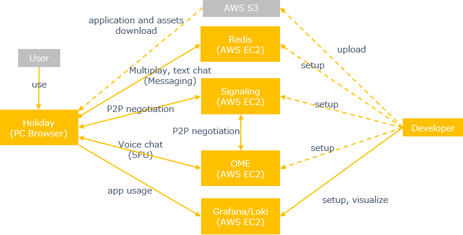
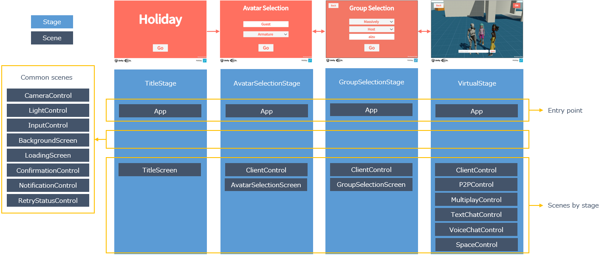

# Architecture

## System Structure

ユーザは各ストアやAWS S3からダウンロードしてアプリケーションを使用します。
アプリケーションに3Dモデルなどのアセットやサーバーへの接続情報を含めて配布します。
アプリケーションから直接処理に必要なSaaSやサーバに接続します。

:::info
サンプルアプリケーションのため実際に各ストアやAWS S3に配置していません。
今後、各ストアの審査対応などノウハウを公開していく予定です。
:::

## Application Structure

HolidayのアプリケーションアーキテクチャはExtrealが想定している[アーキテクチャ](../intro.md#application)を採用します。
Holidayのステージとシーンは次の通りです。

Appシーンは個別の機能提供でなく、特別なシーンなのでここで説明します。

Appシーンがアプリケーションのエントリーポイントになります。
Appシーンではアプリケーションの初期化処理、ステージ構成やアプリケーション状態の提供など、アプリケーション全体に関わる処理を行います。
