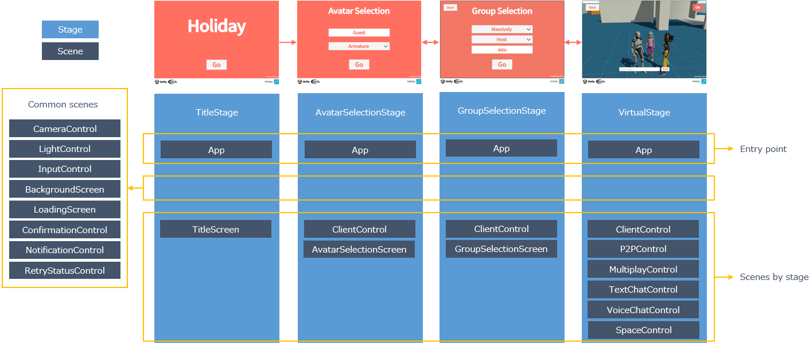

# Development Guide

## Project

### Directory structure

#### Overview

- Assets
  - AddressableAssetsData
    - Addressablesを使うための設定
  - Analyzer
    - [Code Cracker](https://github.com/code-cracker/code-cracker)を使うための設定
  - Google Fonts
    - [Noto Sans Japanese](https://fonts.google.com/noto/specimen/Noto+Sans+JP)から作成したUnityのフォントアセット
  - Holiday
    - Holidayのアプリケーションで作成するアセット
  - Holiday.PerformanceTest
    - Holidayのパフォーマンステスト向けの資材
  - Mixamo
    - [Mixamo](https://www.mixamo.com/)から作成したUnityのキャラクタモデル
  - StarterAssets
    - [Starter Assets - Third Person Character Controller](https://assetstore.unity.com/packages/essentials/starter-assets-third-person-character-controller-196526?locale=ja-JP)のインストール先
  - TextMesh Pro
    - TextMesh Proを使うための設定
  - URP
    - Universal Render Pipelineを使うための設定
  - WebGLScripts
    - Holidayのアプリケーションで作成するWebGL向けのアセット
  - WebGLTemplates
    - Holidayのアプリケーションで使用するWebGL向けのテンプレート
- Packages
  - アプリケーション開発で使用するUnityパッケージ
- Servers
  - Holidayのアプリケーションで使用するサーバーのスクリプト
- WebGLBuild
  - 開発時にWebGL向けのHolidayのアプリケーションを配信するスクリプト

自分達で作成したアセットの格納場所としてHolidayから始まる名前を付けたディレクトリを設けています。
サードパーティを元に作成したアセットと自分達で作成したアセットを見分けやすくするためです。
Holiday以外のディレクトリはサードパーティやUnityの機能利用時に作成された設定になります。
アプリケーション用のディレクトリを設けたのでそれ以外のディレクトリは作成された状態、またはサードバーティと分かる名前を付けて配置しています。

#### Holiday

- App
  - アプリケーションのエントリーポイント
  - アプリケーション全体の設定/状態
  - AppUsage
    - アプリケーションの利用状況可視化向けの処理
  - AssetWorkflow
    - アセットのダウンロードに共通する処理
  - Avatars
    - アバターのプレハブ
  - Config
    - アプリケーションの設定
  - Group
    - グループチャットに共通する処理
  - Stages
    - ステージに共通する処理
- Controls
  - XxxControl
    - Controlシーン。シーン毎のアセットをまとめて配置
  - Common
    - Controlシーン間で共通する処理
- Screens
  - XxxScreen
    - Screenシーン。シーン毎のアセットをまとめて配置
  - Common
    - Screenシーン間で共通するUIや処理
- Spaces
  - XxxSpace
    - Spaceシーン。シーン毎のアセットをまとめて配置
  - Common
    - Spaceシーン間で共通するUIや処理

Unityのアプリケーションではアセットの種類毎にディレクトリを分けることが多いですが、1つの機能を構成するアセットが散らばり探すのが大変なので、Holidayではシーン単位でディレクトリを分けてシーン毎のアセットをまとめて配置します。

ディレクトリとシーンの対応が分かるようにアプリケーション構成を再掲します。



### Static analysis

ルート直下にある`.editorconfig`でAnalyzerの設定をしています。
[EditorConfig](https://editorconfig.org/)に対応したエディタを使ってスクリプトを編集し、Analyzerの問題がないことを確認してからプッシュしてください。

### Assembly Definition(AD)

アプリケーション単位でADを1つ作成します。

- アプリケーションで使用するサードパーティのパッケージを制限するため
- 自動テストの導入をしやすくするため
- [Code Cracker](https://github.com/code-cracker/code-cracker)を適用するため
  - Code Crackerを適用するにはチェック対象のADにCode Crackerを含める必要があります。

### File settings

意図しない変更差分が出ないようにスクリプトや設定ファイルは次の設定にしてください。

- エンコーディング: `UTF-8のBOM付き`
- 改行コード: `LF`

:::info
Visual Studioで`UTF-8のBOM無し`を設定できないため`UTF-8のBOM付き`としています。
:::

## Application

### Entry point

アプリケーションのエントリーポイントは次のシーンです。

```text
Assets/Holiday/App/App
```

### Initialization

アプリケーションの初期化処理は次のスクリプトのInitializeAppで実施しています。
Awakeの先頭でInitializeAppを呼び出しています。

```text
Assets/Holiday/App/AppScope
```

フレームレートの設定や[Loggingの設定](../core/logging.md#settings)を行っています。

### Stage configuration

ステージ構成は[Stage Navigationの設定](../core/stage-navigation.md#settings)にある通り、3つのタイプを作成しています。
ステージやシーンの作成時に変更してください。

```text
Assets/Holiday/App/Config/StageName
```

```text
Assets/Holiday/App/Config/SceneName
```

```text
Assets/Holiday/App/Config/StageConfig
```

### Application state

アプリケーション状態を保持するクラスを設けています。
プレイヤーの名前や選択したアバター、シーンをまたがる情報を保持するのに使います。

```text
Assets/Holiday/App/AppState
```

### Utility class

アプリケーション全体に共通する処理はユーティリティクラスとして提供しています。

```text
Assets/Holiday/App/AppUtils
```

## Objects

各シーンで使うオブジェクトの管理には[VContainer](https://vcontainer.hadashikick.jp/)を使います。

### DI

DIについては[What is DI ?](https://vcontainer.hadashikick.jp/about/what-is-di)を参照してください。

DIにはいくつかやり方があります。
VContainerが推奨する方法を採用します。

- C# Type
  - [Constructor Injection](https://vcontainer.hadashikick.jp/resolving/constructor-injection)
- MonoBehaviour
  - [Property/Field Injection](https://vcontainer.hadashikick.jp/resolving/property-field-injection)

VContainerの推奨理由については[Constructor Injection](https://vcontainer.hadashikick.jp/resolving/constructor-injection)のRECOMMENDATIONを参照してください。

VContainerへの登録は次のRegisterを使います。

```csharp title="C# Type"
builder.Register<AppState>(Lifetime.Singleton);
```

```csharp title="MonoBehaviour"
builder.RegisterComponent(networkManager);
```

MonoBehaviourのようなインスタンスの登録はRegisterInstanceとRegisterComponentを使えますがRegisterComponentを使ってください。
RegisterInstanceは引数のオブジェクトに対してDIが行われないため、DIを使いたいオブジェクトを誤って指定した際に問題解決まで時間を要する可能性があります。

```csharp title="Entry point"
builder.RegisterEntryPoint<AppPresenter>();
```

### Scope

[VContainer](https://vcontainer.hadashikick.jp/)ではLifetimeScopeを継承したクラスをアタッチしたオブジェクトをシーンに置き、これが1つのスコープ（1つのコンテナ）を表現します。
スコープに親のスコープを指定することでオブジェクトの検索を親まで広げることができます。
Holidayでは親のスコープ指定を使って、共通するシーンのオブジェクトを各シーンで使えるようにします。

Holidayの共通するシーンは次の通りです。
- Appシーン
- ClientControlシーン
  - Vivoxクライアント、NGOクライアントを提供します。

Holidayのスコープ階層は下記になります。

```text
Appシーン
↑
各シーン（Controlシーン、Screenシーン、Spaceシーン）

または

Appシーン
↑
ClientControlシーン
↑
各シーン（Controlシーン、Screenシーン、Spaceシーン）
```

各シーンのスコープの親には共通するシーンのスコープを指定してください。


### Dispose pattern

Disposeを行うクラスには[Dispose Pattern](https://learn.microsoft.com/en-us/dotnet/standard/garbage-collection/implementing-dispose)の実装が推奨されています。
Dispose Patternの実装を共通化するため、個別にDispose Patternを実装せず[Common](../core/common.md#core-common-dp)が提供するクラスを使用してください。

## Assets

Holidayではコンテンツを外部化し必要なコンテンツをダウンロードしてアプリケーションを使えるようにします。
コンテンツのみ変更できるようにする、アプリケーションの容量を減らしてダウンロード時間を短くするためです。

Holidayではアセット管理に[AssetWorkflow.Addressables](../integration/asset-workflow.addressables.md)を使用します。

アセットグループは次の通りです。
アセットの初回使用時のみダウンロードされ、以降はキャッシュが使われます。

- AppCommon
  - アプリケーション全体に共通するアセット
  - メッセージ/チャット/マルチプレイの設定やアバターの3Dモデルなど
  - ダウンロードタイミング
    - アバター選択ステージに遷移する前
- VirtualSpace
  - VirtualSpaceステージ用のアセット
  - バーチャル空間の3Dモデルなど
  - ダウンロードタイミング
    - VirtualSpaceステージに遷移する前
- Duplicate Asset Isolation
  - 複数のアセットグループに重複するアセット
  - ダウンロードタイミング
    - AppCommonと同じ

リモートのベースURLは次のルールとし、アプリケーションのバージョン毎にアセットを配置します。

```
Remote base URL：
  https://<host>/<version>/<target>
Example：
  https://<host>/1.0.0/Android
  https://<host>/1.0.0/iOS
  https://<host>/1.0.0/StandaloneWindows64
  https://<host>/1.1.0/Android
  https://<host>/1.1.0/iOS
  https://<host>/1.1.0/StandaloneWindows64
```

開発時は`Addressables Groups`の設定で`Play Mode Script`を`Use Asset Database`に指定するとダウンロードせずにプレイできます。

## Scenes

### Design policy

シーンの設計方針を示します。
各シーンはこの設計方針に合わせて作成してください。
各シーンの作り方を統一することでメンテナンスしやすいアプリケーションを目指します。

- シーンはMV(R)Pパターンで作成します。
- アプリケーション全体で使用するモデルはAppシーンのスコープで管理します。
  - StageNavigator、AppState、データアクセスのためのリポジトリ、NetworkManagerなど
- シーンをまたがる情報のやりとりは[AppState](#application-state)を使います。
- 各シーンでしか使わないモデルは各シーンのスコープで管理します。
  - MultiplayRoom、TextChatChannelなど
- シーンのロード/アンロード時の処理はIInitializable/IDisposableで行います。
  - PresenterでIInitializable/IDisposableを実装して行います。
  - **IInitializable/IDisposableが呼ばれるタイミングはステージ遷移のタイミングではないことに注意してください。ステージ遷移で同じシーンが続く場合はシーンが再利用されIInitializable/IDisposableは呼ばれません。**
- ステージ遷移時の処理はStageNavigatorの[イベント通知](../core/stage-navigation.md#core-sn-event)を使用します。
  - PresenterでIInitializableを実装してStageNavigatorのイベント購読を登録します。
  - マルチプレイのルームやテキストチャットのチャンネルへの接続/切断など空間毎に処理を行いたい場合はステージ遷移時の処理として実装します。

### Base class for Presenter

ステージ遷移時の処理呼び出しは各シーンのPresenterスクリプトに共通する処理となるためBaseクラスを設けています。

```text
Assets/Holiday/App/Common/StagePresenterBase
```

テンプレートを用意しているので`Presenter Template`からPresenterスクリプトを作成してください。

Baseクラスは次の共通処理を提供します。

- シーンのロード時の初期化処理呼び出し
- ステージに入る時と出る時の処理呼び出し
- ステージから出る時のDispose呼び出し
- シーンのアンロード時のDispose呼び出し

Baseクラスを継承したPresenterスクリプトのひな型は次の通りです。

```csharp
public class XxxxxPresenter : StagePresenterBase
{

    public XxxxxPresenter(StageNavigator<StageName, SceneName> stageNavigator) : base(stageNavigator)
    {
        // コンストラクタ
        // BaseクラスにStageNavigatorを渡します。
        // シーンに必要なオブジェクトをコンストラクタインジェクションで受け取ります。
    }

    protected override void Initialize(StageNavigator<StageName, SceneName> stageNavigator, CompositeDisposable sceneDisposables)
    {
        // シーンのロード時の初期化処理をここに実装します。
        // シーンのアンロード時にDisposeしたいオブジェクトをsceneDisposablesに追加します。
    }

    protected override void OnStageEntered(StageName stageName, CompositeDisposable stageDisposables)
    {
        // ステージに入る時の処理をここに実装してください。
        // ステージから出る時にDisposeしたいオブジェクトをstageDisposablesに追加します。
    }

    protected override void OnStageExiting(StageName stageName)
    {
        // ステージから出る時の処理をここに実装してください。
    }
}
```

### Basic structure

各シーンでは次のアセット名でGameObjectを作ります。

- Scope
  - VContainerのLifetimeScopeをアタッチする空のGameObject
- View
  - Viewをアタッチする空のGameObject
- (任意の名前)
  - Screen/Spaceシーン
    - 画面のUIや空間の3Dオブジェクト等のGameObject
  - Controlシーン
    - カメラ等のGameObject

機能の実現に不要なものは作らなくても大丈夫です。

参考としてアバター選択画面シーンのオブジェクトやスクリプトを示します。


アバター選択画面シーンはプレイヤーの名前入力とアバター選択、次の画面へ移動ができます。

```csharp
public class AvatarSelectionScreenScope : LifetimeScope
{
    [SerializeField] private AvatarSelectionScreenView avatarSelectionScreenView;

    protected override void Configure(IContainerBuilder builder)
    {
        builder.RegisterComponent(avatarSelectionScreenView);

        builder.RegisterEntryPoint<AvatarSelectionScreenPresenter>();
    }
}
```

AvatarSelectionScreenScopeではViewとPresenterをスコープに登録します。
Presenterはエントリーポイントとして登録しシーン処理の起点となります。
エントリーポイントで使用できる処理のタイミングは[Plain C# Entry point](https://vcontainer.hadashikick.jp/integrations/entrypoint)を参照してください。

```csharp
public class AvatarSelectionScreenPresenter : StagePresenterBase
{
    private static readonly ELogger Logger = LoggingManager.GetLogger(nameof(AvatarSelectionScreenPresenter));

    private readonly AvatarService avatarService;
    private readonly AvatarSelectionScreenView avatarSelectionScreenView;
    private readonly AppState appState;

    public AvatarSelectionScreenPresenter
    (
        StageNavigator<StageName, SceneName> stageNavigator,
        AvatarService avatarService,
        AvatarSelectionScreenView avatarSelectionScreenView,
        AppState appState
    ) : base(stageNavigator)
    {
        this.avatarSelectionScreenView = avatarSelectionScreenView;
        this.avatarService = avatarService;
        this.appState = appState;
    }

    protected override void Initialize(
        StageNavigator<StageName, SceneName> stageNavigator, CompositeDisposable sceneDisposables)
    {
        avatarSelectionScreenView.OnNameChanged
            .Subscribe(appState.SetPlayerName)
            .AddTo(sceneDisposables);

        avatarSelectionScreenView.OnAvatarChanged
            .Subscribe(avatarName =>
            {
                var avatar = avatarService.FindAvatarByName(avatarName);
                appState.SetAvatar(avatar);
            })
            .AddTo(sceneDisposables);

        avatarSelectionScreenView.OnGoButtonClicked
            .Subscribe(_ => stageNavigator.ReplaceAsync(StageName.VirtualStage).Forget())
            .AddTo(sceneDisposables);
    }

    protected override void OnStageEntered(StageName stageName, CompositeDisposable stageDisposables)
    {
        var avatars = avatarService.Avatars;
        if (appState.Avatar.Value == null)
        {
            appState.SetAvatar(avatars.First());
        }

        var avatarNames = avatars.Select(avatar => avatar.Name).ToList();
        avatarSelectionScreenView.Initialize(avatarNames);

        avatarSelectionScreenView.SetInitialValues(appState.PlayerName.Value, appState.Avatar.Value.Name);

        if (Logger.IsDebug())
        {
            Logger.LogDebug($"player: name: {appState.PlayerName.Value} avatar: {appState.Avatar.Value.Name}");
        }
    }

    protected override void OnStageExiting(StageName stageName)
    {
    }
}
```

PresenterはViewやModelをインジェクトし、ViewとModelの処理のマッピングやステージ遷移を行います。
スコープの親にAppシーンのスコープを指定しているため、Appシーンで管理しているStageNavigatorやAppStateを設定して使用できます。

```csharp
public class AvatarSelectionScreenView : MonoBehaviour
{
    [SerializeField] private TMP_InputField nameInputField;
    [SerializeField] private TMP_Dropdown avatarDropdown;
    [SerializeField] private Button goButton;

    private readonly List<string> avatarNames = new List<string>();

    public void Initialize(List<string> avatarNames)
    {
        this.avatarNames.Clear();
        this.avatarNames.AddRange(avatarNames);
        avatarDropdown.options =
            this.avatarNames.Select(avatarName => new TMP_Dropdown.OptionData(avatarName)).ToList();
    }

    public void SetInitialValues(string name, string avatarName)
    {
        nameInputField.text = name;
        avatarDropdown.value = avatarNames.IndexOf(avatarName);
    }

    public IObservable<string> OnNameChanged =>
        nameInputField.onEndEdit.AsObservable().TakeUntilDestroy(this);

    public IObservable<string> OnAvatarChanged =>
        avatarDropdown.onValueChanged.AsObservable()
            .TakeUntilDestroy(this).Select(index => avatarNames[index]);

    public IObservable<Unit> OnGoButtonClicked => goButton.OnClickAsObservable().TakeUntilDestroy(this);
}
```

Viewはアバタープルダウンの初期化、入力項目の初期値設定、入力項目のイベント通知を行っています。

## UI

### Font

[Noto Sans Japanese](https://fonts.google.com/noto/specimen/Noto+Sans+JP)を取り込みTextMesh Proのデフォルトに設定済みです。
フォントはNoto Sans Japaneseを使ってください。

### Resolution

解像度は汎用的なサイズの1920x1080を基準にします。
PCは1920x1080、モバイルはポートレートモードの1080x1920で使う想定です。
GameViewの解像度に1080x1920を追加し、Unityエディタ上では2つのサイズで確認してください。

### Modularization

画面やボタンなどデザインが共通するUIはメンテナンスしやすいように共通化します。
UIの共通化にはUnityのPrefabを使います。
Prefabを追加した場合は下記に追記してください。

```text
Assets/Holiday/Screens/Common
```
- ScreenCanvas
  - 画面用のCanvas
  - バックグラウンドの色指定、SafeArea対応が入っています。
  - SafeAreaの下に画面のUIを配置してください。
- ScreenTitle
  - 画面用のタイトル
  - フォント、文字の設定が入っています。
- ScreenButton
  - 画面用のボタン
  - フォント、文字の設定が入っています。

```text
Assets/Holiday/Controls/Common
```
- SpaceCanvas
  - 空間用のCanvas
  - SafeArea対応が入っています。
  - SafeAreaの下に画面のUIを配置してください。
- SpaceButton
  - 空間用のボタン
  - フォント、文字の設定が入っています。

### Canvas

バックグラウンド画面やローディング画面のように画面や空間に重ねて使用する共通画面のCanvasにはSortOrderを指定して前面に表示されるようにしてください。

## Build

ビルド設定をリポジトリに含めているので次の設定のみ変更して本番向けのビルドを行います。

- `Player Settings > Other Settings > Script Compilation`に`HOLIDAY_PROD`シンボルを追加します。

アプリケーションは`WebGL`でビルドします。

## Application usage visualization {#holiday-devguide-appusage}

### Specification

アプリケーションの利用状況可視化では次のログデータを収集し可視化できるようにします。

#### 共通項目

- クライアントID
  - クライアントを識別するID。アプリケーション毎にUUIDを生成してクライアントの識別子とします。
  - クライアントIDはPlayerPrefsに保存します。PlayerPrefsに存在しない場合のみクライアントIDを生成します。
- 利用状況ID
  - 利用状況を識別するID。
  - 送信タイミング毎にユニークな名前を付けます。
- ステージ名
  - 利用状況を取得したステージを表すステージ名。

#### ユーザーの利用状況

- 初回利用
  - 利用状況ID：FirstUse
  - 送信タイミング：クライアントIDを生成した直後
  - 送信データ：OS、デバイスモデル、デバイスタイプ、デバイスID、プロセッサータイプ
  - 分析用途：ユニークユーザー数、利用デバイスなど
- ステージ利用状況
  - 利用状況ID：StageUsage
  - 送信タイミング：ステージから出る直前とアプリケーションが終了する直前
  - 送信データ：滞在時間、テキストチャット送信数
  - 分析用途：ステージの滞在時間、テキストチャット送信数など

#### リソースの使用状況

- 利用状況ID：ResourceUsage
- 送信タイミング：一定間隔（10秒など設定で指定）
- 送信データ：メモリサイズ、使用済みメモリサイズ、ヒープサイズ、使用済みヒープサイズ
- 分析用途：メモリ使用量など

#### エラーの発生状況

- 利用状況ID：ErrorStatus
- 送信タイミング：エラーログが出力される直前
- 送信データ：エラーメッセージ、エラータイプ、例外メッセージ、スタックトレース（500文字など設定により指定可能）
- 分析用途：エラー発生数など

### System structure

ログ収集とデータ可視化（ダッシュボード）には次のアプリケーションを使います。

- ログ収集: [Loki](https://grafana.com/oss/loki/) 
- データ可視化（ダッシュボード）: [Grafana](https://grafana.com/grafana/)


これらのアプリケーションは[Docker Compose](https://docs.docker.com/compose/)を使って実行します。
これらのアプリケーションの実行とダッシュボードの作成方法についてはHolidayの[README](https://github.com/extreal-dev/Extreal.SampleApp.Holiday)を参照してください。

### Application design

アプリケーションからLokiへのログデータ送信には次のクラスを使います。


#### AppUsageManager

- AppUsageManagerはAppシーンで作成されログ収集を開始します。
- AppUsageManagerはAppUsageLogWriterを使ってJSONをINFOレベル/AppUsageカテゴリでログ出力します。

#### IAppUsageCollector

- IAppUsageCollectorを実装したクラスが送信データの作成と送信タイミングの制御を行います。
- アプリケーション本来の購読処理を妨げないように、送信タイミングの制御にはIObservableと[CommonのHook](../core/common.md#core-common-hook)を使います。

#### AppUsageEmitter

- AppUsageEmitterは初回利用やアプリケーションの終了など、必要な送信タイミングを表すIObservableを提供します。

#### AppUsageLogWriter

- AppUsageLogWriterはログカテゴリやログレベルに応じて処理します。
- ログカテゴリがAppUsageの場合はログデータをそのままLokiに送信します。
- ログレベルがErrorの場合はErrorStatusを作成してLokiに送信します。
- 上記以外のログはUnityDebugLogWriterに委譲します。

#### AppUsageUtils

- AppUsageManagerとAppUsageLogWriterに共通する処理を提供します。

#### AppUsageBase

- AppUsageBaseは共通項目、AppUsageBaseのサブクラスは利用状況に応じた項目を定義します。
- JsonUtilityを使ってAppUsageBaseからJSONを作成します。

#### AppUsageConfig

- AppUsageConfigはLokiへのURLやタイムアウト、リソース使用状況の収集間隔など、設定情報を提供します。
- AppUsageConfigの有効化フィールドをOFFにすると、送信データの作成や送信タイミングの制御など、ログデータ送信に関する全ての処理が実行されません。

ログデータ送信を変更したい場合はAppUsageManager、IAppUsageCollectorを実装したクラス、AppUsageBase（またはサブクラス）の変更を検討してください。
