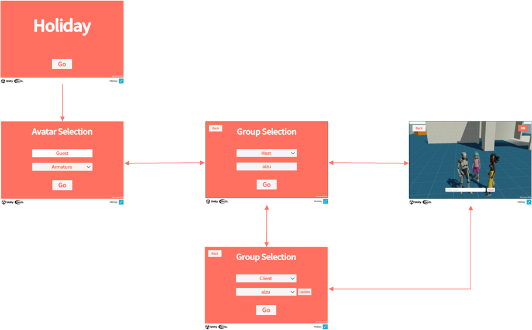

# Requirements

ここではHolidayで実現している要件を示します。

:::caution
Holidayの要件は本番運用するアプリケーションに必要な要件を網羅していません。
本番運用するアプリケーションの場合は[非機能要求グレード](https://www.ipa.go.jp/sec/softwareengineering/std/ent03-b.html)を参考に非機能要件の観点を洗い出して要件定義を実施してください。
:::

## Functional requirements

Holidayは友人や家族で集まって休日のひと時を過ごしてもらうことを目指したアプリケーションです。

- タイトル画面
  - タイトル表示のみ
- アバター選択画面
  - 名前を入力できる
  - アバターを選択できる
    - [Starter Assets - Third Person Character Controller](https://assetstore.unity.com/packages/essentials/starter-assets-third-person-character-controller-196526)のArmature
    - [Mixamo](https://www.mixamo.com)のMichelle、Amy
- グループ選択画面
  - ホストまたはクライアントを選択できる
  - ホストの場合はグループ名を指定してグループを作成できる
  - クライアントの場合はグループを選択してグループに参加できる
  - アバター選択画面に戻れる
- バーチャル空間
  - ボイスチャットができる
  - テキストチャットができる
  - マルチプレイができる
  - 空間を切り替えられる
  - グループ選択画面に戻れる

## Non-functional requirements

- 開催方法
  - 1回あたり30分、日程を決めてイベント告知して開催する。
  - 開催のたびにサーバーを起動/停止する。
- 利用人数
  - マルチプレイ
    - 1スペース70人
  - テキスト/ボイスチャット
    - 1グループ10人
  - 最大人数を超えた場合はグループ選択画面でユーザーに通知する。
  - グループ数の制限なし
- 利用環境
  - PCブラウザ
    - Windows 10
    - Chrome
  - PC アプリ
    - Windows 10
  - モバイルアプリ
    - iOS 17
    - Android 13
  - インターネット回線
    - 上り/下り 40Mbps以上
- アセット
  - アセットはアプリケーションに含めず、アプリケーションの実行時にダウンロードする。
    - アバターのキャラクタやバーチャル空間等のモデル、タイトルやメッセージ等のテキストなど
    - アセットのダウンロードはダウンロードサイズを表示してユーザーに実行確認を行う。
- アプリケーションの利用状況可視化
  - ユーザーの利用状況
    - ユニークユーザー数
    - ステージ毎の滞在時間
    - テキストチャットの送信数
  - リソースの使用状況
    - アプリケーションのメモリ使用量
  - エラー発生状況
    - アプリケーション実行時のエラー発生数
- 外部接続
  - アセットのダウンロード（S3）
    - ネットワーク切断時は再接続を行う。
    - 再接続状況はユーザーに通知する。
    - 再接続が失敗した場合、さらに再接続したい場合はユーザー操作（画面遷移）で行う。
  - マルチプレイ、テキストチャット（メッセージング）
    - ネットワーク切断時はユーザーに通知する。
    - マルチプレイ、テキストチャット以外の機能は使用できる。
    - バーチャル空間に再入室すると再接続できるので再接続処理は不要とする。
  - ボイスチャット（SFU）
    - ネットワーク切断時はユーザーに通知する。
    - ボイスチャット以外の機能は使用できる。
    - バーチャル空間に再入室すると再接続できるので再接続処理は不要とする。
  - アプリケーションの利用状況可視化（Grafana/Loki）
    - ユーザーのプレイには影響がないため、再接続やユーザー通知を行わない。
    - 全ての機能が使用できる。
  - 空間の背景に使う360度動画/画像のダウンロード（S3）
    - ネットワーク切断時はユーザーに通知する。
- 地域、言語
  - 日本、日本語のみ
