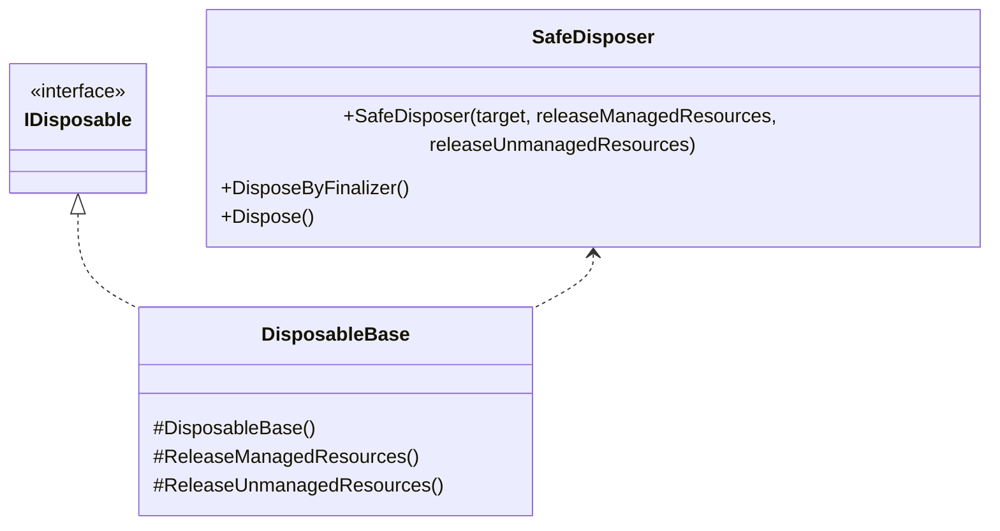
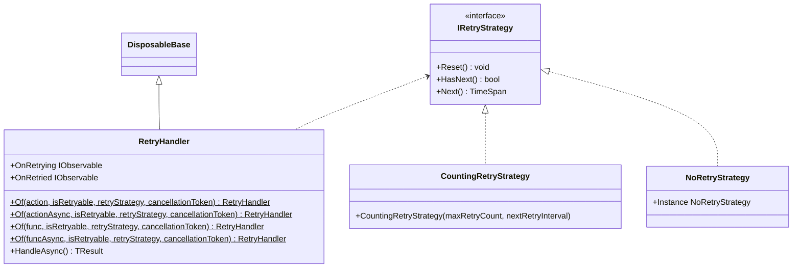
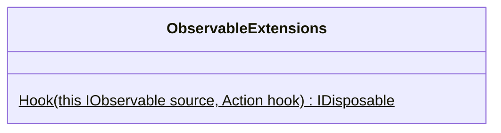

---
sidebar_position: 3
---

# Common

## What for?

A generic feature like retry processing is needed to realize the features of a framework or application.
For example, retry processing is required for external connection features such as [Chat](../integration/chat.vivox.md) and [Multiplay](../integration/multiplay.ngo.md) in frameworks and external API calls in applications.
This module provides such generic processing as common features.

## Specification

- You can apply the [Dispose Pattern](https://learn.microsoft.com/en-us/dotnet/standard/garbage-collection/implementing-dispose).
- You can apply a retry processing.
- You can add hooks to IObservable.

## Architecture

### System



### Retry



### Hook



## Installation

### Package

```text
https://github.com/extreal-dev/Extreal.Core.Common.git
```

### Dependencies

Common uses the following packages.

- [Extreal.Core.Logging](./logging.md)
- [UniTask](https://github.com/Cysharp/UniTask)
- [UniRx](https://github.com/neuecc/UniRx)

Please refer to [Release](../category/release) for the correspondence between module version and each package version.

### Settings

No work is required as there are no settings.

## Usage

### Apply the Dispose Pattern {#core-common-dp}

We provide two ways to apply the [Dispose Pattern](https://learn.microsoft.com/en-us/dotnet/standard/garbage-collection/implementing-dispose): inheritance and delegation.
Use inheritance if it is available, since inheritance covers a wider range of the Dispose Pattern.
If the class to which the pattern is applied has already inherited from another class and inheritance is not available, use delegation.

The DisposableBase class is used in the inheritance.

```csharp
public class SomethingClass : DisposableBase
{
    // Processing something with resources
    
    protected override void ReleaseManagedResources()
    {
        // release managed resources
    }

    protected override void ReleaseUnmanagedResources()
    {
        // release unmanaged resources
    }
}
```

Override the ReleaseManagedResources and ReleaseUnmanagedResources methods to release resources, depending on the resources to be handled.
By default, these methods do nothing, so there is no need to override methods that do not require release processing.
These methods are called by the DisposableBase class at the timing indicated in the Dispose Pattern.

:::caution
To prevent resource release omissions, implement the resource release processing in such a way that it does not raise exceptions or errors.
:::

:::caution
The [Dispose Pattern](https://learn.microsoft.com/en-us/dotnet/standard/garbage-collection/implementing-dispose) shows the correct way to implement Dispose.
Even if you follow the Dispose Pattern, your application must call IDisposable's Dispose method at the appropriate time.
The same is true when using DisposableBase.
:::

The SafeDisposer class is used in the delegation.
The DisposableBase class uses the SafeDisposer class to realize the Dispose Pattern.
Please refer to the source code of the DisposableBase class as an example of implementation of the SafeDisposer class.

```csharp
public class DisposableBase : IDisposable
{
    private readonly SafeDisposer safeDisposer;

    protected DisposableBase()
        => safeDisposer = new SafeDisposer(this, ReleaseManagedResources, ReleaseUnmanagedResources);

    ~DisposableBase() => safeDisposer.DisposeByFinalizer();

    protected virtual void ReleaseManagedResources() { }

    protected virtual void ReleaseUnmanagedResources() { }

    public void Dispose() => safeDisposer.Dispose();
}
```

### Apply a retry processing {#core-common-retry}

#### Retry processing

Retry processing is provided by the RetryHandler class.
The RetryHandler class can be used to apply retry processing to methods.

The conditions for methods to which retry processing can be applied are as follows.

- The target method is one of the following.
    - Synchronous processing without return value
      ```csharp
      void RunAction()
      ```
    - Asynchronous processing without return value
      ```csharp
      UniTask RunActionAsync()
      ```
    - Synchronous processing with return value
      ```csharp
      TResult RunFunc()
      ```
    - Asynchronous processing with return value
      ```csharp
      UniTask<TResult> RunFuncAsync()
      ```
- Method arguments can be provided or not.
- Use [UniTask](https://github.com/Cysharp/UniTask) for asynchronous processing.
- Be able to determine whether to retry or not by looking at the exception. (Throw an exception if the processing to be retried fails)

Retry processing is applied using the Of method of RetryHandler.
The Of method creates a RetryHandler so that a method with retry processing applied can be called.
The Of method accepts the following parameters.

- Retry target method
- Processing to determine whether to retry or not
- How to control retry processing (retry strategy)
- Token for cancelling retry

The HandleAsync method of RetryHandler is used to run the method to which retry processing is applied.
The HandleAsync method starts the retry processing if the method to be retried fails.
HandleAsync uses a retry or not retry decision processing and a retry strategy to determine whether or not to continue retries.

```csharp
using var retryHandler = RetryHandler<Unit>.Of(RunAction, e => e is AccessViolationException, new CountingRetryStrategy());
await retryHandler.HandleAsync();
```

If the method to be retried has arguments, use [lambda expression](https://learn.microsoft.com/en-us/dotnet/csharp/language-reference/operators/lambda-expressions).

```csharp
// Synchronous processing without return value
using var retryHandler = RetryHandler<Unit>.Of(() => RunAction(value), e => e is AccessViolationException, new CountingRetryStrategy());
await retryHandler.HandleAsync();

// Asynchronous processing without return value
using var retryHandler = RetryHandler<Unit>.Of(() => RunActionAsync(value), e => e is AccessViolationException, new CountingRetryStrategy());
await retryHandler.HandleAsync();

// Synchronous processing with return value
using var retryHandler = RetryHandler<Unit>.Of(() => RunFunc(value), e => e is AccessViolationException, new CountingRetryStrategy());
var result = await retryHandler.HandleAsync();

// Asynchronous processing with return value
using var retryHandler = RetryHandler<Unit>.Of(() => RunFuncAsync(value), e => e is AccessViolationException, new CountingRetryStrategy());
var result = await retryHandler.HandleAsync();
```

#### Retry strategy

The following retry strategies are provided by default.

- CountingRetryStrategy 
    - The retry processing is controlled by the retry count.
- NoRetryStrategy
    - Always no retry.
    - This is used when creating a library that has built-in retry processing.

CountingRetryStrategy is used to specify the maximum retry count and retry interval.

```csharp
// Max retry count is 5, retry interval is 5 seconds each times
var retryStrategy = new CountingRetryStrategy(5, _ => TimeSpan.FromSeconds(5));

// Max retry count is 5, retry interval is retry count x 5 seconds
var retryStrategy = new CountingRetryStrategy(5, retryCount => TimeSpan.FromSeconds(retryCount * 5));
```

CountingRetryStrategy provides retry processing using Fibonacci numbers by default.
The default Fibonacci number is limited to 20, so if you wish to increase the maximum retry count beyond 20, please specify the retry interval.

```csharp
// Max retry count is 12(default), retry interval is Fibonacci numbers
var retryStrategy = new CountingRetryStrategy();

// Max retry count is 5, retry interval is Fibonacci numbers
var retryStrategy = new CountingRetryStrategy(5);
```

Retry strategy is provided by the IRetryStrategy interface.
If the class provided by default does not support your needs, please create a class that implements the IRetryStrategy interface.

#### Reuse of retry processing

Unexpected disconnections may occur during connections in voice chat and multiplayer.
When such a disconnection occurs, you may want to reconnect using the state of the initial connection (channel name and other access information).
RetryHandler resets the retry state each time the HandleAsync method is called, so it can be reused.

#### Event notifications for retry processing {#core-common-retry-event}

RetryHandler has the following event notifications.

- OnRetrying
    - Timing：Just before retry
    - Type：IObservable
    - Parameters：Retry count
        - The first time is `1` and the second time is `2`.
        - `1` means the start of retry strategy running.
- OnRetried
    - Timing：Immediately after the retry is finished
        - If the retry is canceled, it will not be notified.
    - Type：IObservable
    - Parameters：Retry result
        - true: If the retry strategy is run and the retry is successful
        - false: If the retry strategy is run and the retry is not successful finally

### Add hooks to IObservable {#core-common-hook}

When using an IObservable, notifications are usually received via the Subscribe method.
In some cases, such as when you want to send the application's operation log to an external server, you may want to add processing to the IObservable without interfering with the application's original subscription processing.
The processing you want to add to the IObservable without interrupting the original processing of the application is called a hook.

Hooks must handle exceptions so that the processing of the application is not interrupted in the event of a processing failure.
The Hook method is provided as an extension method of IObservable to which hooks can be added.

This is an example of an implementation that sends stage usage status (e.g., stay time) at the timing of stage transitions.
```csharp
stageNavigator.OnStageTransitioning
              .Hook(_ => CollectStageUsage())
              .AddTo(disposables);
```

Unlike Subscribe, an exception raised by a processing executed with the Hook method does not affect other subscription processing.
To ensure that the developer is aware during development that an exception was raised by Hook, exception information is logged output at the Error level only when the log level is Debug.
