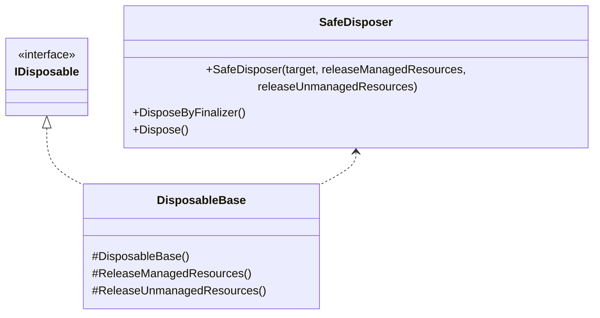

---
sidebar_position: 3
---

# Common

## What for?

A generic feature like retry processing is needed to realize the features of a framework or application.
For example, retry processing is required for external connection features such as [Chat](/integration/chat.vivox) and [Multiplay](/integration/multiplay.ngo) in frameworks and external API calls in applications.
This module provides such generic processing as common features.

## Specification

- You can apply the [Dispose Pattern](https://learn.microsoft.com/en-us/dotnet/standard/garbage-collection/implementing-dispose).

## Architecture



## Installation

### Package

```text
https://github.com/extreal-dev/Extreal.Core.Common.git
```

### Dependencies

Common uses the following packages.

- [Extreal.Core.Logging](/core/logging)

Please refer to [Release](/category/release) for the correspondence between module version and each package version.

### Settings

No work is required as there are no settings.

## Usage

### Apply the Dispose Pattern {#core-common-dp}

We provide two ways to apply the [Dispose Pattern](https://learn.microsoft.com/en-us/dotnet/standard/garbage-collection/implementing-dispose): inheritance and delegation.
Use inheritance if it is available, since inheritance covers a wider range of Dispose Patterns.
If the class to which the pattern is applied has already inherited from another class and inheritance is not available, use delegation.

The DisposableBase class is used in the inheritance.

```csharp
public class SomethingClass : DisposableBase
{
    // Processing something with resources
    
    protected override void ReleaseManagedResources()
    {
        // release managed resources
    }

    protected override void ReleaseUnmanagedResources()
    {
        // release unmanaged resources
    }
}
```

Override the ReleaseManagedResources and ReleaseUnmanagedResources methods to release resources, depending on the resources to be handled.
By default, these methods do nothing, so there is no need to override methods that do not require release processing.
These methods are called by the DisposableBase class at the timing indicated in the Dispose Pattern.

:::caution
To prevent resource release omissions, implement the resource release processing in such a way that it does not raise exceptions or errors.
:::

:::caution
The [Dispose Pattern](https://learn.microsoft.com/en-us/dotnet/standard/garbage-collection/implementing-dispose) shows the correct way to implement Dispose.
Even if you follow the Dispose Pattern, your application must call IDisposable's Dispose method at the appropriate time.
The same is true when using DisposableBase.
:::

The SafeDisposer class is used in the delegation.
The DisposableBase class uses the SafeDisposer class to realize the Dispose Pattern.
Please refer to the source code of the DisposableBase class as an example of implementation of the SafeDisposer class.

```csharp
public class DisposableBase : IDisposable
{
    private readonly SafeDisposer safeDisposer;

    protected DisposableBase()
        => safeDisposer = new SafeDisposer(this, ReleaseManagedResources, ReleaseUnmanagedResources);

    ~DisposableBase() => safeDisposer.DisposeByFinalizer();

    protected virtual void ReleaseManagedResources() { }

    protected virtual void ReleaseUnmanagedResources() { }

    public void Dispose() => safeDisposer.Dispose();
}
```
