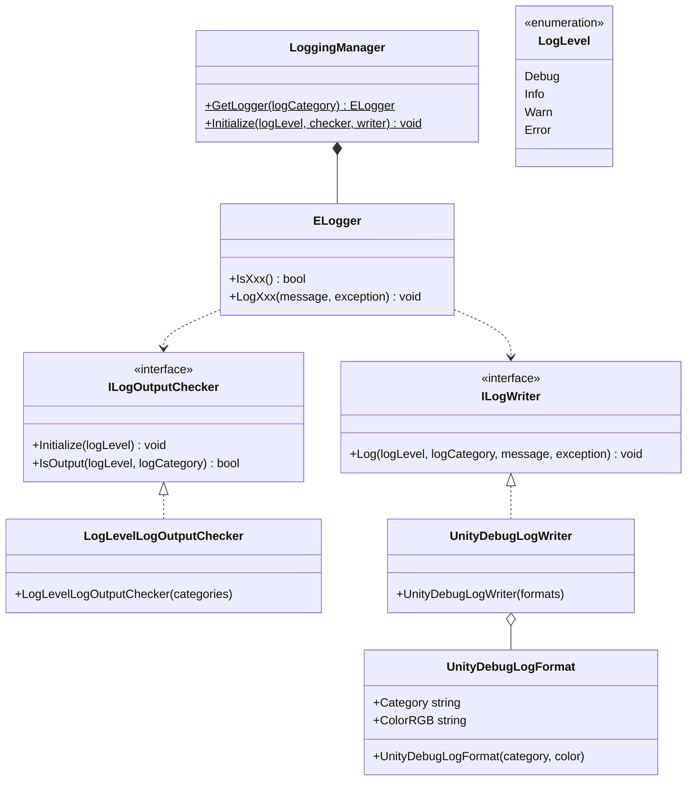
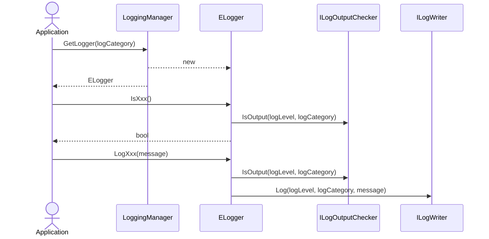

# Logging

## What for?

We provide Logging so that the log output of your framework and application can be commonized and log output can be controlled in a unified manner by your application.

By consolidating your application's log output into Logging, you can easily control your application's log output, such as switching log types and output destinations between development and production operations.

:::info
Currently, Logging only provides log output using the Unity standard Debug class.
It should be considered for debugging during development.
We plan to increase the number of log output destinations in the future, such as sending logs to the public cloud so that applications can be monitored.
:::

## Specification

Logging outputs logs with associating log levels and log categories for easier control of log output.

The four log levels in order from highest to lowest are Error, Warn, Info, and Debug.

- Error
  - When an error occurs that prevents the application from continuing
- Warn
  - When an event occurs that has no immediate impact but could become problematic if left unchecked
- Info
  - When you want to output events of normal operation for the purpose of understanding the usage status of the application or the connection status with external services
- Debug
  - When you want to output debugging information during development

The log levels are intended to be used in the following ways.

- Output logs of Debug or higher during development and Info or higher during production operation.
- Logs of Error or higher are monitored and notified.

Log category is a name to classify logs.
We assume the following usages.

- The name of the class that outputs logs is set as the log category so that the logs can be determined which class outputs the logs.
- A specific name is set as the log category so that logs output by multiple classes can be traced later.
- In some cases, such as when testing the reproduction of a failure, you may want to output all logs for a specific class only, regardless of the log level. This can be achieved by using log categories to change the log output checker.

Logging specifications are as follows.

- Logs can be output by associating log levels and log categories.
  - The default log output checker is based on log level only.
  - The default log output is Info or higher.
  - Default log output is performed by the Unity standard Debug class.
- You can customize log output using log categories.
  - You can filter log output by log category.
  - You can specify the color of the log output in the Unity standard Debug class for each log category.
- You can change the log level used to determine log output.
- You can change the log output checker.
- You can change the log writer (format and output destination).

## Architecture



:::info
`Xxx` is the log level (Error, Warn, Info, Debug).
:::

:::info
To prevent duplication and ambiguous references between Unity's Logger and Logging's Logger, Logging's Logger is marked with `E`, the first letter of Extreal.
:::

The sequence for logging output by the application is as follows.



## Installation

### Package

```text
https://github.com/extreal-dev/Extreal.Core.Logging.git
```

### Dependencies

No work is required as there are no dependencies.

### Settings

If the default is used, no further work is required.

In some cases, log output is required by the initialization process of the framework or application, so log output must be initialized and ready to use before any other feature of the framework or application.
The best time to initialize log output is at Awake of the GameObject that is the entry point.

Log output is initialized using the LoggingManager class.

```csharp
public class App : MonoBehaviour
{
    private static void InitializeApp()
    {
        const LogLevel logLevel = LogLevel.Debug;
        LoggingManager.Initialize(logLevel: logLevel);
    }

    private void Awake()
    {
        InitializeApp();
    }
}
```

Symbols are used to switch settings during development and production.

```csharp
#if DEV
const LogLevel logLevel = LogLevel.Debug;
#elif PROD
const LogLevel logLevel = LogLevel.Info;
#endif
LoggingManager.Initialize(logLevel: logLevel);
```

## Usage

### Output logs

The ELogger class is used to output logs.
The ELogger class is obtained from the LoggingManager class.

```csharp
public class SomethingService {

    private static readonly ELogger Logger = LoggingManager.GetLogger(nameof(SomethingService));

    public void Something() {

      Logger.LogInfo("Here we go!");

      // something

      Logger.LogInfo("It's over!!!");
    }
}
```

The creation of character strings to be output to the log may degrade the performance of the application depending on the output location, so a log output determination is made in advance before log output.

```csharp
if (Logger.IsDebug()) {
    Logger.LogDebug($"Hello {name}!");
}
```

:::tip
Log output determination is not required for logs that are always output based on the log level set for production operation.
:::

### Customize log output using log categories {#core-logging-category}

Log categories can be used to customize log output as follows.

- You can filter log output by log category.
- You can specify the color of the log output in the Unity standard Debug class for each log category.

#### Filter log output by log category

Use the LogLevelLogOutputChecker class.
Only logs of the specified log category will be output.

```csharp
var categoryFilters = new List<string> { "XxxClass", "YyyClass", "ZzzClass" };
var checker = new LogLevelLogOutputChecker(categoryFilters);
LoggingManager.Initialize(checker: checker);
```

#### Specify the color of the log output in the Unity standard Debug class for each log category

Use the UnityDebugLogWriter and UnityDebugLogFormat classes.
Use UnityDebugLogFormat to specify colors for each log category.

```csharp
var formats = new List<UnityDebugLogFormat>
{
    new UnityDebugLogFormat("XxxClass", Color.blue),
    new UnityDebugLogFormat("ZzzClass", Color.red)
};
var writer = new UnityDebugLogWriter(formats);
LoggingManager.Initialize(writer: writer);
```

#### Example of use in application

If you use these features in your application, please create the following ScriptableObject for easy configuration on the Unity editor.

```csharp
[CreateAssetMenu(
    menuName = "Config/" + nameof(LoggingConfig),
    fileName = nameof(LoggingConfig))]
public class LoggingConfig : ScriptableObject
{
    [SerializeField] private List<string> categoryFilters;
    [SerializeField] private List<LogFormat> logFormats;

    [Serializable]
    public class LogFormat
    {
        [SerializeField] private string category;
        [SerializeField] private Color color;

        public string Category => category;
        public Color Color => color;
    }

    public ICollection<string> CategoryFilters => categoryFilters;

    public ICollection<UnityDebugLogFormat> LogFormats =>
        logFormats.Select(logFormat => new UnityDebugLogFormat(logFormat.Category, logFormat.Color)).ToArray();
}

// Initialize using LoggingConfig.
public class App : MonoBehaviour
{
    [SerializeField] private LoggingConfig loggingConfig;

    private static void InitializeApp()
    {
        const LogLevel logLevel = LogLevel.Debug;
        var checker = new LogLevelLogOutputChecker(loggingConfig.CategoryFilters);
        var writer = new UnityDebugLogWriter(loggingConfig.LogFormats);
        LoggingManager.Initialize(logLevel, checker, writer);
    }

    private void Awake()
    {
        InitializeApp();
    }
}
```

### Change log level

The log level is changed using the LoggingManager class.

```csharp
// Initialization script for Logging
LoggingManager.Initialize(LogLevel.Debug);
```

### Change log output checker

The ILogOutputChecker interface determines log output.
You create a class that implements the ILogOutputChecker interface and set it to the LoggingManager class.

```csharp
// Class that implements the ILogOutputChecker interface.
// Adds special conditions to log output checks.
public class AppLogOutputChecker : ILogOutputChecker
{
    private LogLevel logLevel;

    public void Initialize(LogLevel logLevel)
    {
        this.logLevel = logLevel;
    }

    public bool IsOutput(LogLevel logLevel, string logCategory)
    {
        return this.logLevel <= logLevel
                || (logLevel == LogLevel.Debug && logCategory == "Debugger");
    }
}
```

```csharp
// Initialization script for Logging
LoggingManager.Initialize(checker: new AppLogOutputChecker());
```

### Change log writer

The ILogWriter interface writes logs.
You create a class that implements the ILogWriter interface and set it to the LoggingManager class.

```csharp
// Class that implements the ILogWriter interface.
// Changes the format of the log.
public class AppLogWriter : ILogWriter
{
    public void Log(LogLevel logLevel, string logCategory, string message, Exception exception = null)
    {
        switch (logLevel)
        {
            case LogLevel.Debug:
                Debug.Log(LogFormat("o-o", logCategory, message, exception));
                break;

            case LogLevel.Info:
                Debug.Log(LogFormat("(^_^)", logCategory, message, exception));
                break;

            case LogLevel.Warn:
                Debug.LogWarning(LogFormat("(--;", logCategory, message, exception));
                break;

            case LogLevel.Error:
                Debug.LogError(LogFormat("(*A*;", logCategory, message, exception));
                break;

            default:
                throw new ArgumentOutOfRangeException(nameof(logLevel), "Undefined LogLevel was input");
        }
    }

    private string LogFormat(string logLevel, string logCategory, string message, Exception exception = null)
    {
        var stringBuilder = new StringBuilder();
        stringBuilder
            .Append(logLevel)
            .Append(" ")
            .Append(logCategory)
            .Append(": ")
            .Append(message);
        if (exception != null)
        {
            stringBuilder.Append("\n---- Exception ----\n").Append(exception).Append("\n-------------------\n");
        }
        return stringBuilder.ToString();
    }
}
```

```csharp
// Initialization script for Logging
LoggingManager.Initialize(writer: new AppLogWriter());
```
