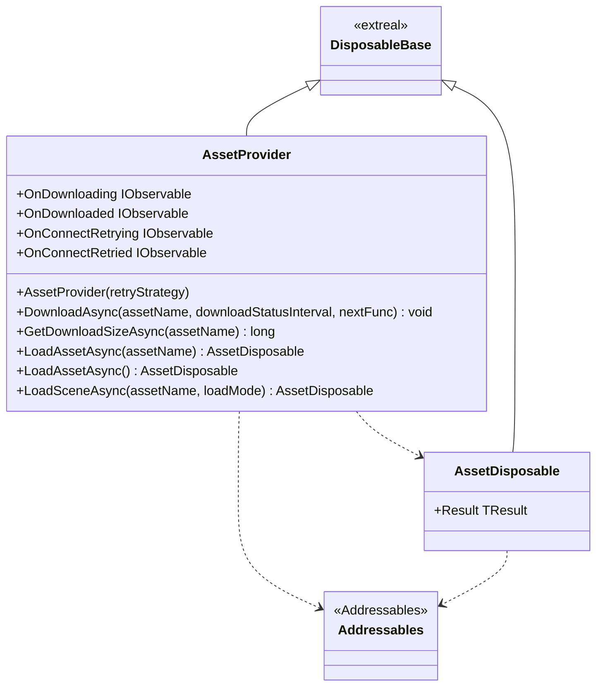
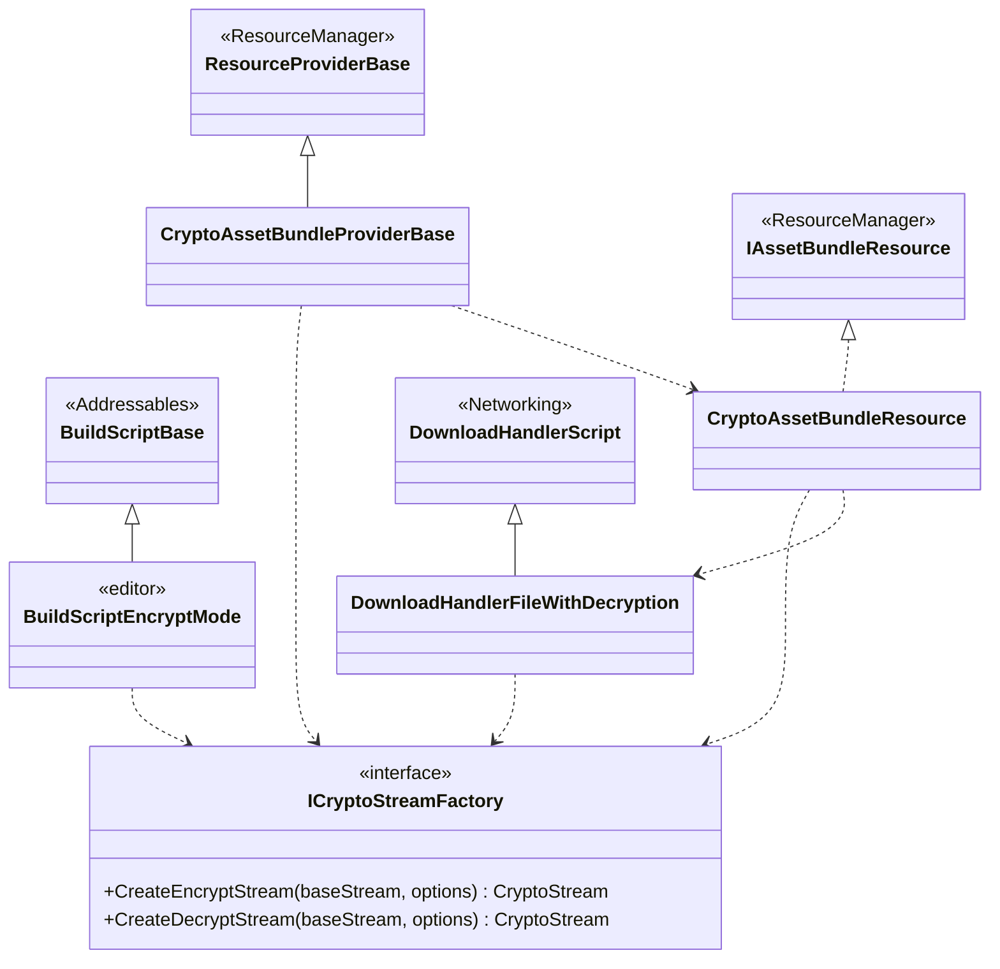

---
sidebar_position: 3
---

# Asset Workflow using Addressables

## What for?

We provide a wrapper that makes [Addressables](https://docs.unity3d.com/Packages/com.unity.addressables@1.19/manual/index.html) easier to use in applications.

We will call this feature, which wraps Addressables, the Addressables wrapper.

The Addressables wrapper provides features to facilitate the creation of download status displays and asset encryption/decryption, which are necessary for applications using Addressables.

The goal is to make Addressables introduction smooth by using the Addressables wrapper in your applications.

:::caution
The  wrapper makes Addressables easier to use, but it does not mean that you only need to know the Addressables wrapper to realize asset workflow without knowing Addressables.
The Addressables wrapper compensates for the difficulties and lack of features when using Addressables as it is, but transfers the asset workflow process to Addressables.
Therefore, to use the Addressables wrapper, it is assumed that you know Addressables.
If you do not know Addressables, please refer to [Learning](../learning/intro.md#asset-workflow) to learn about Addressables.
This guide assumes you know Addressables.
:::

## Specification

The specifications of the Addressables wrapper are as follows.

- You can use Addressables features.
- Reconnect when asset downloads fail to connect.
- You can add processing triggered by asset download state.
- You can encrypt and decrypt assets.

## Architecture

### Addressables wrapper



### Addressables customization



## Installation

### Package

```text
https://github.com/extreal-dev/Extreal.Integration.AssetWorkflow.Addressables.git
```

### Dependencies

The Addressables wrapper uses the following packages.

- [Extreal.Core.Logging](../core/logging.md)
- [Extreal.Core.Common](../core/common.md)
- [Addressables](https://docs.unity3d.com/Packages/com.unity.addressables@1.19/manual/index.html)
- [UniTask](https://github.com/Cysharp/UniTask)
- [UniRx](https://github.com/neuecc/UniRx)

Please refer to [Release](../category/release) for the correspondence between module version and each package version.

### Settings

There are no special settings when used by default.
See [encryption and decryption](#assets-addressables-crypto) for encryption and decryption of assets.

## Usage

### Use Addressables features

The features of Addressables are provided by the AssetProvider class.
Features not provided by AssetProvider should be implemented directly using Addressables.

```csharp
var assetProvider = new AssetProvider();
```

Here are some basic uses of AssetProvider.

Use the GetDownloadSizeAsync method to get the download size.

```csharp
var size = await assetProvider.GetDownloadSizeAsync("AssetName");
```

Use the DownloadAsync method to download assets.

```csharp
assetProvider.DownloadAsync("AssetName").Forget();
```

You can also specify post-download processing, such as loading assets after downloading and then transitioning to the next stage.

```csharp
Func<UniTask> navigate = async () =>
{
    MessageConfig = await LoadAsync<MessageConfig>();
    stageNavigator.ReplaceAsync(nextStage).Forget();
};
assetProvider.DownloadAsync("AssetName", nextFunc: navigate).Forget();
```

Use [event notification](#assets-addressables-event) if you want to run processing based on the download status.

Use the LoadAssetAsync method to load an asset.

```csharp
using var assetDisposable = await assetProvider.LoadAssetAsync<GameObject>("AssetName");
var prefab = assetDisposable.Result;
```

Methods that load assets or scenes return AssetDisposable.
AssetDisposable is a class that enables the release of loaded assets with IDisposable's Dispose.
AssetDisposable handles an asset in the same way as other classes that implement IDisposable.
Loaded asset is obtained from the Result property of AssetDisposable.

If you use the type name as the asset name, such as ScriptableObject, you can load an asset without specifying the asset name.

```csharp
// Asset name: "ChatConfig"
using var assetDisposable = await assetProvider.LoadAssetAsync<ChatConfig>();
var chatConfig = assetDisposable.Result;
```

Use the LoadSceneAsync method to load a scene.

```csharp
using var assetDisposable = await assetProvider.LoadSceneAsync("VirtualSpace");
var sceneInstance = assetDisposable.Result;
```

### Reconnect when asset downloads fail to connect {#assets-addressables-retry}

AssetProvider uses the retry processing provided by [Common](../core/common.md) to reconnect when communication is disconnected.
The following description assumes that you are familiar with the retry processing, so if you have not checked the retry processing, please check the [retry processing](../core/common.md#core-common-retry) first.

AssetProvider does not reconnect by default.
Specifying a retry strategy in the AssetProvider constructor will reconnect.

```csharp
var assetProvider = new AssetProvider(new CountingRetryStrategy());
```

The reconnection processing handled by AssetProvider is as follows.

- When to run reconnection
  - If the asset download failed
    - This includes cases where asset loading fails, since downloading occurs even when an asset is loaded without having downloaded the asset.
- Reconnection processing details
  - If the asset download failed
    - Repeat the connection according to the retry strategy.

Use [event notifications](#assets-addressables-event) if you want to run processing based on the status of retry processing.

### Add processing triggered by asset download state {#assets-addressables-event}

AssetProvider has the following event notifications.

- OnDownloading
  - Timing：Just before downloading
  - Type：IObservable
  - Parameters：None
- OnDownloaded
  - Timing：Immediately after download (including during processing)
  - Type：IObservable
  - Parameters：Download status
    - Asset name, total bytes, downloaded bytes, percentages, etc.
- OnConnectRetrying
  - Timing：Just before retrying the connection
  - Type：IObservable
  - Parameters：Retry count
    - The first time is `1` and the second time is `2`.
    - `1` means the start of retry strategy running.
- OnConnectRetried
  - Timing：Immediately after connection retry is finished
    - If the retry is canceled, it will not be notified.
  - Type：IObservable
  - Parameters：Retry result
    - true: If the retry strategy is run and the retry is successful
    - false: If the retry strategy is run and the retry is not successful finally

### Encrypt and decrypt assets {#assets-addressables-crypto}

:::caution
Note that using this feature alone is weak protection for intellectual property.

By using this feature, if someone obtains only encrypted assets, they will not be able to decrypt them.
For example, even if the URL of the asset download destination is known, the asset cannot be decrypted, thus preventing misappropriation of the asset.

However, if the encryption algorithm and the key used for decryption (implementation of ICryptoStreamFactory) are embedded in the application, the information necessary for decryption can be accessed and decrypted through reverse engineering.
Therefore, for the purpose of intellectual property protection, it is necessary to prevent decryption from the application by reverse engineering in addition to this feature.
:::

Customize Addressables build scripts and ResourceProvider to encrypt and decrypt assets.
The following classes are provided.

- Build script to encrypt assets
  - BuildScriptEncryptMode
- ResourceProvider to decrypt assets
  - CryptoAssetBundleProviderBase
  - CryptoAssetBundleResource
  - DownloadHandlerFileWithDecryption
- Factory that creates the CryptoStream used to encrypt and decrypt the asset
  - ICryptoStreamFactory

These classes are related as follows.
- Since the cryptographic algorithm to be used and the management of keys vary depending on the security level required by the application, an ICryptoStreamFactory is provided to implement for their processing.
- To embed ICryptoStreamFactory, CryptoAssetBundleProviderBase is provided as a Base class.
- CryptoAssetBundleProviderBase decrypts assets using ICryptoStreamFactory. (Actually CryptoAssetBundleResource and DownloadHandlerFileWithDecryption do it)
- BuildScriptEncryptMode encrypts using ICryptoStreamFactory if the ResourceProvider specified in the Asset Group at build execution is a class that extends CryptoAssetBundleProviderBase, and Otherwise, encryption is not executed.

The following is an instruction on how to apply this feature.

First, set up a build script to encrypt the assets as follows.

- Create a ScriptableObject from the `Extreal>Integration.AssetWorkflow.Addressables.Editor>Encrypt Build Script` in the Create Asset menu.
- Add the ScriptableObject you created to the `Build and Play Mode Scripts` from the `AddressablesAssetSettings` inspector.

This setting allows you to choose `Build>New Build>Encrypt Build Script` in the `Addressables Group` window.

Next, set up the ResourceProvider that decrypts the asset.
ICryptoStreamFactory must be implemented first.
Implement ICryptoStreamFactory according to the requirements of your application.
An example implementation using AES is shown below to give an idea of the implementation.

```csharp
public class CryptoStreamFactory : ICryptoStreamFactory
{
    public CryptoStream CreateEncryptStream(Stream baseStream, AssetBundleRequestOptions options)
        => CreateCryptoStream(baseStream, options, CryptoStreamMode.Write);

    public CryptoStream CreateDecryptStream(Stream baseStream, AssetBundleRequestOptions options)
        => CreateCryptoStream(baseStream, options, CryptoStreamMode.Read);

    private static CryptoStream CreateCryptoStream
    (
        Stream baseStream,
        AssetBundleRequestOptions options,
        CryptoStreamMode mode
    )
    {
        using var aes = CreateAesManaged(options);
        var cryptor = mode == CryptoStreamMode.Write ? aes.CreateEncryptor() : aes.CreateDecryptor();
        return new CryptoStream(baseStream, cryptor, mode);
    }

    [SuppressMessage("Usage", "CC0022")]
    private static AesManaged CreateAesManaged(AssetBundleRequestOptions options)
    {
        const int keyLength = 128;
        var salt = Encoding.UTF8.GetBytes(options.BundleName);

        using var keyGen = new Rfc2898DeriveBytes(SecretVariables.CryptAssetPassword, salt, 100, HashAlgorithmName.SHA256);
        using var ivGen = new Rfc2898DeriveBytes(SecretVariables.CryptAssetIv, salt, 1, HashAlgorithmName.SHA256);

        var key = keyGen.GetBytes(keyLength / 8);
        var iv = ivGen.GetBytes(keyLength / 8);

        return new AesManaged
        {
            BlockSize = keyLength,
            KeySize = keyLength,
            Mode = CipherMode.CBC,
            Padding = PaddingMode.PKCS7,
            Key = key,
            IV = iv
        };
    }
}
```

Implement a class that extends CryptoAssetBundleProviderBase.
Return a class that implements ICryptoStreamFactory.

```csharp
[DisplayName("Crypto AssetBundle Provider")]
public class CryptoAssetBundleProvider : CryptoAssetBundleProviderBase
{
    public override ICryptoStreamFactory CryptoStreamFactory => new CryptoStreamFactory();
}
```

Now you can select the implemented class as the `Content Packing & Loading > Advanced Options > Asset Bundle Provider` from the inspector of the `Addressables Asset Group`.
