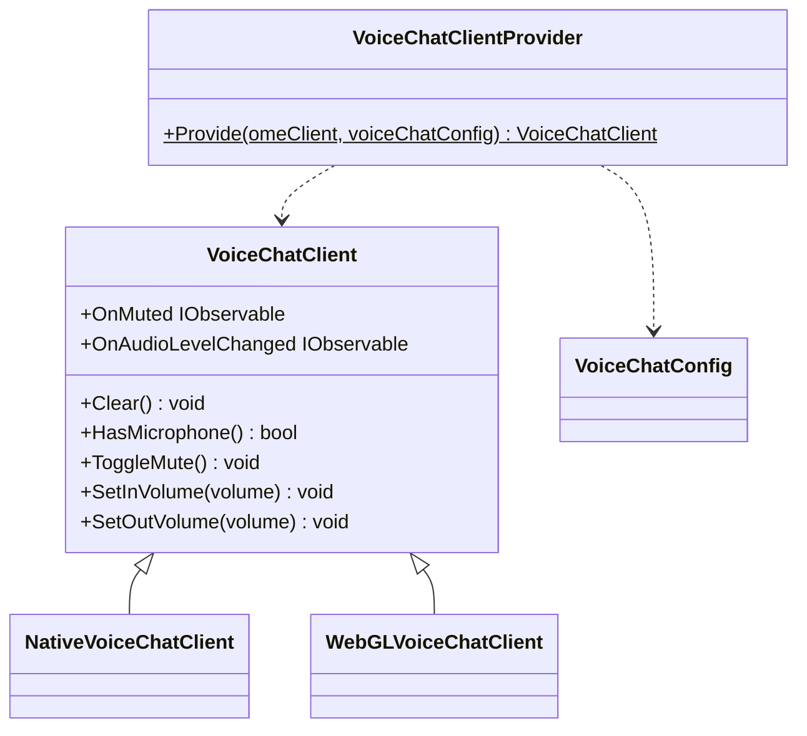
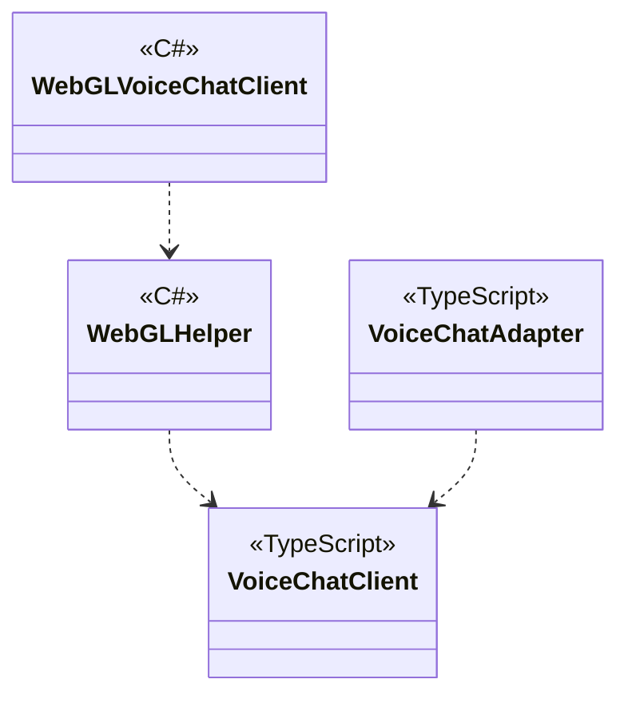

# Chat using OME

## What for?

SFU (Selected Forwarding Unit) is a means to communicate on a large scale in the virtual space, etc. with the lowest cost possible.

This module provides voice chat with SFU for Native (C#) and WebGL (JavaScript).

## Specification

- You can do voice chat with SFU.
- You can add a processing triggered by the client's state of voice chat.

## Architecture

### Unity



### JavaScript



## Installation

### Package

#### Unity
```text
https://github.com/extreal-dev/Extreal.Integration.Chat.OME.git
```

#### npm
```text
@extreal-dev/extreal.integration.chat.ome
```

### Dependencies

This module uses the following packages.

#### Unity

- [Extreal.Core.Logging](../core/logging.md)
- [Extreal.Core.Common](../core/common.md)
- [Extreal.Integration.Web.Common](../integration/web.common.md)
- [Extreal.Integration.SFU.OME](../integration/sfu.ome.md)
- [UniTask](https://github.com/Cysharp/UniTask)
- [UniRx](https://github.com/neuecc/UniRx)
- [WebRTC](https://docs.unity3d.com/Packages/com.unity.webrtc@3.0/manual/index.html)

#### npm

- [@extreal-dev/extreal.integration.web.common](https://www.npmjs.com/package/@extreal-dev/extreal.integration.web.common)
- [@extreal-dev/extreal.integration.sfu.ome](https://www.npmjs.com/package/@extreal-dev/extreal.integration.sfu.ome)

### Settings

This module uses [SFU.OME](./sfu.ome.md) to realize SFU.
Therefore, [Settings of SFU.OME](./sfu.ome.md#settings) is required.
Add the following initialization after setting up SFU.OME.

Create a Client with Provider.

```csharp
public class ClientControlScope : LifetimeScope
{
    protected override void Configure(IContainerBuilder builder)
    {
        var omeConfig = new OmeConfig("http://localhost:3040");
        var omeClient = OmeClientProvider.Provide(omeConfig);
        builder.RegisterComponent(omeClient);

        var voiceChatClient = VoiceChatClientProvider.Provide(omeClient);
        builder.RegisterComponent(voiceChatClient);

        builder.RegisterEntryPoint<ClientControlPresenter>();
    }
}
```

If you want to use it with WebGL, you will need to initialize JavaScript further.
Create Adapter and call adapt function.

```typescript
import { OmeAdapter } from "@extreal-dev/extreal.integration.sfu.ome";
import { VoiceChatAdapter } from "@extreal-dev/extreal.integration.chat.ome";


const omeAdapter = new OmeAdapter();
omeAdapter.adapt();

const voiceChatAdapter = new VoiceChatAdapter();
voiceChatAdapter.adapt(omeAdapter.getOmeClient);
```

## Usage

### Do voice chat with SFU

Voice chat is realized using [SFU.OME](sfu.ome.md) for SFU.
Please use [SFU.OME API](sfu.ome.md#sfu-ome-establish-connection) to establish SFU connection.

Voice Chat features are provided by VoiceChatClient.

Use the ToggleMute method to switch mute.

```csharp
voiceChatClient.ToggleMute();
```

The value (bool) after switching to mute is received in the OnMuted event.

```csharp
voiceChatClient.OnMuted
    .Subscribe(muted =>
    {
        // do something
    })
    .AddTo(disposables);
```

If you want to specify the default value for mute, specify it in VoiceChatConfig.

```csharp
var voiceChatConfig = new VoiceChatConfig(initialMute: false);
var voiceChatClient = VoiceChatClientProvider.Provide(omeClient, voiceChatConfig);
```

Use SetInVolume method to adjust the input volume.
Enter a float value between 0 and 1 for the argument volume.

```csharp
voiceChatClient.SetInVolume(volume);
```

If you want to specify an initial value for the input volume, use VoiceChatConfig.

```csharp
var voiceChatConfig = new VoiceChatConfig(initialInVolume: 0.8f);
var voiceChatClient = VoiceChatClientProvider.Provide(omeClient, voiceChatConfig);
```

Use SetOutVolume method to adjust the output volume.
Enter a float value between 0 and 1 for the argument volume.

```csharp
voiceChatClient.SetOutVolume(volume);
```

If you want to specify an initial value for the output volume, use VoiceChatConfig.

```csharp
var voiceChatConfig = new VoiceChatConfig(initialOutVolume: 0.8f);
var voiceChatClient = VoiceChatClientProvider.Provide(omeClient, voiceChatConfig);
```

### Add a processing triggered by the client's state in voice chat

VoiceChatClient has the following event notifications

- OnAudioLevelChanged
  - Timing: When there is a change in speech volume at a specified frequency.
  - Type: IObservable
  - Parameters: ID and speech volume pair

If you want to specify the frequency at which the speech volume is acquired, specify it in VoiceChatConfig.

```csharp
var voiceChatConfig = new VoiceChatConfig(InitialAudioLevelCheckIntervalSeconds: 0.5f);
var voiceChatClient = VoiceChatClientProvider.Provide(omeClient, voiceChatConfig);
```
