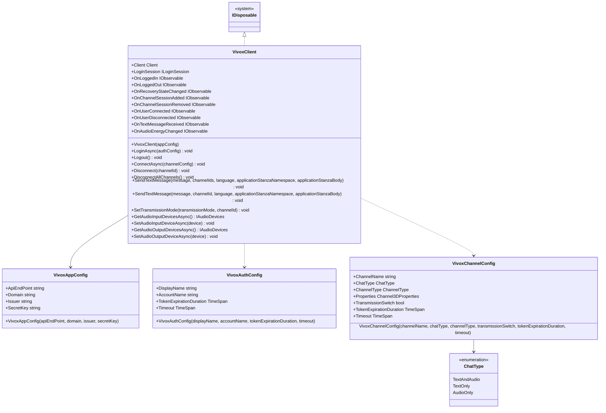

# Chat using Vivox

We provide a wrapper that makes [Vivox](https://unity.com/ja/products/vivox) easier to use in applications.

We will call this feature, which wraps Vivox, the Vivox wrapper.

The implementation of login/logout or connecting/disconnecting to a channel using Vivox's API is similar in any application.
The Vivox wrapper provides features that are common to such implementations when using Vivox.

The goal is to make Vivox introduction smooth by using the Vivox wrapper in your applications.

:::caution
The Vivox wrapper makes Vivox easier to use, but it does not mean that you only need to know the Vivox wrapper to realize voice/text chat without knowing Vivox.
The Vivox wrapper compensates for the difficulties and lack of features when using Vivox as it is, but transfers the voice/text chat process to Vivox.
Therefore, to use the Vivox wrapper, it is assumed that you know Vivox.
If you do not know Vivox, please refer to [How to lean](/learning/intro#how-to-learn) to learn about Vivox.
This guide assumes you know Vivox.
:::

:::caution
Vivox is available on the originally existing [Vivox Developer Portal](https://developer.vivox.com/) and on [Unity Gaming Services](<https://unity.com/ja/> solutions/gaming-services), which appeared in October 2021.
The current Vivox wrapper is compatible with the [Vivox Developer Portal](https://developer.vivox.com/).
It is not compatible with [Unity Gaming Services](https://unity.com/ja/solutions/gaming-services).
We will consider supporting [Unity Gaming Services](https://unity.com/ja/solutions/gaming-services) in the future.
:::

## Specification

The specifications of the Vivox wrapper are as follows.

- You can use Vivox features.
- You can add processing triggered by Vivox client state.

## Architecture



## Installation

### Package

```text
https://github.com/extreal-dev/Extreal.Integration.Chat.Vivox.git
```

### Dependencies

The Vivox wrapper uses the following packages.

- [Extreal.Core.Logging](/core/logging)
- [Vivox Unity SDK](https://docs.vivox.com/v5/general/unity/15_1_190000/en-us/Default.htm)
- [UniTask](https://github.com/Cysharp/UniTask)
- [UniRx](https://github.com/neuecc/UniRx)

Please refer to [Release](/category/release) for the correspondence between module version and each package version.

### Settings

VivoxClient is initialized.

It is assumed that the application to which the client will connect has been created in [Vivox Developer Portal](https://developer.vivox.com/).

To initialize VivoxClient, VivoxAppConfig, which holds the connection information to Vivox, is required.
As an example, we will show how to set the connection information to Vivox with a ScriptableObject.
Create a ScriptableObject that generates VivoxAppConfig and set the connection information to Vivox in the inspector.

```csharp
[CreateAssetMenu(
    menuName = "Config/" + nameof(ChatConfig),
    fileName = nameof(ChatConfig))]
public class ChatConfig : ScriptableObject
{
    [SerializeField] private string apiEndPoint;
    [SerializeField] private string domain;
    [SerializeField] private string issuer;
    [SerializeField] private string secretKey;

    public VivoxAppConfig ToVivoxAppConfig()
        => new VivoxAppConfig(apiEndPoint, domain, issuer, secretKey);
}
```

Initialize VivoxClient with VContainer.

```csharp
public class ChatControlScope : LifetimeScope
{
    [SerializeField] private ChatConfig chatConfig;

    protected override void Configure(IContainerBuilder builder)
    {
        builder.RegisterComponent(chatConfig.ToVivoxAppConfig());
        builder.Register<VivoxClient>(Lifetime.Singleton);
    }
}
```

## Usage

### Use Vivox features

Vivox features are provided by VivoxClient.
For features that are not provided by VivoxClient, please obtain the Client or ILoginSession provided by Vivox from VivoxClient and implement them.

```csharp
var client = vivoxClient.Client;
var loginSession = vivoxClient.LoginSession;
```

Here are some basic instructions for using VivoxClient.

To conduct voice/text chat, you must first log in to the Vivox application.
Login is done using LoginAsync in VivoxClient.

```csharp
var vivoxAuthConfig = new VivoxAuthConfig("Guest");
vivoxClient.LoginAsync(vivoxAuthConfig).Forget();
```

Logout is done using Logout in VivoxClient.

```csharp
vivoxClient.Logout();
```

You can use VivoxClient's ConnectAsync to enter the channel.

```csharp
var vivoxChannelConfig = new VivoxChannelConfig("GuestChannel");
vivoxClient.ConnectAsync(vivoxChannelConfig).Forget();
```

VivoxChannelConfig enables voice and text chat by default.
If you want to restrict to voice chat only or text chat only, specify ChatType.
An example of restricting to voice chat only is as follows.

```csharp
var vivoxChannelConfig = new VivoxChannelConfig("GuestChannel", ChatType.AudioOnly);
```

If you want to exit from all channels at the point of exiting the space, such as when allowing voice or text chat only within a space, use DisconnectAllChannels in VivoxClient.

```csharp
vivoxClient.DisconnectAllChannels();
```

You can use Disconnect in VivoxClient to leave a specific channel, such as when a group chat feature is provided.

```csharp
vivoxClient.Disconnect(channelId);
```

You can use SendTextMessage in VivoxClient to send text chat messages.

```csharp
vivoxClient.SendTextMessage(message, channelId);
```

Text chat messages are received via OnTextMessageReceived, an event notification published by VivoxClient.

```csharp
vivoxClient.OnTextMessageReceived
    .Subscribe(message => /* do something with message */)
    .AddTo(disposables);
```

### Add a processing triggered by Vivox client state

VivoxClient has the following event notifications.

- OnLoggedIn
  - Timing: Immediately after login
  - Type: IObservable
  - Parameters: None
- OnLoggedOut
  - Timing: Immediately after logout
  - Type: IObservable
  - Parameters: None
- OnRecoveryStateChanged
  - Timing: Immediately after the recovery state changes on unexpected network disconnection
  - Type: IObservable
  - Parameters: Recovery state
    - [ConnectionRecoveryState](https://docs.vivox.com/v5/general/unity/15_1_190000/en-us/Default.htm#ReferenceManual/Unity/namespace_vivox_unity.html#a21771ea5086c36c42452bc29059ec379%3FTocPath%3DCore%7CUnity%2520API%2520Reference%2520Manual%7CClass%2520List%7CUnity%20API%20Reference%20Manual%7CUnity%20API%20Reference%20Manual%7C_____4)
- OnChannelSessionAdded
  - Timing: Immediately after a channel is added
  - Type: IObservable
  - Parameters: ID of the added channel
    - [ChannelId](https://docs.vivox.com/v5/general/unity/15_1_190000/en-us/Default.htm#ReferenceManual/Unity/class_vivox_unity_1_1_channel_id.html%3FTocPath%3DVivox%2520Unity%2520SDK%2520documentation%7CUnity%2520API%2520Reference%2520Manual%7CClass%2520List%7C_____5)
- OnChannelSessionRemoved
  - Timing: Immediately after a channel is removed
  - Type: IObservable
  - Parameters: ID of the removed channel
    - [ChannelId](https://docs.vivox.com/v5/general/unity/15_1_190000/en-us/Default.htm#ReferenceManual/Unity/class_vivox_unity_1_1_channel_id.html%3FTocPath%3DVivox%2520Unity%2520SDK%2520documentation%7CUnity%2520API%2520Reference%2520Manual%7CClass%2520List%7C_____5)
- OnUserConnected
  - Timing: Immediately after a participant connects to the channel.
    - The user who originated the event is also notified of this event.
  - Type: IObservable
  - Parameters: Participant who connected to the channel.
    - [IParticipant](https://docs.vivox.com/v5/general/unity/15_1_190000/en-us/Default.htm#ReferenceManual/Unity/interface_vivox_unity_1_1_i_participant.html%3FTocPath%3DVivox%2520Unity%2520SDK%2520documentation%7CUnity%2520API%2520Reference%2520Manual%7CClass%2520List%7C_____31)
    - The IsSelf property of IParticipant determines if the participant is the user itself who entered the channel.
- OnUserDisconnected
  - Timing: Immediately after a participant disconnects from the channel.
    - The user who originated the event is also notified of this event.
  - Type: IObservable
  - Parameters: Participant who disconnected from the room
    - [IParticipant](https://docs.vivox.com/v5/general/unity/15_1_190000/en-us/Default.htm#ReferenceManual/Unity/interface_vivox_unity_1_1_i_participant.html%3FTocPath%3DVivox%2520Unity%2520SDK%2520documentation%7CUnity%2520API%2520Reference%2520Manual%7CClass%2520List%7C_____31)
    - The IsSelf property of IParticipant determines if the participant is the user itself who left the channel.
- OnTextMessageReceived
  - Timing: Immediately after a message is received on the channel
  - Type: IObservable
  - Parameters: Incoming message
    - [IChannelTextMessage](https://docs.vivox.com/v5/general/unity/15_1_190000/en-us/Default.htm#ReferenceManual/Unity/interface_vivox_unity_1_1_i_channel_text_message.html%3FTocPath%3DCore%7CUnity%2520API%2520Reference%2520Manual%7CClass%2520List%7CUnity%20API%20Reference%20Manual%7CClass%20List%7C_____33)
- OnAudioEnergyChanged
  - Timing: Immediately after a change in the participant's audio loudness
  - Type: IObservable
  - Parameters: Participant and audio volume (tuple)
    - [IParticipant](https://docs.vivox.com/v5/general/unity/15_1_190000/en-us/Default.htm#ReferenceManual/Unity/interface_vivox_unity_1_1_i_participant.html%3FTocPath%3DVivox%2520Unity%2520SDK%2520documentation%7CUnity%2520API%2520Reference%2520Manual%7CClass%2520List%7C_____31)
    - [AudioEnergy](https://docs.vivox.com/v5/general/unity/15_1_190000/en-us/Default.htm#ReferenceManual/Unity/interface_vivox_unity_1_1_i_participant_properties.html#ac14ea71429adc8e41eaa22af478296ee%3FTocPath%3DCore%7CUnity%2520API%2520Reference%2520Manual%7CClass%2520List%7CUnity%20API%20Reference%20Manual%7CClass%20List%7C_____40)
