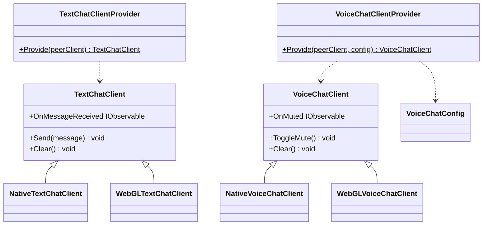
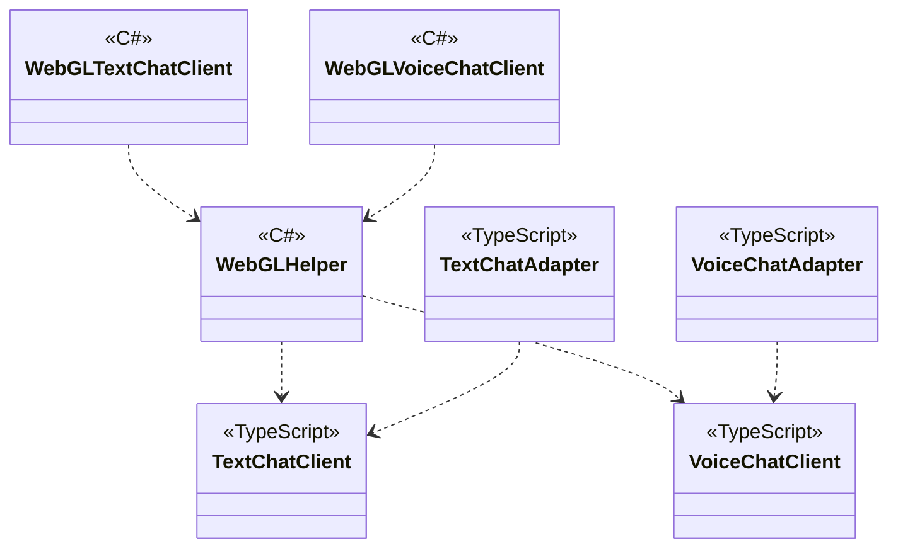

---
sidebar_position: 3
---

# Chat using WebRTC

## What for?

P2P(Peer to Peer) is a means of communication with the lowest possible cost.

This module provides P2P text/voice chat for Native(C#) and WebGL(JavaScript).

## Specification

- P2P text chat is available.
- P2P voice chat is available.

## Architecture

### Unity



### JavaScript



## Installation

### Package

#### Unity
```text
https://github.com/extreal-dev/Extreal.Integration.Chat.WebRTC.git
```

#### npm
```text
@extreal-dev/extreal.integration.chat.webrtc
```

### Dependencies

This module uses the following packages.

#### Unity

- [Extreal.Core.Logging](../core/logging.md)
- [Extreal.Core.Common](../core/common.md)
- [Extreal.Integration.Web.Common](../integration/web.common.md)
- [Extreal.Integration.P2P.WebRTC](../integration/p2p.webrtc.md)
- [WebRTC](https://docs.unity3d.com/Packages/com.unity.webrtc@3.0/manual/index.html)
- [UniTask](https://github.com/Cysharp/UniTask)
- [UniRx](https://github.com/neuecc/UniRx)

#### npm

- [@extreal-dev/extreal.integration.web.common](https://www.npmjs.com/package/@extreal-dev/extreal.integration.web.common)
- [@extreal-dev/extreal.integration.p2p.webrtc](https://www.npmjs.com/package/@extreal-dev/extreal.integration.p2p.webrtc)

Please refer to [Release](../category/release) for the correspondence between module version and each package version.

### Settings

This module uses [P2P.WebRTC](p2p.webrtc.md) to realize P2P.
[WebRTC Settings](p2p.webrtc.md#settings) is required.
Please add the following initialization after setting up P2P.WebRTC.

Create a Client with each Provider.

```csharp
public class ClientControlScope : LifetimeScope
{
    protected override void Configure(IContainerBuilder builder)
    {
        var peerConfig = new PeerConfig("http://127.0.0.1:3010");
        var peerClient = PeerClientProvider.Provide(peerConfig);
        builder.RegisterComponent(peerClient);

        var textChatClient = TextChatClientProvider.Provide(peerClient);
        builder.RegisterComponent(textChatClient);

        var voiceChatClient = VoiceChatClientProvider.Provide(peerClient);
        builder.RegisterComponent(voiceChatClient);

        builder.RegisterEntryPoint<ClientControlPresenter>();
    }
}
```

If used with WebGL, further JavaScript initialization is required.
Create each Adapter and call the adapt function.

```typescript
import { PeerAdapter } from "@extreal-dev/extreal.integration.p2p.webrtc";
import { TextChatAdapter, VoiceChatAdapter } from "@extreal-dev/extreal.integration.chat.webrtc";

const peerAdapter = new PeerAdapter();
peerAdapter.adapt();

const textChatAdapter = new TextChatAdapter();
textChatAdapter.adapt(peerAdapter.getPeerClient);

const voiceChatAdapter = new VoiceChatAdapter();
voiceChatAdapter.adapt(peerAdapter.getPeerClient);
```

## Usage

### Perform P2P text chat

Text chat uses [P2P.WebRTC](p2p.webrtc.md) to realize P2P.
Use [P2P.WebRTC's API](p2p.webrtc.md#p2p-webrtc-host-client) to establish P2P connections.

Text chat features are provided by TextChatClient.

Use the Send method to send messages.

```csharp
textChatClient.Send(message);
```

The OnMessageReceived event is used to receive a message.
A string message is passed as a parameter.

```csharp
textChatClient.OnMessageReceived
    .Subscribe(message =>
    {
        // do something
    })
    .AddTo(disposables);
```

To end the text chat, use the Clear method.

```csharp
textChatClient.Clear();
```

### Perform P2P voice chat

Voice chat uses [P2P.WebRTC](p2p.webrtc.md) to realize P2P.
Please use [P2P.WebRTC's API](p2p.webrtc.md#p2p-webrtc-host-client) to establish P2P connections.

Voice Chat features are provided by VoiceChatClient.

Use the ToggleMute method to switch mute.

```csharp
voiceChatClient.ToggleMute();
```

The value(bool) after switching to mute is received in the OnMuted event.

```csharp
voiceChatClient.OnMuted
    .Subscribe(muted =>
    {
        // do something
    })
    .AddTo(disposables);
```

If you want to specify the default value for mute, specify it in VoiceChatConfig.

```csharp
var voiceChatConfig = new VoiceChatConfig(initialMute: false);
var voiceChatClient = VoiceChatClientProvider.Provide(peerClient, voiceChatConfig);
```
