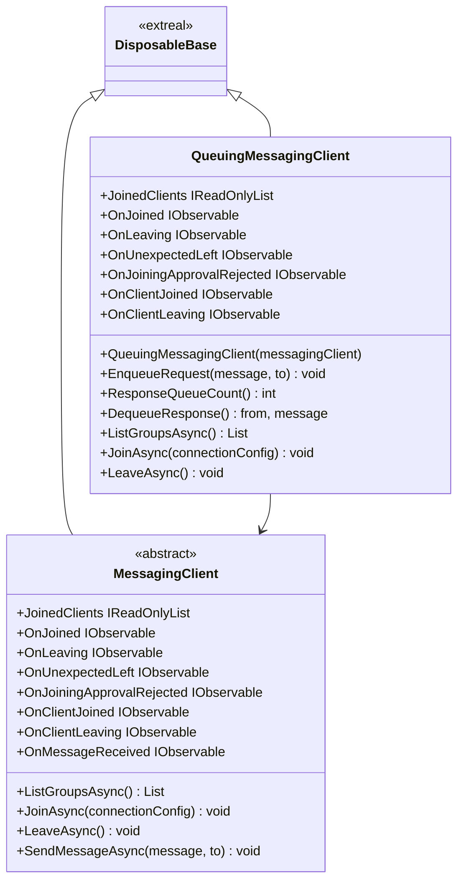
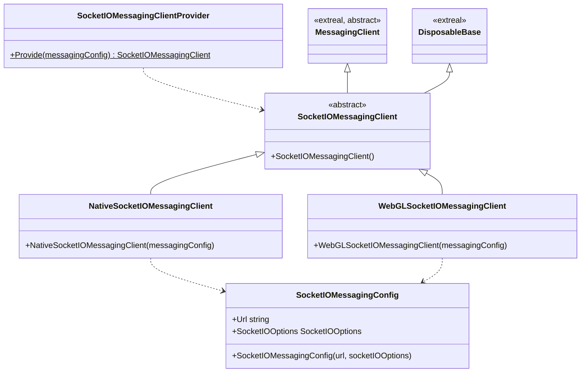
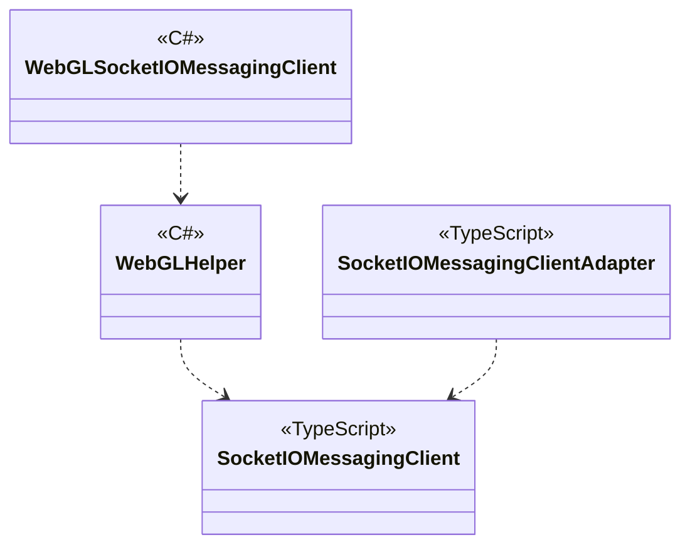

# Messaging

## What for?

In virtual spaces where people can gather and communicate, they often want to form groups to exchange messages, such as multiplayer or text chat.

Therefore, Extreal provides a messaging feature that allows groups to exchange messages.
This module provides a default implementation of messaging features using [Socket.IO](https://socket.io/).
The server used for messaging, like Socket.IO, is called a messaging server in this module.

## Specification

- You can exchange messages in groups.
- You can controls the timing of sending and receiving messages (queuing).
- You can add processing triggered by client state.
- Messaging with Socket.IO.
  - Native (C#) and WebGL (JavaScript) support.

:::tip
When many messages are exchanged in a short period of time, such as when realizing a multiplayer game, the communication load remains high.
In such cases, queuing can be used to reduce the communication load.
:::

## Architecture

### Messaging

### Socket.IO

#### Unity



#### JavaScript


## Installation

### Package

#### Messaging

```text
https://github.com/extreal-dev/Extreal.Integration.Messaging.git
```
#### Socket.IO

##### Unity

```text
https://github.com/extreal-dev/Extreal.Integration.Messaging.Socket.IO.git
```

##### npm

```text
@extreal-dev/extreal.integration.messaging.socket.io
```

### Dependencies

Messaging uses the following packages.

#### Messaging

- [Extreal.Core.Logging](../core/logging.md)
- [Extreal.Core.Common](../core/common.md)
- [UniTask](https://github.com/Cysharp/UniTask)
- [UniRx](https://github.com/neuecc/UniRx)

#### Socket.IO

##### Unity

- [Extreal.Core.Logging](../core/logging.md)
- [Extreal.Core.Common](../core/common.md)
- [Extreal.Integration.Web.Common](../integration/web.common.md)
- [UniTask](https://github.com/Cysharp/UniTask)
- [UniRx](https://github.com/neuecc/UniRx)
- [SocketIOClient](https://github.com/doghappy/socket.io-client-csharp)
- [Newtonsoft.Json](https://www.newtonsoft.com/json)

##### npm

- [@extreal-dev/extreal.integration.web.common](https://www.npmjs.com/package/@extreal-dev/extreal.integration.web.common)
- [socket.io-client](https://www.npmjs.com/package/socket.io-client)


Please refer to [Release](../category/release) for the correspondence between module version and each package version.

### Settings

#### Messaging server

Messaging servers are provided by [Docker Compose](https://docs.docker.com/compose/).

As an implementation, an HTTP server is set up, and the server and client are connected via Socket.IO.
See [Rooms](https://socket.io/docs/v4/rooms/) for details.

Sets the maximum number of people per group when starting up the messaging server.
If more than the maximum number of clients attempt to join a group, the client will be denied participation.
The maximum number of people per group is specified by MESSAGING_MAX_CAPACITY in the [compose.yaml](https://github.com/extreal-dev/Extreal.Integration.Messaging.Socket.IO/tree/main/MessagingServer~/compose.yaml) file.

```yaml
environment:
    # If "on" is logging, otherwise is not. In production, set it to "off".
    MESSAGING_LOGGING: ${MESSAGING_LOGGING:-on}
    # Capacity of one room
    MESSAGING_MAX_CAPACITY: ${MESSAGING_MAX_CAPACITY:-80} # Change here
    # In production, change it to suit the environment.
    MESSAGING_CORS_ORIGIN: ${MESSAGING_CORS_ORIGIN:-*}
```

Please refer to [README](https://github.com/extreal-dev/Extreal.Integration.Messaging.Socket.IO/tree/main/MessagingServer~) to prepare your messaging server.

:::tip
If you wish to scale out by adding more messaging servers, you can do so by using the Redis Adapter provided by Socket.IO. See [Redis Adapter](https://socket.io/docs/v4/redis-adapter/) for details.
:::

#### Application

Create a SocketIOMessagingClient using the SocketIOMessagingClientProvider.

```csharp
public class ClientControlScope : LifetimeScope
{
    protected override void Configure(IContainerBuilder builder)
    {
        var messagingConfig = new SocketIOMessagingConfig("url", socketIOOptions);
        var messagingClient = SocketIOMessagingClientProvider.Provide(messagingConfig);
        builder.RegisterComponent<MessagingClient>(messagingClient);

        builder.RegisterEntryPoint<ClientControlPresenter>();
    }
}
```

When used with WebGL, JavaScript initialization is required.
Create a SocketIOMessagingAdapter and call the adapt function.

```typescript
import { SocketIOMessagingAdapter } from "@extreal-dev/extreal.integration.messaging.socket.io";

const messagingAdapter = new SocketIOMessagingAdapter();
messagingAdapter.adapt();
```

## Usage

### Exchange messages in groups {#messaging-among-group}

The ability to exchange messages in groups is provided by MessagingClient.

To join an existing group, use ListGroupsAsync to get a list of groups.

```csharp
var groups = await messagingClient.ListGroupsAsync();
```

A list of Groups with Name will be returned, so join the group using the Group Name obtained here.

```csharp
var joiningConfig = new MessagingJoiningConfig("groupName");
await messagingClient.JoinAsync(joiningConfig);
```

If you want to create a new group, join it by specifying a group name that is not part of existing groups.

To send a message, use SendMessageAsync.
If you want to send a message to the members of a group, specify only the message.

```csharp
await messagingClient.SendMessageAsync("message");
```

If you want to send a message to a specific member of a group, specify the client ID in addition to the message.

```csharp
await messagingClient.SendMessageAsync("message", toClientId);
```

The client IDs participating in the group can be obtained from the JoinedClients property.

The OnMessageReceived event is used to receive messages.

```csharp
messagingClient.OnMessageReceived
    .Subscribe(HandleReceivedMessage)
    .AddTo(disposables);

private void HandleReceivedMessage((string clientId, string message) tuple)
{
  // Handle message
}
```

To leave the group, use LeaveAsync.

```csharp
await messagingClient.LeaveAsync();
```

### Control the timing of sending and receiving messages (queuing)

Queuing feature is provided by QueuingMessagingClient.
QueuingMessagingClient is a wrapper class for MessagingClient.
To use the queuing feature, initialize QueuingMessagingClient.

```csharp
public class ClientControlScope : LifetimeScope
{
    protected override void Configure(IContainerBuilder builder)
    {
        var messagingConfig = new SocketIOMessagingConfig("url", socketIOOptions);
        var messagingClient = SocketIOMessagingClientProvider.Provide(messagingConfig);
        var queuingMessagingClient = new QueuingMessagingClient(messagingClient);
        builder.RegisterComponent(queuingMessagingClient);

        builder.RegisterEntryPoint<ClientControlPresenter>();
    }
}
```

QueuingMessagingClient controls the timing of sending and receiving by holding messages to be sent and received in the request and response queues, respectively.

If you want to send a message, add the message to the request queue.

If you want to send a message to a group member, specify only the message.

```csharp
await queuingMessagingClient.EnqueueRequest("message");
```

If you want to send a message to a specific member of a group, specify the client ID in addition to the message.

```csharp
await queuingMessagingClient.EnqueueRequest("message", toClientId);
```

Received messages are received from the response queue.
The number of messages in the response queue can be checked with ResponseQueueCount.

```csharp
while (queuingMessagingClient.ResponseQueueCount() > 0)
{
    (var from, var message) = queuingMessagingClient.DequeueResponse();
    // Handle message
}
```

### Add processing triggered by client state

MessagingClient/QueuingMessagingClient has the following event notifications.

- OnJoined
  - Timing: Immediately after joining a group
  - Type: IObservable
  - Parameters: Own user ID
- OnLeaving
  - Timing: Just before leaving the group
  - Type: IObservable
  - Parameters: Reason for disconnection
- OnUnexpectedLeft
  - Timing: Immediately after an unexpected server disconnection occurs
  - Type: IObservable
  - Parameters: Reason for disconnection
- OnJoiningApprovalRejected
  - Timing: Immediately after a joining was rejected
  - Type: IObservable
  - Parameters: None
- OnUserJoined
  - Timing: Immediately after a user joins
  - Type: IObservable
  - Parameters: Joined user ID
- OnUserLeaving
  - Timing: Just before a user leaves
  - Type: IObservable
  - Parameter: User ID to be disconnected
- OnMessageReceived
  - Timing: Immediately after a message is received
  - Type: IObservable
  - Parameters: ID of the user who sent the message and the message
