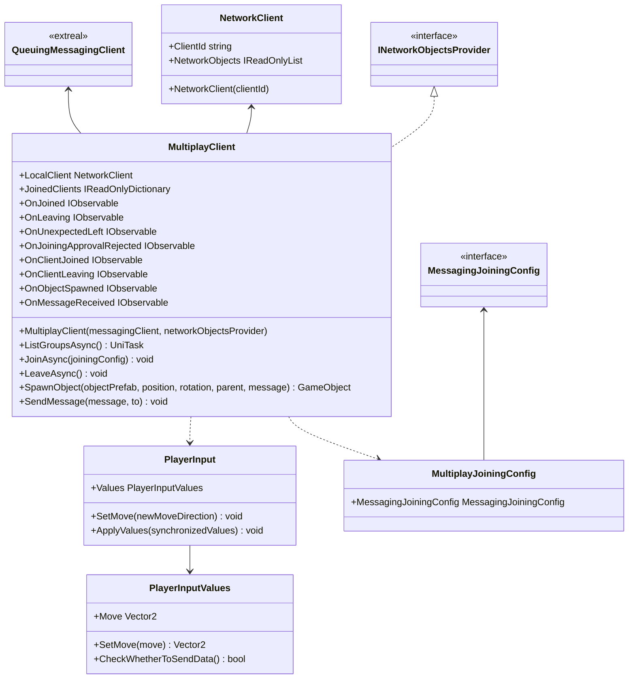

# Multiplay using Messaging

## What for?

When implementing multiplayer feature, it is necessary to synchronize player states (e.g., location and movement).

Netcode for GameObjects, on which the [NGO wrapper](./multiplay.ngo.md) is based, centralizes player state within a single server process.
Such a design makes scale-out difficult.

This module uses [Messaging](./messaging.md) to enable multi-group multiplayer on a single server, or to scale out to multiple servers to increase the number of players in multiplayer.
This allows for easier scale-out, resulting in lower operating costs.

## Specification

- Multiplayer in groups.
- You can send and receive messages within a group.
- You can add synchronized object movements.
- You can add processing triggered by client state.

## Architecture



## Installation

### Package

#### Unity

```text
https://github.com/extreal-dev/Extreal.Integration.Multiplay.Messaging.git
```

### Dependencies

This module uses the following packages.

#### Unity

- [Extreal.Core.Logging](../core/logging.md)
- [Extreal.Core.Common](../core/common.md)
- [Extreal.Integration.Messaging](./messaging.md)
- [UniTask](https://github.com/Cysharp/UniTask)
- [UniRx](https://github.com/neuecc/UniRx)

Please refer to [Release](../../category/release) for the correspondence between module version and each package version.

### Settings

This module uses [Messaging](./messaging.md) to realize multiplayer.
Therefore, [Messaging Settings](./messaging.md#settings) is required.

```csharp
public class ClientControlScope : LifetimeScope
{
    private MultiplayClient multiplayClient;

    protected override void Configure(IContainerBuilder builder)
    {
        // After initializing QueuingMessagingClient and NetworkObjectsProvider
        multiplayClient = new MultiplayClient(queuingMessagingClient, networkObjectsProvider)
    }
}
```

## Usage

### Multiplayer in groups

MultiplayClient provides the feature to play multiplayer in a group.

Joining/Leaving a group is used in the same way as in [Messaging](./messaging.md).
See [Exchanging messages in a group](./messaging.md#messaging-among-group).

```csharp
// Join a group
var messagingJoiningConfig = new MessagingJoiningConfig("groupName");
var multiplayJoiningConfig = new MultiplayJoiningConfig(messagingJoiningConfig);
await multiplayClient.JoinAsync(multiplayJoiningConfig);

// Leave the group
multiplayClient.LeaveAsync();
```

Once you join a group, spawn a player and join the multiplayer.

```csharp
multiplayClient.SpawnObject(playerObjectToBeSpawned)
```
You can also spawn objects other than the player.

```csharp
multiplayClient.SpawnObject(objectToBeSpawned)
```

### Send and receive messages within a group

You may want to send and receive messages within a group, such as synchronizing reactions.
Sending and receiving messages is used in the same way as [Messaging](./messaging.md).
See [Exchanging messages in a group](./messaging.md#messaging-among-group).

```csharp
// Send message to entire group
await messagingClient.SendMessageAsync("message");
```

### Add synchronized object movements

The position and rotation of objects spawned by the SpawnObject method are synchronized in the default implementation.

Depending on your requirements, you may want to synchronize other movements besides object position and rotation, such as animation.
This module allows you to add additional object movements to be synchronized according to your requirements by adding an implementation.

This module synchronizes object movements by sending a player's input to other players.
Which player input is used for synchronization is indicated by PlayerInput and PlayerInputValues.

If you want to synchronize movements other than position and rotation, create a class that inherits PlayerInput and PlayerInputValues.

For example, here is a case where the input Jump is to be synchronized.

```csharp
public class HolidayPlayerInput : PlayerInput
{
    public override PlayerInputValues Values => HolidayValues;
    public HolidayPlayerInputValues HolidayValues { get; } = new HolidayPlayerInputValues();

    public void SetJump(bool newJump)
        => HolidayValues.SetJump(newJump);

    public override void ApplyValues(PlayerInputValues synchronizedValues)
    {
        var synchronizedHolidayValues = synchronizedValues as HolidayPlayerInputValues;

        base.ApplyValues(synchronizedHolidayValues);
        SetJump(synchronizedHolidayValues.Jump);
    }
}
```

```csharp
public class HolidayPlayerInputValues : PlayerInputValues
{
    [SuppressMessage("Usage", "CC0047")] public bool Jump { get; set; }

    public void SetJump(bool jump)
        => Jump = jump;
}
```

Player inputs are synchronized at regular intervals.
If you want to control the conditions of synchronization, for example, if you want to synchronize every time the input changes, use the CheckWhetherToSendData method.

Here is an example of synchronizing when either Move or Jump changes.

```csharp
[Serializable]
public class HolidayPlayerInputValues : PlayerInputValues
{
    private Vector2 preMove;
    private bool isMoveChanged;

    [SuppressMessage("Usage", "CC0047")] public bool Jump { get; set; }
    private bool preJump;
    private bool isJumpChanged;

    public override void SetMove(Vector2 move)
    {
        preMove = Move;
        base.SetMove(move);
        isMoveChanged = preMove != Move;
    }

    public void SetJump(bool jump)
    {
        preJump = Jump;
        Jump = jump;
        isJumpChanged = preJump != Jump;
    }

    public override bool CheckWhetherToSendData()
    {
        var ret = isMoveChanged || isJumpChanged;
        isMoveChanged = isJumpChanged = false;
        return ret;
    }
}
```

### Add processing triggered by client state

You can use the same event notification as in [Messaging](./messaging.md). See [Adding Processes Triggered by Client State](./messaging.md#client-event) in Messaging for details.

In addition to the above, MultiplayClient has the following event notifications

- OnObjectSpawned
  - Timing: Immediately after spawning the object to be synchronized
  - Type: IObservable
  - Parameters: Participating client ID, spawned object, message sent
