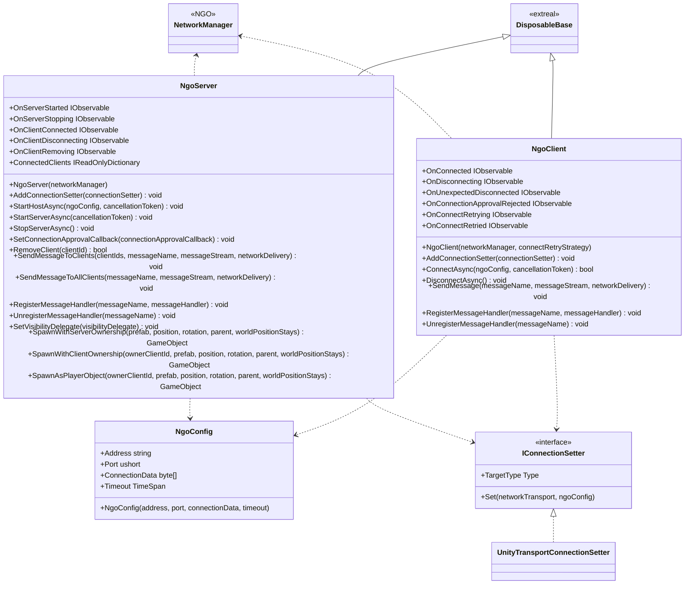
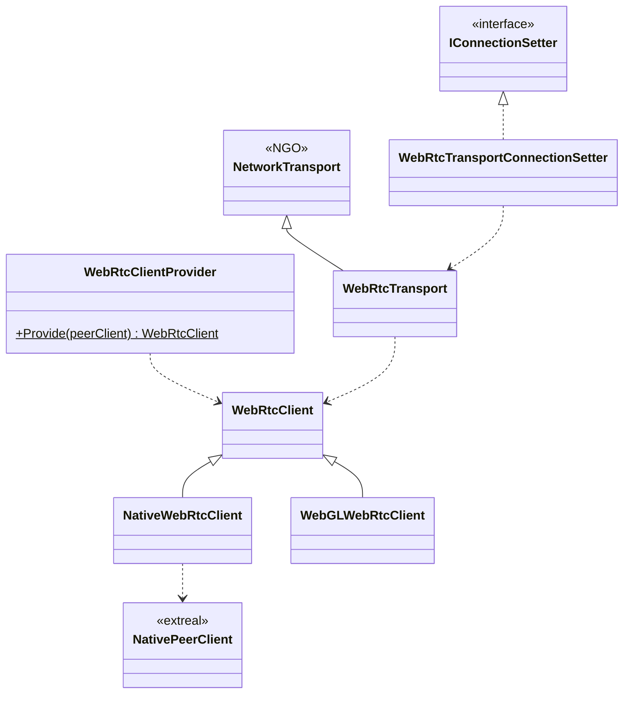
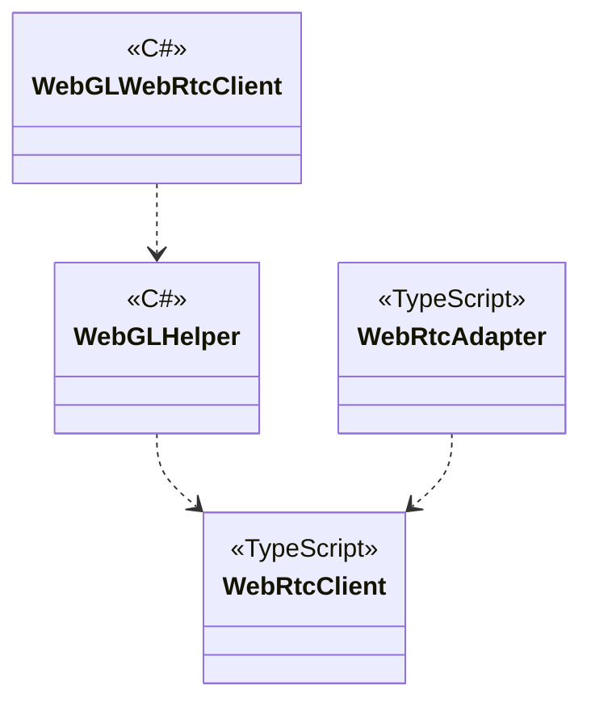

# Multiplay using Netcode for GameObjects

## What for?

We provide a wrapper that makes [Netcode for GameObjects](https://docs-multiplayer.unity3d.com/netcode/current/about/index.html) easier to use in your application.

In Extreal, Netcode for GameObjects is called NGO, and this feature that wraps NGO is called the NGO wrapper.

NGO provides server and client features in a single class called NetworkManager.
Since using NetworkManager as-is always requires context-aware implementation and can be confusing, the NGO wrapper provides NgoServer and NgoClient as separate classes for the server and client, respectively.

The goal is to make NGO introduction smooth by using the NGO wrapper in your applications.

:::caution
The NGO wrapper makes NGO easier to use, but it does not mean that you only need to know the NGO wrapper to realize multiplayer without knowing NGO.
The NGO wrapper compensates for the difficulties or lack of features when using NGO as it is, but transfers the multiplayer process to NGO.
Therefore, to use the NGO wrapper, it is assumed that you know NGO.
If you do not know NGO, please refer to [Learning](../learning/intro.md#multiplayer) to learn about NGO.
This guide assumes you know NGO.
:::

## Specification

The specifications of the NGO Wrapper are as follows.

- You can use features for NGO servers/hosts.
- You can add processing triggered by NGO server/host state.
- You can use features for NGO clients.
- Reconnect when NGO client communication is disconnected.
- You can add processing triggered by NGO client state.
- You can support any NetworkTransport other than the default one provided by the NGO.
- Multiplayer by P2P(Host/Client). (WebRtcTransport)
  - Native(C#) and WebGL(JavaScript) support.

:::caution
Since many of the features for NGO servers/hosts are common, only the different parts are clearly marked as host.
Please understand that the part described as server also applies to host.
:::

:::info
The NGO wrapper supports the default transport provided by NGO (Unity Transport), so no additional action is required if you use the default transport.
When using a new transport not provided by NGO, the IConnectionSetter used by NgoClient must be changed.
See [Supporting non-default NetworkTransport provided by NGO](#int-ngo-nt) for details.
:::

## Architecture

### NGO wrapper



### WebRtcTransport

#### Unity



#### JavaScript



## Installation

### Package

#### Unity

Using the NGO Wrapper

```text
https://github.com/extreal-dev/Extreal.Integration.Multiplay.NGO.git
```

Using WebRtcTransport

```text
https://github.com/extreal-dev/Extreal.Integration.Multiplay.NGO.WebRTC.git
```

#### npm

Using WebRtcTransport

```text
@extreal-dev/extreal.integration.multiplay.ngo.webrtc
```

### Dependencies

Using the NGO Wrapper

- [Extreal.Core.Logging](../core/logging.md)
- [Extreal.Core.Common](../core/common.md)
- [Netcode for GameObjects](https://docs-multiplayer.unity3d.com/netcode/current/about/index.html)
- [UniTask](https://github.com/Cysharp/UniTask)
- [UniRx](https://github.com/neuecc/UniRx)

Using WebRtcTransport

#### Unity

- [Extreal.Integration.Web.Common](../integration/web.common.md)
- [Extreal.Integration.P2P.WebRTC](../integration/p2p.webrtc.md)
- [WebRTC](https://docs.unity3d.com/Packages/com.unity.webrtc@3.0/manual/index.html)

#### npm

- [@extreal-dev/extreal.integration.web.common](https://www.npmjs.com/package/@extreal-dev/extreal.integration.web.common)
- [@extreal-dev/extreal.integration.p2p.webrtc](https://www.npmjs.com/package/@extreal-dev/extreal.integration.p2p.webrtc)

Please refer to [Release](../category/release) for the correspondence between module version and each package version.

### Settings

#### NGO wrapper

NgoServer and NgoClient are initialized.
Initializing NgoServer and NgoClient requires NetworkManager.
The NetworkManager is set to NgoServer and NgoClient using VContainer.

The NGO NetworkManager is assumed to be initialized by attaching it to a GameObject.

```csharp
public class MultiplayServerScope : LifetimeScope
{
    [SerializeField] private NetworkManager networkManager;

    protected override void Configure(IContainerBuilder builder)
    {
        builder.RegisterComponent(networkManager);
        builder.Register<NgoServer>(Lifetime.Singleton);
    }
}
```

```csharp
public class MultiplayControlScope : LifetimeScope
{
    [SerializeField] private NetworkManager networkManager;

    protected override void Configure(IContainerBuilder builder)
    {
        builder.RegisterComponent(networkManager);
        builder.Register<NgoClient>(Lifetime.Singleton)
            .WithParameter(typeof(IRetryStrategy), NoRetryStrategy.Instance);
    }
}
```

:::tip
NetworkManager needs to be configured the same on server and client, so it should be Prefab and use the same on server and client.
:::

:::info
If you want to use a new transport not provided by NGO, please refer to [Supporting non-default NetworkTransport provided by NGO](#int-ngo-nt).
If you use the default transport provided by the NGO (Unity Transport), no work is required.
:::

#### WebRtcTransport {#mulitplay-ngo-settings-webrtctransport}

WebRtcTransport uses [P2P.WebRTC](p2p.webrtc.md) to realize P2P.
[WebRTC Settings](p2p.webrtc.md#settings) is required.
Add the following initialization after setting up P2P.WebRTC.

If using WebRtcTransport, first configure WebRtcTransport in the NetworkManager inspector.
Next, initialize NgoServer and NgoClient so that WebRtcClient can be configured for WebRtcTransport.
Set WebRtcClient to WebRtcTransport via WebRtcTransportConnectionSetter.

```csharp
public class ClientControlScope : LifetimeScope
{
    [SerializeField] private NetworkManager networkManager;

    protected override void Configure(IContainerBuilder builder)
    {
        var peerConfig = new PeerConfig("http://127.0.0.1:3010");
        var peerClient = PeerClientProvider.Provide(peerConfig);
        builder.RegisterComponent(peerClient);

        var webRtcClient = WebRtcClientProvider.Provide(peerClient);
        var webRtcTransportConnectionSetter = new WebRtcTransportConnectionSetter(webRtcClient);

        var ngoHost = new NgoServer(networkManager);
        ngoHost.AddConnectionSetter(webRtcTransportConnectionSetter);
        builder.RegisterComponent(ngoHost);

        var ngoClient = new NgoClient(networkManager, assetHelper.NgoClientConfig.RetryStrategy);
        ngoClient.AddConnectionSetter(webRtcTransportConnectionSetter);
        builder.RegisterComponent(ngoClient);

        builder.RegisterEntryPoint<ClientControlPresenter>();
    }
}
```

If used with WebGL, further JavaScript initialization is required.
Create a WebRtcAdapter and call the adapt function.

```typescript
import { PeerAdapter } from "@extreal-dev/extreal.integration.p2p.webrtc";
import { WebRtcAdapter } from "@extreal-dev/extreal.integration.multiplay.ngo.webrtc";

const peerAdapter = new PeerAdapter();
peerAdapter.adapt();

const webRtcAdapter = new WebRtcAdapter();
webRtcAdapter.adapt(peerAdapter.getPeerClient);
```

## Usage

### Use features for NGO servers/hosts {#mulitplay-ngo-server-host}

Features for NGO servers/hosts are provided by NgoServer.
Here are some basic instructions on how to use NgoServer.
Since NgoServer transfers the multiplayer processing to NetworkManager, please refer to the NGO documentation for details on each feature.

The server is started using StartServerAsync.

```csharp
ngoServer.StartServerAsync().Forget();
```

The host is started using StartHostAsync.

```csharp
ngoServer.StartHostAsync(ngoConfig).Forget();
```

The server is stopped by StopServerAsync, but StopServerAsync is called in NgoServer's Dispose.
When the application is terminated, NgoServer's Dispose should be called.

Processing in response to messages from clients is registered with RegisterMessageHandler.
Unregistration is done with UnregisterMessageHandler.
The following code registers and unregisters at the start and end of the server.

```csharp
ngoServer.OnServerStarted.Subscribe(_ =>
{
    ngoServer.RegisterMessageHandler(MessageName.PlayerSpawn.ToString(), PlayerSpawnMessageHandler);
}).AddTo(compositeDisposable);

ngoServer.OnServerStopping.Subscribe(_ =>
{
    ngoServer.UnregisterMessageHandler(MessageName.PlayerSpawn.ToString());
}).AddTo(compositeDisposable);
```

You can use SpawnAsPlayerObject if you want to spawn a player at an arbitrary time or if you want to dynamically switch the player's prefab.
The following code is a response to a message from the client registered with RegisterMessageHandler above.
The player is spawned in response to a message from the client.

```csharp
private async void PlayerSpawnMessageHandler(ulong clientId, FastBufferReader messageStream)
{
    if (Logger.IsDebug())
    {
        Logger.LogDebug($"{MessageName.PlayerSpawn}: {clientId}");
    }
    messageStream.ReadValueSafe(out string avatarAssetName);
    var result = Addressables.LoadAssetAsync<GameObject>(avatarAssetName);
    var playerPrefab = await result.Task;
    ngoServer.SpawnAsPlayerObject(clientId, playerPrefab);
}
```

### Add a processing triggered by NGO server/host state

NgoServer has the following event notifications.

- OnServerStarted
  - Timing: Immediately after the server starts
  - Type: IObservable
  - Parameters: None
- OnServerStopping
  - Timing: Just before the server stops
  - Type: IObservable
  - Parameters: None
- OnClientConnected
  - Timing: Immediately after a client connects
  - Type: IObservable
  - Parameters: Connected client ID
- OnClientDisconnecting
  - Timing: Just before a client disconnects
  - Type: IObservable
  - Parameters: Client ID to be disconnected
- OnClientRemoving
  - Timing: Immediately before the client is removed
  - Type: IObservable
  - Parameters: Client ID to be removed

The following is an example of adding processing at server startup and shutdown

```csharp
ngoServer.OnServerStarted.Subscribe(_ =>
{
    ngoServer.RegisterMessageHandler(MessageName.PlayerSpawn.ToString(), PlayerSpawnMessageHandler);
}).AddTo(compositeDisposable);

ngoServer.OnServerStopping.Subscribe(_ =>
{
    ngoServer.UnregisterMessageHandler(MessageName.PlayerSpawn.ToString());
}).AddTo(compositeDisposable);
```

### Use features for NGO clients

NGO client features are provided by NgoClient.
Here are some basic instructions on how to use NgoClient.
NgoClient transfers the multiplayer processing to NetworkManager, so please refer to the NGO documentation for details on each feature.

ConnectAsync is used to connect to the server.
Connection information is specified in NgoConfig.
Since it is assumed that an instance of NgoClient is reused while the application is running, the connection information is specified each time the connection is made.

```csharp
var ngoConfig = new NgoConfig();
ngoClient.ConnectAsync(ngoConfig).Forget();
```

The default for NgoConfig is as follows.
If timeout is null, it is set to 10 seconds.
TimeoutException is thrown when the timeout period elapses in the connection process.

```csharp
public NgoConfig
(
    string address = "127.0.0.1",
    ushort port = 7777,
    byte[] connectionData = null,
    TimeSpan timeout = null
)
```

DisconnectAsync is used to disconnect from the server.

```csharp
ngoClient.DisconnectAsync().Forget();
```

SendMessage is used to send messages to the server.
The following code sends a message to the server to spawn a player after connecting to the server.

```csharp
ngoClient.OnConnected.Subscribe(_ =>
{
    var messageStream = new FastBufferWriter(FixedString64Bytes.UTF8MaxLengthInBytes, Allocator.Temp);
    ngoClient.SendMessage(MessageName.PlayerSpawn.ToString(), messageStream);
}).AddTo(compositeDisposable);
```

### Reconnect when NGO client communication is disconnected {#multiplay-ngo-retry}

NgoClient uses the retry processing provided by [Common](../core/common.md) to reconnect when communication is disconnected.
The following description assumes that you are familiar with the retry processing, so if you have not checked the retry processing, please check the [retry processing](../core/common.md#core-common-retry) first.

NgoClient does not reconnect by default.
If a retry strategy is specified when NgoClient is initialized, it will reconnect.

```csharp
builder.Register<NgoClient>(Lifetime.Singleton).WithParameter(typeof(IRetryStrategy), new CountingRetryStrategy());
```

The reconnection processing handled by NgoClient is as follows.

- When to run reconnection
  - If a connection failed
  - Unexpected disconnection from the server
- Reconnection processing details
  - If a connection failed
    - Repeat the connection according to the retry strategy.
  - Unexpected disconnection from the server
    - Repeat the connection according to the retry strategy.

Use [event notifications](#multiplay-ngo-event) if you want to run processing based on the status of retry processing.

### Add a processing triggered by NGO client state {#multiplay-ngo-event}

NgoClient has the following event notifications.

- OnConnected
  - Timing: Immediately after connecting to the server
  - Type: IObservable
  - Parameters: None
- OnDisconnecting
  - Timing: Just before disconnecting from the server
  - Type: IObservable
  - Parameters: None
- OnUnexpectedDisconnected
  - Timing: Immediately after an unexpected server disconnection occurs
  - Type: IObservable
  - Parameters: None
- OnConnectionApprovalRejected
  - Timing: Immediately after a connection approval is rejected
  - Type: IObservable
  - Parameters: None
- OnConnectRetrying
  - Timing：Just before retrying the connection
  - Type：IObservable
  - Parameters：Retry count
    - The first time is `1` and the second time is `2`.
    - `1` means the start of retry strategy running.
- OnConnectRetried
  - Timing：Immediately after connection retry is finished
    - If the retry is canceled, it will not be notified.
  - Type：IObservable
  - Parameters：Retry result
    - true: If the retry strategy is run and the retry is successful
    - false: If the retry strategy is run and the retry is not successful finally

The following is an example of adding processing immediately after connecting to the server.

```csharp
ngoClient.OnConnected.Subscribe(_ =>
{
    var messageStream = new FastBufferWriter(FixedString64Bytes.UTF8MaxLengthInBytes, Allocator.Temp);
    ngoClient.SendMessage(MessageName.PlayerSpawn.ToString(), messageStream);
}).AddTo(compositeDisposable);
```

### Support non-default NetworkTransport provided by NGO {#int-ngo-nt}

NGO can change the transport used for communication.
The NGO wrapper supports the default transport provided by NGO (Unity Transport), so if you use the default transport, no additional action is required.
If you want to use a new transport that is not provided by NGO, you will need to change the IConnectionSetter used by NgoClient.

Since the part of each transport implementation that holds connection information is not standardized, it is necessary to absorb the differences.
IConnectionSetter is provided to fill in the implementation differences of each transport.

To use a new transport, it is necessary to create a class that implements the IConnectionSetter and set it in NgoClient.
The implementation of IConnectionSetter for UnityTransport is shown below for reference when implementing IConnectionSetter.

```csharp
public class UnityTransportConnectionSetter : IConnectionSetter
{
    public Type TargetType => typeof(UnityTransport);

    public void Set(NetworkTransport networkTransport, NgoConfig ngoConfig)
    {
        var unityTransport = networkTransport as UnityTransport;
        unityTransport.ConnectionData.Address = ngoConfig.Address.Trim();
        unityTransport.ConnectionData.Port = ngoConfig.Port;
        unityTransport.ConnectionData.ServerListenAddress = ngoConfig.Address.Trim();
    }
}
```

Set the implemented class with NgoClient's AddConnectionSetter.

```csharp
ngoClient.AddConnectionSetter(new UnityTransportConnectionSetter());
```

### Multiplayer by P2P(Host/Client) {#mulitplay-ngo-p2p}

The WebRtcTransport setting allows for P2P multiplayer.
To set it up, go to [Settings](multiplay.ngo.md#multitplay-ngo-settings-webrtctransport).

WebRtcTransport uses [P2P.WebRTC](p2p.webrtc.md) to realize P2P.
Use [P2P.WebRTC's API](p2p.webrtc.md#p2p-webrtc-host-client) to establish the host/client connection.

Since the NGO connection must be initiated after the P2P connection is established, the start timing of NgoServer and NgoClient is determined by the OnStarted event of PeerClient.

```csharp
peerClient.OnStarted
    .Subscribe(_ => ngoServer.StartHostAsync(ngoConfig).Forget())
    .AddTo(disposables);

peerClient.OnStarted
    .Subscribe(_ => ngoClient.ConnectAsync(ngoConfig).Forget())
    .AddTo(disposables);
```
